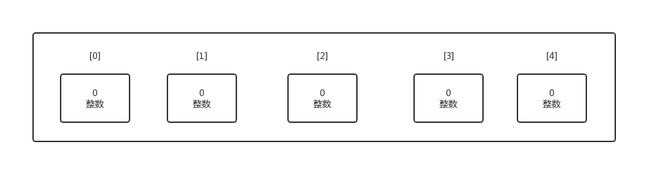
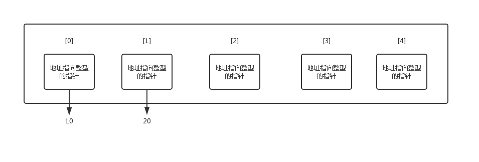
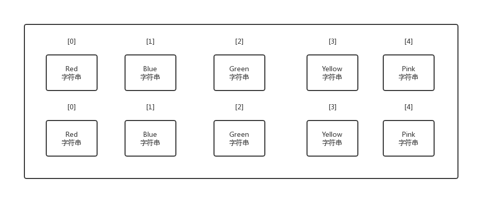
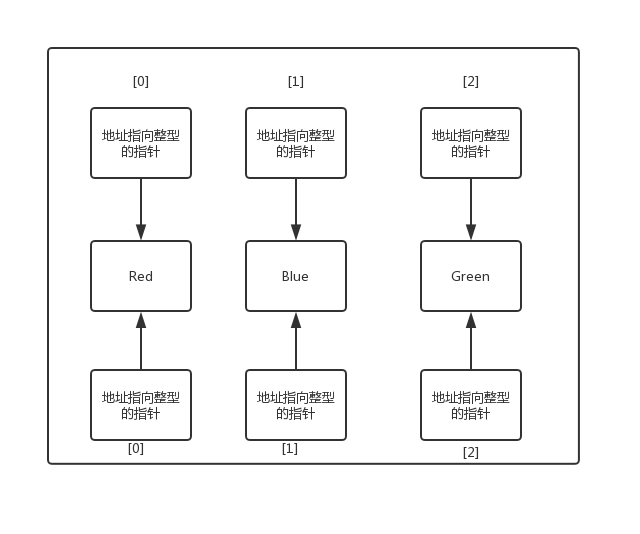

# 爬虫
## 一、go语言爬取豆瓣电影top250
```go
package main

import (
	"net/http"
	"io/ioutil"
	"os"
	"fmt"
	"strconv"
	"regexp"
	"time"
)

//定义新的数据类型
type Spider struct {
	url    string
	header map[string]string
}


//定义 Spider get的方法
func (keyword Spider) get_html_header() string {
	client := &http.Client{}
	req, err := http.NewRequest("GET", keyword.url, nil)
	if err != nil {
	}
	for key, value := range keyword.header {
		req.Header.Add(key, value)
	}
	resp, err := client.Do(req)
	if err != nil {
	}
	defer resp.Body.Close()
	body, err := ioutil.ReadAll(resp.Body)
	if err != nil {
	}
	return string(body)

}
func parse()  {
	header := map[string]string{
		"Host": "movie.douban.com",
		"Connection": "keep-alive",
		"Cache-Control": "max-age=0",
		"Upgrade-Insecure-Requests": "1",
		"User-Agent": "Mozilla/5.0 (Windows NT 6.1; WOW64) AppleWebKit/537.36 (KHTML, like Gecko) Chrome/53.0.2785.143 Safari/537.36",
		"Accept": "text/html,application/xhtml+xml,application/xml;q=0.9,image/webp,*/*;q=0.8",
		"Referer": "https://movie.douban.com/top250",
	}

	//创建excel文件
	f, err := os.Create("spider.txt")
	if err != nil {
		panic(err)
	}
	defer f.Close()
	//写入标题
	f.WriteString("电影名称"+"\t"+"评分"+"\t"+"评价人数"+"\t"+"\r\n")

	//循环每页解析并把结果写入excel
	for i:=0;i<10;i++{
		fmt.Println("正在抓取第"+strconv.Itoa(i)+"页......")
		url:="https://movie.douban.com/top250?start="+strconv.Itoa(i*25)+"&filter="
		spider := &Spider{url, header}
		html := spider.get_html_header()

		//评价人数
		pattern2:=`<span>(.*?)评价</span>`
		rp2 := regexp.MustCompile(pattern2)
		find_txt2 := rp2.FindAllStringSubmatch(html,-1)

		//评分
		pattern3:=`property="v:average">(.*?)</span>`
		rp3 := regexp.MustCompile(pattern3)
		find_txt3 := rp3.FindAllStringSubmatch(html,-1)

		//电影名称
		pattern4:=`alt="(.*?)" src="`
		rp4 := regexp.MustCompile(pattern4)
		find_txt4 := rp4.FindAllStringSubmatch(html,-1)

		// 写入UTF-8 BOM
		f.WriteString("\xEF\xBB\xBF")
		//  打印全部数据和写入excel文件
		for i:=0;i<len(find_txt2);i++{
			fmt.Printf("%s %s %s\n",find_txt4[i][1],find_txt3[i][1],find_txt2[i][1], )
			f.WriteString(find_txt4[i][1]+"\t"+find_txt3[i][1]+"\t"+find_txt2[i][1]+"\t"+"\r\n")
		}
	}
}

func main() {
	t1 := time.Now() // get current time
	parse()
	elapsed := time.Since(t1)
	fmt.Println("爬虫结束,总共耗时: ", elapsed)
}
```
## 二、goquery
上面第一部分的例子，使用了正则表达式来匹配，使用goquery会更方便。goquery是一个使用go语言写成的HTML解析库，可以让你像jQuery那样的方式来操作DOM文档。
获取代码:
> gopm get -g github.com/PuerkitoBio/goquery

直接使用go get方式安装失败，这里使用了gopm来安装，关于gopm可以参考[国内的go get问题的解决 --gopm](https://www.jianshu.com/p/db9e6ae0d227)
在代码中引用时:
> import “github.com/PuerkitoBio/goquery”

以下参考[golang goquery selector(选择器) 示例大全](https://www.flysnow.org/2018/01/20/golang-goquery-examples-selector.html)
如果大家以前做过前端开发，对jquery不会陌生，goquery类似jquery，它是jquery的go版本实现。使用它，可以很方便的对HTML进行处理。
1. 基于HTML Element元素的选择器
这个比较简单，就是基于a,p等这些HTML的基本元素进行选择，这种直接使用Element名称作为选择器即可。比如dom.Find("div")。
```go
func findDiv() {
    html := `<body>
                <div>DIV1</div>
                <div>DIV2</div>
                <span>SPAN</span>
            </body>
            `

    dom,err:=goquery.NewDocumentFromReader(strings.NewReader(html))
    if err!=nil{
        log.Fatalln(err)
    }

    dom.Find("div").Each(func(i int, selection *goquery.Selection) {
        fmt.Println("i",i,"select text",selection.Text())
    })
}
```
2. ID选择器
这个是使用频次最多的，类似于上面的例子，有两个div元素，其实我们只需要其中的一个，那么我们只需要给这个标记一个唯一的id即可，这样我们就可以使用id选择器，精确定位了。
```go
func main() {
    html := `<body>

                <div id="div1">DIV1</div>
                <div>DIV2</div>
                <span>SPAN</span>

            </body>
            `

    dom,err:=goquery.NewDocumentFromReader(strings.NewReader(html))
    if err!=nil{
        log.Fatalln(err)
    }

    dom.Find("#div1").Each(func(i int, selection *goquery.Selection) {
        fmt.Println(selection.Text())
    })
}
```
3. Element ID选择器
id选择器以#开头，紧跟着元素id的值，使用语法为dom.Find(#id),后面的例子我会简写为Find(#id),大家知道这是代表goquery选择器的即可。

如果有相同的ID，但是它们又分别属于不同的HTML元素怎么办？有好办法，和Element结合起来。比如我们筛选元素为div,并且id是div1的元素，就可以使用Find(div#div1)这样的筛选器进行筛选。

所以这类筛选器的语法为Find(element#id)，这是常用的组合方法，比如后面讲的过滤器也可以采用这种方式组合使用。
4. Class选择器
class也是HTML中常用的属性，我们可以通过class选择器来快速的筛选需要的HTML元素，它的用法和ID选择器类似，为Find(".class")。
```go
func main() {
    html := `<body>

                <div id="div1">DIV1</div>
                <div class="name">DIV2</div>
                <span>SPAN</span>

            </body>
            `

    dom,err:=goquery.NewDocumentFromReader(strings.NewReader(html))
    if err!=nil{
        log.Fatalln(err)
    }

    dom.Find(".name").Each(func(i int, selection *goquery.Selection) {
        fmt.Println(selection.Text())
    })
}
```
以上示例中，就筛选出来class为name的这个div元素。
5. Element Class 选择器
class选择器和id选择器一样，也可以结合着HTML元素使用，他们的语法也类似Find(element.class)，这样就可以筛选特定element、并且指定class的元素。

## 三、使用goquery爬取豆瓣电影top250
```go
package main

import (
    "net/http"
    "fmt"
    "github.com/PuerkitoBio/goquery"
    "strconv"
)

func GetMovie(url string) {
    fmt.Println(url)
    resp, err := http.Get(url)
    if err != nil {
        panic(err)
    }
    //bodyString, err := ioutil.ReadAll(resp.Body)
    //fmt.Println(string(bodyString))
    if resp.StatusCode != 200 {
        fmt.Println("err")
    }

    doc, err := goquery.NewDocumentFromReader(resp.Body)
    if err != nil {
        panic(err)
    }

    //

    doc.Find("#content h1").Each(func(i int, s *goquery.Selection) {
        // name
        fmt.Println("name:" + s.ChildrenFiltered(`[property="v:itemreviewed"]`).Text())
        // year
        fmt.Println("year:" + s.ChildrenFiltered(`.year`).Text())
    })

    // #info > span:nth-child(1) > span.attrs
    director := ""
    doc.Find("#info span:nth-child(1) span.attrs").Each(func(i int, s *goquery.Selection) {
        // 导演
        director += s.Text()
        //fmt.Println(s.Text())
    })
    fmt.Println("导演:" + director)
    //fmt.Println("\n")

    pl := ""
    doc.Find("#info span:nth-child(3) span.attrs").Each(func(i int, s *goquery.Selection) {
        pl += s.Text()
    })
    fmt.Println("编剧:" + pl)

    charactor := ""
    doc.Find("#info span.actor span.attrs").Each(func(i int, s *goquery.Selection) {
        charactor += s.Text()
    })
    fmt.Println("主演:" + charactor)

    typeStr := ""
    doc.Find("#info > span:nth-child(8)").Each(func(i int, s *goquery.Selection) {
        typeStr += s.Text()
    })
    fmt.Println("类型:" + typeStr)
}

func GetToplist(url string) []string {
    var urls []string
    resp, err := http.Get(url)
    if err != nil {
        panic(err)
    }
    //bodyString, err := ioutil.ReadAll(resp.Body)
    //fmt.Println(string(bodyString))
    if resp.StatusCode != 200 {
        fmt.Println("err")
    }

    doc, err := goquery.NewDocumentFromReader(resp.Body)
    if err != nil {
        panic(err)
    }

    doc.Find("#content div div.article ol li div div.info div.hd a").
    Each(func(i int, s *goquery.Selection) {
        // year
        fmt.Printf("%v", s)
        herf, _ := s.Attr("href")
        urls = append(urls, herf)
    })
    return urls
}

func main() {
    url := "https://movie.douban.com/top250?start="
    var urls []string
    var newUrl string
    fmt.Println("%v", urls)
    for i := 0; i < 10; i++ {
        start := i * 25
        newUrl = url + strconv.Itoa(start)
        urls = GetToplist(newUrl)

        for _, url := range urls {
            GetMovie(url)
        }
    }
}
```
注意这个`Find:doc.Find("#content div div.article ol li div div.info div.hd a")`,参考返回的html内容，这里是个多层查找，#是查找id，带点的是找相应的class。当然改成`doc.Find("ol.grid_view li div.hd a")`也是可以的。最终都是要找列表里的li,然后挑出href。

- 参考原文：https://www.jianshu.com/p/ae172d60c431?utm_campaign=studygolang.com&utm_medium=studygolang.com&utm_source=studygolang.com

# go语言细节小结
前段时间，看了菜鸟入门，较浅的认识一下golang的语法习惯和规则，然后跟别人做了个爬虫项目，但是对于golang语言的语法结构还不是很懂。又看了遍《go实战》第二章。

构建程序在构建可执行文件时，需要找到这个已经声明的main函数，把它作为程序的入口。

关键字import就是导入一段代码，让用户可以访问其中的标识符，如类型、函数、常量和接口。

所有处于同一个文件夹里的代码文件，必须使用同一个包名。

下划线（_）这个技术是为了让Go语言对包做初始化操作，但是并不使用包里的标识符。下划线让编译器接受这类导入，并且调用对应包内的所有代码文件里定义的init函数。

编译器查找包的时候，总是会到GOROOT和GOPATH环境变量引用的位置去查找。

在Go语言里，标识符要么从包里公开，要么不从包里公开。`以小写字母开头的标识符是不公开的，不能被其他包中的代码直接访问；大写字母相反`。

map是Go语言里的引用类型，需要使用make来构造。

在Go语言中，所有变量都被初始化为其零值。对于数值类型，零值是0；对于字符串类型，零值是空字符串；对于布尔类型，零值是false；对于指针，零值是nil。

Go语言使用关键字func声明函数，关键字后面紧跟这函数名、参数以及返回值。
```go
func function_name( [parameter list] ) [return_types] {
   函数体
}
```
函数定义解析：
- func：函数由 func 开始声明
- function_name：函数名称，函数名和参数列表一起构成了函数签名。
- parameter list：参数列表，参数就像一个占位符，当函数被调用时，你可以将值传递给参数，这个值被称为实际参数。参数列表指定的是参数类型、顺序、及参数个数。参数是可选的，也就是说函数也可以不包含参数。
- return_types：返回类型，函数返回一列值。return_types 是该列值的数据类型。有些功能不需要返回值，这种情况下 return_types 不是必须的。
- 函数体：函数定义的代码集合。

切片是一种实现了一个动态数组的引用类型。在Go语言里可以用切片来操作一组数据。

简化变量声明运行符（:=）。这个运算符用于声明一个变量，同时给这个变量赋予初始值。

如果需要声明初始值为零值的变量，应该使用var关键字声明变量；如果提供确切的非零值初始化变量或者使用函数返回值创建变量，应该使用简化变量声明运算符。

在Go语言中，如果main函数返回，整个程序也就终止了。Go程序终止时，还会关闭所有之前启动且还在运行的goroutine。写并发程序的时候，最佳做法是，在main函数返回前，清理并终止所有之前启动的goroutine。

`引号里的部分被称作标记（tag）。

error类型的值，用来表示函数是否调用成功。

关键字defer会安排随后的函数调用函数返回时才执行。关键字defer可以缩短打开文件和关闭文件间隔的代码行数，有助于提高代码可读性，减少错误。

interface关键字声明了一个接口，这个接口声明了结构类型或者具名类型需要实现的性为。一个接口的行为最终由在这个接口类型中声明的方法决定。如果接口类型只包含一个方法，那么这个类型的名字以er结尾。如果接口类型内部声明了多个方法，起名字需要与其行为关联。

程序里所有的init方法都会在main函数启动前被调用。

# go语言中的打包和工具链
## 包
所有Go语言的程序都会组织成若干组文件，每组文件被称为一个包。这样每个包的代码都可以作为很小的复用单元，被其他项目引用。

### 包名惯例
给包命名的惯例是使用包所在目录的名字。并不需要所有包的名字都与别的包不同，因为导入包时是使用全路径的，所以可以区分同名的不同包。

### main包
Go语言的编译程序会试图把这种名字的包编译为二进制可执行文件。所有用Go语言编译的可执行程序都必须有一个名为main的包。

---

`命令和包` Go文档里经常使用命令（command）这个词来指代可执行程序，如命令行应用程序。这会让新手在阅读文档时产生困惑。记住，在Go语言里，命令是指任何可执行程序。作为对比，包更常用来指语义上可导入的功能单元。

---
 
## 导入
`import`语句告诉编译器到磁盘的哪里去找想要导入的包。导入包需要使用关键字import，它会告诉编译器你想引用该位置的包内的代码。如果需要导入多个包，习惯上是将import语句包装在一个导入块中：
```go
import (
	"fmt"
	"net/http"
	"github.com/PuerkitoBio/goquery"
	"strconv"
)
```
标准库中的包会在安装Go的位置找到。Go开发者创建的包会在GOPATH环境变量指定的目录里查找。

### 远程导入
目前的大趋势是，使用分布式版本控制系统（DVCS）来分析代码，如GitHub。Go语言的工具链本身就支持从这些网站及类似网站获取源代码。Go工具链会使用导入路径确定需要获取的代码在网络的什么地方。
例如：
```go
import "github.com/PuerkitoBio/goquery"
```
如果路径包含URL，可以使用Go工具链从DVCS获取包，并把包的源代码保存在GOPATH指向的路径里与URL匹配的目录里。这个获取过程使用`go get`命令完成。go get将获取任意指定的URL的包，或者一个已经导入的包所依赖的其他包。

### 命名导入
崇明的包可以通过命名导入来导入。命名导入时指，在import语句给出的包路径的左侧定义一个名字，将导入的包命名为新名字。
例如：
```go
package main

import {
    "fmt"
    myfmt "mylib/fmt"
}

func main(){
    fmt.Println("Standard Library")
    myfmt.Println("mylib/fmt")
}
```

当你导入了一个不在代码里使用的包时，Go编译器会编译失败，并输出一个错误。
有时，用户可能需要导入一个包，但是不需要引用这个包的标识符。在这种情况下，可以使用空白标识符`_`来重命名这个导入。

---

`空白标识符` 下划线字符（_）在Go语言里称为空白标识符，有很多用法。这个标识符用来抛弃不想继续使用的值，如给导入的包赋予一个空名字，或者忽略函数返回的你不感兴趣的值。

---

## 函数init
每个包可以包含任意多个init函数，这些函数都会在程序执行开始的时候被调用。所有被编译器发现的init函数都会安排在main函数之前执行。init函数用在设置包、初始化变量或者其他要在程序运行前优先完成的引导工作。

## 使用Go的工具
`go`

`go build`编译程序。
`go clean`删除编译生成的可执行文件。
`go run`会先构建.go文件里包含的程序，然后执行构建后的程序。

## 进一步介绍Go开发工具
### go vet
vet命令会帮开发人员检测代码的常见错误。


### Go代码格式化
fmt命令自动格式化开发人员指定的源代码文件并保存。

### Go语言的文档
go doc

# 数组、切片和映射
## 数组的内部实现和基础功能
因为数组是切片和映射的基础数据结构。理解了数组的工作原理，有助于理解切片和映射提供的优雅和强大的功能。

### 内部实现
在Go语言里，数组是一个长度固定的数据类型，用于存储一段具有相同的类型的元素的连续块。
下图中可以到数组的表示。


数组是一种非常有用的数据结构，因为其占用的内存是连续分配的。由于内存连续，CPU能把正在使用的数据缓存更久的时间。而且内存连续很容易计算索引，可以快速迭代数组里的所有元素。数组的类型信息可以提供每次访问一个元素时需要在内存中移动的距离。

### 声明和初始化
声明数组时需要指定内部存储的数据的类型，以及需要存储的元素的数量，这个数量也称为数组的长度，如下：
```go
// 声明一个包含5个元素的整型数组
var array [5]int
```

一种快速创建数组并初始化的方式是使用数组字面量。
```go
array := [5]int{10,20,30,40,50}
```


### 使用数组
要访问数组里某个单独元素，使用[]运算符，如：
```go
// 声明一个包含5个元素的整型数组
// 用具体值初始化为每个元素
array := [5]int{10,20,30,40,50}

// 修改索引为2的元素的值
array[2] = 35
```

使用*运算符就可以访问元素指针所指向的值，如：
```go
// 声明包含5个元素的指向整数的数组
// 用整型指针初始化索引为0和1的数组元素
array := [5]*int{0: new(int), 1: new(int)}

// 为索引为0和1的元素赋值
*array[0] = 10
*array[1] = 20
```


在Go语言里，数组是一个值。这意味着数组可以用在赋值操作中。变量名代表整个数组，因此，同样类型的数组可以赋值给另一个数组：
```go
// 声明一个包含5个元素的字符串数组
var array1 [5]string

// 声明第二个包含5个元素的字符串数组
// 用颜色初始化数组
array2 := [5]string{"Red","Blue","Green","Yellow","Pink"}

// 把array2的值复制到array1
array1 = array2
```

数组变量的类型包括数组长度和每个元素的类型。只有这两部分都相同的数组，才是类型相同的数组，才能互相赋值。

复制指针数组，只会复制指针的值，而不会复制指针所指向的值。
```go
var array [3]*string

array2 := [3]*string{new(string), new(string), new(string)}

*array2[0] = "Red"
*array2[1] = "Blue"
*array2[2] = "Green"

array1 = array2
```



### 多维数组
数组本身只有一个维度，不过可以组合多个数组创建多维数组。
```go
var array [4][2]int

array := [4][2]int{{10,11},{20,21},{30,31},{40,41}}

array := [4][2]int{1: {20,21},3: {40,41}}

array := [4][2]int{1: {0: 20},3: {1: 41}}
```

# go语言中方法和函数的区别
今天看《Go语言实战》发现方法和函数不太一样，写的格式不一样，用法也不一样。所以记一次笔记。

在Go语言中，函数和方法不太一样，有明确的概念区分。其他语言中，比如Java，一般来说，函数就是方法，方法就是函数，但是在Go语言中，函数是指不属于任何结构体、类型的方法，也就是说，函数是没有接收者的；而方法是有接收者的，我们说的方法要么是属于一个结构体的，要么属于一个新定义的类型的。

## 函数
函数和方法，虽然概念不同，但是定义非常相似。函数的定义声明没有接收者，所以我们直接在go文件里，go包之下定义声明即可。
```go
func main() {
	sum := add(1, 2)
	fmt.Println(sum)
}

func add(a, b int) int {
	return a + b
}

```

例子中，我们定义了`add`就是一个函数，它的函数签名是`func add(a, b int) int`,没有接收者，直接定义在go的一个包之下，可以直接调用，比如例子中的`main`函数调用了`add`函数。

例子中的这个函数名称是小写开头的`add`，所以它的作用域只属于所声明的包内使用，不能被其他包使用，如果我们把函数名以大写字母开头，该函数的作用域就大了，可以被其他包调用。这也是Go语言中大小写的用处，比如Java中，就有专门的关键字来声明作用域`private`、`protect`、`public`等。
```go
/*
 提供的常用库，有一些常用的方法，方便使用
*/
package lib

// 一个加法实现
// 返回a+b的值
func Add(a, b int) int {
	return a + b
}
```
如上例子中定义的`Add`方法就可以被其他包调用。

## 方法
方法的声明和函数类似，他们的区别是：方法在定义的时候，会在`func`和方法名之间增加一个参数，这个参数就是接收者，这样我们定义的这个方法就和接收者绑定在了一起，称之为这个接收者的方法。
```go
type person struct {
	name string
}

func (p person) String() string{
	return "the person name is "+p.name
}
```

留意例子中，`func`和方法名之间增加的参数`(p person)`,这个就是接收者。现在我们说，类型`person`有了一个`String`方法，现在我们看下如何使用它。
```go
func main() {
	p:=person{name:"张三"}
	fmt.Println(p.String())
}
```
调用的方法非常简单，使用类型的变量进行调用即可，类型变量和方法之前是一个`.`操作符，表示要调用这个类型变量的某个方法的意思。

Go语言里有两种类型的接收者：值接收者和指针接收者。我们上面的例子中，就是使用值类型接收者的示例。

使用值类型接收者定义的方法，在调用的时候，使用的其实是值接收者的一个副本，所以对该值的任何操作，不会影响原来的类型变量。
```go
func main() {
	p:=person{name:"张三"}
	p.modify() //值接收者，修改无效
	fmt.Println(p.String())
}

type person struct {
	name string
}

func (p person) String() string{
	return "the person name is "+p.name
}

func (p person) modify(){
	p.name = "李四"
}
```

以上的例子，打印出来的值还是`张三`，对其进行的修改无效。如果我们使用一个指针作为接收者，那么就会其作用了，因为指针接收者传递的是一个指向原值指针的副本，指针的副本，指向的还是原来类型的值，所以修改时，同时也会影响原来类型变量的值。
```go
func main() {
	p:=person{name:"张三"}
	p.modify() //指针接收者，修改有效
	fmt.Println(p.String())
}

type person struct {
	name string
}

func (p person) String() string{
	return "the person name is "+p.name
}

func (p *person) modify(){
	p.name = "李四"
}
```

只需要改动一下，变成指针的接收者，就可以完成了修改。
> 在调用方法的时候，传递的接收者本质上都是副本，只不过一个是这个值副本，一是指向这个值指针的副本。指针具有指向原有值的特性，所以修改了指针指向的值，也就修改了原有的值。我们可以简单的理解为值接收者使用的是值的副本来调用方法，而指针接收者使用实际的值来调用方法。

在上面的例子中，有没有发现，我们在调用指针接收者方法的时候，使用的也是一个值的变量，并不是一个指针，如果我们使用下面的也是可以的。
```go
p:=person{name:"张三"}
(&p).modify() //指针接收者，修改有效
```
这样也是可以的。如果我们没有这么强制使用指针进行调用，Go的编译器自动会帮我们取指针，以满足接收者的要求。

同样的，如果是一个值接收者的方法，使用指针也是可以调用的，Go编译器自动会解引用，以满足接收者的要求，比如例子中定义的`String()`方法，也可以这么调用：
```go
p:=person{name:"张三"}
fmt.Println((&p).String())
```

总之，方法的调用，既可以使用值，也可以使用指针，我们不必要严格的遵守这些，Go语言编译器会帮我们进行自动转义的，这大大方便了我们开发者。

不管是使用值接收者，还是指针接收者，一定要搞清楚类型的本质：对类型进行操作的时候，是要改变当前值，还是要创建一个新值进行返回？这些就可以决定我们是采用值传递，还是指针传递。

##多值返回
Go语言支持函数方法的多值返回，也就说我们定义的函数方法可以返回多个值，比如标准库里的很多方法，都是返回两个值，第一个是函数需要返回的值，第二个是出错时返回的错误信息，这种的好处，我们的出错异常信息再也不用像Java一样使用一个Exception这么重的方式表示了，非常简洁。

```go
func main() {
	file, err := os.Open("/usr/tmp")
	if err != nil {
		log.Fatal(err)
		return
	}
	fmt.Println(file)
}

```
如果返回的值，我们不想使用，可以使用`_`进行忽略。
```go
file, _ := os.Open("/usr/tmp")
```

多个值返回的定义也非常简单，看个例子。
```go
func add(a, b int) (int, error) {
	return a + b, nil
}
```

函数方法声明定义的时候，采用逗号分割，因为时多个返回，还要用括号括起来。返回的值还是使用return 关键字，以逗号分割，和返回的声明的顺序一致。

## 可变参数
函数方法的参数，可以是任意多个，这种我们称之为可以变参数，比如我们常用的fmt.Println()这类函数，可以接收一个可变的参数。
```go
func main() {
	fmt.Println("1","2","3")
}
```
可以变参数，可以是任意多个。我们自己也可以定义可以变参数，可变参数的定义，在类型前加上省略号…即可。
```go
func main() {
	print("1","2","3")
}

func print (a ...interface{}){
	for _,v:=range a{
		fmt.Print(v)
	}
	fmt.Println()
}

```
例子中我们自己定义了一个接受可变参数的函数，效果和`fmt.Println()`一样。

可变参数本质上是一个数组，所以我们向使用数组一样使用它，比如例子中的 `for range`循环。

函数方法还有其他一些知识点，比如`painc`异常处理，递归等，这些在《Go语言实战》书里也没有介绍，这些基础知识，可以参考Go语言的那本圣经。