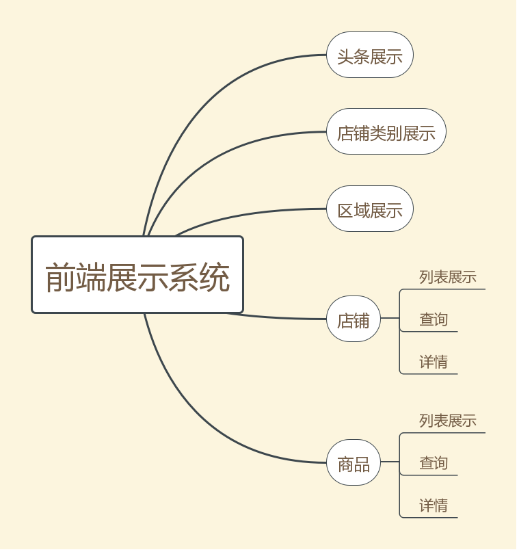
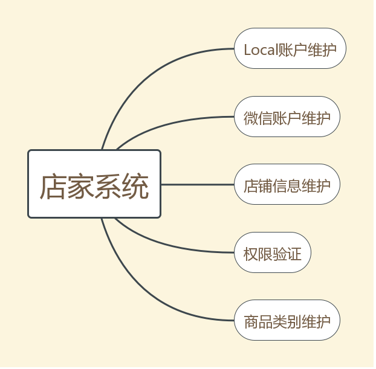
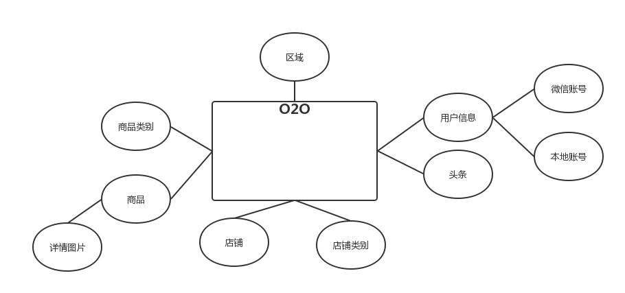

### 第一天

搭建SSM+Maven环境，略。

### 第二天

#### 系统功能模块划分

前端系统



店家系统



实体类



建表SQL见`o2o.sql`

#### 第二天

配置`Maven`

```xml
<?xml version="1.0" encoding="UTF-8"?>
<project xmlns="http://maven.apache.org/POM/4.0.0"
         xmlns:xsi="http://www.w3.org/2001/XMLSchema-instance"
         xsi:schemaLocation="http://maven.apache.org/POM/4.0.0 http://maven.apache.org/xsd/maven-4.0.0.xsd">
    <modelVersion>4.0.0</modelVersion>

    <groupId>com.imooc</groupId>
    <artifactId>o2o</artifactId>
    <version>0.0.1-SNAPSHOT</version>

    <properties>
        <spring.verison>4.3.7.RELEASE</spring.verison>
    </properties>
    <dependencies>
        <!-- 单元测试 -->
        <dependency>
            <groupId>junit</groupId>
            <artifactId>junit</artifactId>
            <version>4.12</version>
            <scope>test</scope>
        </dependency>
        <!-- log -->
        <dependency>
            <groupId>ch.qos.logback</groupId>
            <artifactId>logback-classic</artifactId>
            <version>1.2.3</version>
        </dependency>
        <!-- Spring -->
        <!-- 1)包含Spring框架解百纳的和性工具类。Spring其他组件要都要使用到这个包l里的类 -->
        <dependency>
            <groupId>org.springframework</groupId>
            <artifactId>spring-core</artifactId>
            <version>${spring.verison}</version>
        </dependency>
        <!-- 2)这个jar文件是所有应用都要用到的，它包含访问配置文件、创建和管理bean以及进行Inverison of Controller
            /Dependency Injection(IoC/DI)操作相关的所有类。如果应用只需基本的IoC/DI支持，引入spring-core
            及spring-beans.jar文件就可以了。 -->
        <dependency>
            <groupId>org.springframework</groupId>
            <artifactId>spring-beans</artifactId>
            <version>${spring.verison}</version>
        </dependency>
        <!-- 3)这个jar文件为Spring核心提供了大量扩展。可以找到使用Spring ApplicationContext特性时所需的全部
            所需的全部类，instrumentation组件以及检验Validation方面的相关类。 -->
        <dependency>
            <groupId>org.springframework</groupId>
            <artifactId>spring-context</artifactId>
            <version>${spring.verison}</version>
        </dependency>
        <!-- 2)Spring DAO层-->
        <!-- 4)这个jar文件包含对Spring对JDBC数据访问进行封装的所有类-->
        <dependency>
            <groupId>org.springframework</groupId>
            <artifactId>spring-jdbc</artifactId>
            <version>${spring.verison}</version>
        </dependency>
        <!-- 5)为JDBC、Hibernate、JDO、JPA等提供了一致的声明式和编程式事务管理 -->
        <dependency>
            <groupId>org.springframework</groupId>
            <artifactId>spring-tx</artifactId>
            <version>${spring.verison}</version>
        </dependency>
        <!-- 7)Spring web包含web应用开发时，用到Spring框架时所需的核心类，包括自动载入WebApplicationContext -->
        <dependency>
            <groupId>org.springframework</groupId>
            <artifactId>spring-web</artifactId>
            <version>${spring.verison}</version>
        </dependency>
        <!-- 7)包含Spring MVC框架相关的所有类-->
        <dependency>
            <groupId>org.springframework</groupId>
            <artifactId>spring-webmvc</artifactId>
            <version>${spring.verison}</version>
        </dependency>
        <!-- 8)Spring test对JUNIT等测试框架的简单封装 -->
        <dependency>
            <groupId>org.springframework</groupId>
            <artifactId>spring-test</artifactId>
            <version>${spring.verison}</version>
            <scope>test</scope>
        </dependency>
        <!-- Servlet web -->
        <dependency>
            <groupId>javax.servlet</groupId>
            <artifactId>javax.servlet-api</artifactId>
            <version>3.1.0</version>
        </dependency>
        <!-- json解析 -->
        <dependency>
            <groupId>com.fasterxml.jackson.core</groupId>
            <artifactId>jackson-databind</artifactId>
            <version>2.8.7</version>
        </dependency>
        <!-- Map工具类 对标准Java Collection的扩展spring-core.jar需commons-collections.jar-->
        <dependency>
            <groupId>commons-collections</groupId>
            <artifactId>commons-collections</artifactId>
            <version>3.2</version>
        </dependency>
        <!-- DAO:MyBatis -->
        <dependency>
            <groupId>org.mybatis</groupId>
            <artifactId>mybatis</artifactId>
            <version>3.4.2</version>
        </dependency>
        <dependency>
            <groupId>org.mybatis</groupId>
            <artifactId>mybatis-spring</artifactId>
            <version>1.3.1</version>
        </dependency>
        <!-- 数据库 -->
        <dependency>
            <groupId>mysql</groupId>
            <artifactId>mysql-connector-java</artifactId>
            <version>5.1.37</version>
        </dependency>
        <dependency>
            <groupId>c3p0</groupId>
            <artifactId>c3p0</artifactId>
            <version>0.9.1.2</version>
        </dependency>
    </dependencies>

    <build>
        <finalName>o2o</finalName>
        <plugins>
            <plugin>
                <groupId>org.apache.maven.plugins</groupId>
                <artifactId>maven-compiler-plugin</artifactId>
                <version>3.6.1</version>
                <configuration>
                    <source>1.8</source>
                    <target>1.8</target>
                    <encoding>utf-8</encoding>
                </configuration>
            </plugin>
        </plugins>
    </build>

    
</project>
```

**完成SSM各项的配置**

`jdbc.properties`

```properties
jdbc.driver=com.mysql.jdbc.Driver
jdbc.url=jdbc:mysql://localhost:3306/o2o?useUnicode=true&characterEncoding=utf8
jdbc.username=root
jdbc.password=root
```

`mybatis-config.xml`

```xml
<?xml version="1.0" encoding="UTF-8" ?>
<!DOCTYPE configuration
        PUBLIC "-//mybatis.org/DTD Config 3.0//EN"
        "http://mybatis.org/dtd/mybatis-3-config.dtd">
<configuration>
    <!--配置全局属性 -->
    <settings>
        <!-- 使用jdbc的getGeneratedKeys获取数据库自增主键值 -->
        <setting name="useGeneratedKeys" value="true"/>
        <!-- 使用列标签替换列别名 默认：true-->
        <setting name="useColumnLabel" value="true"/>
        <!-- 开启驼峰命名转换:Table{create_time} -> Entity{createTime} -->
        <setting name="mapUnderscoreToCamelCase" value="true" />
    </settings>
</configuration>
```

`spring/spring-dao.xml`

```xml
<?xml version="1.0" encoding="UTF-8" ?>
<beans xmlns="http://www.springframework.org/schema/beans"
       xmlns:xsi="http://www.w3.org/2001/XMLSchema-instance"
       xmlns:context="http://www.springframework.org/schema/context"
       xsi:schemaLocation="http://www.springframework.org/schema/beans
        http://www.springframework.org/schema/beans/spring-beans.xsd
        http://www.springframework.org/schema/context
        http://www.springframework.org/schema/context/spring-context.xsd">
    <!-- 配置整合mybatis过程 -->
    <!-- 1.配置数据库相关参数properties的属性：${url} -->
    <context:property-placeholder location="classpath:jdbc.properties"/>

    <!-- 2.数据库连接池 -->
    <bean id="dataSource" class="com.mchange.v2.c3p0.ComboPooledDataSource">
        <!-- 配置数据池属性 -->
        <property name="driverClass" value="${jdbc.driver}"/>
        <property name="jdbcUrl" value="${jdbc.url}"/>
        <property name="user" value="${jdbc.username}"/>
        <property name="password" value="${jdbc.password}"/>

        <!-- c3p0连接池的私有属性 -->
        <property name="maxPoolSize" value="30"/>
        <property name="minPoolSize" value="10"/>
        <!-- 关闭链接后不自动commit -->
        <property name="autoCommitOnClose" value="false" />
        <!-- 获取链接超时时间 -->
        <property name="checkoutTimeout" value="10000"/>
        <!-- 当获取连接失败重获次数 -->
        <property name="acquireRetryAttempts" value="2" />
    </bean>

    <!-- 3.配置SqlSessionFactory对象 -->
    <bean id="sqlSessionFactory" class="org.mybatis.spring.SqlSessionFactoryBean">
        <!-- 注入数据库连接池 -->
        <property name="dataSource" ref="dataSource" />
        <!-- 配置MyBatis全局配置文件mybatis-config.xml -->
        <property name="configLocation" value="classpath:mybatis-config.xml"/>
        <!-- 扫描entity包 使用别名 -->
        <property name="typeAliasesPackage" value="com.imooc.o2o.entity" />
        <!-- 扫描sql配置文件:mapper需要的xml文件-->
        <property name="mapperLocations" value="classpath:mapper/*.xml"/>
    </bean>

    <!-- 4.配置扫描Dao接口包，动态实现Dao接口，注入到spring容器中-->
    <bean class="org.mybatis.spring.mapper.MapperScannerConfigurer">
        <!-- 注入sqlSessionFactory-->
        <property name="sqlSessionFactoryBeanName" value="sqlSessionFactory"/>
        <!-- 给出需要扫描Dao接口包 -->
        <property name="basePackage" value="com.imooc.o2o.dao"/>
    </bean>
</beans>
```

`spring/spring-service.xml`

```xml
<?xml version="1.0" encoding="UTF-8" ?>
<beans xmlns="http://www.springframework.org/schema/beans"
       xmlns:xsi="http://www.w3.org/2001/XMLSchema-instance"
       xmlns:context="http://www.springframework.org/schema/context" xmlns:tx="http://www.springframework.org/schema/tx"
       xsi:schemaLocation="http://www.springframework.org/schema/beans
        http://www.springframework.org/schema/beans/spring-beans.xsd
        http://www.springframework.org/schema/context
        http://www.springframework.org/schema/context/spring-context.xsd
        http://www.springframework.org/schema/tx
        http://www.springframework.org/schema/tx/spring-tx.xsd">
    <!-- 扫描service包下所有使用注解的类型 -->
    <context:component-scan base-package="com.imooc.o2o.service" />
    <!-- 配置事务管理器 -->
    <bean id="transactionManager"
          class="org.springframework.jdbc.datasource.DataSourceTransactionManager">
        <!-- 注入数据库连接池-->
        <property name="dataSource" ref="dataSource"/>
    </bean>
    <!-- 配置基于注解的声明式事务 -->
    <tx:annotation-driven transaction-manager="transactionManagere"/>
</beans>
```

`spring/spirng-web.xml`

```xml
<?xml version="1.0" encoding="UTF-8" ?>
<beans xmlns="http://www.springframework.org/schema/beans"
       xmlns:xsi="http://www.w3.org/2001/XMLSchema-instance"
       xmlns:context="http://www.springframework.org/schema/context"
       xmlns:mvc="http://www.springframework.org/schema/mvc"
       xsi:schemaLocation="http://www.springframework.org/schema/beans
        http://www.springframework.org/schema/beans/spring-beans.xsd
        http://www.springframework.org/schema/context
        http://www.springframework.org/schema/context/spring-context.xsd
        http://www.springframework.org/schema/mvc
        http://www.springframework.org/schema/mvc/spring-mvc-3.2.xsd">
    <!-- 配置SpringMVC -->
    <!-- 1.开启SpringMVC注解模式-->
    <mvc:annotation-driven/>

    <!-- 2.静态资源默认servlet配置
        (1)加入静态资源处理: js,gif,png
        (2)允许使用"/"做整体映射
        -->
    <mvc:resources mapping="/resources/**" location="/resources/" />
    <mvc:default-servlet-handler/>

    <!-- 3.定义视图解析器-->
    <bean id="viewResolver"
          class="org.springframework.web.servlet.view.InternalResourceViewResolver">
        <property name="prefix" value="/WEB-INF/html"></property>
        <property name="suffix" value=".html"></property>
    </bean>
    
    <!-- 4.扫描web相关的bean -->
    <context:component-scan base-package="com.imooc.o2o.web"/>
</beans>
```

`web.xml`

```xml
<?xml version="1.0" encoding="UTF-8"?>
<web-app xmlns="http://xmlns.jcp.org/xml/ns/javaee"
         xmlns:xsi="http://www.w3.org/2001/XMLSchema-instance"
         xsi:shemaLocation="http://xmlns.jcp.org/xml/ns/javaee
            http://xmlns.jcp.org/xml/ns/javaee/web_3.1.xsd"
         version="3.1" metadata-complete="true">
    <welcome-file-list>
        <welcome-file>index.jsp</welcome-file>
        <welcome-file>index.html</welcome-file>
    </welcome-file-list>
    <servlet>
        <servlet-name>spring-dispatcher</servlet-name>
        <servlet-class>org.springframework.web.servlet.DispatcherServlet</servlet-class>
        <init-param>
            <param-name>contextConfigLocation</param-name>
            <param-value>classpath:spring/spring-*.xml</param-value>
        </init-param>
    </servlet>
    <servlet-mapping>
        <servlet-name>spring-dispatcher</servlet-name>
        <!-- 默认配置所有的请求 -->
        <url-pattern>/</url-pattern>
    </servlet-mapping>
</web-app>
```

### 第三天

Dao层新增商铺，Thumbnailator图片处理和封装，Dto之ShopExecution的实现，店铺注册之Service层的实现，店铺注册的Controller层，店铺注册的前端设计，店铺注册使用js实现，引入Kaptcha实现验证码。

添加新的依赖关系

```xml
<!-- 图片处理-->
        <dependency>
            <groupId>net.coobird</groupId>
            <artifactId>thumbnailator</artifactId>
            <version>0.4.8</version>
        </dependency>
        <dependency>
            <groupId>com.github.penggle</groupId>
            <artifactId>kaptcha</artifactId>
            <version>2.3.2</version>
        </dependency>
        <dependency>
            <groupId>commons-fileupload</groupId>
            <artifactId>commons-fileupload</artifactId>
            <version>1.3.2</version>
        </dependency>
```


**出现的问题**：

1）静态资源文件的导入，IDEA和eclipse不一样。

2）Kaptcha的验证码图片，由于IDEA和eclipse不一样，所以处理的方式也不一样。

3）map处理的有问题，js无法解析后端提供的json数据。

代码太多不一个个添加了。


### 第四天

**数据库主从同步**

生产者消费者模式

需要Linux，推迟学习

### 第五天

图片处理有些bug，项目完成后再细细更改
