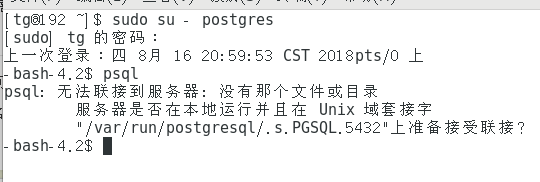
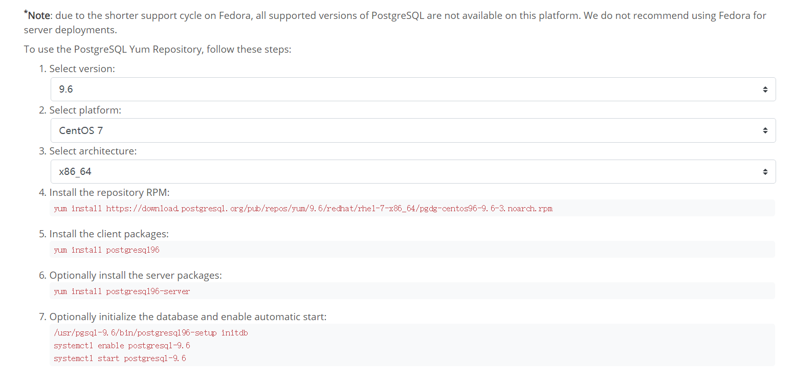
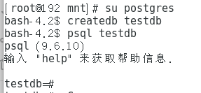

# postgreSQL入门小实践

#### 前言

昨晚无意间点开Jarvis OJ的GitHub，作者也大方的介绍了该项目，用到了ssm+postgreSQL框架开发的，对于ssm这种mvc框架来说，我还算是比较熟悉的。然后对于postgreSQL数据库来说，我就认识很少了，国内大多数人还是用MySQL居多，大学课本也用的MySQL居多，查网站才发现postgreSQL数据库比MySQL更早出来，并且对于大量数据连接有很好的支持作用，然而MySQL只适合做一些小型网站之类的，对于CTF平台这种对数据库连接要求比较高的web程序来说，postgreSQL无疑是最好的选择。

---

根据阮一峰大佬的[博客](http://www.ruanyifeng.com/blog/2013/12/getting_started_with_postgresql.html)

就碰到了这种恶心的事情




百度试了无果。

直接删除虚拟机镜像重新安装，不过阮一峰大佬是拿Ubuntu之类的系统安装，我直接就换了个。

---

#### 安装

先安装PostgreSQL客户端 

> sudo apt-get install postgresql-client 

然后安装PostgreSQL服务器

> sudo apt-get install postgresql 

正常情况下，安装完成后，PostgreSQL服务器会自动在本机的5432端口开启

如果还想安装图形管理界面，可以运行下面命令

> sudo apt-get install pgadmin3 

---

PostgreSQL是C/S模式的数据库，所以，需要开服务器和客户端。

搞了大半天没搞出来，先把SSM学了吧

---

百度谷歌老样子

http://www.gitbook.net/postgresql/2013080333.html

找到这个教程，打算好好啃啃这个教程。

但是这个教程还是有问题，百般折磨之后，还是乖乖去官网。



哎，早知如此何必当初，所以说耐心多重要，做事千万不能浮躁尤其是搞技术。

如图所示，我下载的是centos7 64位的。

#### 安装

最开始先下载RPM包

> ```shell
> yum install https://download.postgresql.org/pub/repos/yum/9.6/redhat/rhel-7-x86_64/pgdg-centos96-9.6-3.noarch.rpm
> ```

再安装PostgreSQL客户端 

> ```shell
> yum install postgresql96
> ```

然后安装PostgreSQL服务器

> ```shell
> yum install postgresql96-server
> ```

正常情况下，安装完成后，PostgreSQL服务器会自动在本机的5432端口开启

（可选）初始化数据库并开启自动启动 

> ```shell
> /usr/pgsql-9.6/bin/postgresql96-setup initdb
> systemctl enable postgresql-9.6
> systemctl start postgresql-9.6
> ```

hhh，镜像删了重新来。



