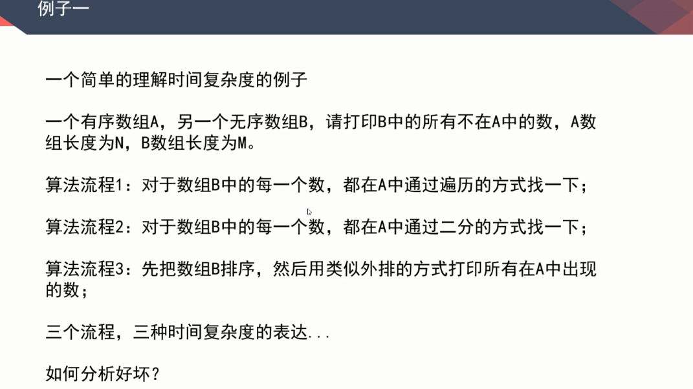
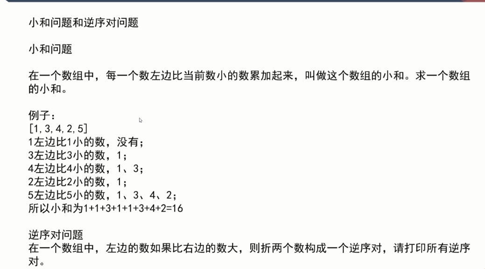

# postgresql入门实践--熟悉SQL语法

### 创建一个新表

你可以通过指定表的名字和所有列的名字及其类型来创建表∶

```sql
CREATE TABLE weather (
    city            varchar(80),
    temp_lo         int,           -- 最低温度
    temp_hi         int,           -- 最高温度
    prcp            real,          -- 湿度
    date            date
);
```

在`psql`输入这些命令以及换行符。`psql`可以识别该命令直到分号才结束。

可以在 SQL 命令中自由使用空白（即空格、制表符和换行符）。 这就意味着你可以用和上面不同的对齐方式键入命令，或者将命令全部放在一行中。两个划线（"`--`"）引入注释。 任何跟在它后面直到行尾的东西都会被忽略。SQL 是对关键字和标识符大小写不敏感的语言，只有在标识符用双引号包围时才能保留它们的大小写（上例没有这么做）。

`varchar(80)`指定了一个可以存储最长 80 个字符的任意字符串的数据类型。`int`是普通的整数类型。`real`是一种用于存储单精度浮点数的类型。`date`类型应该可以自解释（没错，类型为`date`的列名字也是`date`。 这么做可能比较方便或者容易让人混淆 — 你自己选择）。

PostgreSQL支持标准的SQL类型`int`、`smallint`、`real`、`double precision`、`char(*N*)`、`varchar(*N*)`、`date`、`time`、`timestamp`和`interval`，还支持其他的通用功能的类型和丰富的几何类型。PostgreSQL中可以定制任意数量的用户定义数据类型。因而类型名并不是语法关键字，除了SQL标准要求支持的特例外。

第二个例子将保存城市和它们相关的地理位置：

```sql
CREATE TABLE cities (
    name            varchar(80),
    location        point
);
```

类型`point`就是一种PostgreSQL特有数据类型的例子。

最后，我们还要提到如果你不再需要某个表，或者你想以不同的形式重建它，那么你可以用下面的命令删除它：

```sql
DROP TABLE tablename;
```

### 在表中增加行

`INSERT`语句用于向表中添加行：  

```
INSERT INTO weather VALUES ('San Francisco', 46, 50, 0.25, '1994-11-27');
```

 请注意所有数据类型都使用了相当明了的输入格式。那些不是简单数字值的常量通常必需用单引号（`'`）包围，就象在例子里一样。`date`类型实际上对可接收的格式相当灵活，不过在本教程里，我们应该坚持使用这种清晰的格式。    

`point`类型要求一个座标对作为输入，如下： 

```
INSERT INTO cities VALUES ('San Francisco', '(-194.0, 53.0)');
```

到目前为止使用的语法要求你记住列的顺序。一个可选的语法允许你明确地列出列： 

```
INSERT INTO weather (city, temp_lo, temp_hi, prcp, date)
    VALUES ('San Francisco', 43, 57, 0.0, '1994-11-29');
```

如果你需要，你可以用另外一个顺序列出列或者是忽略某些列， 比如说，我们不知道降水量： 

```
INSERT INTO weather (date, city, temp_hi, temp_lo)
    VALUES ('1994-11-29', 'Hayward', 54, 37);
```

许多开发人员认为明确列出列要比依赖隐含的顺序是更好的风格。    

请输入上面显示的所有命令，这样你在随后的各节中才有可用的数据。    

你还可以使用`COPY`从文本文件中装载大量数据。这种方式通常更快，因为`COPY`命令就是为这类应用优化的， 只是比 `INSERT`少一些灵活性。比如：  

```
COPY weather FROM '/home/user/weather.txt';
```

这里源文件的文件名必须在运行后端进程的机器上是可用的， 而不是在客户端上，因为后端进程将直接读取该文件。你可以在[COPY](http://www.postgres.cn/docs/9.6/sql-copy.html)中读到更多有关`COPY`命令的信息。    

### 查询一个表

要从一个表中检索数据就是*查询*这个表。SQL的`SELECT`语句就是做这个用途的。 该语句分为选择列表（列出要返回的列）、表列表（列出从中检索数据的表）以及可选的条件（指定任意的限制）。比如，要检索表`weather`的所有行，键入：

```sql
SELECT * FROM weather;
```

这里`*`是"所有列"的缩写。因此相同的结果应该这样获得：

```sql
SELECT city, temp_lo, temp_hi, prcp, date FROM weather;
```

而输出应该是：


你可以在选择列表中写任意表达式，而不仅仅是列的列表。比如，你可以：

```sql
SELECT city, (temp_hi+temp_lo)/2 AS temp_avg, date FROM weather;
```

这样应该得到：


请注意这里的`AS`子句是如何给输出列重新命名的（`AS`子句是可选的）。    

一个查询可以使用`WHERE`子句"修饰"，它指定需要哪些行。`WHERE`子句包含一个布尔（真值）表达式，只有那些使布尔表达式为真的行才会被返回。在条件中可以使用常用的布尔操作符（`AND`、`OR`和`NOT`）。 比如，下面的查询检索旧金山的下雨天的天气：  

 ```sql
SELECT * FROM weather WHERE city = 'San Francisco' AND prcp > 0.0;
 ```



你可以要求返回的查询结果是排好序的：

```sql
SELECT * FROM weather ORDER BY city;
```


在这个例子里，排序的顺序并未完全被指定，因此你可能看到属于旧金山的行被随机地排序。但是如果你使用下面的语句，那么就总是会得到上面的结果：

```sql
SELECT * FROM weather ORDER BY city, temp_lo;
```



你可以要求在查询的结果中消除重复的行：

```sql
SELECT DISTINGT city FROM weather;
```


