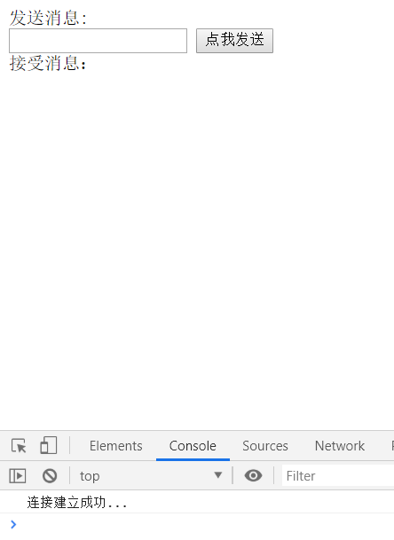
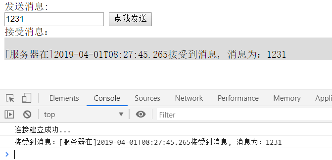
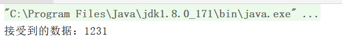
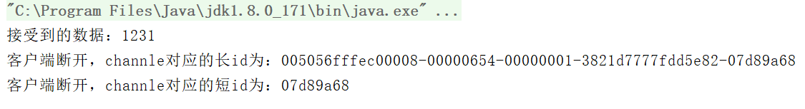

## 前驱知识
### WebSocket
维基百科：
WebSocket是一种在单个TCP连接上进行全双工通信的协议。WebSocket通信协议于2011年被IETF定为标准RFC 6455，并由RFC7936补充规范。WebSocket API也被W3C定为标准。

WebSocket使得客户端和服务器之间的数据交换变得更加简单，允许服务端主动向客户端推送数据。在WebSocket API中，浏览器和服务器只需要完成一次握手，两者之间就直接可以创建持久性的连接，并进行双向数据传输。

## 添加maven依赖
```xml
    <build>
        <plugins>
            <plugin>
                <groupId>org.apache.maven.plugins</groupId>
                <artifactId>maven-compiler-plugin</artifactId>
                <configuration>
                    <source>8</source>
                    <target>8</target>
                </configuration>
            </plugin>
        </plugins>
    </build>


    <dependencies>
        <dependency>
            <groupId>io.netty</groupId>
            <artifactId>netty-all</artifactId>
            <version>4.1.25.Final</version>
        </dependency>
    </dependencies>
```

## 编写代码
### Chat处理器
```java
import io.netty.channel.ChannelHandlerContext;
import io.netty.channel.SimpleChannelInboundHandler;
import io.netty.channel.group.ChannelGroup;
import io.netty.channel.group.DefaultChannelGroup;
import io.netty.handler.codec.http.websocketx.TextWebSocketFrame;
import io.netty.util.concurrent.GlobalEventExecutor;

import java.time.LocalDateTime;

/**
 * @author: Tu9ohost
 * 处理消息的handler
 * TextWebSocketFrame: 在netty中，是用于为websocket专门处理文本的对象，frame是消息的载体
 */
public class ChatHandler extends SimpleChannelInboundHandler<TextWebSocketFrame> {

    // 用于记录和管理所有客户端的channle
    private static ChannelGroup clients =
            new DefaultChannelGroup(GlobalEventExecutor.INSTANCE);

    @Override
    protected void channelRead0(ChannelHandlerContext ctx, TextWebSocketFrame msg)
            throws Exception {
        // 获取客户端传输过来的消息
        String content = msg.text();
        System.out.println("接受到的数据：" + content);

//		for (Channel channel: clients) {
//			channel.writeAndFlush(
//				new TextWebSocketFrame(
//						"[服务器在]" + LocalDateTime.now()
//						+ "接受到消息, 消息为：" + content));
//		}
        // 下面这个方法，和上面的for循环，一致
        clients.writeAndFlush(
                new TextWebSocketFrame(
                        "[服务器在]" + LocalDateTime.now()
                                + "接受到消息, 消息为：" + content));

    }

    /**
     * 当客户端连接服务端之后（打开连接）
     * 获取客户端的channle，并且放到ChannelGroup中去进行管理
     */
    @Override
    public void handlerAdded(ChannelHandlerContext ctx) throws Exception {
        clients.add(ctx.channel());
    }

    @Override
    public void handlerRemoved(ChannelHandlerContext ctx) throws Exception {
        // 当触发handlerRemoved，ChannelGroup会自动移除对应客户端的channel
//		clients.remove(ctx.channel());
        System.out.println("客户端断开，channle对应的长id为："
                + ctx.channel().id().asLongText());
        System.out.println("客户端断开，channle对应的短id为："
                + ctx.channel().id().asShortText());
    }
}
```
### 编写服务初始化
```java
import io.netty.channel.ChannelInitializer;
import io.netty.channel.ChannelPipeline;
import io.netty.channel.socket.SocketChannel;
import io.netty.handler.codec.http.HttpObjectAggregator;
import io.netty.handler.codec.http.HttpServerCodec;
import io.netty.handler.codec.http.websocketx.WebSocketServerProtocolHandler;
import io.netty.handler.stream.ChunkedWriteHandler;

/**
 * @author: Tu9ohost
 */
public class WSServerInitiazer extends ChannelInitializer<SocketChannel> {

    @Override
    protected void initChannel(SocketChannel ch) throws Exception {
        ChannelPipeline pipeline = ch.pipeline();

        // websocket 基于http协议，所以要有http编解码器
        pipeline.addLast(new HttpServerCodec());
        // 对写大数据流的支持
        pipeline.addLast(new ChunkedWriteHandler());
        // 对httpMessage进行聚合，聚合成FullHttpRequest或FullHttpResponse
        // 几乎在netty中的编程，都会使用到此hanler
        pipeline.addLast(new HttpObjectAggregator(1024*64));

        // ====================== 以上是用于支持http协议    ======================

        // ====================== 以下是支持httpWebsocket ======================

        /**
         * websocket 服务器处理的协议，用于指定给客户端连接访问的路由 : /ws
         * 本handler会帮你处理一些繁重的复杂的事
         * 会帮你处理握手动作： handshaking（close, ping, pong） ping + pong = 心跳
         * 对于websocket来讲，都是以frames进行传输的，不同的数据类型对应的frames也不同
         */
        pipeline.addLast(new WebSocketServerProtocolHandler("/ws"));

        // 自定义的handler
        pipeline.addLast(new ChatHandler());
    }
}
```
### 主方法
```java
import io.netty.bootstrap.ServerBootstrap;
import io.netty.channel.ChannelFuture;
import io.netty.channel.EventLoopGroup;
import io.netty.channel.nio.NioEventLoopGroup;
import io.netty.channel.socket.nio.NioServerSocketChannel;

/**
 * @author: Tu9ohost
 */
public class WSServer {

    public static void main(String[] args) throws Exception {

        EventLoopGroup mainGroup = new NioEventLoopGroup();
        EventLoopGroup subGroup = new NioEventLoopGroup();

        try {
            ServerBootstrap server = new ServerBootstrap();
            server.group(mainGroup, subGroup)
                    .channel(NioServerSocketChannel.class)
                    .childHandler(new WSServerInitiazer());

            // 定义了端口为8088
            ChannelFuture future = server.bind(8088).sync();

            future.channel().closeFuture().sync();
        } finally {
            mainGroup.shutdownGracefully();
            subGroup.shutdownGracefully();
        }
    }
}
```
## 编写界面
```html
<!DOCTYPE html>
<html>
	<head>
		<meta charset="utf-8" />
		<title></title>
	</head>
	<body>
		
		<div>发送消息:</div>
		<input type="text" id="msgContent"/>
		<input type="button" value="点我发送" onclick="CHAT.chat()"/>
		
		<div>接受消息：</div>
		<div id="receiveMsg" style="background-color: gainsboro;"></div>
		
		<script type="application/javascript">
			
			window.CHAT = {
				socket: null,
				init: function() {
					if (window.WebSocket) {
						CHAT.socket = new WebSocket("ws://127.0.0.1:8088/ws");
						CHAT.socket.onopen = function() {
							console.log("连接建立成功...");
						},
						CHAT.socket.onclose = function() {
							console.log("连接关闭...");
						},
						CHAT.socket.onerror = function() {
							console.log("发生错误...");
						},
						CHAT.socket.onmessage = function(e) {
							console.log("接受到消息：" + e.data);
							var receiveMsg = document.getElementById("receiveMsg");
							var html = receiveMsg.innerHTML;
							receiveMsg.innerHTML = html + "<br/>" + e.data;
						}
					} else {
						alert("浏览器不支持websocket协议...");
					}
				},
				chat: function() {
					var msg = document.getElementById("msgContent");
					CHAT.socket.send(msg.value);
				}
			};
			
			CHAT.init();
			
		</script>
	</body>
</html>
```

## 检验
首先运行主方法，再打开界面，按F12，会显式链接建立成功

随意编写，再点击`点我发送`

服务端显式

关闭界面窗口，则会显式断开链接id
