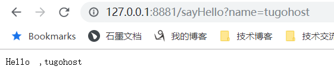

# 安装ZooKeeper

我这里使用zookeeper作为服务注册中心，版本3.4.9，下载地址：

http://mirrors.hust.edu.cn/apache/zookeeper/zookeeper-3.4.12/

下载后，解压

要先配置一下，否则没法启动，启动会报错，找不到 `zoo.cfg` 文件，其实这个配置文件是有的，在 `conf`文件夹里，只不过名字是 `zoo_sample.cfg` 把名字改一下即可

windows是启动还有些问题，直接运行 `zkServer.cmd` 还不行，我电脑上还装了 git-bash ，所以直接打开 git-bash 进入 bin 目录，运行命令 `./zkServer.sh start` 即可启动

停止命令是 `./zkServer.sh stop`

# 新建项目`SpringBoot_dubbo_server`

加入依赖：

```xml
<?xml version="1.0" encoding="UTF-8"?>
<project xmlns="http://maven.apache.org/POM/4.0.0"
         xmlns:xsi="http://www.w3.org/2001/XMLSchema-instance"
         xsi:schemaLocation="http://maven.apache.org/POM/4.0.0 http://maven.apache.org/xsd/maven-4.0.0.xsd">
    <modelVersion>4.0.0</modelVersion>

    <groupId>com.tugohost</groupId>
    <artifactId>springboot_dubbo_server</artifactId>
    <version>1.0-SNAPSHOT</version>
    <packaging>jar</packaging>

    <name>springboot_dubbo_server</name>
    <description>springboot_dubbo_server</description>

    <parent>
        <groupId>org.springframework.boot</groupId>
        <artifactId>spring-boot-starter-parent</artifactId>
        <version>2.1.3.RELEASE</version>
    </parent>

    <properties>
        <project.build.sourceEncoding>UTF-8</project.build.sourceEncoding>
        <project.reporting.outputEncoding>UTF-8</project.reporting.outputEncoding>
        <java.version>1.8</java.version>
    </properties>

    <dependencies>
        <dependency>
            <groupId>org.springframework.boot</groupId>
            <artifactId>spring-boot-starter</artifactId>
            <exclusions>
                <exclusion>
                    <groupId>org.springframework.boot</groupId>
                    <artifactId>spring-boot-starter-logging</artifactId>
                </exclusion>
            </exclusions>
        </dependency>
        <dependency>
            <groupId>org.springframework.boot</groupId>
            <artifactId>spring-boot-starter-log4j</artifactId>
            <version>1.2.8.RELEASE</version>
        </dependency>
        <dependency>
            <groupId>io.dubbo.springboot</groupId>
            <artifactId>spring-boot-starter-dubbo</artifactId>
            <version>1.0.0</version>
        </dependency>
    </dependencies>

    <build>
        <plugins>
            <plugin>
                <groupId>org.springframework.boot</groupId>
                <artifactId>spring-boot-maven-plugin</artifactId>
            </plugin>
        </plugins>
    </build>

</project>
```

## 配置文件`application.yml`如下：

```yml
server:
  port: 8880

spring:
  dubbo:
    application:
      name: dubbo_server
    registry:
      address: zookeeper://127.0.0.1:2181
    protocol:
      name: dubbo
      port: 20880
    scan: com.tugohost.dubbo
```

## 定义一个Service Interface：HelloService

```java
package com.tugohost.dubbo;

/**
 * @author: Tu9ohost
 */
public interface HelloService {
    String SayHello(String name);
}

```

## 接口的实现类：HelloServiceImpl.java：

```java
package com.tugohost.dubbo.impl;

import com.alibaba.dubbo.config.annotation.Service;
import com.tugohost.dubbo.HelloService;

/**
 * @author: Tu9ohost
 */
@Service(version = "1.0.0")
public class HelloServiceImpl implements HelloService {
    @Override
    public String SayHello(String name) {
        return "Hello  ," + name;
    }
}

```

到这里dubbo服务提供者已经创建完成。

# 新建项目`SpringBoot_dubbo_client`

加入依赖如下：

```xml
<?xml version="1.0" encoding="UTF-8"?>
<project xmlns="http://maven.apache.org/POM/4.0.0"
         xmlns:xsi="http://www.w3.org/2001/XMLSchema-instance"
         xsi:schemaLocation="http://maven.apache.org/POM/4.0.0 http://maven.apache.org/xsd/maven-4.0.0.xsd">
    <modelVersion>4.0.0</modelVersion>

    <groupId>com.tugohost</groupId>
    <artifactId>springboot_dubbo_client</artifactId>
    <version>1.0-SNAPSHOT</version>
    <packaging>jar</packaging>

    <name>springboot_dubbo_client</name>
    <description>springboot_dubbo_client</description>

    <parent>
        <groupId>org.springframework.boot</groupId>
        <artifactId>spring-boot-starter-parent</artifactId>
        <version>2.1.3.RELEASE</version>
    </parent>

    <properties>
        <project.build.sourceEncoding>UTF-8</project.build.sourceEncoding>
        <project.reporting.outputEncoding>UTF-8</project.reporting.outputEncoding>
        <java.version>1.8</java.version>
    </properties>

    <dependencies>
        <dependency>
            <groupId>org.springframework.boot</groupId>
            <artifactId>spring-boot-starter</artifactId>
            <exclusions>
                <exclusion>
                    <groupId>org.springframework.boot</groupId>
                    <artifactId>spring-boot-starter-logging</artifactId>
                </exclusion>
            </exclusions>
        </dependency>

        <dependency>
            <groupId>org.springframework.boot</groupId>
            <artifactId>spring-boot-starter-web</artifactId>
        </dependency>
        <dependency>
            <groupId>org.springframework.boot</groupId>
            <artifactId>spring-boot-starter-log4j</artifactId>
            <version>1.2.8.RELEASE</version>
        </dependency>
        <dependency>
            <groupId>io.dubbo.springboot</groupId>
            <artifactId>spring-boot-starter-dubbo</artifactId>
            <version>1.0.0</version>
        </dependency>
    </dependencies>

    <build>
        <plugins>
            <plugin>
                <groupId>org.springframework.boot</groupId>
                <artifactId>spring-boot-maven-plugin</artifactId>
            </plugin>
        </plugins>
    </build>
</project>
```

## 配置文件`application.yml`

```yml
server:
  port: 8881

spring:
  dubbo:
    application:
      name: dubbo_client
    registry:
      address: zookeeper://127.0.0.1:2181
    scan: com.tugohost.controller
```

## HelloService接口如下：

```java
package com.tugohost.dubbo;

/**
 * @author: Tu9ohost
 */
public interface HelloService {
    String SayHello(String name);
}

```

## 创建一个controller进行测试

注意版本号要与提供者的版本号一致，dubbo扫描包要扫描到我们要使用的类上，代码如下：

```java
package com.tugohost.controller;

import com.alibaba.dubbo.config.annotation.Reference;
import com.tugohost.dubbo.HelloService;
import org.springframework.web.bind.annotation.GetMapping;
import org.springframework.web.bind.annotation.RestController;

/**
 * @author: Tu9ohost
 */
@RestController
public class HelloController {
    @Reference(url = "dubbo://127.0.1:20880",version = "1.0.0")
    HelloService helloService;

    @GetMapping("sayHello")
    public String sayHello(String name){
        return helloService.SayHello(name);
    }
}

```

到这里dubbo服务调用者也创建完成。

# 测试

分别启动服务提供者项目和服务调用者项目，在浏览器访问http://localhost:8881/sayHello?name=tugohost，如图，证明调用成功。



