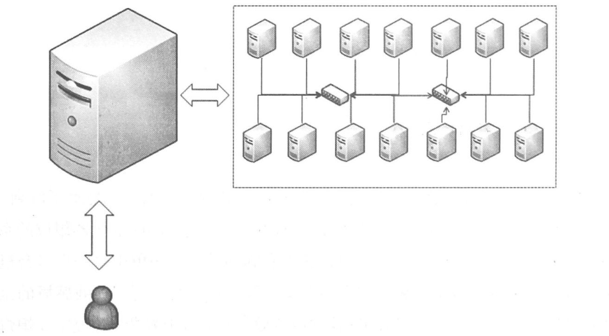

# 分布式系统概述
## 初识分布式系统
### 分布式系统的定义
这里引用一下Distributed System Concepts and Design(Third Edition)中的一句话：“A distributed system is one in which components located at networked computers communicate and coordinate their actions only by passing messages”。从这句话我们可以看到几个重点，一是组件分布在网络计算机上，而是组件之间仅仅通过消息传递并协调行动。
下图是一个分布式系统的示意图，**从用户的视角看，用户面对的就是一个服务器，提供用户需要的服务，而实际上是靠背后的众多服务器组成的一个分布式系统来提供服务**。分布式系统看起来就像一个超级计算机一样。

我们来理解一下分布式系统的定义。**首先分布式系统一定是由多个节点组成的系统，一般来说一个节点就是我们的一台计算机；然后这些节点不是孤立的，而是互相连通的；最后，这些连通的节点上部署了我们的组件，并且相互之间的操作会有协同**。
### 分布式系统的意义
从单机单用户到单机多用户，再到现在的网络时代，应用系统发生了很多的变化。而分布式系统依然是目前很热门的讨论话题。下面从三个方面来介绍一下其中的原因：
- 升级单机处理能力的性价比越来越低。
- 单机处理能力存在瓶颈。
- 处于稳定性和可用性的考虑。

# 参考资料
- 大型网站系统与Java中间件开发实践
- 亿级流量网站架构核心技术