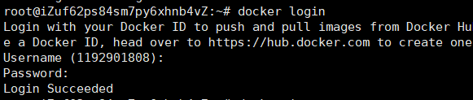
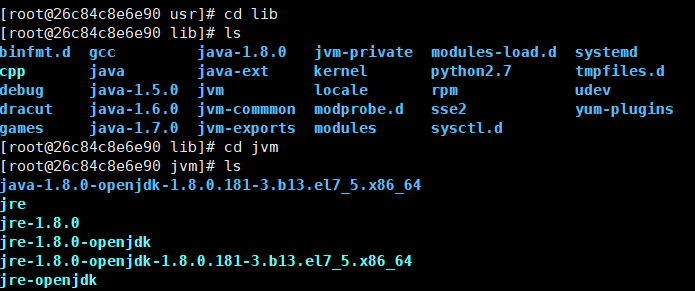

#### 前言
最近想通过Javaee来开发博客，但是不想因为环境配置问题总是耗时间配置相关配置，所以萌生出用docker镜像来搭建web的系统环境，也是作为docker学习实践的笔记。
#### docker hub注册
前往 [docker-hub](https://hub.docker.com/) 注册账号
#### 命令行登陆docker-hub
`docker login`


### 制作镜像
#### 拉取镜像
`docker pull centos`
#### 运行镜像
`docker run -it 镜像名`
#### 进入bash
`docker exec -i -t 容器ID或名字 /bin/bash`
### 安装tomcat
#### 安装gcc
`yum install gcc-c++`
#### 安装PCRE
`yum install -y pcre pcre-devel`
#### 安装zlib
`yum install -y zlib zlib-devel`
#### 安装wget
`yum -y install wget`
#### 下载tomcat
直接去[官网](http://tomcat.apache.org/download-70.cgi)下载即可
`wget http://mirrors.hust.edu.cn/apache/tomcat/tomcat-7/v7.0.90/bin/apache-tomcat-7.0.90.tar.gz`
##### 解压
`tar -xzvf apache-tomcat-7.0.90.tar.gz`
#### 安装java
` yum install java-1.8.0-openjdk`
### 设置环境变量
#### 设置好JAVA_HOME之类的环境

`vi /etc/profile`
在profile中添加如下
```
#set java environment
JAVA_HOME=/usr/lib/jvm/java-1.8.0-openjdk-1.8.0.181-3.b13.el7_5.x86_64
JRE_HOME=$JAVA_HOME/jre
CLASS_PATH=.:$JAVA_HOME/lib/dt.jar:$JAVA_HOME/lib/tools.jar:$JRE_HOME/lib
PATH=$PATH:$JAVA_HOME/bin:$JRE_HOME/bin
export JAVA_HOME JRE_HOME CLASS_PATH PATH
```
修改之后，执行`source /etc/profile`使得配置生效。
#### 下载 mysql源安装包
`wget https://dev.mysql.com/get/mysql57-community-release-el7-11.noarch.rpm`
#### 安装mysql源
`yum -y localinstall mysql57-community-release-el7-11.noarch.rpm `

-----
到此，我们的tomcat，jdk环境，mysql都已经全部搞好了。
我们最后push上去就可以了。
#### 退出镜像
`exit`
#### 制作镜像
`docker commit 26c84c8e6e90 docker.io/1192901808/ltmj`
#### 上传镜像
`docker push docker.io/1192901808/ltmj:latest`

----
到此，已经全部结束了。。

