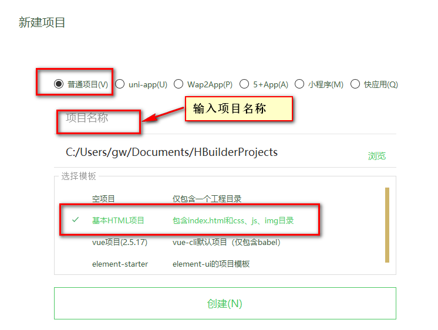
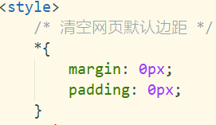
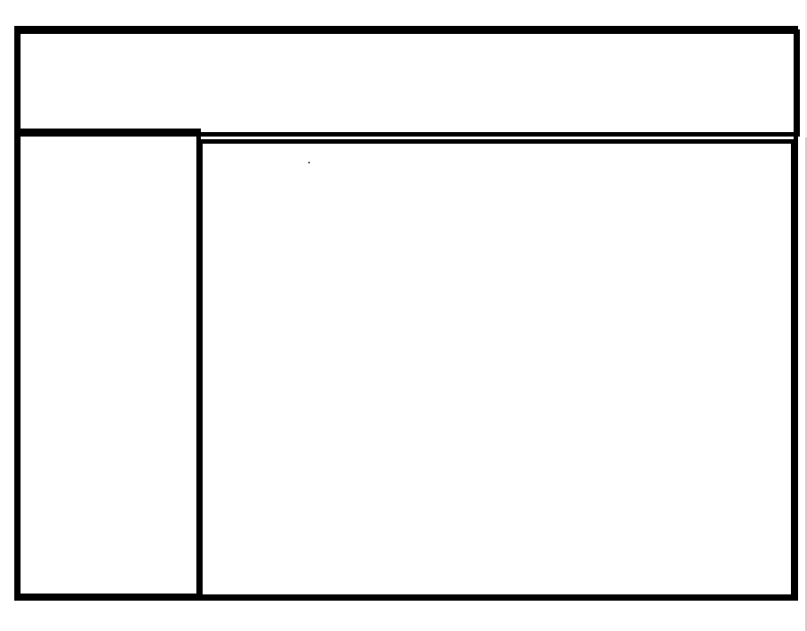
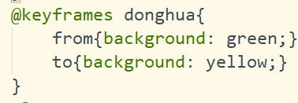
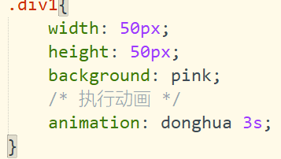
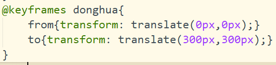
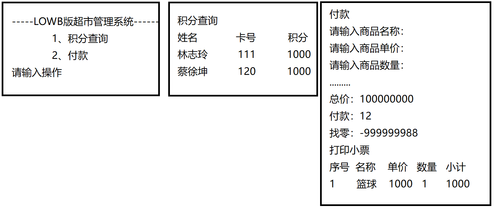
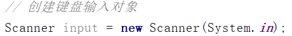

# HTML5
## 创建项目
选择文件——新建项目——普通项目——项目名（Web01）-基础HTML项目

## 编写代码
### 盒子模型(div)
### 作用：
用于将整个网页划分开来并填充对应的内容，盒子模型会将整个网页分割成许多模块。
盒子与盒子之间存在距离
如果盒子是包含关系：内边距（padding）
如果盒子存在并列关系：外边距（margin）
### 选择器：
- class选择器：一般用于样式
- 标签选择器：很少使用
- id选择器：一般用于JS
---
在编写每一个页面之前，先清空页面默认边距（内边距，外边距）。

需求：编写一个网页，将该网页分割成上左右模式

### 动画
动画两步走
第一步：编写动画执行过程——动画做什么的 @keyframe
编写一个动画名词叫donghua，执行让div颜色由绿色变成黄色

第二步：调用动画——谁执行动画 
语法：Animation：动画名称 动画执行的时间

编写一个动画，让该div沿着x轴移动一定距离
translate()

执行动画

# Java
Java三大架构
- JavaSE：Java基础版，一般用于C/S（客户端/服务器）
  - Java基础（循环、选择，数组、String）、面向对象（封装、继承、多态、抽象）、异常、集合、IO流、线程、socket、JDBC、MySQL
- JavaEE：Java企业版，一般用于B/S（浏览器/服务器）
  - HTML、CSS、JS、Jquery、JSP、Servlet、AJAX（工厂模式、过滤器…）、SSM、Spring Cloud、Spring Boot
- JavaME：Java移动端
# 项目

## 类名
1. 字母、数字、_、$组成，数字不能开头
2. 驼峰式命名，单词首字母大写
3. 不能是关键字
4. 见名知意
## 包名
com.公司名.项目名.模块名
com.szxy.day01

## 类
- 访问控制符
- class
- 类名
- 程序运行的入口

## 转义字符
- \n：表示换行
- \t：表示一个制表符（tab）
- \s：表示一个空格
- \_：表示一个下划线
## 键盘输入
第一步：创建键盘输入对象

第二步：接收不同类型数据
8大数据类型
- 整型：byte(1) short(2) int(4) long(8)
- 浮点型：float(4) double(8)
- 字符型：char(2)
- 布尔类型：boolean(1)
引用数据类型
String 数组 对象 类
## 选择结构
if else

需求：键盘输入小明考试成绩，如果及格，吃个鸡

switch
面试题：表达式的值可以为那些数据类型？
1、byte short int char
2、JDK1.5以后可以是枚举
3、JDK1.7以后可以是String

if选择一般用于连续区间，switch选择一般用于离散区间

变量的定义：变量表示内存中一块存储空间的表示
比那辆三要素：变量类型、变量名、变量值

`引用数据类型的真实值存在堆中，在栈上只有该数据类型存储空间的别名，是一个十六进制的字符串，所以引用数据类型不能用==判断
基本数据类的真实值直接存储在栈上，所以可以使用==判断`