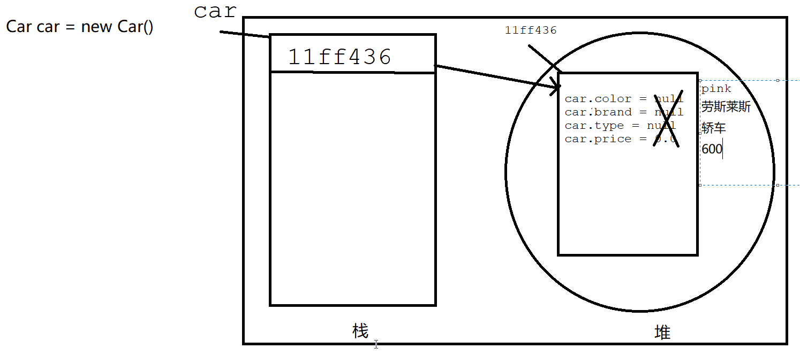

# 循环结构
循环起始点、循环条件、循环体、迭代
## while

```java
while(){

}
```

`break`表示终止循环或选择机构，不再执行任何操作

`continue`表示结束本次循环，继续下一次循环

## do while
```java
do{

}while();
```
while 与 do...while的区别：
do...while：先执行一次，再判断，最少执行一次
while：先判断在执行，可能一次都不执行
## for
```java
for(循环起始点;循环条件;迭代){

}
```

# 数组

数组：表示内存中一块连续存储空间的表示

## 数组的特点

- 长度固定
- 只能存储相同数据类型
- 有序的（下标）

## 定义数组

数组定义的长度表示它在内存中开辟多少空间，在空间中会存储数组对应数据类型的布尔值。

# 面向对象

## 面向对象与面向过程的区别？

`面向过程`是按照事物的形成过程一步一步完成整个过程

`面向对象`是直接调用事物形成过程中的方法

**`面向对象`的底层都是`面向过程`**

`类`：是一个抽象概念

`对象`：是一个具体事物，是一个事务存在的事物

**`类`是对对象的抽象描述，对象是对`类`的具体产物，在Java中默认现有类，再有对象**

在Java中属性用变量表示

第一步：创建类

类在内存中的分配情况：




## 方法

语法

访问控制符 返回值类型 方法名 参数 {	

​		方法体

}

- 访问控制符: 
  - public 
  - private 
  - protected 
  - 默认（不写）

- 返回值类型：
  - void没有返回值
  - 数据类型：返回对应数据类型的数据

- 方法名：
  - 有字母、数字、_、$组成，数字不能开头
  - 驼峰式命名（第一个单词首字母小写，后面单词首字母大写）
  - 不能是关键字
  - 见名知意

- 参数：
  - 可有可无

- 方法体
  - 规定该方法的作用

需求：计算两个数的和

方式一：无参数，无返回值

方式二：有参数，无返回值