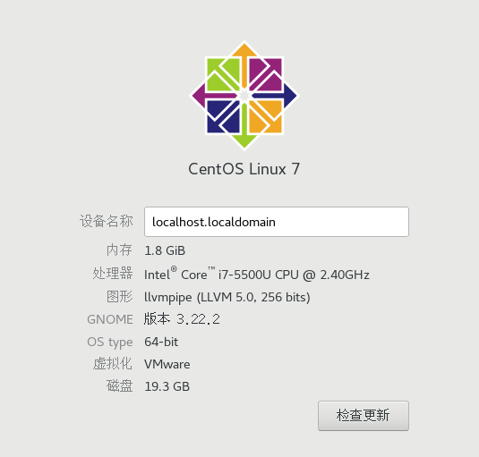
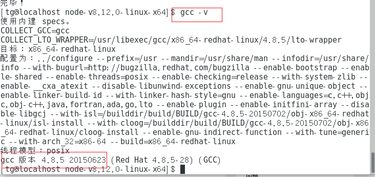

# 基于Centos7搭建ES6学习环境

本过程所在系统环境:



### 获取node.js源码

执行命令:

```shell
sudo wget https://nodejs.org/dist/v8.12.0/node-v8.12.0-linux-x64.tar.xz
```

### 解压缩

```shell
sudo tar xvf node-v8.12.0-linux-x64.tar.xz
```

### 进入解压的node文件夹，安装必要的编译软件包

```shell
cd node-v8.12.0-linux-x64/
sudo yum install gcc gcc-c++
```

在这里，先检查gcc的版本

```shell
gcc -v
```



如果版本号低于4.9.4，请先升级gcc，因为nodejs8.7.0编译时gcc版本要求在4.9.4+。

更新方法参考这篇文章:https://my.oschina.net/golang/blog/1526674

