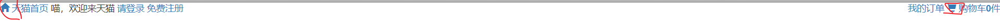
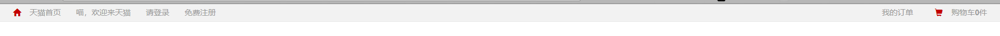
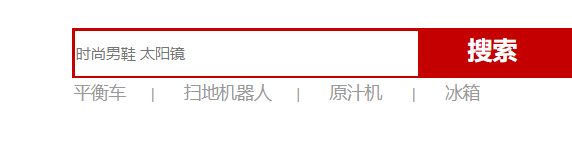
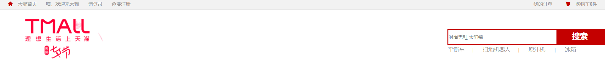
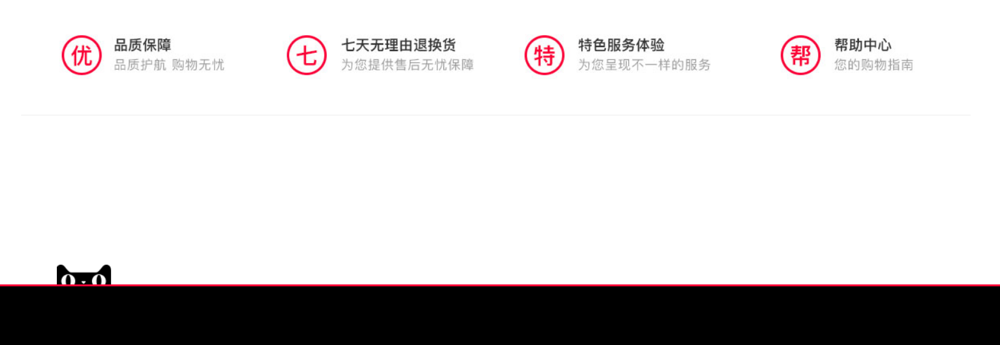
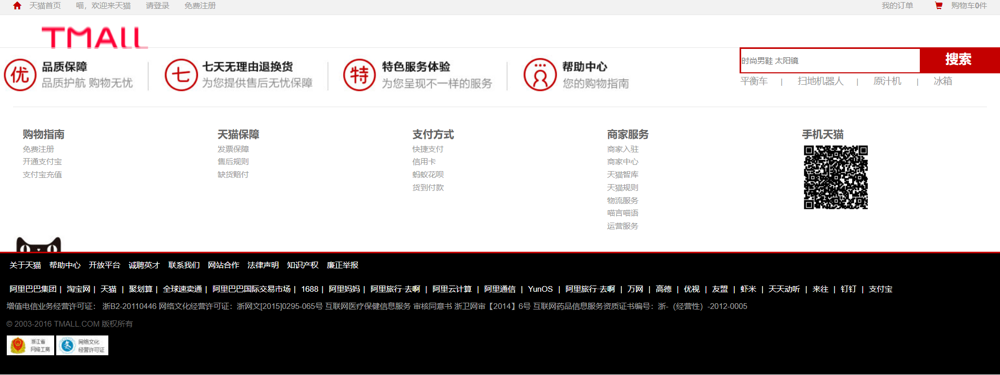

# 天猫前端页面实践

前段时间学习了，html、css、js，但都是纸上谈兵，没有实践过，打算好好实践一下。比如写一个天猫前端页面，当然对于刚开始的我不可能从头到尾都是自己写的，所以先借鉴老师傅们的，在自己在空白页上写。这样知识就算是我得了，而不是老师傅们的了。

----

## 实践上篇--跟着老师傅敲一边

实践先跟着老师傅照葫芦画瓢。

先贴出`置顶栏`

```html
<!DOCTYPE html>
<head>
<meta http-equiv="Content-Type" content="text/html; charset=UTF-8">
<script src="https://cdn.bootcss.com/jquery/2.0.0/jquery.min.js"></script>
<script src="https://cdn.bootcss.com/bootstrap/3.3.6/js/bootstrap.min.js"></script>
<link href="https://cdn.bootcss.com/bootstrap/3.3.6/css/bootstrap.min.css" rel="stylesheet">
</head>

<nav class="top">
    <a href="#nowhere">
        <span class="glyphicon glyphicon-home redColor"></span>
        天猫首页
    </a>

    <span>喵，欢迎来天猫</span>
        <a href="#nowhere">请登录</a>
        <a href="#nowhere">免费注册</a>

    <span class="pull-right">
        <a href="#nowhere">我的订单</a>
        <a href="#nowhere">
            <span class="glyphicon glyphicon-shopping-cart redColor"></span>
            购物车<strong>0</strong>件
        </a>
    </span>
</nav>
```

其中有用到了`bootstrap`的图标



老师傅基本上使用的是bootstrap的图标呢。

添加样式

```html
<style>
body{
    font-size: 12px;
    font-family: Arial;
}
a{
    color:#999;
}
.redColor{
    color: #C40000 !important;
}
nav.top{
    background-color: #f2f2f2;
    padding-top: 5px;
    padding-bottom: 5px;
    border-bottom:1px solid  #e7e7e7;
}
nav.top span, nav.top a{
    color: #999;
    margin: 0px 10px 0px 10px;
}
nav.top a:hover{
    color: #C40000;
    text-decoration: none;
}
</style>
```



调整了字体大小和字体，然后所有的链接转为灰色#999，将home和shopcat图标转为红色，添加背景色。

---

再然后是`搜索框`

```html
<div class="searchDiv pull-right">
        <input type="text" placeholder="时尚男鞋 太阳镜" name="keyword">
        <button class="searchButton" type="submit">搜索</button>
        <div class="searchBelow">
            <span> <a href="#nowhere">平衡车</a><span>|</span>
            </span><span><a href="#nowhere">扫地机器人</a><span>|</span>
            </span> <span> <a href="#nowhere"> 原汁机 </a> <span>|</span>
            </span> <span> <a href="#nowhere"> 冰箱 </a></span>
        </div>
    </div>
```

样式

```css

div.searchDiv{
    background-color: #C40000;
    width: 400px;
    margin: 50px auto;
    padding: 1px;
    height: 40px;
    display: block;
}

div.searchDiv input{
    width: 275px;
    border: 1px solid transparent;
    height: 36px;
    margin: 1px;
    outline: none;
}

div.searchDiv button{
    width: 110px;
    border: 1px solid transparent;
    background-color: #C40000;
    color: white;
    font-size: 20px;
    font-weight: bold;
}

div.searchBelow{
    margin-top: 3px;
    margin-left: -20px;
}

div.searchBelow span{
    color: #999;
}

div.searchBelow a{
    padding: 0px 20px 0px 20px;
    font-size: 14px;
}
```

效果



由于`<div class="searchDiv pull-right">`所以整体显示是靠右的。



搜索框就到这。

---

接下来是页脚，天猫商城有个专属的页脚



```html
<div style="display: block;" class="footer" id="footer">
    <div class="font_ensure" id="footer_ensure">
        <a href="#nowhere">
            
        </a>
    </div>
    <div class="footer_desc" id="footer_desc">
        <div class="descColumn">
            <span class="descColumnTitle">购物指南</span>
            <a href="#nowhere">免费注册</a>
            <a href="#nowhere">开通支付宝</a>
            <a href="#nowhere">支付宝充值</a>
        </div>
        <div class="descColumn">
            <span class="descColumnTitle">天猫保障</span>
            <a href="#nowhere">发票保障</a>
            <a href="#nowhere">售后规则</a>
            <a href="#nowhere">缺货赔付</a>
        </div>
        <div class="descColumn">
            <span class="descColumnTitle">支付方式</span>
            <a href="#nowhere">快捷支付</a>
            <a href="#nowhere">信用卡</a>
            <a href="#nowhere">蚂蚁花呗</a>
            <a href="#nowhere">货到付款</a>
        </div>
        <div class="descColumn">
            <span class="descColumnTitle">商家服务</span>
            <a href="#nowhere">商家入驻</a>
            <a href="#nowhere">商家中心</a>
            <a href="#nowhere">天猫智库</a>
            <a href="#nowhere">天猫规则</a>
            <a href="#nowhere">物流服务</a>
            <a href="#nowhere">喵言喵语</a>
            <a href="#nowhere">运营服务</a>
        </div>
        <div class="descColumn">
            <span class="descColumnTitle">手机天猫</span>
            <a href="#nowhere"></a>
        </div>
    </div>
<div style="clear: both"></div>
    
    <div class="copyright" id="copyright">
            <div class="white_link">
                    <a href="#nowhere">关于天猫</a>
                    <a href="#nowhere"> 帮助中心</a>
                    <a href="#nowhere">开放平台</a>
                    <a href="#nowhere">  诚聘英才</a>
                    <a href="#nowhere">联系我们</a>
                    <a href="#nowhere">网站合作</a>
                    <a href="#nowhere">法律声明</a>
                    <a href="#nowhere">知识产权</a>
                    <a href="#nowhere">  廉正举报 </a>
                </div>
                <div class="white_link">
                    <a href="#nowhere"> 阿里巴巴集团</a><span class="slash">|</span>
                    <a href="#nowhere"> 淘宝网</a><span class="slash">|</span>
                    <a href="#nowhere">天猫 </a><span class="slash">|</span>
                    <a href="#nowhere">  聚划算</a><span class="slash">|</span>
                    <a href="#nowhere">全球速卖通</a><span class="slash">|</span>
                    <a href="#nowhere">阿里巴巴国际交易市场</a><span class="slash">|</span>
                    <a href="#nowhere">1688</a><span class="slash">|</span>
                    <a href="#nowhere">阿里妈妈</a><span class="slash">|</span>
                    <a href="#nowhere">  阿里旅行·去啊  </a><span class="slash">|</span>
                    <a href="#nowhere">  阿里云计算    </a><span class="slash">|</span>
                    <a href="#nowhere">  阿里通信     </a><span class="slash">|</span>
                    <a href="#nowhere">  YunOS    </a><span class="slash">|</span>
                    <a href="#nowhere">  阿里旅行·去啊  </a><span class="slash">|</span>
                    <a href="#nowhere">   万网  </a><span class="slash">|</span>
                    <a href="#nowhere">  高德   </a><span class="slash">|</span>
                    <a href="#nowhere"> 优视    </a><span class="slash">|</span>
                    <a href="#nowhere">  友盟   </a><span class="slash">|</span>
                    <a href="#nowhere">  虾米   </a><span class="slash">|</span>
                    <a href="#nowhere">  天天动听 </a><span class="slash">|</span>
                    <a href="#nowhere">  来往   </a><span class="slash">|</span>
                    <a href="#nowhere">  钉钉   </a><span class="slash">|</span>
                    <a href="#nowhere">  支付宝      </a>
                </div>
                <div class="license">
                    <span>增值电信业务经营许可证： 浙B2-20110446</span>
                    <span>网络文化经营许可证：浙网文[2015]0295-065号</span>
                    <span>互联网医疗保健信息服务 审核同意书 浙卫网审【2014】6号 </span>
                    <span>互联网药品信息服务资质证书编号：浙-（经营性）-2012-0005</span>
                    <div class="copyRightYear">© 2003-2016 TMALL.COM 版权所有</div>
                <div>
                    
                    
                </div>
    </div>
</div>
```

样式

```css
div.footer{
    margin: 0px 0px;
    border-top-style: solid;
    border-top-width: 1px;
    border-top-color: #e7e7e7;
}

div.footer_ensure{
    margin-top: 24px;
    margin-bottom: 24px;
    text-align: center;
}

div.footer_desc{
    border-top-style: solid;
    border-top-width: 1px;
    border-top-color: #e7e7e7;
    padding-top: 30px;
    margin: 0px 20px;
}

div.footer_desc div.descColumn{
    width: 20%;
    float: left;
    padding-left: 15px;
}

div.footer_desc div.descColumn span.descColumnTitle{
    color: #646464;
    font-weight: bold;
    font-size: 16px;
}

div.footer_desc a{
    display: block;
    padding-top: 3px;
}

div.copyright{
    background-color: black;
    border-top-style: solid;
    border-top-width: 2px;
    border-top-color: #C40000;
}

div.copyright span.slash{
    color: white;
}

div.footer div.copyright div.white_link a{
    color: white;
    padding: 0px 5px;
}

div.footer div.copyright div.white_link{
    padding: 10px 0px;
    margin-left: 10px;
}

div.license{
    margin-left: 10px;
    padding-bottom: 30px;
}

div.license span{
    color: #a4a4a4;
}

div.license div.copyRightYear{
    margin: 10px 0px;
    color: #686868;
}

img.cateye{
    margin-left: 20px;
}
```

最后呈现效果



还是通过关键标签，div搞好位置，再通过样式表来渲染颜色和位置。

---

接下来是导航和轮播

导航

```html
<div class="categoryWithCarousel">
        <div class="headbar">
            <div class="head">
                <span class="glyphicon glyphicon-th-list" style="margin-left: 10px"></span>
                <span style="margin-left: 10px">商品分类</span>
            </div>
            <div class="rightMenu">
                <span><a href="#nowhere"></a></span>
                <span><a href="#nowhere"></a></span>
                <span><a href="#nowhere">天猫会员</a></span>
                <span><a href="#nowhere">电器城</a></span>
                <span><a href="#nowhere">喵鲜生</a></span>
                <span><a href="#nowhere">医药馆</a></span>
                <span><a href="#nowhere">营业厅</a></span>
                <span><a href="#nowhere">魅力惠</a></span>
                <span><a href="#nowhere">飞猪旅游</a></span>
                <span><a href="#nowhere">苏宁易购</a></span>
            </div>
        </div>
</div>
```

样式

```css
div.categoryWithCarousel{
    width: 100%;
    position:relative;
}
div.categoryWithCarousel div.headbar{
    background-color: #DD2727;
}
div.categoryWithCarousel div.head{
    width: 200px;
    background-color: #C60A0A;
    height: 36px;
    line-height: 36px;
    font-size: 16px;
    font-weight: bold;
    color: white;
    margin-left: 20px;
    display: inline-block;
}
div.categoryWithCarousel div.rightMenu{
    display: inline-block;
}
div.categoryWithCarousel div.rightMenu a{
    font-size: 16px;
    color: white;
    text-decoration:none;
}
div.categoryWithCarousel div.rightMenu span{
    margin: 0px 20px 0px 20px;
}
div.categoryWithCarousel div.rightMenu img{
    height: 30px;
}
```

轮播，用到了bootstrap的轮播效果，直接拿来用

```html
<div data-ride="carousel" class="carousel-of-product carousel slide" id="carousel-of-product">
    <!-- 指标 -->
    <ol class="carousel-indicators">
        <li class="active" data-slide-to="0" data-target="#carousel-of-product"></li>
        <li data-slide-to="1" data-target="#carousel-of-product" class=""></li>
        <li data-slide-to="2" data-target="#carousel-of-product" class=""></li>
        <li data-slide-to="3" data-target="#carousel-of-product" class=""></li>
    </ol>
    <!-- 轮播 -->
    <div role="listbox" class="carousel-inner">
        <div class="item active">
            
        </div>
        <div class="item">
            
        </div>
        <div class="item">
            
        </div>
        <div class="item">
            
        </div>
    </div>
    <div class="carouselBackgroundDiv"></div>
</div>
```

```css
div.carousel-of-product{
    height: 510px;
    width:1024px;
    margin:0px auto;
}
img.carouselImage{
    height: 510px !important;
}
div.carouselBackgroundDiv{
    width:100%;
    height:510px;
    background-color:#E8E8E8;
    position:absolute;
    top:36px;
    z-index:-1;
}
```

---

分类和产品推荐

```html
<!-- 分类和产品推荐 -->
<div class="categoryWithCarousel">
        <div style="position: relative">
        <div class="categoryMenu ">
                    <div class="eachCategory" cid="83">
                        <span class="glyphicon glyphicon-link"></span>
                        <a href="#nowhere">
                            平板电视
                        </a>
                    </div>
                    <div class="eachCategory" cid="82">
                        <span class="glyphicon glyphicon-link"></span>
                        <a href="#nowhere">
                            马桶
                        </a>
                    </div>
                    <div class="eachCategory" cid="81">
                        <span class="glyphicon glyphicon-link"></span>
                        <a href="#nowhere">
                            沙发
                        </a>
                    </div>
                    <div class="eachCategory" cid="80">
                        <span class="glyphicon glyphicon-link"></span>
                        <a href="#nowhere">
                            电热水器
                        </a>
                    </div>
                    <div class="eachCategory" cid="79">
                        <span class="glyphicon glyphicon-link"></span>
                        <a href="#nowhere">
                            平衡车
                        </a>
                    </div>
                    <div class="eachCategory" cid="78">
                        <span class="glyphicon glyphicon-link"></span>
                        <a href="#nowhere">
                            扫地机器人
                        </a>
                    </div>
                    <div class="eachCategory" cid="77">
                        <span class="glyphicon glyphicon-link"></span>
                        <a href="#nowhere">
                            原汁机
                        </a>
                    </div>
                    <div class="eachCategory" cid="76">
                        <span class="glyphicon glyphicon-link"></span>
                        <a href="#nowhere">
                            冰箱
                        </a>
                    </div>
                    <div class="eachCategory" cid="75">
                        <span class="glyphicon glyphicon-link"></span>
                        <a href="#nowhere">
                            空调
                        </a>
                    </div>
                    <div class="eachCategory" cid="74">
                        <span class="glyphicon glyphicon-link"></span>
                        <a href="#nowhere">
                            女表
                        </a>
                    </div>
                    <div class="eachCategory" cid="73">
                        <span class="glyphicon glyphicon-link"></span>
                        <a href="#nowhere">
                            男表
                        </a>
                    </div>
                    <div class="eachCategory" cid="72">
                        <span class="glyphicon glyphicon-link"></span>
                        <a href="#nowhere">
                            男士手拿包
                        </a>
                    </div>
                    <div class="eachCategory" cid="71">
                        <span class="glyphicon glyphicon-link"></span>
                        <a href="#nowhere">
                            男士西服
                        </a>
                    </div>
                    <div class="eachCategory" cid="69">
                        <span class="glyphicon glyphicon-link"></span>
                        <a href="#nowhere">
                            时尚男鞋
                        </a>
                    </div>
                    <div class="eachCategory" cid="68">
                        <span class="glyphicon glyphicon-link"></span>
                        <a href="#nowhere">
                            品牌女装
                        </a>
                    </div>
                    <div class="eachCategory" cid="64">
                        <span class="glyphicon glyphicon-link"></span>
                        <a href="#nowhere">
                            太阳镜
                        </a>
                    </div>
                    <div class="eachCategory" cid="60">
                        <span class="glyphicon glyphicon-link"></span>
                        <a href="#nowhere">
                            安全座椅
                        </a>
                    </div>
            </div> 
        </div>
        <div style="position: relative;left: 0;top: 0;">
            <div class="productsAsideCategorys" cid="83">
                    <div class="row ">
                                <a href="#nowhere">
                                            屏大影院
                                </a>
                                <a href="#nowhere">
                                            周末
                                </a>
                                <a href="#nowhere">
                                            新品特惠
                                </a>
                                <a href="#nowhere">
                                            32吋电视机
                                </a>
                                <a href="#nowhere">
                                            智能网络
                                </a>
                        <div class="seperator"></div>
                    </div>       
                    <div class="row ">
                                <a href="#nowhere">
                                            USB高清解
                                </a>
                                <a href="#nowhere">
                                            芒果TV在线
                                </a>
                                <a href="#nowhere">
                                            抢购价
                                </a>
                                <a href="#nowhere">
                                            USB解码
                                </a>
                                <a href="#nowhere">
                                            32英吋
                                </a>
                                <a href="#nowhere">
                                            10核
                                </a>
                                <a href="#nowhere">
                                            TCL品牌日
                                </a>
                        <div class="seperator"></div>
                    </div>       
                    <div class="row ">
                                <a href="#nowhere">
                                            不要赠品
                                </a>
                                <a href="#nowhere">
                                            新品上市
                                </a>
                                <a href="#nowhere">
                                            4K硬屏
                                </a>
                                <a href="#nowhere">
                                            领100元券
                                </a>
                                <a href="#nowhere" style="color: rgb(135, 206, 250);">
                                            智能高清
                                </a>
                                <a href="#nowhere">
                                            8月，酷暑
                                </a>
                                <a href="#nowhere" style="color: rgb(135, 206, 250);">
                                            8月大促
                                </a>
                                <a href="#nowhere">
                                            天猫定制
                                </a>
                        <div class="seperator"></div>
                    </div>       
                    <div class="row ">
                                <a href="#nowhere">
                                            智能操作系统
                                </a>
                                <a href="#nowhere">
                                            金色外观
                                </a>
                                <a href="#nowhere">
                                            三星屏幕
                                </a>
                                <a href="#nowhere">
                                            客厅爆款
                                </a>
                                <a href="#nowhere">
                                            八核配置
                                </a>
                                <a href="#nowhere">
                                            限时特惠
                                </a>
                        <div class="seperator"></div>
                    </div>       
                    <div class="row ">
                                <a href="#nowhere">
                                            限时特惠
                                </a>
                                <a href="#nowhere">
                                            热销爆款
                                </a>
                                <a href="#nowhere">
                                            4K全高清
                                </a>
                                <a href="#nowhere" style="color: rgb(135, 206, 250);">
                                            六核智能
                                </a>
                                <a href="#nowhere">
                                            14核4K
                                </a>
                                <a href="#nowhere">
                                            YUNOS
                                </a>
                                <a href="#nowhere" style="color: rgb(135, 206, 250);">
                                            YUNOS
                                </a>
                                <a href="#nowhere">
                                            64位处理器
                                </a>
                        <div class="seperator"></div>
                    </div>       
                    <div class="row ">
                                <a href="#nowhere">
                                            YUNOS
                                </a>
                                <a href="#nowhere">
                                            微信电视
                                </a>
                                <a href="#nowhere">
                                            4k超清
                                </a>
                                <a href="#nowhere">
                                            64位真4K
                                </a>
                                <a href="#nowhere">
                                            10核机芯
                                </a>
                                <a href="#nowhere">
                                            V字黑釉底座
                                </a>
                                <a href="#nowhere">
                                            4K超清
                                </a>
                        <div class="seperator"></div>
                    </div>       
                    <div class="row ">
                                <a href="#nowhere">
                                            64位14核
                                </a>
                                <a href="#nowhere">
                                            海量影视
                                </a>
                                <a href="#nowhere">
                                            人气爆款
                                </a>
                                <a href="#nowhere">
                                            限时特惠
                                </a>
                                <a href="#nowhere">
                                            真4K屏
                                </a>
                                <a href="#nowhere">
                                            65吋巨屏
                                </a>
                                <a href="#nowhere" style="color: rgb(135, 206, 250);">
                                            4K超清视界
                                </a>
                                <a href="#nowhere">
                                            限时特惠
                                </a>
                        <div class="seperator"></div>
                    </div>       
                    <div class="row ">
                                <a href="#nowhere">
                                            55寸旗舰
                                </a>
                                <a href="#nowhere">
                                            4K机皇
                                </a>
                                <a href="#nowhere">
                                            曲面机皇
                                </a>
                                <a href="#nowhere" style="color: rgb(135, 206, 250);">
                                            轻薄4K
                                </a>
                        <div class="seperator"></div>
                    </div>       
            </div>           
        </div>   
                <div style="height:510"></div>
        </div>
```

还是要按照页面样式写出div

---

搞来搞去都是html，css，然后js搞互动。