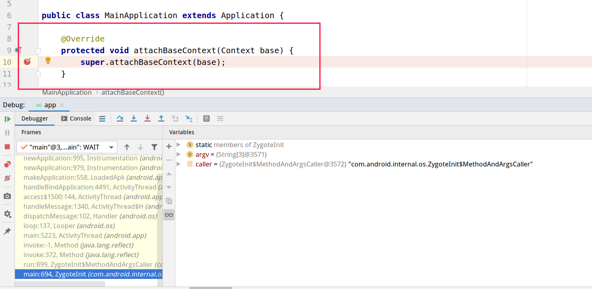
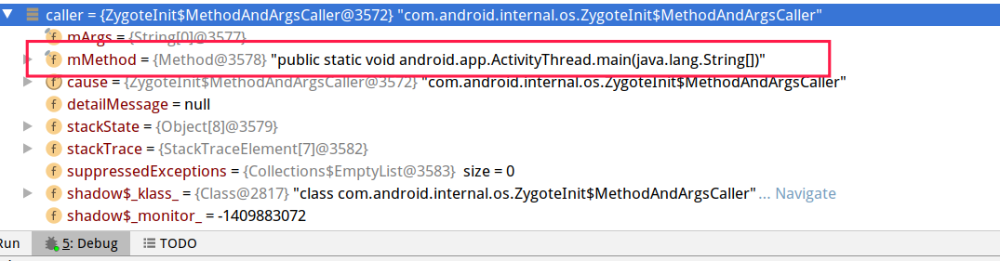
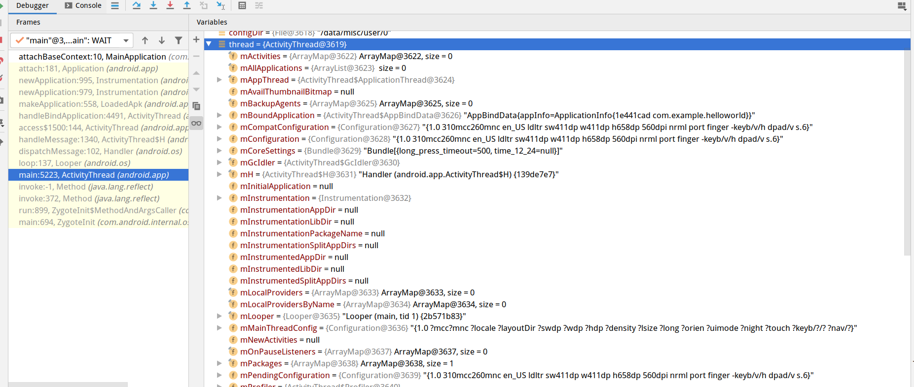
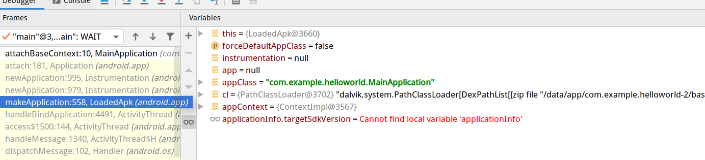
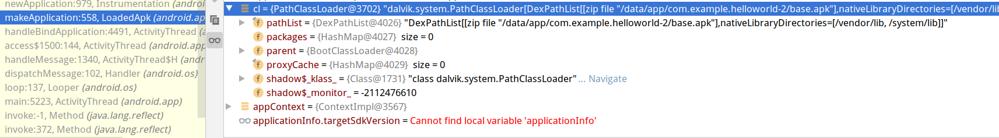
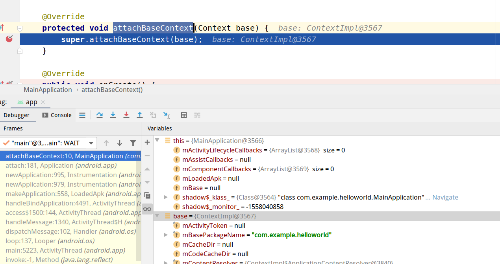
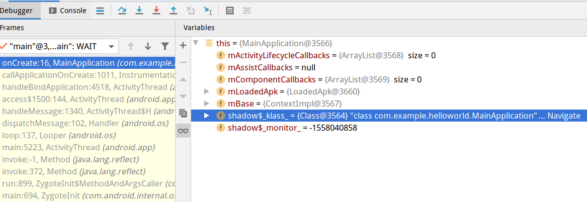
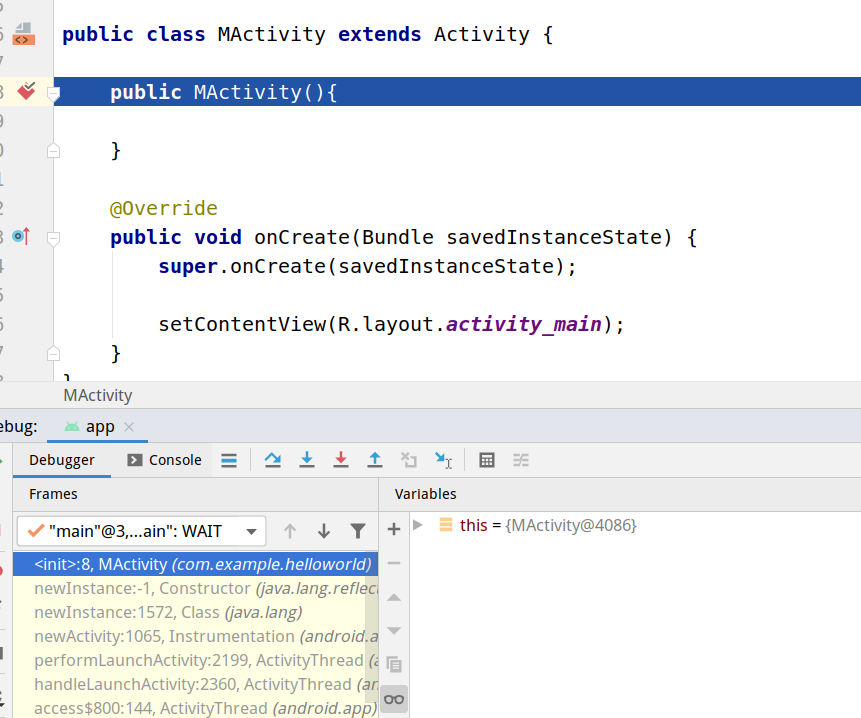
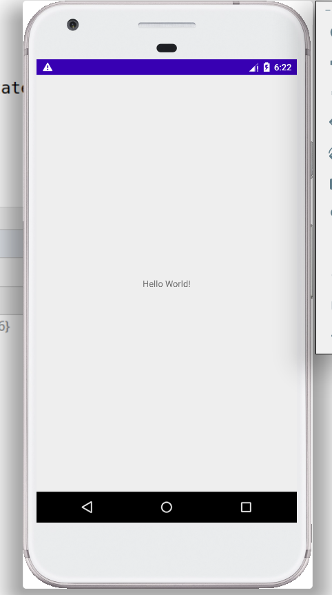

# 前言	

新的加固方案，需要替换底层中`ActivityThread`其中的一些参数，来执行我的壳程序，并能够让壳程序将原APP加载到classload中。

# 正文

通过对Application类的`attachBaseContext()`方法打断点就可以进入到安卓应用的启动逻辑，接下来会是大量的Debug。

## Zygote

对于Zygote：

> 在Android系统启动期间，Linux内核首先将进程称为“ init”。init读取文件“ /init.rc”和“ init.device.rc”。“ init.device.rc”是特定于设备的，在虚拟设备上，此文件称为“ init.goldfish.rc”。
>
> init.rc通过程序“ / system / bin / app_process”启动进程“ Zygote”。Zygote加载核心Java类并对其进行初始处理。这些类可被Android应用程序重用，因此，此步骤使它们可以更快地启动。Zygote的初始工作完成后，该进程将侦听套接字并等待请求。

程序运行中`Zygote`会调用`caller`函数，`caller`函数会反射调用`android.app.ActivityThread.main(String[])`

其中的`mMethod`是最重要的，他是整个安卓应用的出生点。也就是`android.app.ActivityThread.main(String[])`。

## ActivityThread

进入`ActivityThread.main`可以看到

`ActivityThread`的参数已经完成了初始化

安卓会根据这些参数来加载相关APP的application类、activity类。

### loop,dispatchMessage,handleMessage,access,handleBinApplication

这个过程，安卓系统会将待创建的线程交给`loop`来创建，并且发送信息，作为内存交换。

> 称为*Binder*的特殊驱动程序允许进行有效的进程间通信（IPC），其中允许在进程之间传递对对象的引用。实际对象存储在共享内存中。这样，由于必须传输的数据较少，因此可以优化进程之间的通信。
>
> Android不像其他Linux系统那样提供交换空间，因此可用内存范围仅限于设备上的内存。

### makeApplication,newApplication

`applClass`就是`AndroidManifest.xml`中配置的`android:name`这个属性名。

`cl`就是classload，会将application类加载到类加载器中。

`context`就是一些包名、线程等一些信息。

## Application类

将application类加载进来之后就会进入application类的`attachBaseContext()`方法中。

然后就是执行`onCreate()`方法。

会将加载的信息比如app的文件地址，lib库（主要是使用了什么ABI），包名之类的。

## Activity类

这些跑完之后就是进入主Acitivity类的初始化过程。

`onCreate()`方法执行完之后就是将界面加载出来。

# 总结

以上是安卓应用启动的全过程（略微短浅）。了解这个可以知道底层的一些东西，安卓应用点击图标背后都做了什么的故事。

安卓应用通过`Zygote`将app初始化，再通过`ActivityThread`将整个app的信息和线程初始化好，将application类加入到类加载器中，并通过类加载器开始跑这个app。app真的开始运行的时候获取app信息，包名，apk文件，lib库，然后初始化界面。

