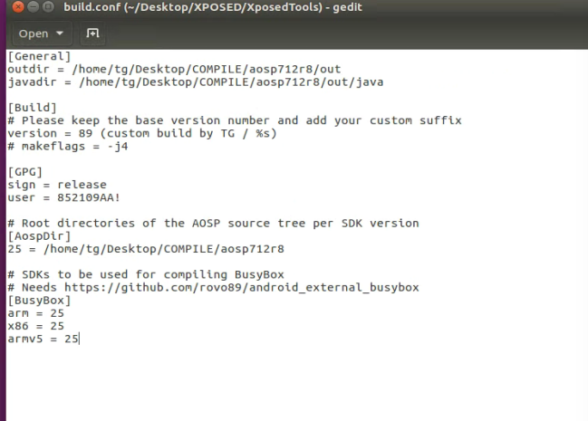

## 11月：Xposed + RPC

### `Hook Java`：反射，（非）静态/构造函数，域/实例，主动调用

#### 1111课时：XPOSED插件开发

- `Pixel`刷入谷歌官方安卓7
- `Xposed`安装和插件使用
- 开发第一个`Xposed`插件
- `Xposed`基本项目结构和组建学习
- 编译`GravityBox`学习大项目

https://www.freebuf.com/articles/terminal/189021.html

https://bbs.pediy.com/thread-258639.htm

- 过滤子进程：loadPackageParam.packageName
- 参数、调用栈、返回值，打印和修改
- Xposed的开发，本质上就是Java的开发

#### 1113课时：Xposed组件和语法详解

- 重温Java语法与Xposed的对应公式
- 类是Java/Xposed世界的一等公民
- Xposed的接口、类和对象
- 构造函数、动静态域和动静态方法(callMethod, callStaticMethod)
- Xposed api对其操作方式学习
- Xposed 与frida在hook时的写法比对

Xposed比frida多的：

- [set(get)AdditionalInstanceField](https://api.xposed.info/reference/de/robv/android/xposed/XposedHelpers.html#setAdditionalInstanceField(java.lang.Object, java.lang.String, java.lang.Object))
- [getMD5Sum](https://api.xposed.info/reference/de/robv/android/xposed/XposedHelpers.html#getMD5Sum(java.lang.String))
- [getMethodDepth](https://api.xposed.info/reference/de/robv/android/xposed/XposedHelpers.html#getMethodDepth(java.lang.String))
- [getParameterTypes](https://api.xposed.info/reference/de/robv/android/xposed/XposedHelpers.html#getParameterTypes(java.lang.Object...))
- [getSurroundingThis](https://api.xposed.info/reference/de/robv/android/xposed/XposedHelpers.html#getSurroundingThis(java.lang.Object))
- [hookMethod](https://api.xposed.info/reference/de/robv/android/xposed/XposedBridge.html#hookMethod(java.lang.reflect.Member, de.robv.android.xposed.XC_MethodHook))
- 系统级别的，过滤所有的进程
- 只要XPosed生效了，可以把Xposed理解为系统框架。作为系统本身来考虑

frida比xposed多的：

- Java.choose
- rpc
- 热重载/加载
- 单进程级别的，只能在hook的进程内生效

#### 1115课时：Frida hook & trace Xposed

- Xposed模块逆向分析 
- Frida hook Xposed API
- Frida trace Xposed API
- 从执行流分析Xposed模块逻辑
- Xposed API源码解析
- Frida对接口、虚函数、进程的处理

### 主动调用：`NanoHttpd`，参数构造，远程/外网请求，性能测试

#### 1118课时：参数构造主动调用

- 反射调用invoke
- CallMethod/CallStaticMethod
- 得到对象实例的方式
- 动静态主动调用的区分
- 参数构造和强制转化

> 相比Frida，Xposed在参数的构造上是更有优势的；因为它就是使用的java进行的开发

动态的得到对象：

>hook（想通过hook的方式得到一个Obj对象的话得hook一个实例方法）
>
>constructor.newInstance
>
>xposed.newInstance

Context的获取有两种情况：

> hook获取一个
>
> 自己构造一个（假的）？

#### 1120课时：Xposed+NanoHttpd

- Xposed获取实例主动调用
- nanohttpd环境搭建
- nanohttpd案例分析
- nanohttpd开发流程
- Xposed+Nanohttpd结合开发

> objection 1.9.6给源码加构造函数
>
> https://t.zsxq.com/nyR3r7i

https://curz0n.github.io/2018/05/31/nanohttpd_encrypt/

https://github.com/NanoHttpd/nanohttpd

#### 1122课时：远程/外网请求

https://www.cnblogs.com/xiaobaiyey/p/6442417.html

- firda和xposed联合逆向
- xposed hook带壳的app
- xposed反射枚举classloader
- xposed+nanohttpd+压力测试
- app暴露算法提供http公网调用

### 魔改去特征，平头哥免`root`/`Sekiro`规模调用

#### 1125课时：AOSP源码编译和刷如7.1.2_r8

- 环境
- 源码包

1. 根据南北方选择清华或者中科大源
2. 下载repo
3. 到目录里执行初始化

> ```
> repo init -u git://mirrors.ustc.edu.cn/aosp/platform/manifest -b android-4.0.1_r1
> ```

4. repo sync

- 编译

1. 别忘了装驱动！！verdor文件夹
2. 如果内存不够，加swap

> https://blog.csdn.net/click_idc/article/details/80591686

- 刷机

编译的内容网上很多，同步源码也是。

现在是怎么将编译完成的镜像刷进手机中，我看老师操作如下：

在google的镜像站中下载相同版本的镜像，并将其中的镜像替换成out/target/product/sailfish/下的所有img。

完成了，很欣慰，就是android_info.txt的目录下的所有内容压缩成为一个zip即可。

#### 1127课时：编译原版Xposed并刷入手机

- 编译模块管理器（XposedInstaller）
- 编译运行时支持库（XposedBridge）
- 编译定制版`art`解释器（android_art）
- 编译本体（Xposed）
- 编译刷机包（XposedTools）
- 将刷机包刷入手机正常使用

需要有aosp7.1.2_r8源码，并且需要使用xposed_art替换原有的art。

这一块处理起来比较复杂，实现的机子是ubuntu16.04

主要是看这篇文章https://www.jianshu.com/p/6471bab49cb1

XposedTools中的build.conf这样修改：



> 编译
>
> ./build.pl -t arm64:25

#### 1129课时：魔改Xposed去特征

这个感觉需要用到编译源码的步骤，所以暂时去掉。

使用虚拟机的ubuntu16.04 编译aosp7.1.2_r8成功了

这个老师也是按照自己的博客以及别人写的特征进行修改。我打算自己尝试去做。

- 可以全局替换字符串吗
- 修改包名，库名，类名，字段名
- 编译魔改后的刷机包并刷机
- `XposedChecker`过检测
- 魔改后的`Xposed`模块开发姿势