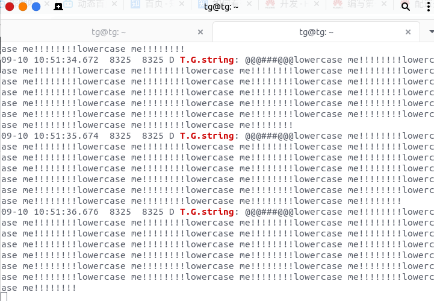
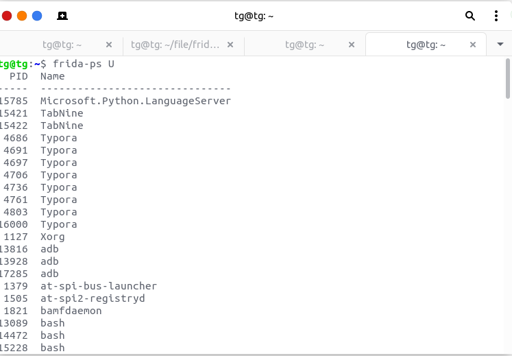
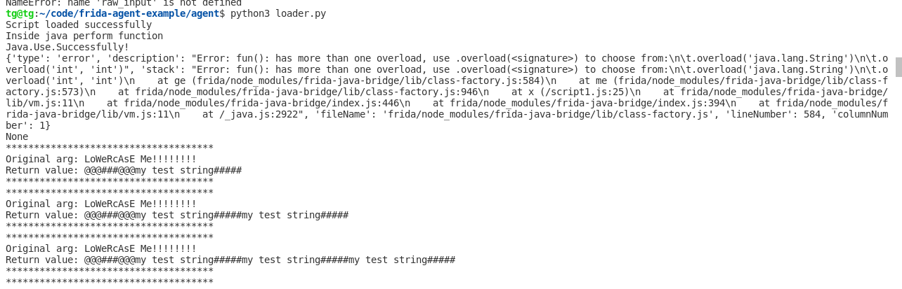

# Frida 安装

## pyenv

参考这个链接即可：https://gist.github.com/cedricbonhomme/ababe00d0a675ea5c69d777276e8f375

```sh
# Installation of a decent editor, emacs
$ sudo apt install emacs

# Prerequisites to build Python
$ sudo apt install make build-essential libssl-dev zlib1g-dev libbz2-dev \
libreadline-dev libsqlite3-dev wget curl llvm libncurses5-dev libncursesw5-dev \
xz-utils tk-dev libffi-dev liblzma-dev python-openssl

# Installation of pyenv
$ curl https://pyenv.run | bash

# Always use the latest stable version of Python
$ pyenv install 3.8.0
$ pyenv global 3.8.0

# Installation of pipx
$ python -m pip install --user pipx
$ python -m userpath append ~/.local/bin

# Installation of poetry
$ curl -sSL https://raw.githubusercontent.com/python-poetry/poetry/master/get-poetry.py | python
```

针对frida 12.8.0版本的安装

这个版本可能是比较稳定的：

> pip install frida==12.8.0 
>
> pip install frida-tools==5.3.0 
>
> pip install objection==1.8.4

## 新建一个Android项目

```java
package myapplication.example.com.frida_demo;

import androidx.appcompat.app.AppCompatActivity;

import android.os.Bundle;
import android.util.Log;

public class MainActivity extends AppCompatActivity {

    private String total = "@@@###@@@";

    @Override
    protected void onCreate(Bundle savedInstanceState) {
        super.onCreate(savedInstanceState);
        setContentView(R.layout.activity_main);

        while(true){
            try {
                Thread.sleep(1000);
            }catch (InterruptedException e){
                e.printStackTrace();
            }
            fun(50, 30);
            Log.d("T.G.string", fun("LoWeRcAsE Me!!!!!!!!"));
        }
    }
    void fun(int x,int y){
        Log.d("T.G.Sum", String.valueOf(x + y));
    }

    String fun(String x){
        total += x;
        return total.toLowerCase();
    }

    String secret(){
        return total;
    }
}
```

功能主要是打印日志。

执行命令即可看到

> adb logcat | grep T.G.string



# Frida使用

首先需要在firda的releases界面中找到测试机的abi版本注意需要是server端。

firda releases：https://github.com/frida/frida/releases

将下载好的frida-server push到手机上

> adb push frida-server /data/local/tmp/

frida的开发环境：https://github.com/oleavr/frida-agent-example

按照官方中的教程：

```
$ git clone git://github.com/oleavr/frida-agent-example.git
$ cd frida-agent-example/
$ npm install
$ frida -U -f com.example.android --no-pause -l _agent.js
```

在`agent`目录下创建`s1.js`

```javascript
console.log("Script loaded successfully ");
Java.perform(function x() {
    console.log("Inside java perform function");
    //定位类
    var my_class = Java.use("myapplication.example.com.frida_demo.MainActivity");
    console.log("Java.Use.Successfully!");//定位类成功！
    var string_class = Java.use("java.lang.String"); //获取String类型

    my_class.fun.overload("java.lang.String").implementation = function (x) {
        console.log("*************************************");
        var my_string = string_class.$new("My TeSt String#####"); //new一个新字符串
        console.log("Original arg: " + x);
        var ret = this.fun(my_string); // 用新的参数替换旧的参数，然后调用原函数获取结果
        console.log("Return value: " + ret);
        console.log("*************************************");
        return ret;
    };
    //在这里更改类的方法的实现（implementation）
    my_class.fun.implementation = function (x, y) {
        //打印替换前的参数
        console.log("original call: fun(" + x + ", " + y + ")");
        //把参数替换成2和5，依旧调用原函数
        var ret_value = this.fun(2, 5);
        return ret_value;
    }
});
```

调用js脚本的`loader.py`：

```python
import time
import frida

def my_message_handler(message , payload): #定义错误处理
	print(message)
	print(payload)

# 连接安卓机上的frida-server
device = frida.get_usb_device()
# 启动`demo02`这个app
pid = device.spawn(["myapplication.example.com.frida_demo"])
device.resume(pid)
time.sleep(1)
session = device.attach(pid)
# 加载s1.js脚本
with open("s1.js") as f:
    script = session.create_script(f.read())
script.on("message", my_message_handler)
script.load()

# 脚本会持续运行等待输入
input()
```

然后adb shell 进入手机，不过frida需要root，需要事先root的手机。

执行命令：

> chmod +x frida-server
>
> ./frida-server

在客户端（也就是自己的电脑）输入`frida-ps U `检测frida-server是否运行成功。



运行`python3 loader.py`



