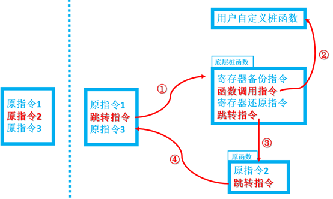

# 基础知识

## arm 汇编基础

主要学习这个块内容是通过阅读ljcnaix大佬的翻译来学习的。

[[翻译]ARM汇编基础教程——ARM汇编简介](https://bbs.pediy.com/thread-220461.htm)

[[翻译]ARM汇编基础教程——数据类型和寄存器](https://bbs.pediy.com/thread-220535.htm)

[[翻译]ARM汇编基础教程——ARM指令集](https://bbs.pediy.com/thread-220753.htm)

[[原创]ARM汇编基础教程番外篇——配置实验环境](https://bbs.pediy.com/thread-220907.htm)

也可以看下原文：https://azeria-labs.com/writing-arm-assembly-part-1/

###  arm指令集

| 指令 | 描述           | 指令    | 描述                   |
| ---- | -------------- | ------- | ---------------------- |
| MOV  | 移动数据       | EOR     | 单比特异或             |
| MVN  | 取反码移动数据 | LDR     | 加载数据               |
| ADD  | 数据相加       | STR     | 存储数据               |
| SUB  | 数据相减       | LDM     | 多次加载               |
| MUL  | 数据相乘       | STM     | 多次存储               |
| LSL  | 逻辑左移       | PUSH    | 压栈                   |
| LSR  | 逻辑右移       | POP     | 出栈                   |
| ASR  | 算数右移       | B       | 分支                   |
| ROR  | 循环右移       | BL      | 带返回的分支           |
| CMP  | 比较操作       | BX      | 带状态切换的分支       |
| AND  | 单比特与       | BLX     | 带返回、状态切换的分支 |
| ORR  | 单比特或       | SWI/SVC | 系统调用               |

ARM CPU有15个通用寄存器，分别编号为R0~R15。其中R13也叫SP，用于保存栈顶地址；R14也叫LR，用于保存函数的返回地址；R15也叫PC，由于ARM架构的指令预读，实际运行时PC寄存器并不指向当前执行的指令，而是指向当前指令地址加8处。

# Inline Hook实现原理

Inline Hook的核心原理。这里说明一下几个关键点：

（1） 跳转指令的构建、从原指令跳转过去的底层桩函数，涉及系统汇编层，和Inline Hook的平台关系较大，既是ARM和THUMB、X86等均都有所不同；64位和32位也有所不同。本文实现以32位的ARM为样例实现。

（2） 从底层桩函数跳转回原函数，既原理图中第3步跳转，去执行原指令2的时候，有个关键的点：如果原指令2涉及到PC操作，则需要进行指令修复。比如说是ADD R3, PC, R3, 两处指令的PC完全不一样，肯定不能直接复制，需要针对修复相应PC值。本文为了方便读者入门，没有针对指令进行修复操作，既是有个限制：HOOK点位置，原指令2不能有涉及到PC的操作。如果读者后续对指令修复有兴趣，可能自行实现，本文的代码框架能很好支持这个扩展。

（3） Inline Hook的指令覆盖顺序，原指令2的覆盖建议留在最后实现。既是完成了底层桩函数构造、原函数构造后，再一次性填写跳转指令覆盖原指令2。这样的好处是防止HOOK一些频繁执行的函数可能导致的崩溃。在Inline Hook的过程中走入了HOOK逻辑，而桩函数或者原函数可能未构造成功导致崩溃。