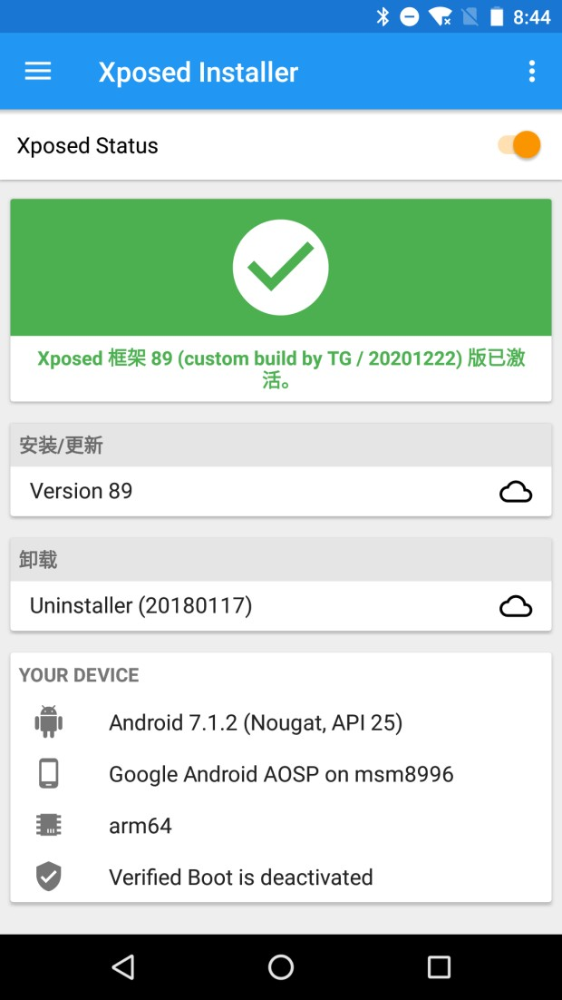
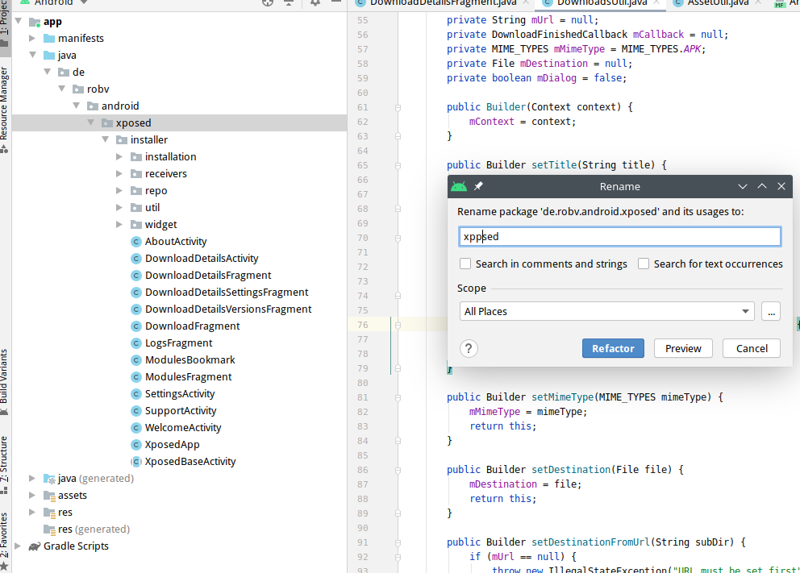

## 环境

ubuntu 16.04

aosp7.1.2r8源码


## 编译Xposed

首先需要将xposed相关项目都clone到本地

>https://github.com/rovo89/Xposed.git
>
>https://github.com/rovo89/XposedBridge.git
>
>https://github.com/rovo89/android_art.git
>
>https://github.com/rovo89/XposedTools.git
>
>https://github.com/rovo89/XposedInstaller.git

### XposedBridge

使用AS打开XposedBridge项目，直接build，在项目的`app/build/outputs/apk`下将`app-release-unsigned.apk`重命名为`XposedBridge.jar`。

将这个jar包放在aosp源码目录下的`/out/target/product/sailfish/system/framework/`目录下。

/out/java/

### android_art

将该项目直接替换源码目录的art目录

### Xposed

将xposed目录复制到`aosp712r8/frameworks/base/cmds/`目录下

### XposedTools

复制`build.conf.sample`并重命名为`build.conf`

修改其中内容：

```conf
[General]
outdir = /home/tg/Desktop/COMPILE/aosp712r8/out
javadir = /home/tg/Desktop/COMPILE/aosp712r8/out/java

[Build]
# Please keep the base version number and add your custom suffix
version = 89 (custom build by TG / %s)
# makeflags = -j4

[GPG]
sign = release
user = 852109AA!

# Root directories of the AOSP source tree per SDK version
[AospDir]
25 = /home/tg/Desktop/COMPILE/aosp712r8
# SDKs to be used for compiling BusyBox
# Needs https://github.com/rovo89/android_external_busybox
[BusyBox]
arm = 25
x86 = 25
armv5 = 25

```

> outdir指向的路径是xposed编译之后生成的文件的存放路径。
> version的值和后边的参数是自己设置的。编译之后会写入到xposed.prop文件中。
> makeflags是设置在后边编译过程中使用的线程数。
> AospDir指向的路径是android源码存放的路径，前边的值是源码对应的SDK的版本号。这里我指向的是android5.1.1的源码，对应的android sdk的版本是22。

修改完之后需要下载一些perl的库。

> sudo apt-get install libauthen-ntlm-perl libclass-load-perl libcrypt-ssleay-perl libdata-uniqid-perl libdigest-hmac-perl libdist-checkconflicts-perl libfile-copy-recursive-perl libfile-tail-perl
>
> perl -MCPAN -e 'install File::ReadBackwards'

使用build.pl进行编译`./build.pl -t arm:25`

将生成的xposed.zip发布到web上，以供XposedInstall安装使用。

### XposedInstall

修改`de.robv.android.xppsed.installer.util.DownloadsUtil`其中的setUrl函数

```java
public Builder setUrl(String url) {
            //mUrl = url;
    		// 改成XposedTools生成的XPosed.zip
            mUrl = "";
            return this;
        }
```

然后安装，installXposed即可。



## 魔改去特征

### XposedInstall



直接修改包名即可。

全局替换`de.robv.android.xposed.installer`，改为`de.robv.android.xppsed.installer`。

`de.robv.android.xppsed.installer.XposedApp`中的`XPOSED_PROP_FILES`内容改为：

```java
private static final String[] XPOSED_PROP_FILES = new String[]{
            "/su/xposed/xppsed.prop", // official systemless
            "/system/xppsed.prop",    // classical
    };
```

再build->clean project。

### XposedBridge-art.jar

替换包名为`de.robv.android.xppsed`，全局替换`de.robv.android.xposed，` 改为`de.robv.android.xppsed`。

生成出来的jar包也改为`XppsedBridge.jar`。

gradle使用`jarStubsSorce`和`jarStubs`生产api.jar包，给自己编写Xposed插件使用。

### Xposed

`libxposed_art.cpp`改为`libxppxosed_art.cpp`

`xposed.h`

```h
#define XPOSED_PROP_FILE "/system/xppsed.prop"
#define XPOSED_LIB_ART           XPOSED_LIB_DIR "libxppsed_art.so"

...
#define XPOSED_CLASS_DOTS_ZYGOTE "de.robv.android.xppsed.XposedBridge"
#define XPOSED_CLASS_DOTS_TOOLS  "de.robv.android.xppsed.XposedBridge$ToolEntryPoint"
```

`libxposed_common.h`

```h
#define CLASS_XPOSED_BRIDGE  "de/robv/android/xppsed/XposedBridge"
...
#define CLASS_ZYGOTE_SERVICE "de/robv/android/xppsed/services/ZygoteService"
#define CLASS_FILE_RESULT    "de/robv/android/xppsed/services/FileResult"
```

`xposed_service.cpp`

```cpp
IMPLEMENT_META_INTERFACE(XposedService, "de.robv.android.xppsed.IXposedService");
```

`xposed_shared.h`

```h
#define XPOSED_DIR "/data/user_de/0/de.robv.android.xppsed.installer/"

...
    
#define XPOSED_DIR "/data/data/de.robv.android.xppsed.installer/"
```

`ART.mk`

```mk
LOCAL_SRC_FILES += \
  libxposed_common.cpp \
  libxppsed_art.cpp

...
LOCAL_MODULE := libxppsed_art
```

并将`libxposed_art.cpp`文件名改为`libxppsed_art.cpp`

### XposedTools

`build.pl`中的`xposed.prop`改为`xpposed.prop`，将`libxposed_art`改为`libxppsed_art`，将`XposedBridge.jar`改为`XppsedBridge.jar`

`zipstatic/_all/META-INF/com/google/android/flash-script.sh`中将`xposed.prop`改为`xpposed.prop`，将`libxposed_art`改为`libxppsed_art`，将`XposedBridge.jar`改为`XppsedBridge.jar`


## 参考

- https://www.jianshu.com/p/6471bab49cb1
- https://bbs.pediy.com/thread-255836.htm