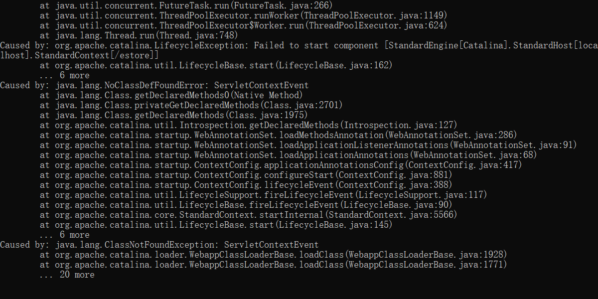

# 实训日记

### day01

1. 安装开发环境

- 安装mysql
- 安装jdk
- 配置环境变量 JAVA_HOME,path,CLASSPATH
- 安装eclipse，编码改为utf-8
- 安装tomcat，配置到eclipse，修改web目录，server localtions，注意一下http1.1的端口号

2. 用jdbc导入eclipse

- 链接数据库

### day02

servlet 一组Java类，逻辑处理，数据准备

jsp 做数据动态展示

1. 编写类dao.BookDao实现增删改查

4. 插入数据为中文

   > private static String url="jdbc:mysql://127.0.0.1:3306/shixun?characterEncoding=utf-8";

5. web介绍

   - 项目基于B/S模式即浏览器服务器模式；在浏览器输入服务器的IP及端口号来访问
   - `html`静态页面
   - `jsp` java代码块<% %> 表达式<%=%>,el表达式即jstl.jar
   - `Servlet`一组基于web的Java类和接口，主要用于处理业务逻辑和进行数据分发（携带数据转到不同的jsp文件上进行展示）
   - `JavaScript`主要用于前端的动态功能

   

### day03

1. 导入资源：html、css、JavaScript……
2. 解决编码问题：

​	get：Filter

​	post：修改tomcat配置文件server.xml 添加`URLEncoding="UTF-8"`

生命周期方法

- 现在出现的问题是，自己的servlet不能用。

触发了。但是不知道为啥感觉不能用

3. index.jsp注入数据
   - 定义监听器来准备数据
   - 创建index.jsp文件
   - 再注入数据

- 注：jsp里有三种作用域，request，respone，session，application

​	jsp->servlet->jsp

​	index.jsp->showbookservlet->viewbook.jsp

出现以下报错，说明有代码写错了。而不是Tomcat问题。

4. 进行登陆拦截   

   - addCart  
   - loginfilter 
   - 实现login.jsp 添加jsp模板，解决路径问题（loginfilter 通过session变量来判断用户有没有登陆）

   ​	

- 常见错误
  - Tomcat启动报错
    - <url-pattern>/loginFilter/<url-pattern>
    - 根据console的提示，修改web.xml的错误
  - 404错误
    - 没有在web.xml中注册Servlet
  - 405错误
    - 没有重新doGet和doPost方法

### day04

- 注册模块
  - 使用JavaScript弹出提示信息(在login.jsp文件中)

1. 在login.jsp文件中对立即注册进行处理(跳转至register.jsp)
2. 创建register.jsp
3. 创建registerServlet类实现doget和doposet方法并注册
4. 创建bean.Customer，用于处理数据库中的数据
5. 创建CustomerDao来实现数据库的操作

servlet感觉充当了一个服务器的角色，用来处理各种传递的参数。

- 登陆模块

1. 修改login.jsp
2. 创建loginServlet类实现doget和dopost方法并登陆
3. 