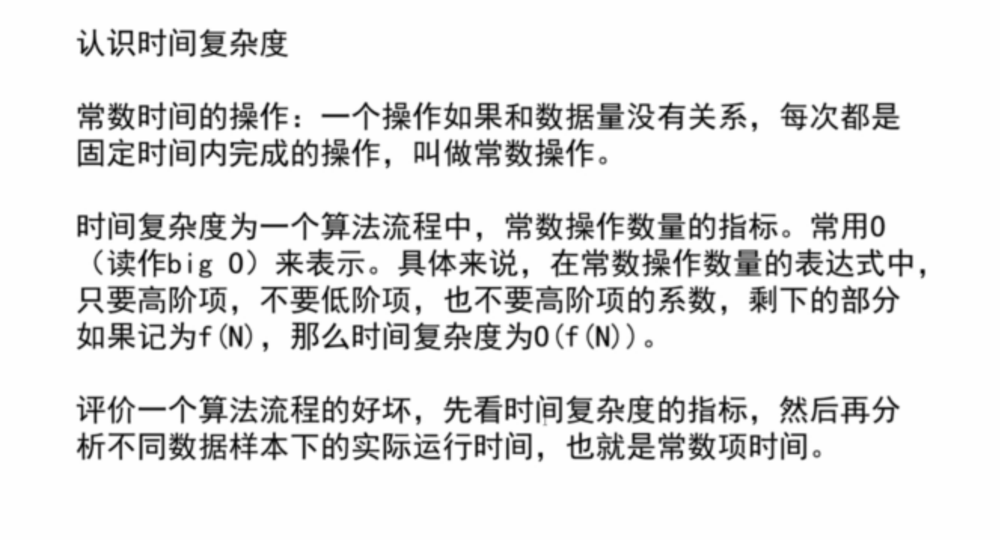
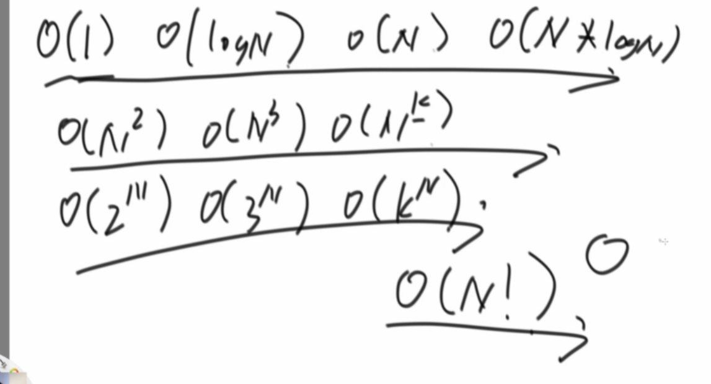
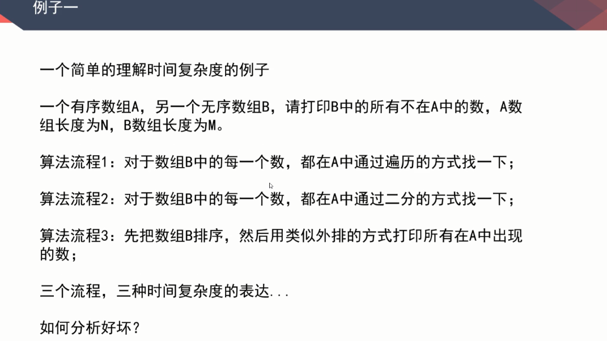

# 左神算法基础班学习笔记

## 第一章

System.nonoTime()函数记录某些操作时间。

### 认识时间复杂度



### 常见的浮躁度，由低到高



### 列1



**算法1**时间复杂度：O(M*N)

**算法2**时间复杂度：O(M*LOG(2,N))

**算法3**时间复杂度：O(M^2)+O(M+N)

外排概念看这个[传送门](https://blog.csdn.net/my_precious/article/details/50907976)

### 列2对数器

这个算是上课很有用的东西之一，自己也想着整理，但是网上已经有更好更详细的，我也就不造轮子了。

[传送门](https://blog.csdn.net/sdr_zd/article/details/79391050)

### 列3冒泡排序

详细讲解了冒泡排序，这也是大学里学到的第一个排序算法。

时间复杂度：O(N^2)

### 列4选择排序

详情看[传送门](http://bubkoo.com/2014/01/13/sort-algorithm/selection-sort/)

时间复杂度：O(N^2)

### 列5插入排序

详情看[传送门](http://bubkoo.com/2014/01/14/sort-algorithm/insertion-sort/)

时间复杂度：O(N^2)

### 列6递归行为

左神有效的讲解了递归行为在程序内部的实现，并提到了master公式，这个我也是第一次见到。嗯，继续不造轮子，直接谷歌吧。

### 列7归并排序

详情看[传送门](https://blog.csdn.net/MoreWindows/article/details/6678165)

### 列8小和问题


### 收获

这节课主要是围绕时间复杂度来展开讲几个常见的排序算法，了解了对数器，还有master公式，以及异或运算对两个数交换。

```java


import java.util.Arrays;

public class Code_01_InsertionSort {

	public static void insertionSort(int[] arr) {
		if (arr == null || arr.length < 2) {
			return;
		}
		for (int i = 1; i < arr.length; i++) {
			for (int j = i - 1; j >= 0 && arr[j] > arr[j + 1]; j--) {
				swap(arr, j, j + 1);
			}
		}
	}
	//交换两个数(i j 不同位置的数)swap(arr,9,9) arr[9] -> 0
	public static void swap(int[] arr, int i, int j) {
		arr[i] = arr[i] ^ arr[j];
		arr[j] = arr[i] ^ arr[j];
		arr[i] = arr[i] ^ arr[j];
        //int temp = arr[i];
        //arr[i] = arr[j];
        //arr[j] = temp;
	}

	// for test
	public static void comparator(int[] arr) {
		Arrays.sort(arr);
	}

	// for test
	public static int[] generateRandomArray(int maxSize, int maxValue) {
		int[] arr = new int[(int) ((maxSize + 1) * Math.random())];
		for (int i = 0; i < arr.length; i++) {
			arr[i] = (int) ((maxValue + 1) * Math.random()) - (int) (maxValue * Math.random());
		}
		return arr;
	}

	// for test
	public static int[] copyArray(int[] arr) {
		if (arr == null) {
			return null;
		}
		int[] res = new int[arr.length];
		for (int i = 0; i < arr.length; i++) {
			res[i] = arr[i];
		}
		return res;
	}

	// for test
	public static boolean isEqual(int[] arr1, int[] arr2) {
		if ((arr1 == null && arr2 != null) || (arr1 != null && arr2 == null)) {
			return false;
		}
		if (arr1 == null && arr2 == null) {
			return true;
		}
		if (arr1.length != arr2.length) {
			return false;
		}
		for (int i = 0; i < arr1.length; i++) {
			if (arr1[i] != arr2[i]) {
				return false;
			}
		}
		return true;
	}

	// for test
	public static void printArray(int[] arr) {
		if (arr == null) {
			return;
		}
		for (int i = 0; i < arr.length; i++) {
			System.out.print(arr[i] + " ");
		}
		System.out.println();
	}

	// for test
	public static void main(String[] args) {
		int testTime = 500000;
		int maxSize = 100;
		int maxValue = 100;
		boolean succeed = true;
		for (int i = 0; i < testTime; i++) {
			int[] arr1 = generateRandomArray(maxSize, maxValue);
			int[] arr2 = copyArray(arr1);
			insertionSort(arr1);
			comparator(arr2);
			if (!isEqual(arr1, arr2)) {
				succeed = false;
				break;
			}
		}
		System.out.println(succeed ? "Nice!" : "Fucking fucked!");

		int[] arr = generateRandomArray(maxSize, maxValue);
		printArray(arr);
		insertionSort(arr);
		printArray(arr);
	}

}

```

详细代码整理到了[GitHub](https://github.com/TUGOhost/study_note/tree/master/%E5%B7%A6%E7%A5%9E%E7%AE%97%E6%B3%95%E5%9F%BA%E7%A1%80%E7%8F%AD)上。