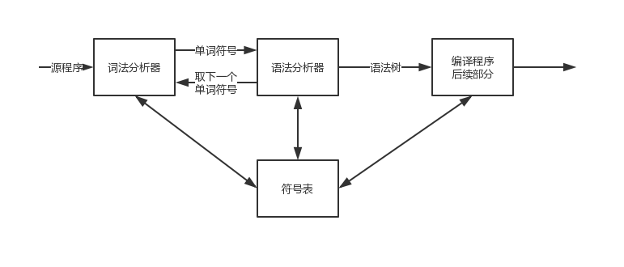

灵感来自：https://www.zhihu.com/question/35382593
# 阶段一——无事务, 单线程, 仅存在于内存的数据库.
该状态下的数据库, 其实就是一个”索引结构”+”语法分析器”.
语法分析器分析SQL语句, 然后根据逻辑, 去执行相应的操作.
索引结构则是用来快速查询.
由于该版本仅存在于内存, 所以只要你会一些常见的索引算法, 即可完成, 可以称之为”简易内存数据库”.
如你会B+树算法, 就可以实现一个B+树, Bt. 
它实现了两个接口, Bt.Insert(key, value) -> void, Bt.Search(key) -> value.
再实现一个”语法分析器”.
如来了一条语句”Insert into student value (tony, 22, 123)”. ”语法分析器”分析该语句, 将value包裹一下, 选取一个该value的键值key.
然后调用 Bt.Insert(key, value). 之后执行”Read from student …” 其实也就是分析一下, 然后执行Bt.Search(key).该版本数据库完成. 

## B+树的实现
### B+ 树的改进
#### B+ 树变更
1. 叶子结点存储了所有的关键字信息，并且通过右指针形成链表，可以做到从小到大的顺序遍历；
2. 所有中间节点可以看作索引，结点中仅含有其子树根结点中最大（或最小）关键字。

#### B+树优势
1. B+ 树中间节点只是作为索引来用，占用空间小，读一次磁盘可以加载更多的索引，减少了查询需要的 IO 次数；
2. 任何关键字的查找必须走一条从根结点到叶子结点的路，所有关键字查询的路径长度相同，导致每一个数据的查询效率相当；
3. 有序数组链表简化了树的遍历操作。

### 数据结构定义
#### 建议
1.所有数据结构应该存储在 kv 对里，整个结构对外表现为一个 map，B+ Tree 是为了减少 map 上 key 的访问次数和封锁粒度而存在的
2.允许有序扫描
#### 定义
```go
// B+ 树数据结构；限制只能存储正数
type BTree map[int]node
```
#### 核心接口定义
```go
// node 接口设计
type node interface {
	// 确定元素在节点中的位置
	find(key int) (int, bool)
	// 获取父亲节点
	parent() *interiorNode
	// 设置父亲节点
	setParent(*interiorNode)
	// 是否达到最大数目限制
	full() bool
	// 元素数目统计	
	countNum() int
}
// Tree API
// 创建自由一个父亲节点和叶子节点的 B+ 树
func NewBTree() *BTree 
// 返回 B+ Tree 存储的元素数目
func (bt *BTree) Count() int 
// 返回根结点
func (bt *BTree) Root() node 
// 返回最左侧叶子结点
func (bt *BTree) First() node 
// 返回由叶子结点指针构成的数组，从最左侧开始依次追加
func (bt *BTree) Values() []*leafNode
// 在 B+ 树中，插入 key-value
func (bt *BTree) Insert(key int, value string)
// 搜索： 找到，则返回 value ，否则返回空value
func (bt *BTree) Search(key int) (string, bool) 
```

## 语法分析器
这一块，主要使用了《编译原理》中的知识
如图：

