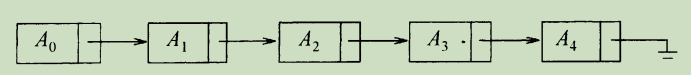
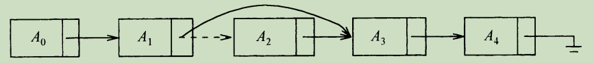
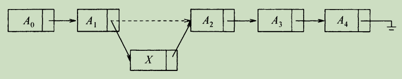
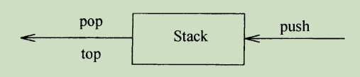

# 表、栈和队列

## 表

我们将处理形如A<sub>0</sub>，A<sub>1</sub>，A<sub>2</sub>，A<sub>3</sub>…，A<sub>N-1</sub>的一边的表。我们说这个表的大小是N。我们将大小为0的特殊的表称为空表（empty list）。

对于除空表外的任何表，我们说A<sub>i</sub>后继A<sub>i-1</sub>（或继A<sub>i-1</sub>之后。i < N）并称A<sub>i</sub>前驱A<sub>i</sub>（i > 0）。表中的第一个元素是A<sub>0</sub>，而最后一个元素是A<sub>N-1</sub>。我们将不定义A<sub>0</sub>的前驱元，也不定义A<sub>N-1</sub>的后继元。元素A<sub>i</sub>在表中的位置为i+1。为了简单起见，我们假设表中的元素是整数，但一般说来任意的复元素也是允许的。

与这些“定义”相关的是要在表上进行操作的集合。printList和makeEmpty是常用的操作；find返回某一项首次出现的位置；insert和remove一般是从表的某个位置插入和删除某个元素；而findKth则返回（作为参数而被指定的）某个位置上的元素。；insert插入；remove移出。

### 表的简单数组实现

对表的所有这些操作都可以通过使用数组来实现。虽然数组是由固定容量创建的，但在需要的时候可以用双倍的容量创建一个不同的数组。它解决由于使用数组而产生的最严重的问题，即从历史上看为了使用一个数组，需要对表的大小进行估计。而这种估计在Java或任何现代编程语言中都是不需要的。下列程序段解释了一个数组arr在必要的时候如何被扩展（其初始长度为10）：

```java
int[] arr = new int[10];
...
//下面我们决定需要扩大arr
int[] newArr = new int[arr.length * 2];
for(int i = 0; i < arr.length; i++){
    newArr[i] = arr[i];
}
arr = newArr;
```

数组的实现可以使得printList以线性时间被执行，而findKth操作则花费常数时间。不过插入和删除的花费却潜藏着昂贵的开销，这要看插入和删除发生在什么地方。最坏的情形下，在位置0的插入（即在表的前端插入）首先需要将整个数组后移一个位置以空出空间来，而删除第一个元素则需要将表中的所有元素前移一个位置，因此这两个操作的最坏情况为O(N)。平均来看，这两个操作都需要移动表的一半的元素，因此仍然需要线性时间。另一方面，如果所有的操作都发生在表的高端，那就没有元素需要移动，而添加和删除只花费O(1)时间。

存在许多情形，在这些情形下的表是通过在高端进行插入操作建成的，其后只发生对数组的访问（即只有findKth操作）。在这种情况下，数组是表的一种恰当的实现。然而，如果发生对表的一些插入和删除操作，特别是对表的前端进行，那么数组就不是一种好的选择。下一节处理另一种数据结构：链表（linked list）。

### 简单链表

为了避免插入和删除的线性开销，我们需要保证表可以不连续存储，否则表的每个部分都可能需要整体移动。下图指出链表的一般想法。



链表由一系列节点组成，这些节点不必在内存种相连。每一个节点均含有表元素和到包含该元素后继元的节点的链（link）。我们称之为next链。最后一个单元的next链引用null。

为了执行printList或find(x)，只要从表的第一个节点开始然后用一些后继的next链遍历该表即可。这种操作显然是线性时间的，和在数组实现时一样，不过其中的常熟可能比用数组实现要大。findKth操作不如数组实现时的效率高；findKth(i)O(i)的时间并以这种明显的方式遍历链表而完成。在实践种这个界是保守的，因为调用findKth常常是以（按i）排序后的方式进行的。

remove方法可以通过修改一个next引用来实现。下图给出在原表中删除第三个元素的结果。



insert方法需要使用new操作符从系统取得一个新节点，此后执行两次引用的调整。其一般想法在图中给出，其中虚线表示原来的next引用。



我们看到，在实践中如果知道变动将要发生的地方，那么向链表插入或从链表中删除一项的操作不需要移动好多的项，而只涉及常熟个节点的链的改变。

在表的前端添加项或删除第一项的特数情形此时也属于常数时间的操作，当然要假设到链表前端的链是存在的。只要我们拥有链表最后节点的链，那么在链表末尾进行添加操作的特殊情形（即让新的项成为最后一项）可以花费常数时间。因此，典型的链表拥有到该表两端的链。删除最后一项比较复杂，因此必须找出指向最后节点的项，把它的next链改成null，然后再更新持有最后节点的链。在经典的链表中，每个节点均存储到其下一节点的链，而拥有指向最后节点的链并不提供最后节点的前驱节点的任何信息。

保留指向最后节点的第3个链的想法行不通，因为它在删除操作期间也需要更新。我们的做法是，让每一个节点持有一个指向它在表中的前驱节点的链，下图所示，我们称之为双链表（doubly linked list）。


### 对ArrayList类的实现

```java
public class MyArrayList<AnyType> implements Iterable<AnyType> {

    //初始容量
    private static final int DEFAULT_CAPACITY = 10;
    private AnyType[] mArray;
    private int mArraySize;

    @Override
    public Iterator<AnyType> iterator() {
        return new ArrayIterator();
    }


    private class ArrayIterator implements Iterator<AnyType> {
        private int currentPositon;

        @Override
        public boolean hasNext() {
            return currentPositon < mArraySize;
        }

        @Override
        public AnyType next() {
            if (!hasNext()) {
                throw new NoSuchElementException();
            }

            return mArray[currentPositon++];
        }

        @Override
        public void remove() {
            MyArrayList.this.remove(--currentPositon);
        }
    }


    public void trimTosize() {
        ensureCapacity(size());
    }

    //容量
    public int size() {
        return mArraySize;
    }

    //是否为空
    public boolean isEmpty() {
        return mArraySize == 0;
    }


    public MyArrayList(int size) {
        if (size < DEFAULT_CAPACITY) {
            mArraySize = size;
        } else {
            ensureCapacity(DEFAULT_CAPACITY);
        }
    }

    private void ensureCapacity(int newCapacity) {
        AnyType[] newArray = (AnyType[]) new Object[newCapacity];
        for (int i = 0; i < mArray.length; i++) {
            newArray[i] = mArray[i];
        }
        mArray = newArray;
    }

    //添加
    public boolean add(AnyType t) {
        add(t, mArraySize);
        return true;
    }

    public void add(AnyType t, int position) {
        if (mArraySize == mArray.length) {
            ensureCapacity(mArraySize * 2 + 1);
        }
        for (int i = position; i < mArraySize - 1; i++) {
            mArray[i + 1] = mArray[i];
        }
        mArray[position] = t;
        ++mArraySize;
    }

    //移出
    public AnyType reomve() {
        return remove(mArraySize);
    }

    private AnyType remove(int position) {
        AnyType t = mArray[position];
        for (int i = position; i < mArraySize - 1; i++) {
            mArray[i] = mArray[i + 1];
        }
        --mArraySize;
        return t;
    }

    public AnyType get(int position) {
        if (position < 0 || position > mArraySize) {
            throw new ArrayIndexOutOfBoundsException();
        }
        return mArray[position];
    }

    public AnyType set(AnyType t) {
        return set(t, mArraySize - 1);
    }

    public AnyType set(AnyType t, int position) {
        if (position < 0 || position > mArraySize) {
            throw new ArrayIndexOutOfBoundsException();
        }
        AnyType old = mArray[position];
        mArray[position] = t;
        return old;
    }
}
```

### 对LinkedList的实现

```java
public class MyLinkedList<AnyType> implements Iterable<AnyType> {

    private Node<AnyType> headNote;
    private Node<AnyType> endNote;

    private int mSize;
    private int modCount;

    public MyLinkedList() {
        init();
    }

    private void init() {
        headNote = new Node<>(null, null, null);
        endNote = new Node<>(null, headNote, null);
        headNote.mNext = endNote;

        mSize = 0;
        modCount++;
    }

    public int size() {
        return mSize;
    }

    public boolean isEmpty() {
        return mSize == 0;
    }

    public boolean add(T t) {
        addBefore(t, size());
        return true;
    }

    public T get(int index) {
        Node<T> temp = getNode(index, 0, size());
        return temp.mData;
    }

    public T remove(int position) {
        Node<T> tempNode = getNode(position);
        return remove(tempNode);
    }

    private T remove(Node<T> tempNode) {
        tempNode.mPre.mNext = tempNode.mNext;
        tempNode.mNext.mPre = tempNode.mPre;
        mSize--;
        modCount++;
        return tempNode.mData;
    }

    public T set(int index, T t) {
        Node<AnyType> tempNode = getNode(index);
        T old = tempNode.mData;
        tempNode.mData = t;
        return old;
    }

    private Node<AnyType> getNode(int index) {
        return getNode(index, 0, size() - 1);
    }


    private Node<AnyType> getNode(int index, int lower, int upper) {
        Node<AnyType> tempNode;

        if (lower < 0 || upper > mSize) {
            throw new IndexOutOfBoundsException();
        }

        if (index < mSize / 2) {
            tempNode = headNote.mNext;
            for (int i = 0; i < index; i++) {
                tempNode = tempNode.mNext;
            }
        } else {
            tempNode = endNote;
            for (int i = mSize; i > index; i--) {
                tempNode = tempNode.mPre;
            }
        }
        return tempNode;
    }


    //节点类
    private static class Node<AnyType> {
        //后继节点
        private Node<AnyType> mNext;
        //数据
        private AnyType mData;
        //前驱节点
        private Node<AnyType> mPre;

        public Node(AnyType data, Node<AnyType> pre, Node<AnyType> next) {
            mData = data;
            mPre = pre;
            mNext = next;
        }
    }


    private class LinkedListIterator implements Iterator<AnyType> {
        private Node<AnyType> currentNode = headNote.mNext;
        private int expectedModCount = modCount;
        private boolean okToMove;

        @Override
        public boolean hasNext() {
            return currentNode != endNote;
        }

        @Override
        public AnyType next() {
            if (modCount != expectedModCount) {
                throw new ConcurrentModificationException();
            }
            if (!hasNext()) {
                throw new NoSuchElementException();
            }
            AnyType t = currentNode.mData;
            currentNode = currentNode.mNext;
            okToMove = true;
            return t;
        }

         @Override
        public void remove() {
            if (modCount != expectedModCount) {
                throw new ConcurrentModificationException();
            }
            if (!okToMove) {
                throw new IllegalStateException();
            }
            MyLinkedList.this.remove(currentNode.mPre);
            expectedModCount++;
            okToMove = false;
        }

    @Override
    public Iterator<AnyType> iterator() {
        return new LinkedListIterator();
    }
}
```

## 栈

### 栈模型

栈（stack）是限制插入和删除只能在一个位置上进行的表，该位置是表的末端，叫作 栈的顶（top）。对栈的基本操作有push（进栈）和pop（出栈），前者相当于插入，后者则是删除最后插入的元素。最后插入的元素可以通过使用top例程在执行pop之前进行考查。对空栈进行的pop或top一般被认为是栈中的一个错误。另一方面，当运行push时空间用尽是一个实现限制，但不是错误。

栈有时又叫做LIFO（后进先出）表。下图中描述的模型只象征着push是输入操作而pop和top是输出操作。普通的清空栈的操作和判断是否空栈的测试都是栈的操作指令系统的一部分，但是，我们对栈所能够做的，基本上也就是push和pop操作。



下图表示在进行若干操作后的一个抽象的栈。一般的模型是，存在某个元素位于栈顶，而该元素是唯一的可见元素。


### 栈的实现

```java
public class Stack<E> extends Vector<E> {
    
    //创建一个空栈
    public Stack(){
    }

    //push操作
    public E push(E item){
        addElement(item);

        return item;
    }

    //pop操作
    public syncrhonized E pop(){
        E obj;
        int len = size();

        obj = peek();
        removeElementAt(len - 1);

        return obj;
    }

    //查看此栈顶部的对象，而不将其从栈中删除。
    public syncrhonized E peek(){
        int len = size();

        if(len == 0){
            throw new EmptyStackException();
        }
        return elementAt(len - 1);
    }

    //是否为空
    public boolean empty(){
        return size() == 0;
    }

    //查找某个对象
    public syncrhonized int search(Object o){
        int i = lastIndexOf(o);

        if(i >= 0){
            return size() - i;
        }
        return -1;
    }
}
```


# 几种排序算法

## 时间复杂度、空间复杂度、稳定性比较

| 排序方法 | 平均情况           | 最好情况    | 最坏情况    | 辅助空间 | 稳定性 |
| -------- | ------------------ | ----------- | ----------- | -------- | ------ |
| 插入排序 | O(n^2)             | O(n)        | O(n^2)      | O(1)     | 稳定   |
| 希尔排序 | O(n*log(n))~O(n^2) | O(n^1.3)    | O(n^2)      | O(1)     | 不稳定 |
| 选择排序 | O(n^2)             | O(n^2)      | O(n^2)      | O(1)     | 不稳定 |
| 冒泡排序 | O(n^2)             | O(n)        | O(n^2)      | O(1)     | 稳定   |
| 归并排序 | O(n*log(n))        | O(n*log(n)) | O(n*log(n)) | O(n)     | 稳定   |
| 堆排序   | O(n*log(n))        | O(n*log(n)) | O(n*log(n)) | O(1)     | 不稳定 |
| 快速排序 | O(n*log(n))        | O(n*log(n)) | O(n^2)      | O(1)     | 不稳定 |

