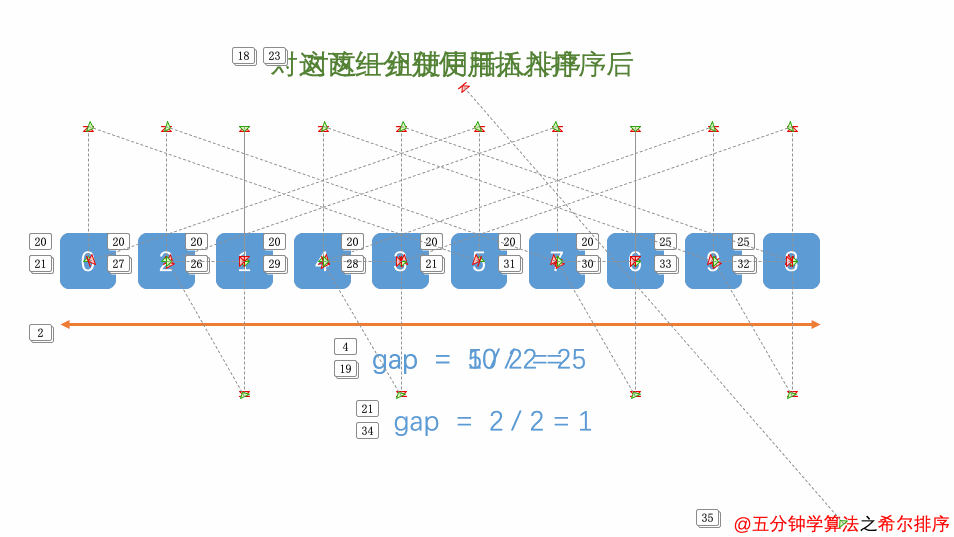

# 时间复杂度、空间复杂度、稳定性比较

| 排序方法 | 平均情况           | 最好情况    | 最坏情况    | 辅助空间 | 稳定性 |
| -------- | ------------------ | ----------- | ----------- | -------- | ------ |
| 插入排序 | O(n^2)             | O(n)        | O(n^2)      | O(1)     | 稳定   |
| 希尔排序 | O(n*log(n))~O(n^2) | O(n^1.3)    | O(n^2)      | O(1)     | 不稳定 |
| 选择排序 | O(n^2)             | O(n^2)      | O(n^2)      | O(1)     | 不稳定 |
| 冒泡排序 | O(n^2)             | O(n)        | O(n^2)      | O(1)     | 稳定   |
| 归并排序 | O(n*log(n))        | O(n*log(n)) | O(n*log(n)) | O(n)     | 稳定   |
| 堆排序   | O(n*log(n))        | O(n*log(n)) | O(n*log(n)) | O(1)     | 不稳定 |
| 快速排序 | O(n*log(n))        | O(n*log(n)) | O(n^2)      | O(1)     | 不稳定 |
| 桶排序 | O(N) | O(N) | O(N) | O(1)| 不稳定 |

# 插入排序

## 基本思想

每步将一个待排序的记录，按其顺序码大小插入到前面已经排序的字序列的合适位置（从后向前找到合适位置后），直到全部插入排序完为止。


## 算法实现

```java
// 插入排序
public static void insertionSort(int[] arr){
	// 判断目标数组是否为空或只有一个值
	if (arr == null || arr.length < 2) {
		return;
	}
	for (int i = 1; i < arr.length; i++) {
		// arr[j] > arr[j + 1]用意是前面比后面大，
		// 如果条件发生并且j的值大于0则交换
		for (int j = i - 1; j >= 0 && arr[j] > arr[j + 1]; j--) {
			swap(arr, j, j + 1);
		}
	}
}
```
# 希尔排序

## 基本思想

先将整个待排序的记录序列分割成为若干子序列分别进行直接插入排序，待整个序列中的记录“基本有序”时，再对全体记录进行依次直接插入排序。



## 算法实现

```java
public static<AnyType extends Compare<? super AnyType> void shellsort(AnyType[] a){
    int j;
    for(int gap = a.length / 2; gap > 0; gap /= 2){
        for(int i = gap; i < a.length; i++){
            AnyType tmp = a[i];
            for(j = i; j >= gap && tmp.comapreTo(a[j]) < 0; j -= gap){
                a[j] = a[j -gap];
            }
            a[j] = tmp;
        }
    }
}
```
# 选择排序

## 基本思想

在要排序的一组数中，选出最小的一个数与第一个位置的数交换；然后在剩下的数当中再找最小的与第二个位置的数交换，如此循环到倒数第二个数和最后一个数比较为止。


## 算法实现

```java
// 选择排序
public static void selectSort(int[] arr){
	// 判断目标数组是否为空或只有一个值
	if(arr == null || arr.length < 2){
		return;
	}
	for (int i = 0; i < arr.length - 1; i++) {
		int minIndex = i; // 定义最小值的位置
		for (int j = i + 1; j < arr.length; j++) {
			// 如果比minIndex位置上的值要小则交换
			minIndex = arr[j] < arr[minIndex] ? j : minIndex;
		}
		swap(arr, i, minIndex);
	}
}

public static void swap(int[] arr, int i, int j){
	int temp = arr[i];
	arr[i] = arr[j];
	arr[j] = temp;
}
```
# 冒泡排序

## 基本思想

冒泡排序是一种简单的排序算法。它重复地走访过要排序的数列，一次比较两个元素，如果他们的顺序错误就把他们交换过来。走访数列的工作是重复地进行直到没有再需要交换，也就是说该数列已经排序完成。这个算法的名字由来是因为越小的元素会经由交换慢慢“浮”到数列的顶端。


## 算法实现

```java
// 冒泡排序
public static void bubbleSort(int[] numbers){
	// 判断目标数组是否为空或只有一个值
	if(numbers == null || numbers.length < 2){
		return;
	}
	int temp = 0;
	int size = numbers.length;
	for(int i = 0; i < size - 1; i ++){
		for (int j = 0; j < size - 1 - i;j ++) {	
			if(numbers[j] > numbers[j + 1]{
				temp = numbers[j];
				numbers[j] = numbers[j + 1;
				numbers[j + 1] = temp;
			}
		}
	}
}
```
# 归并排序

## 基本思想

归并（Merge）排序法是将两个（或两个以上）有序表合并成一个新的有序表，即把待排序序列分为若干个子序列，每个子序列是有序的。然后再把有序子序列合并为整体有序序列。

	

## 算法实现

```java
	// 归并排序
public static void mergeSort(int[] arr){
	// 判断目标数组是否为空或只有一个值
	if (arr == null || arr.length < 2) {
		return;
	}
	mergeSort(arr, 0, arr.length - 1);
}

public static void mergeSort(int[] arr, int l, int r){
	if(l == r){
		return;
	}
	// 使用位运算可以准确高效的计算出中间值
	int mid = l + ((r - 1) >> 1); 
	mergeSort(arr, l, mid);
	mergeSort(arr, mid + 1, r);
	merget(arr, l, mid, r);
}

public static void merget(int[] arr, int l, int m, int r){
	// 申请一个额外空间
	int[] help = new int[r - l + 1];
	int i = 0;
	int p1 = l;
	int p2 = m + 1;
	// 在 l~m 和 m+1~r 的途中，
	// 如果arr[p1] < arr[p2]，
	// 则额外空间help[]存放较小值
	while (p1 <= m && p2 <= r) {
		help[i++] = arr[p1] < arr[p2] ? arr[p1++] : arr[p2++];
	}
	// 两个循环，将剩下的值倒入额外空间help[]中
	while(p1 <= m){
		help[i++] = arr[p1++];
	}
	while(p2 <= r){
		help[i++] = arr[p2++];
	}
	// 将额外空间help[]中的数值全倒入arr[l + help.length]这段区域中
	for (i = 0; i < help.length; i++) {
		arr[l + i] = help[i];
	}
}
```
# 堆排序

## 基本思想

将待排序序列构造成一个大顶堆，此时，整个序列的最大值就是堆顶的根节点。将其与末尾元素进行交换，此时末尾就为最大值。然后将剩余n-1个元素重新构造成一个堆，这样会得到n个元素的次小值。如此反复执行，便能得到一个有序序列了。


## 算法实现

```java
// 堆排序
public static void heapSort(int[] arr){
	if (arr == null || arr.length < 2) {
		return;
	}
	for (int i = 0; i < arr.length; i++) {
		// 0~i之间的形成大根堆
		heapInsert(arr, i);
	}
	int size = arr.length;
	swap(arr, 0, --size);
	while(size > 0){
		heapify(arr, 0, size);
		swap(arr, 0, --size);
	}
}

// 如果建立了一个堆，
// 将index插入到堆中，
// 向上调整
public static void heapInsert(int[] arr, int index){
	// 只要当前index位置比父位置要大，
	// 则交换
	while(arr[index] > arr[(index - 1) / 2]
		swap(arr, index, (index -1) / 2);
		index = (index - 1) / 2;
	}
}

// 调整成大根堆
public static void heapify(int arr, int index, int size){
	// 左孩子
	int left = index * 2 + 1;
	while(left < size){
		// 左右两个孩子中的最大值
		int largest = left + 1 < size && arr[left + 1] > arr[left] ? left + 1 : left;
		largest = arr[largest] > arr[index] ? largest : index;
		if(largest == index){
			break;
		}
		swap(arr, largest, index);
		index = largest;
		left = index * 2 + 1;
	}	
}

public static void swap(int[] arr, int i, int j) {
	int tmp = arr[i];
	arr[i] = arr[j];
	arr[j] = tmp;
	}
```
# 快速排序

## 基本思想

通过一趟排序将待排序记录分割成独立的两部分，其中一部分记录的关键字均比另一部分关键字小，则分别对这两部分继续进行排序，直到整个序列有序。


## 算法实现

```java
// 快速排序
public static void quickSort(int[] arr){
	// 判断目标数组是否为空或只有一个值
	if (arr == null || arr.length < 2) {
		return;
	}
	quickSort(arr, 0, arr.length - 1);
}

public static void quickSort(int[] arr, int l, int r){
	if (l < r) {
		// 这一段就是随机快排
		swap(arr, l + (int)(Math.random() * (r - l + 1)), r);
		int[] p = partition(arr, l, r);
		quickSort(arr, l, p[0] - 1);
		quickSort(arr, p[l] + 1, r);
	}
}

// 切分
public static int[] partition(int[] arr, int l, int r){
	int less = l - 1;
	int more = r;
	while (l < more) {
		if (arr[l] < arr[r]) {
			swap(arr, ++less, l++);
		}else if (arr[l] > arr[r]) {
			swap(arr, --more, l);
		}else{
			l++;
		}
	}
	swap(arr, more, r);
	// 返回一个新的数组
	return new int[]{ less + 1, more};
}

	public static void swap(int[] arr, int i, int j) {
		int tmp = arr[i];
		arr[i] = arr[j];
		arr[j] = tmp;
	}
```

# 桶排序

## 基本思想

设置一个定量的数组当作空桶子。寻访序列，并且把项目一个一个放到对应的桶子去。对每个不是空的桶子进行排序。从不是空的桶子里把项目再放回原来的序列中。


## 实现代码

```java
private int indexFor(int a, int min, int step) {
		return (a - min) / step;
	}

	public void bucketSort(int[] arr) {

		int max = arr[0], min = arr[0];
		for (int a : arr) {
			if (max < a)
				max = a;
			if (min > a)
				min = a;
		}
		// 该值也可根据实际情况选择
		int bucketNum = max / 10 - min / 10 + 1;
		List buckList = new ArrayList<List<Integer>>();
		// create bucket
		for (int i = 1; i <= bucketNum; i++) {
			buckList.add(new ArrayList<Integer>());
		}
		// push into the bucket
		for (int i = 0; i < arr.length; i++) {
			int index = indexFor(arr[i], min, 10);
			((ArrayList<Integer>) buckList.get(index)).add(arr[i]);
		}
		ArrayList<Integer> bucket = null;
		int index = 0;
		for (int i = 0; i < bucketNum; i++) {
			bucket = (ArrayList<Integer>) buckList.get(i);
			insertSort(bucket);
			for (int k : bucket) {
				arr[index++] = k;
			}
		}

	}

	// 把桶內元素插入排序
	private void insertSort(List<Integer> bucket) {
		for (int i = 1; i < bucket.size(); i++) {
			int temp = bucket.get(i);
			int j = i - 1;
			for (; j >= 0 && bucket.get(j) > temp; j--) {
				bucket.set(j + 1, bucket.get(j));
			}
			bucket.set(j + 1, temp);
		}
	}
```