# 表、栈和队列

## 表

我们将处理形如A<sub>0</sub>，A<sub>1</sub>，A<sub>2</sub>，A<sub>3</sub>…，A<sub>N-1</sub>的一边的表。我们说这个表的大小是N。我们将大小为0的特殊的表称为空表（empty list）。

对于除空表外的任何表，我们说A<sub>i</sub>后继A<sub>i-1</sub>（或继A<sub>i-1</sub>之后。i < N）并称A<sub>i</sub>前驱A<sub>i</sub>（i > 0）。表中的第一个元素是A<sub>0</sub>，而最后一个元素是A<sub>N-1</sub>。我们将不定义A<sub>0</sub>的前驱元，也不定义A<sub>N-1</sub>的后继元。元素A<sub>i</sub>在表中的位置为i+1。为了简单起见，我们假设表中的元素是整数，但一般说来任意的复元素也是允许的。

与这些“定义”相关的是要在表上进行操作的集合。printList和makeEmpty是常用的操作；find返回某一项首次出现的位置；insert和remove一般是从表的某个位置插入和删除某个元素；而findKth则返回（作为参数而被指定的）某个位置上的元素。；insert插入；remove移出。

### 表的简单数组实现

对表的所有这些操作都可以通过使用数组来实现。虽然数组是由固定容量创建的，但在需要的时候可以用双倍的容量创建一个不同的数组。它解决由于使用数组而产生的最严重的问题，即从历史上看为了使用一个数组，需要对表的大小进行估计。而这种估计在Java或任何现代编程语言中都是不需要的。下列程序段解释了一个数组arr在必要的时候如何被扩展（其初始长度为10）：

```java
int[] arr = new int[10];
...
//下面我们决定需要扩大arr
int[] newArr = new int[arr.length * 2];
for(int i = 0; i < arr.length; i++){
    newArr[i] = arr[i];
}
arr = newArr;
```

数组的实现可以使得printList以线性时间被执行，而findKth操作则花费常数时间。不过插入和删除的花费却潜藏着昂贵的开销，这要看插入和删除发生在什么地方。最坏的情形下，在位置0的插入（即在表的前端插入）首先需要将整个数组后移一个位置以空出空间来，而删除第一个元素则需要将表中的所有元素前移一个位置，因此这两个操作的最坏情况为O(N)。平均来看，这两个操作都需要移动表的一半的元素，因此仍然需要线性时间。另一方面，如果所有的操作都发生在表的高端，那就没有元素需要移动，而添加和删除只花费O(1)时间。

存在许多情形，在这些情形下的表是通过在高端进行插入操作建成的，其后只发生对数组的访问（即只有findKth操作）。在这种情况下，数组是表的一种恰当的实现。然而，如果发生对表的一些插入和删除操作，特别是对表的前端进行，那么数组就不是一种好的选择。下一节处理另一种数据结构：链表（linked list）。

### 简单链表

为了避免插入和删除的线性开销，我们需要保证表可以不连续存储，否则表的每个部分都可能需要整体移动。下图指出链表的一般想法。

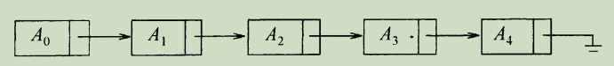

链表由一系列节点组成，这些节点不必在内存种相连。每一个节点均含有表元素和到包含该元素后继元的节点的链（link）。我们称之为next链。最后一个单元的next链引用null。

为了执行printList或find(x)，只要从表的第一个节点开始然后用一些后继的next链遍历该表即可。这种操作显然是线性时间的，和在数组实现时一样，不过其中的常熟可能比用数组实现要大。findKth操作不如数组实现时的效率高；findKth(i)O(i)的时间并以这种明显的方式遍历链表而完成。在实践种这个界是保守的，因为调用findKth常常是以（按i）排序后的方式进行的。

remove方法可以通过修改一个next引用来实现。下图给出在原表中删除第三个元素的结果。

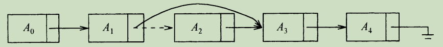

insert方法需要使用new操作符从系统取得一个新节点，此后执行两次引用的调整。其一般想法在图中给出，其中虚线表示原来的next引用。

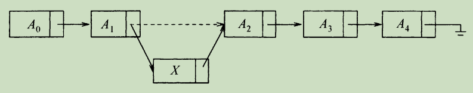

我们看到，在实践中如果知道变动将要发生的地方，那么向链表插入或从链表中删除一项的操作不需要移动好多的项，而只涉及常熟个节点的链的改变。

在表的前端添加项或删除第一项的特数情形此时也属于常数时间的操作，当然要假设到链表前端的链是存在的。只要我们拥有链表最后节点的链，那么在链表末尾进行添加操作的特殊情形（即让新的项成为最后一项）可以花费常数时间。因此，典型的链表拥有到该表两端的链。删除最后一项比较复杂，因此必须找出指向最后节点的项，把它的next链改成null，然后再更新持有最后节点的链。在经典的链表中，每个节点均存储到其下一节点的链，而拥有指向最后节点的链并不提供最后节点的前驱节点的任何信息。

保留指向最后节点的第3个链的想法行不通，因为它在删除操作期间也需要更新。我们的做法是，让每一个节点持有一个指向它在表中的前驱节点的链，下图所示，我们称之为双链表（doubly linked list）。

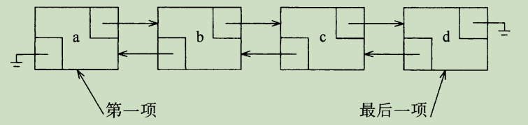


### 对ArrayList类的实现

```java
public class MyArrayList<AnyType> implements Iterable<AnyType> {

    //初始容量
    private static final int DEFAULT_CAPACITY = 10;
    private AnyType[] mArray;
    private int mArraySize;

    @Override
    public Iterator<AnyType> iterator() {
        return new ArrayIterator();
    }


    private class ArrayIterator implements Iterator<AnyType> {
        private int currentPositon;

        @Override
        public boolean hasNext() {
            return currentPositon < mArraySize;
        }

        @Override
        public AnyType next() {
            if (!hasNext()) {
                throw new NoSuchElementException();
            }

            return mArray[currentPositon++];
        }

        @Override
        public void remove() {
            MyArrayList.this.remove(--currentPositon);
        }
    }


    public void trimTosize() {
        ensureCapacity(size());
    }

    //容量
    public int size() {
        return mArraySize;
    }

    //是否为空
    public boolean isEmpty() {
        return mArraySize == 0;
    }


    public MyArrayList(int size) {
        if (size < DEFAULT_CAPACITY) {
            mArraySize = size;
        } else {
            ensureCapacity(DEFAULT_CAPACITY);
        }
    }

    private void ensureCapacity(int newCapacity) {
        AnyType[] newArray = (AnyType[]) new Object[newCapacity];
        for (int i = 0; i < mArray.length; i++) {
            newArray[i] = mArray[i];
        }
        mArray = newArray;
    }

    //添加
    public boolean add(AnyType t) {
        add(t, mArraySize);
        return true;
    }

    public void add(AnyType t, int position) {
        if (mArraySize == mArray.length) {
            ensureCapacity(mArraySize * 2 + 1);
        }
        for (int i = position; i < mArraySize - 1; i++) {
            mArray[i + 1] = mArray[i];
        }
        mArray[position] = t;
        ++mArraySize;
    }

    //移出
    public AnyType reomve() {
        return remove(mArraySize);
    }

    private AnyType remove(int position) {
        AnyType t = mArray[position];
        for (int i = position; i < mArraySize - 1; i++) {
            mArray[i] = mArray[i + 1];
        }
        --mArraySize;
        return t;
    }

    public AnyType get(int position) {
        if (position < 0 || position > mArraySize) {
            throw new ArrayIndexOutOfBoundsException();
        }
        return mArray[position];
    }

    public AnyType set(AnyType t) {
        return set(t, mArraySize - 1);
    }

    public AnyType set(AnyType t, int position) {
        if (position < 0 || position > mArraySize) {
            throw new ArrayIndexOutOfBoundsException();
        }
        AnyType old = mArray[position];
        mArray[position] = t;
        return old;
    }
}
```

### 对LinkedList的实现

```java
public class MyLinkedList<AnyType> implements Iterable<AnyType> {

    private Node<AnyType> headNote;
    private Node<AnyType> endNote;

    private int mSize;
    private int modCount;

    public MyLinkedList() {
        init();
    }

    private void init() {
        headNote = new Node<>(null, null, null);
        endNote = new Node<>(null, headNote, null);
        headNote.mNext = endNote;

        mSize = 0;
        modCount++;
    }

    public int size() {
        return mSize;
    }

    public boolean isEmpty() {
        return mSize == 0;
    }

    public boolean add(T t) {
        addBefore(t, size());
        return true;
    }

    public T get(int index) {
        Node<T> temp = getNode(index, 0, size());
        return temp.mData;
    }

    public T remove(int position) {
        Node<T> tempNode = getNode(position);
        return remove(tempNode);
    }

    private T remove(Node<T> tempNode) {
        tempNode.mPre.mNext = tempNode.mNext;
        tempNode.mNext.mPre = tempNode.mPre;
        mSize--;
        modCount++;
        return tempNode.mData;
    }

    public T set(int index, T t) {
        Node<AnyType> tempNode = getNode(index);
        T old = tempNode.mData;
        tempNode.mData = t;
        return old;
    }

    private Node<AnyType> getNode(int index) {
        return getNode(index, 0, size() - 1);
    }


    private Node<AnyType> getNode(int index, int lower, int upper) {
        Node<AnyType> tempNode;

        if (lower < 0 || upper > mSize) {
            throw new IndexOutOfBoundsException();
        }

        if (index < mSize / 2) {
            tempNode = headNote.mNext;
            for (int i = 0; i < index; i++) {
                tempNode = tempNode.mNext;
            }
        } else {
            tempNode = endNote;
            for (int i = mSize; i > index; i--) {
                tempNode = tempNode.mPre;
            }
        }
        return tempNode;
    }


    //节点类
    private static class Node<AnyType> {
        //后继节点
        private Node<AnyType> mNext;
        //数据
        private AnyType mData;
        //前驱节点
        private Node<AnyType> mPre;

        public Node(AnyType data, Node<AnyType> pre, Node<AnyType> next) {
            mData = data;
            mPre = pre;
            mNext = next;
        }
    }


    private class LinkedListIterator implements Iterator<AnyType> {
        private Node<AnyType> currentNode = headNote.mNext;
        private int expectedModCount = modCount;
        private boolean okToMove;

        @Override
        public boolean hasNext() {
            return currentNode != endNote;
        }

        @Override
        public AnyType next() {
            if (modCount != expectedModCount) {
                throw new ConcurrentModificationException();
            }
            if (!hasNext()) {
                throw new NoSuchElementException();
            }
            AnyType t = currentNode.mData;
            currentNode = currentNode.mNext;
            okToMove = true;
            return t;
        }

         @Override
        public void remove() {
            if (modCount != expectedModCount) {
                throw new ConcurrentModificationException();
            }
            if (!okToMove) {
                throw new IllegalStateException();
            }
            MyLinkedList.this.remove(currentNode.mPre);
            expectedModCount++;
            okToMove = false;
        }

    @Override
    public Iterator<AnyType> iterator() {
        return new LinkedListIterator();
    }
}
```

## 栈

### 栈模型

栈（stack）是限制插入和删除只能在一个位置上进行的表，该位置是表的末端，叫作 栈的顶（top）。对栈的基本操作有push（进栈）和pop（出栈），前者相当于插入，后者则是删除最后插入的元素。最后插入的元素可以通过使用top例程在执行pop之前进行考查。对空栈进行的pop或top一般被认为是栈中的一个错误。另一方面，当运行push时空间用尽是一个实现限制，但不是错误。

栈有时又叫做LIFO（后进先出）表。下图中描述的模型只象征着push是输入操作而pop和top是输出操作。普通的清空栈的操作和判断是否空栈的测试都是栈的操作指令系统的一部分，但是，我们对栈所能够做的，基本上也就是push和pop操作。

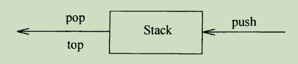

下图表示在进行若干操作后的一个抽象的栈。一般的模型是，存在某个元素位于栈顶，而该元素是唯一的可见元素。

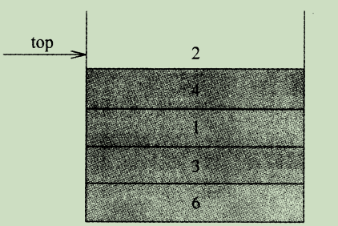

### 栈的实现

```java
public class Stack<E> extends Vector<E> {
    
    //创建一个空栈
    public Stack(){
    }

    //push操作
    public E push(E item){
        addElement(item);

        return item;
    }

    //pop操作
    public syncrhonized E pop(){
        E obj;
        int len = size();

        obj = peek();
        removeElementAt(len - 1);

        return obj;
    }

    //查看此栈顶部的对象，而不将其从栈中删除。
    public syncrhonized E peek(){
        int len = size();

        if(len == 0){
            throw new EmptyStackException();
        }
        return elementAt(len - 1);
    }

    //是否为空
    public boolean empty(){
        return size() == 0;
    }

    //查找某个对象
    public syncrhonized int search(Object o){
        int i = lastIndexOf(o);

        if(i >= 0){
            return size() - i;
        }
        return -1;
    }
}
```


## 队列

像栈一样，队列（queue）也是表。然而，使用队列时插入在一端进行而删除则在另一端进行。

### 队列模型

队列的基本操作是enqueue（入队），它是在表的末端（叫做队尾（rear））插入一个元素，和dequeue（出队），它是删除（并返回）在表的开头（叫做队头（front））的元素。下图显式一个队列的抽象模型。

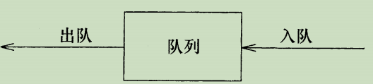

### JDK中的Queue源码

```java
public interface Queue<E> extends Collection<E> {

   /**
    * data 入队,添加成功返回true,否则返回false,可扩容
    * @param data
    * @return
    */
   boolean add(E e);

   /**
    * offer 方法可插入一个元素,这与add 方法不同，
    * 该方法只能通过抛出未经检查的异常使添加元素失败。
    * 而不是出现异常的情况，例如在容量固定（有界）的队列中
    * NullPointerException:data==null时抛出
    * @param data
    * @return
    */
   boolean offer(E e);

   /**
    * 返回队头元素,不执行删除操作,若队列为空,返回null
    * @return
    */
   E peek();

   /**
    * 返回队头元素,不执行删除操作,若队列为空,抛出异常:NoSuchElementException
    * @return
    */
   E element();

   /**
    * 出队,执行删除操作,返回队头元素,若队列为空,返回null
    * @return
    */
   E poll();

   /**
    * 出队,执行删除操作,若队列为空,抛出异常:NoSuchElementException
    * @return
    */
   E remove();
}
```

# 树

## 二叉树

二叉树（binary tree）是一棵树，其中每个节点都不能有多于两个的儿子。

下图显式一颗由一个根和两颗字数组成的二叉树，子树T<sub>L</sub>和T<sub>R</sub>均可能为空。

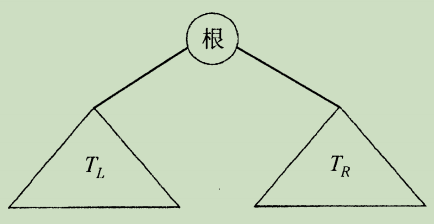

二叉树的一个性质是一颗平均二叉树的深度要比节点个数N小得多，这个性质有时很重要。分析表明，其平均深度为O($$\sqrt{N}$$)，而对于特殊类型的二叉树，即二叉查找树（binary search tree），其深度的平均值是O($$\log{N}​$$)。

### 二叉树的遍历

对于二叉树来讲最主要、最基本的运算是遍历。

遍历二叉树，是指以一定的次序访问二叉树中的每个节点。所谓访问节点是指节点进行各种操作的简称。例如，查询节点数据域的内容，或输出它的值，或找出节点位置，或是执行对节点的其他操作。遍历二叉树的过程实质是把二叉树的节点进行线性排列的过程。假设遍历二叉树时访问节点的操作就是输出节点数据域的值，那么遍历的结果得到一个线性序列。

从二叉树的递归定义可知，一颗非空的二叉树由根节点及左、右子树这三个基本部分组成。因此，在任意给定节点上，可以按某种次序执行三个操作：

1. 访问节点本身（N）
2. 遍历该节点的左子树（L）
3. 便利该节点的右子树（R）

以上三种操作有六种执行次序：
    　NLR、LNR、LRN、NRL、RNL、RLN。
> 注意：前三种次序与后三种次序对称，故只讨论先左后右的前三种次序。
> 

由于被访问的结点必是某子树的根，所以N(Node)、L(Left subtlee)和R(Right subtree)又可解释为根、根的左子树和根的右子树。NLR、LNR和LRN分别又称为先根遍历、中根遍历和后根遍历。

### 实现

因为一个二叉树节点最多有两个子节点，所以我们可以保存直接连接道它们的链。树节点的声明在结构上类似于双链表的声明，在声明中，节点就是由element（元素）的信息加上两个到其他节点的引用（left和right）组成的结构。

```java
import java.util.Stack;
 
/**
 * 二叉树的链式存储
 */
public class BinaryTree {
 
  
  private TreeNode root=null;
  
  public BinaryTree(){
    root=new TreeNode(1,"rootNode(A)");
  }
  
  /**
   * 创建一棵二叉树
   * <pre>
   *           A
   *     B          C
   *  D     E            F
   *  </pre>
   * @param root
   */
  public void createBinTree(TreeNode root){
    TreeNode newNodeB = new TreeNode(2,"B");
        TreeNode newNodeC = new TreeNode(3,"C");
        TreeNode newNodeD = new TreeNode(4,"D");
        TreeNode newNodeE = new TreeNode(5,"E");
        TreeNode newNodeF = new TreeNode(6,"F");
        root.leftChild=newNodeB;
        root.rightChild=newNodeC;
        root.leftChild.leftChild=newNodeD;
        root.leftChild.rightChild=newNodeE;
        root.rightChild.rightChild=newNodeF;
  }
  
  
  public boolean isEmpty(){
    return root==null;
  }
 
  //树的高度
  public int height(){
    return height(root);
  }
  
  //节点个数
  public int size(){
    return size(root);
  }
  
  
  private int height(TreeNode subTree){
    if(subTree==null)
      return 0;//递归结束：空树高度为0
    else{
      int i=height(subTree.leftChild);
      int j=height(subTree.rightChild);
      return (i<j)?(j+1):(i+1);
    }
  }
  
  private int size(TreeNode subTree){
    if(subTree==null){
      return 0;
    }else{
      return 1+size(subTree.leftChild)
          +size(subTree.rightChild);
    }
  }
  
  //返回双亲结点
  public TreeNode parent(TreeNode element){
    return (root==null|| root==element)?null:parent(root, element);
  }
  
  public TreeNode parent(TreeNode subTree,TreeNode element){
    if(subTree==null)
      return null;
    if(subTree.leftChild==element||subTree.rightChild==element)
      //返回父结点地址
      return subTree;
    TreeNode p;
    //现在左子树中找，如果左子树中没有找到，才到右子树去找
    if((p=parent(subTree.leftChild, element))!=null)
      //递归在左子树中搜索
      return p;
    else
      //递归在右子树中搜索
      return parent(subTree.rightChild, element);
  }
  
  public TreeNode getLeftChildNode(TreeNode element){
    return (element!=null)?element.leftChild:null;
  }
  
  public TreeNode getRightChildNode(TreeNode element){
    return (element!=null)?element.rightChild:null;
  }
  
  public TreeNode getRoot(){
    return root;
  }
  
  //在释放某个结点时，该结点的左右子树都已经释放，
  //所以应该采用后续遍历，当访问某个结点时将该结点的存储空间释放
  public void destroy(TreeNode subTree){
    //删除根为subTree的子树
    if(subTree!=null){
      //删除左子树
      destroy(subTree.leftChild);
      //删除右子树
      destroy(subTree.rightChild);
      //删除根结点
      subTree=null;
    }
  }
  
  public void traverse(TreeNode subTree){
    System.out.println("key:"+subTree.key+"--name:"+subTree.data);;
    traverse(subTree.leftChild);
    traverse(subTree.rightChild);
  }
  
  //前序遍历
  public void preOrder(TreeNode subTree){
    if(subTree!=null){
      visted(subTree);
      preOrder(subTree.leftChild);
      preOrder(subTree.rightChild);
    }
  }
  
  //中序遍历
  public void inOrder(TreeNode subTree){
    if(subTree!=null){
      inOrder(subTree.leftChild);
      visted(subTree);
      inOrder(subTree.rightChild);
    }
  }
  
  //后续遍历
  public void postOrder(TreeNode subTree) {
    if (subTree != null) {
      postOrder(subTree.leftChild);
            postOrder(subTree.rightChild);
            visted(subTree);
        }
  }
  
  //前序遍历的非递归实现
  public void nonRecPreOrder(TreeNode p){
    Stack<TreeNode> stack=new Stack<TreeNode>();
    TreeNode node=p;
    while(node!=null||stack.size()>0){
      while(node!=null){
        visted(node);
        stack.push(node);
        node=node.leftChild;
      }
      <span abp="507" style="font-size:14px;">while</span>(stack.size()>0){
        node=stack.pop();
        node=node.rightChild;
      } 
    }
  }
  
  //中序遍历的非递归实现
  public void nonRecInOrder(TreeNode p){
    Stack<TreeNode> stack =new Stack<BinaryTree.TreeNode>();
    TreeNode node =p;
    while(node!=null||stack.size()>0){
      //存在左子树
      while(node!=null){
        stack.push(node);
        node=node.leftChild;
      }
      //栈非空
      if(stack.size()>0){
        node=stack.pop();
        visted(node);
        node=node.rightChild;
      }
    }
  }
  
  //后序遍历的非递归实现
  public void noRecPostOrder(TreeNode p){
    Stack<TreeNode> stack=new Stack<BinaryTree.TreeNode>();
    TreeNode node =p;
    while(p!=null){
      //左子树入栈
      for(;p.leftChild!=null;p=p.leftChild){
        stack.push(p);
      }
      //当前结点无右子树或右子树已经输出
      while(p!=null&&(p.rightChild==null||p.rightChild==node)){
        visted(p);
        //纪录上一个已输出结点
        node =p;
        if(stack.empty())
          return;
        p=stack.pop();
      }
      //处理右子树
      stack.push(p);
      p=p.rightChild;
    }
  }
  public void visted(TreeNode subTree){
    subTree.isVisted=true;
    System.out.println("key:"+subTree.key+"--name:"+subTree.data);;
  }
  
  
  /**
   * 二叉树的节点数据结构
   */
  private class  TreeNode{
    private int key=0;
    private String data=null;
    private boolean isVisted=false;
    private TreeNode leftChild=null;
    private TreeNode rightChild=null;
    
    public TreeNode(){}
    
    /**
     * @param key  层序编码
     * @param data 数据域
     */
    public TreeNode(int key,String data){
      this.key=key;
      this.data=data;
      this.leftChild=null;
      this.rightChild=null;
    }
  }
}
```

## AVL树

AVL（Adelson-Velskii和Landis）树是带有平衡条件（balance condition）的二叉查找树。这个平衡条件必须要容易保持，而且它保证树的深度须是O($$log{N}$$)。最简单的想法是要求左右子树具有相同的高度。

另一个平衡条件是要求每个节点都必须有相同高度的左子树和右子树。如果空子树的高度定义为-1（通常就是这么定义），那么只有具有2<sup>k</sup>-1个节点的理想平衡树（perfectly balanced tree）满足这个条件。一颗AVL树是其每个节点的左子树和右子树的高度最多差1的二叉查找树。

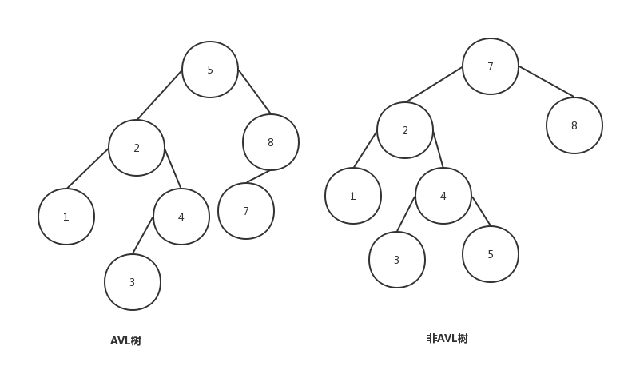

### 旋转

#### 左左单旋转

从下图可以看出，结点X并不能满足AVL树的性质，因为它的左子树比右子树深2层，这种情况就是典型的LL情景，此时需要通过右向旋转来修复失衡的树，如图1，X经过右旋转后变成图2，W变为根结点，X变为W的右子树，同时W的右子树变为X的左子树，树又重新回到平衡，各个结点的子树高度差都已在正常范围。一般情况下，我们把X结点称为失衡点，修复一棵被破坏的AVL树时，找到失衡点是很重要的并把通过一次旋转即可修复平衡的操作叫做单旋转，从图3和图4可知，在原始AVL树插入7结点后，结点9变为失衡点，树再满足AVL性质，因此需要对9结点进行左左单旋转(即向右旋转)后，得到图4，我们发现此时并没有操作树的根结点(6)，实际上这是因为正常情况下，不必从树的根结点进行旋转，而是从插入结点处开始，向上遍历树，并更新和修复在这个路径上的每个结点的平衡及其平衡信息(高度)即可。
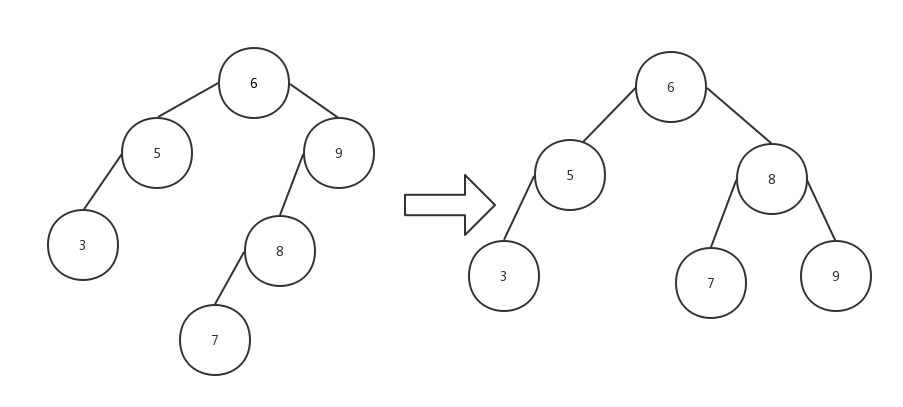

```java
/**
 * 左左单旋转(LL旋转) w变为x的根结点, x变为w的右子树
 * @param x
 * @return
 */
private AVLNode<T> singleRotateLeft(AVLNode<T> x){
    //把w结点旋转为根结点
    AVLNode<T> w=  x.left;
    //同时w的右子树变为x的左子树
    x.left=w.right;
    //x变为w的右子树
    w.right=x;
    //重新计算x/w的高度
    x.height=Math.max(height(x.left),height(x.right))+1;
    w.height=Math.max(height(w.left),x.height)+1;
    return w;//返回新的根结点
}
```

#### 右右单旋转

接着再来看看右右单旋转(RR)的情景，如下图，可以发现与左左单旋转的情况恰好是一种镜像关系，同样结点X并不能满足AVL树的性质，在这样的情景下，需要对X结点进行左旋转来修复树的平衡，如图1经左旋转后变了图2，此时X变为了根结点，W变为X的左孩子，X的左子树变为W的右子树，而树又重新恢复了平衡。如图3和图4的实例情景，原始的AVL树在12处插入结点18后，结点10就变成了失衡点，因为10的左子树和右子树的高度相差2，显然不符合AVL树性质，需要对结点10进行右右单旋转修复(向左旋转)，然后得到图4，此时树重新回到了平衡，这便是右右单旋转(RR)的修复情景。

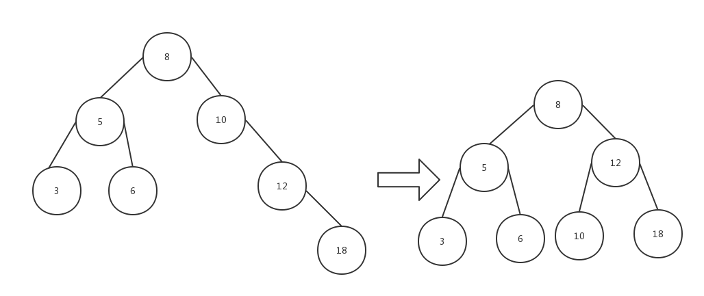

```java
/**
 * 右右单旋转(RR旋转) x变为w的根结点, w变为x的左子树
 * @return
 */
private AVLNode<T> singleRotateRight(AVLNode<T> w){

    AVLNode<T> x=w.right;

    w.right=x.left;
    x.left=w;

    //重新计算x/w的高度
    w.height=Math.max(height(w.left),height(w.right))+1;
    x.height=Math.max(height(x.left),w.height)+1;

    //返回新的根结点
    return x;
}
```


#### 左右双旋转
为了重新平衡，通过上述的分析显然不能把X根结点，而X与W间的旋转也解决不了问题，那唯一的旋转就是把Y作为新根。这样的话，X、W就不得不成为Y的孩子结点，其中W作为Y的左孩子结点，而X成为Y的右孩子结点。这里我们以下图为例来分析，为了达到以上结果，需要W、Y进行单旋转（图1），这里我们可把WY组成的子树看成前面的右右旋转情景，然后进行左向旋转，得到图2，W变为Y的左子树同时Y的左子树B变成W的右子树，其他不变，到此第一次旋转完成，进行第二次旋转，以X结点向右进行旋转(同样可看作左左情景)，由图2得到图3，X变成Y的右孩子结点并且Y的右子树C变成X的左子树，第二次旋转完成，树也重新恢复到平衡。
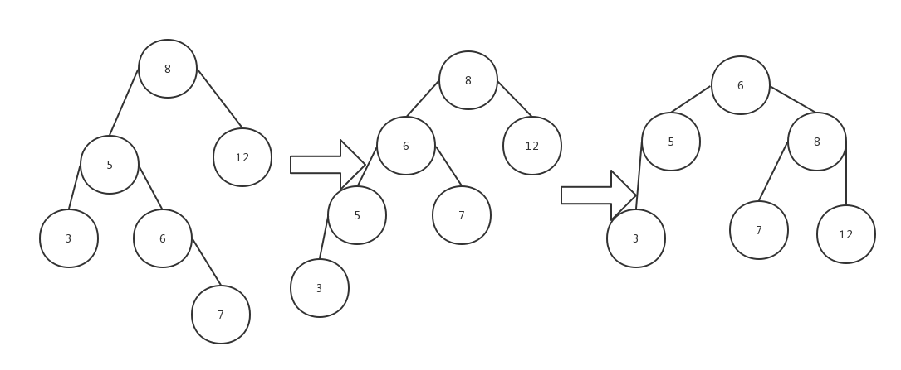
```java
/**
 * 左右旋转(LR旋转) x(根) w y 结点 把y变成根结点
 * @return
 */
private AVLNode<T> doubleRotateWithLeft(AVLNode<T> x){
    //w先进行RR旋转
    x.left=singleRotateRight(x.left);
    //再进行x的LL旋转
    return singleRotateLeft(x);
}
```
#### 右左双旋转
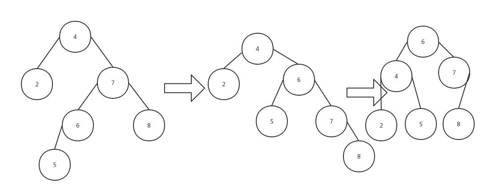
```java
/**
 * 右左旋转(RL旋转)
 * @param w
 * @return
 */
private AVLNode<T> doubleRotateWithRight(AVLNode<T> x){
    //先进行LL旋转
    x.right=singleRotateLeft(x.right);
    //再进行RR旋转
    return singleRotateRight(x);
}
```

### 实现

```java
public class AVLTree<T extends Comparable<T>> {

    private AVLTreeNode<T> mRoot;    // 根结点

    // AVL树的节点(内部类)
    class AVLTreeNode<T extends Comparable<T>> {
        T element;                // 值
        int height;         // 高度
        AVLTreeNode<T> left;    // 左孩子
        AVLTreeNode<T> right;    // 右孩子

        public AVLTreeNode(T key, AVLTreeNode<T> left, AVLTreeNode<T> right) {
            this.element = key;
            this.left = left;
            this.right = right;
            this.height = 0;
        }
    }

    /*
 * 获取树的高度
 */
    private int height(AVLTreeNode<T> tree) {
        if (tree != null)
            return tree.height;

        return 0;
    }

    public int height() {
        return height(mRoot);
    }

    /*
 * LL：左左对应的情况(左单旋转)。
 *
 * 返回值：旋转后的根节点
 */

    /**
     * LL：左左对应的情况(左单旋转)。
     *
     * @param k2
     * @return 旋转后的根节点
     */
    private AVLTreeNode<T> leftLeftRotation(AVLTreeNode<T> k2) {
        AVLTreeNode<T> k1;

        k1 = k2.left;
        k2.left = k1.right;
        k1.right = k2;

        k2.height = Math.max(height(k2.left), height(k2.right)) + 1;
        k1.height = Math.max(height(k1.left), k2.height) + 1;

        return k1;
    }

    /**
     * 右右对应的情况(右单旋转)。
     *
     * @param k1
     * @return 旋转后的根节点
     */
    private AVLTreeNode<T> rightRightRotation(AVLTreeNode<T> k1) {
        AVLTreeNode<T> k2;

        k2 = k1.right;
        k1.right = k2.left;
        k2.left = k1;

        k1.height = Math.max(height(k1.left), height(k1.right)) + 1;
        k2.height = Math.max(height(k2.right), k1.height) + 1;

        return k2;
    }


    /**
     * LR：左右对应的情况(左双旋转)。
     *
     * @param k3
     * @return 旋转后的根节点
     */
    private AVLTreeNode<T> leftRightRotation(AVLTreeNode<T> k3) {
        k3.left = rightRightRotation(k3.left);

        return leftLeftRotation(k3);
    }

    /**
     * RL：右左对应的情况(右双旋转)。
     *
     * @param k1
     * @return 旋转后的根节点
     */
    private AVLTreeNode<T> rightLeftRotation(AVLTreeNode<T> k1) {
        k1.right = leftLeftRotation(k1.right);

        return rightRightRotation(k1);
    }


    public void insert(T key) {
        mRoot = insert(mRoot, key);
    }

    /**
     * 将结点插入到AVL树中，并返回根节点
     *
     * @param tree AVL树的根结点
     * @param key  插入的结点的键值
     * @return 根节点
     */
    private AVLTreeNode<T> insert(AVLTreeNode<T> tree, T key) {
        if (tree == null) {
            // 新建节点
            return tree = new AVLTreeNode<T>(key, null, null);

        }

        int cmp = key.compareTo(tree.element);
        if (cmp < 0) {// 将key插入到"tree的左子树"的情况
            tree.left = insert(tree.left, key);

        } else if (cmp > 0) { // 将key插入到"tree的右子树"的情况
            tree.right = insert(tree.right, key);
        }

        return balance(tree);
    }


    private static final int ALLOWED_IMBALANCE = 1;

    private AVLTreeNode<T> balance(AVLTreeNode<T> tree) {
        if (tree == null) {
            return tree;
        }
        // 插入节点后，若AVL树失去平衡，则进行相应的调节。
        if (height(tree.left) - height(tree.right) > ALLOWED_IMBALANCE) {

            if (height(tree.left.left) >= height(tree.left.right)) {
                leftLeftRotation(tree);
            } else {
                leftRightRotation(tree);
            }
        } else if (height(tree.right) - height(tree.left) > ALLOWED_IMBALANCE) {
            if (height(tree.right.right) >= height(tree.right.left)) {
                rightRightRotation(tree);
            } else {
                rightLeftRotation(tree);
            }
        }
        tree.height = Math.max(height(tree.left), height(tree.right)) + 1;

        return tree;
    }

    public void remove(T key) {
        AVLTreeNode<T> z;

        if ((z = search(mRoot, key)) != null)
            mRoot = remove(mRoot, z);
    }

    /*
       * (递归实现)查找"AVL树x"中键值为key的节点
      */
    private AVLTreeNode<T> search(AVLTreeNode<T> x, T key) {
        if (x == null)
            return x;

        int cmp = key.compareTo(x.element);
        if (cmp < 0)
            return search(x.left, key);
        else if (cmp > 0)
            return search(x.right, key);
        else
            return x;
    }

    public AVLTreeNode<T> search(T key) {
        return search(mRoot, key);
    }

    /**
     * 删除结点(z)，返回根节点
     *
     * @param tree AVL树的根结点
     * @param z    待删除的结点
     * @return 根节点
     */
    private AVLTreeNode<T> remove(AVLTreeNode<T> tree, AVLTreeNode<T> z) {
        if (tree == null)
            return tree;

        int cmp = z.element.compareTo(tree.element);
        if (cmp > 0) {
            tree.right = remove(tree.right, z);
        } else if (cmp < 0) {
            tree.left = remove(tree.left, z);
        } else if (tree.left != null && tree.right != null) {
            tree.element = findMin(tree.right).element;
            tree.right = remove(tree.element, tree.right);
        } else {
            tree = (tree.left != null) ? tree.left : tree.right;
        }
        return balance(tree);
    }

    private AVLTreeNode<T> findMin(AVLTreeNode<T> node) {
        if (node != null) {
            while (node.left != null) {
                node = node.left;
            }
        }
        return node;
    }

    public AVLTreeNode<T> remove(T t, AVLTreeNode<T> node) {
        if (node == null) {
            return node;
        }
        int compareResult = t.compareTo(node.element);
        if (compareResult > 0) {
            node.right = remove(t, node.right);
        } else if (compareResult < 0) {
            node.left = remove(t, node.left);
        } else if (node.left != null && node.right != null) {
            node.element = findMin(node.right).element;
            node.right = remove(node.element, node.right);
        } else {
            node = (node.left != null) ? node.left : node.right;
        }
        return node;

    }

    /*
     * 打印"二叉查找树"
     *
     * key        -- 节点的键值
     * direction  --  0，表示该节点是根节点;
     *               -1，表示该节点是它的父结点的左孩子;
     *                1，表示该节点是它的父结点的右孩子。
     */
    private void print(AVLTreeNode<T> tree, T key, int direction) {
        if(tree != null) {
            if(direction==0)    // tree是根节点
                System.out.printf("%2d is root\n", tree.element, key);
            else                // tree是分支节点
                System.out.printf("%2d is %2d's %6s child\n", tree.element, key, direction==1?"right" : "left");

            print(tree.left, tree.element, -1);
            print(tree.right,tree.element,  1);
        }
    }

    public void print() {
        if (mRoot != null)
            print(mRoot, mRoot.element, 0);
    }
}
```

# 优先队列（堆）
## 二叉堆
二叉堆是完全二元树或者是近似完全二元树，按照数据的排列方式可以分为两种：最大堆和最小堆。 
最大堆：父结点的键值总是大于或等于任何一个子节点的键值；
最小堆：父结点的键值总是小于或等于任何一个子节点的键值。

二叉堆一般都通过”数组”来实现，下面是数组实现的最大堆和最小堆的示意图：
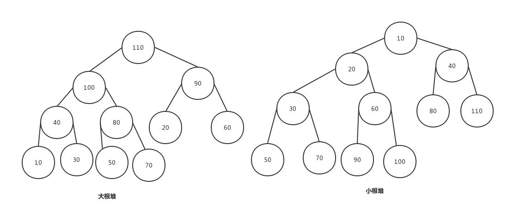
### 代码实现
#### 大根堆
```java
public class MaxHeap<T extends Comparable<T>> {

    private List<T> mHeap;    // 队列(实际上是动态数组ArrayList的实例)

    public MaxHeap() {
        this.mHeap = new ArrayList<T>();
    }

    /* 
     * 最大堆的向下调整算法
     *
     * 注：数组实现的堆中，第N个节点的左孩子的索引值是(2N+1)，右孩子的索引是(2N+2)。
     *
     * 参数说明：
     *     start -- 被下调节点的起始位置(一般为0，表示从第1个开始)
     *     end   -- 截至范围(一般为数组中最后一个元素的索引)
     */
    protected void filterdown(int start, int end) {
        int c = start;          // 当前(current)节点的位置
        int l = 2*c + 1;     // 左(left)孩子的位置
        T tmp = mHeap.get(c);    // 当前(current)节点的大小

        while(l <= end) {
            int cmp = mHeap.get(l).compareTo(mHeap.get(l+1));
            // "l"是左孩子，"l+1"是右孩子
            if(l < end && cmp<0)
                l++;        // 左右两孩子中选择较大者，即mHeap[l+1]
            cmp = tmp.compareTo(mHeap.get(l));
            if(cmp >= 0)
                break;        //调整结束
            else {
                mHeap.set(c, mHeap.get(l));
                c = l;
                l = 2*l + 1;   
            }       
        }   
        mHeap.set(c, tmp);
    }

    /*
     * 删除最大堆中的data
     *
     * 返回值：
     *      0，成功
     *     -1，失败
     */
    public int remove(T data) {
        // 如果"堆"已空，则返回-1
        if(mHeap.isEmpty() == true)
            return -1;

        // 获取data在数组中的索引
        int index = mHeap.indexOf(data);
        if (index==-1)
            return -1;

        int size = mHeap.size();
        mHeap.set(index, mHeap.get(size-1));// 用最后元素填补
        mHeap.remove(size - 1);                // 删除最后的元素

        if (mHeap.size() > 1)
            filterdown(index, mHeap.size()-1);    // 从index号位置开始自上向下调整为最小堆

        return 0;
    }

    /*
     * 最大堆的向上调整算法(从start开始向上直到0，调整堆)
     *
     * 注：数组实现的堆中，第N个节点的左孩子的索引值是(2N+1)，右孩子的索引是(2N+2)。
     *
     * 参数说明：
     *     start -- 被上调节点的起始位置(一般为数组中最后一个元素的索引)
     */
    protected void filterup(int start) {
        int c = start;            // 当前节点(current)的位置
        int p = (c-1)/2;        // 父(parent)结点的位置 
        T tmp = mHeap.get(c);        // 当前节点(current)的大小

        while(c > 0) {
            int cmp = mHeap.get(p).compareTo(tmp);
            if(cmp >= 0)
                break;
            else {
                mHeap.set(c, mHeap.get(p));
                c = p;
                p = (p-1)/2;   
            }       
        }
        mHeap.set(c, tmp);
    }

    /* 
     * 将data插入到二叉堆中
     */
    public void insert(T data) {
        int size = mHeap.size();

        mHeap.add(data);    // 将"数组"插在表尾
        filterup(size);        // 向上调整堆
    }

    @Override
    public String toString() {
        StringBuilder sb = new StringBuilder();
        for (int i=0; i<mHeap.size(); i++)
            sb.append(mHeap.get(i) +" ");

        return sb.toString();
    }

    public static void main(String[] args) {
        int i;
        int a[] = {10, 40, 30, 60, 90, 70, 20, 50, 80};
        MaxHeap<Integer> tree=new MaxHeap<Integer>();

        System.out.printf("== 依次添加: ");
        for(i=0; i<a.length; i++) {
            System.out.printf("%d ", a[i]);
            tree.insert(a[i]);
        }

        System.out.printf("\n== 最 大 堆: %s", tree);

        i=85;
        tree.insert(i);
        System.out.printf("\n== 添加元素: %d", i);
        System.out.printf("\n== 最 大 堆: %s", tree);

        i=90;
        tree.remove(i);
        System.out.printf("\n== 删除元素: %d", i);
        System.out.printf("\n== 最 大 堆: %s", tree);
        System.out.printf("\n");
    }
}
```
#### 小根堆
```java
public class MinHeap<T extends Comparable<T>> {

    private List<T> mHeap;        // 存放堆的数组

    public MinHeap() {
        this.mHeap = new ArrayList<T>();
    }

    /* 
     * 最小堆的向下调整算法
     *
     * 注：数组实现的堆中，第N个节点的左孩子的索引值是(2N+1)，右孩子的索引是(2N+2)。
     *
     * 参数说明：
     *     start -- 被下调节点的起始位置(一般为0，表示从第1个开始)
     *     end   -- 截至范围(一般为数组中最后一个元素的索引)
     */
    protected void filterdown(int start, int end) {
        int c = start;          // 当前(current)节点的位置
        int l = 2*c + 1;     // 左(left)孩子的位置
        T tmp = mHeap.get(c);    // 当前(current)节点的大小

        while(l <= end) {
            int cmp = mHeap.get(l).compareTo(mHeap.get(l+1));
            // "l"是左孩子，"l+1"是右孩子
            if(l < end && cmp>0)
                l++;        // 左右两孩子中选择较小者，即mHeap[l+1]

            cmp = tmp.compareTo(mHeap.get(l));
            if(cmp <= 0)
                break;        //调整结束
            else {
                mHeap.set(c, mHeap.get(l));
                c = l;
                l = 2*l + 1;   
            }       
        }   
        mHeap.set(c, tmp);
    }

    /*
     * 最小堆的删除
     *
     * 返回值：
     *     成功，返回被删除的值
     *     失败，返回null
     */
    public int remove(T data) {
        // 如果"堆"已空，则返回-1
        if(mHeap.isEmpty() == true)
            return -1;

        // 获取data在数组中的索引
        int index = mHeap.indexOf(data);
        if (index==-1)
            return -1;

        int size = mHeap.size();
        mHeap.set(index, mHeap.get(size-1));// 用最后元素填补
        mHeap.remove(size - 1);                // 删除最后的元素

        if (mHeap.size() > 1)
            filterdown(index, mHeap.size()-1);    // 从index号位置开始自上向下调整为最小堆

        return 0;
    }

    /*
     * 最小堆的向上调整算法(从start开始向上直到0，调整堆)
     *
     * 注：数组实现的堆中，第N个节点的左孩子的索引值是(2N+1)，右孩子的索引是(2N+2)。
     *
     * 参数说明：
     *     start -- 被上调节点的起始位置(一般为数组中最后一个元素的索引)
     */
    protected void filterup(int start) {
        int c = start;            // 当前节点(current)的位置
        int p = (c-1)/2;        // 父(parent)结点的位置 
        T tmp = mHeap.get(c);        // 当前节点(current)的大小

        while(c > 0) {
            int cmp = mHeap.get(p).compareTo(tmp);
            if(cmp <= 0)
                break;
            else {
                mHeap.set(c, mHeap.get(p));
                c = p;
                p = (p-1)/2;   
            }       
        }
        mHeap.set(c, tmp);
    }

    /* 
     * 将data插入到二叉堆中
     */
    public void insert(T data) {
        int size = mHeap.size();

        mHeap.add(data);    // 将"数组"插在表尾
        filterup(size);        // 向上调整堆
    }

    public String toString() {
        StringBuilder sb = new StringBuilder();
        for (int i=0; i<mHeap.size(); i++)
            sb.append(mHeap.get(i) +" ");

        return sb.toString();
    }

    public static void main(String[] args) {
        int i;
        int a[] = {80, 40, 30, 60, 90, 70, 10, 50, 20};
        MinHeap<Integer> tree=new MinHeap<Integer>();

        System.out.printf("== 依次添加: ");
        for(i=0; i<a.length; i++) {
            System.out.printf("%d ", a[i]);
            tree.insert(a[i]);
        }

        System.out.printf("\n== 最 小 堆: %s", tree);

        i=15;
        tree.insert(i);
        System.out.printf("\n== 添加元素: %d", i);
        System.out.printf("\n== 最 小 堆: %s", tree);

        i=10;
        tree.remove(i);
        System.out.printf("\n== 删除元素: %d", i);
        System.out.printf("\n== 最 小 堆: %s", tree);
        System.out.printf("\n");
    }
}
```