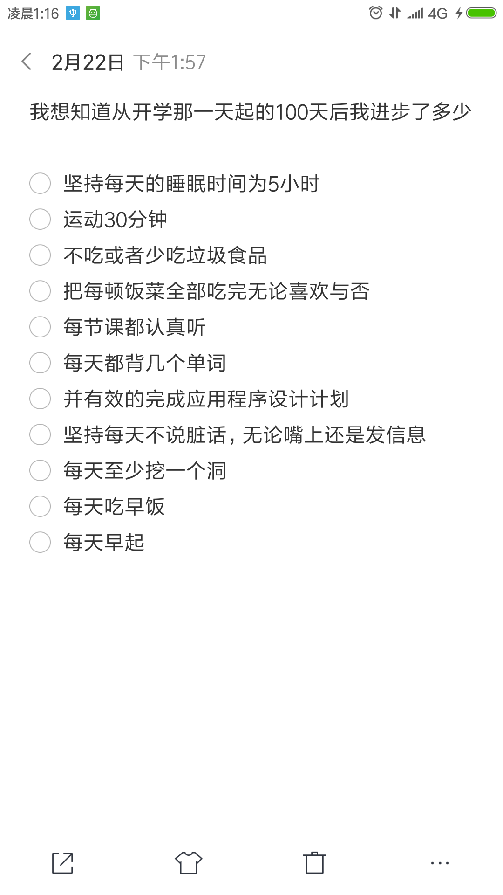

# 100天计划

自己给自己定制了100天计划，想看看自己在这100天里，进步了多少。

#### 简单总结下吧：

- 国赛得了全国三等奖，没办法的事实，我也想进清华打总决赛，但是目前学校没那个能力。
- 学了MVC架构，写了简单的web软件。
- 然后搭建了XSS平台
- 自己对不了解的领域也做了了解。
- 培养了一些有潜力的学弟。
- 学了挖洞
- 挖了几个高危
- 挣了点闲钱
- 换了全固态，加了内存条，相当于硬件设施比较良好。
- 做题有了自己的思路，能够独立完成。
- 开发有待提高，毕竟开发是基础
- 日了一些站，都是小站，或者是黄站。
- 学了点docker，比以前认识了更多，发现docker是个好东西
- 追完了《钢之炼金术师》，《我的超人学院》，《秦时明月之君临天下》等等，自己也记不清楚了。
- 算上即将参加的半决赛，自己也就参加了一次线下赛。

对学习来说，有了本质的改变，以前只认为会了这种操作就行，现在认为需要从本质的原理出发。

然后自己买的书是一本没看完，《疯狂Java》是本好书，希望暑假能够看完，并把《算法》也差不多学个一半。继续掌握好`PHP`，`JSP`，`Python`，这三门开发语言。能够开发出来工具和站点，已经框架。然后对于web安全也有了本质的认识，发现并不是那么简单，都是自己太自大了。

技术每天都在更新，希望自己每天也能够更新。

然后，自己2月22号，定制的计划，完成的没几个，但还是学了很多。

最后一首[《let it out》]( http://music.163.com/song/571330/?userid=354428122)

