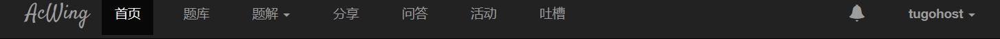

# 打算做什么毕设呢？

我想做一个ACM+CTF+直播教学的平台。

思路的开始是看[acwing平台](https://www.acwing.com/)的思路，感觉挺不错的如果加上CTF平台就是我想做的那种了。寓教于乐，什么活动啊，间隔性的直播讲题啊，我觉得都挺不错的。

看首页

有首页、题库、题解、分享、问答、活动、吐槽、通知、用户。

# 使用的技术栈

前端：vue

后端：Spring cloud

中间层：docker、MySQL、redis、rabbitMQ

主要功能分为五块：直播、OJ、CTF、用户管理、博客、题解。

 

# 直播功能

打算使用Red5来实现直播的功能，但是Red5使用的流协议比较老旧（flash），chrome会对其禁止。

打算使用七牛云直播SDK。

# OJ

看到网上大多是VUE+JAVASCRIPT，但是都不怎么会，VUE可以尝试一下，打算使用java技术栈进行改造重写，然后使用Spring Cloud来进行，可能微服务使用的方案不是sc的，因为直播那块还没解决好，red5太老了，chrome不支持flash。

# CTF

这一块再细分：

PWN + WEB + 密码题 + 杂项

pwn、杂项和密码学，使用存储来进行，如果在比赛的情况下，使用redis来判断flag正确。

web就比较复杂，但是我想做一个docker类的自动化搭建的功能。就是你创建一个题目，可以自动搭建docker环境。

# 用户管理

没啥好说的，就是用户登录登出，设置权限，个人中心什么的。

# 博客题解

类似于发表博客和题解，可以评论，👎和👍。

