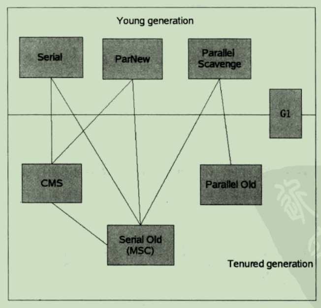
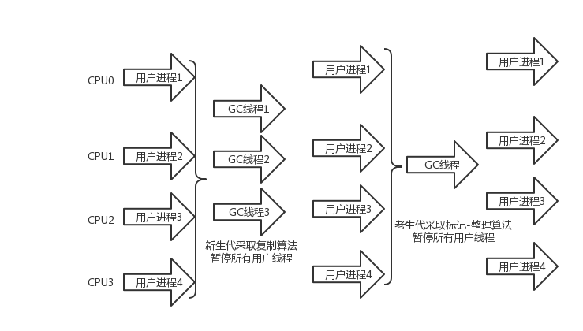

# 自动内存管理机制

## Java内存区域与内存溢出异常

Java和C++之间有一堵由内存动态分配和垃圾手机技术所围成的高墙，墙外面的人想进去，墙里面的人却想出来。

### 概述

对于从事C和C++程序开发的开发人员来说，在内存管理领域，他们即是拥有最高权力的皇帝，又是从事最基础工作的劳动人民——既有用每一个对象的“所有权”，又担负着每个对象生命开始到终结的维护责任。

对Java程序员来说，在虚拟机的自动内存管理机制的帮助下，不再需要为每一个new操作去写配对的delete/free代码，而且不容易出现内存泄漏和内存溢出问题，看起来由虚拟机管理内存一切都很美好。不过，也正是因为Java程序员把内存控制的权利交给了Java虚拟机，一旦出现内存泄漏和溢出方面的问题，如果不了解迅即是怎样使用内存的，那排查错误将会称为一项异常艰难的工作。

### 运行时数据区域

Java虚拟机在执行Java程序的过程中会把它所管理的内存划分成为若干个不同的数据区域。根据《Java虚拟机规范（第2版）》的规定，Java虚拟机所管理的内存将会包括以下几个运行时数据区域。


#### 程序计数器

程序计数器（Program Counter Register）是一块较小的内存空间，它的作用可以看做是当前线程所执行的字节码的行号指示器。在虚拟机的概念模型里，字节码解释器工作时就是通过改变这个计数器的值来选区下一条需要执行的字节码指令，分支、循环、跳转、异常处理、线程恢复等基础功能都需要依赖这个计数器来完成。

由于Java虚拟机的多线程是通过线程轮流切换并分配处理器执行时间的方式来实现的，在任何一个确定的时刻，一个处理器（对于多核处理器来说是一个内核）只会执行一条线程中的指令。因此，为了线程切换后能恢复到正确的执行位置，每条线程都需要有一个独立的程序计数器，各条线程之间的计数器互不影响，独立存储，我们称这类内存区域为“**线程私有**”的内存。

如果线程正在执行的是一个Java方法，这个计数器记录的是正在执行的虚拟机字节码指令的地址；如果正在执行的是[Natvie方法](https://blog.csdn.net/wike163/article/details/6635321)，这个计数器则为空（Undefined）。此内存区域是唯一一个在Java虚拟机规范中没有规定任何OutOfMemoryError情况的区域。

#### Java虚拟机栈

与程序计数器一样，Java虚拟机栈（Java Virtual Machine Stacks）也是线程私有的，它的生命周期与线程相同。虚拟机栈描述的是Java方法执行的内存模型：每个方法被执行的时候都会同时创建一个栈帧（Stack Frame）（栈帧是方法运行期的基础数据结构）用于存储局部变量表、操作栈、动态链接、方法出口等信息。每一个方法被调用直至执行完成的过程，就对应着一个栈帧在虚拟机栈中从入栈到出栈的过程。

局部变量表存放了编译期可知的各种基本数据类型（boolean、byte、char、short、int、float、long、double）、对象引用（reference类型，它不等同于对象本身，根据不同的虚拟机实现，它可能是一个指向对象起始地址的引用指针，也可能指向一个代表对象的句柄或者其他的与此对象相关的位置）和returnAddress类型（指向了一条字节码指令的地址）。其中64位长度的long和double类型的数据会占用2个局部变量空间（Slot），其余的数据类型只占用1个。

局部变量表所需的内存空间在编译期间完成分配，当进入一个方法时，这个方法需要在帧中分配多大的局部变量空间是完全确定的，在方法运行期间不会改变局部变量表的大小。

在Java虚拟机规范中，对这个区域规定了两种异常状况：

1. 如果线程请求的栈深度大于虚拟机所允许的深度，将抛出StackOverflowError异常；
2. 如果虚拟机栈可以动态扩展（当前大部分的Java虚拟机都可动态扩展，只不过Java虚拟机规范中允许固定长度的虚拟机栈），当扩展时无法申请到足够的内存时会抛出OutOfMemoryError异常。

#### 本地方法栈

本地方法栈（Natvive Method Stacks）与虚拟机栈所发挥的作用是非常相似的，其区别不过是虚拟机栈为虚拟机执行Java方法（也就是字节码）服务，而本地方法栈则是为虚拟机使用到的Native方法服务。

#### Java堆

对于大多数应用来说，Java堆（Java Heap）是Java虚拟机所管理的内存中最大的一块。Java堆是被所有线程共享的一块内存区域，在虚拟机启动时创建。此内存区域的唯一目的就是存放对象实例，几乎所有对象实例都在这里分配内存。这一点在Java虚拟机规范中的描述是：所有的对象实例以及数组都要在堆上分配，但是随着JIT编译器的发展与逃逸分析技术的逐渐成熟，栈上分配、标量替换优化技术将会导致一些微妙的变化发生，所有的对象都分配在堆上也渐渐变得不是那么“绝对”了。

Java堆是垃圾收集器管理的主要区域，因此很多时候也被称为“GC堆”（Garbage Collected Heap）。如果从内存回收的角度看，由于现在收集器基本都是采用的分代收集算法，所以Java堆中还可以细分为：新生代和老年代；如果从内存分配的角度看，线程共享的Java堆中可能划分出多个线程私有的分配缓冲区（Thread Local Allocation Buffer，TLAB）。不过，无论如何划分，都与存放内容无关，无论那个区域，存储的都仍然是对象实例，进一步划分的目的是为了更好地回收内存，或者更快的分配内存。

根据Java虚拟机规范的规定，Java堆可以处于物理上不连续地内存空间中，只要逻辑上是连续地的即可，就像我们的磁盘空间一样。

#### 方法区

方法区（Method Area）与Java堆一样，是各个线程共享的内存区域，它用于存储已被虚拟机加载的类信息、常量、静态变量、即时编译器编译后的代码等数据。虽然Java虚拟机规范把方法区描述为堆的一个逻辑部分，但是它却有一个别名叫做Non-Heap（非堆），目的应该是与Java堆区分开来。

Java虚拟机规范对这个区域的限制非常宽松，除了和Java堆一样不需要连续的内存和可以选择固定大小或者可扩展外，还可以选择不实现垃圾收集。这个区域的内存回收目标主要是针对常量池的回收和对类型的卸载，一般来说这个区域的回收“成绩”比较难以令人满意，尤其是类型的卸载，条件相当苛刻，但是这部分区域的回收确实是有必要的。

根据Java虚拟机规范的规定，当方法区无法满足内存分配需求时，将抛出OutOfMemoryError异常。

#### 运行时常量池

运行时常量池（Runtime Constant Pool）是方法区的一部分。Class文件中除了有类的版本、字段、方法、接口等描述等信息外，还有一项信息是常量池（Constant Pool Table），用于存放编译期生成的各种字面量和符号引用，这部分内容将在类加载后存放到方法区的运行时常量池中。

一般来说，除了保存Class文件中描述的符号引用外，还会把翻译出来的直接引用也存储在运行时常量池中。

运行时常量池相对于Class文件常量池的另外一个重要特征时具备动态性，Java语言并不要求常量一定只能在编译器产生，也就是并非预置入Class文件中常量池的内容才能进入方法区运行时常量池，运行期间也可能将新的常量放入池中，这种特性被开发人员利用的比较多的便是String类的intern()方法。

当常量池无法在申请到内存时会抛出OutOfMemoryError异常。

#### 直接内存

直接内存（Direct Memory）并不是虚拟机运行时数据区的一部分，也不是虚拟机规范中定义的内存区域，但是这部分内存也被频繁地使用，而且也可能导致OutOfMemoryError异常出现。

在JDK1.4中新加入了NIO（New Input/Oupt）类，引入了一种基于通道（Channel）与缓冲区（Buffer）的I/O方式，它可以使用Native函数库直接分配堆外内存，然后通过一个存储在Java堆里面的DirectByteBuffer对象作为这块内存的引用进行操作。这样能在一些场景中显著提高性能，因为避免了在Java堆和Native堆中来回复制数据。

显然，本地直接内存的分配不会受到Java堆大小的限制，但是，既然是内存，则肯定还是会受到本机总内存（包括RAM及SWAP区或者分页文件）的大小及处理器寻址空间的限制。服务器管理员配置虚拟机参数时，一般会根据实际内存设置-Xmx等参数信息，但经常会忽略掉直接内存，使得各个内存区域的总和大于物理内存限制（包括物理上的和操作系统级的限制），从而导致动态扩展时出现OutOfMemoryError异常。

### 对象访问

在Java语言中，对象访问是如何进行的？

对象访问在Java语言中无处不在，是最普遍的程序行为，但即使是最简单的访问，也会却涉及Java栈、Java堆、方法区这三个最重要内存区域之间的关联关系，如下面的这句代码：

> Object obj = new Object();l

假设这句代码出现在方法体中，那”Object obj“这部分的语义将会反映到Java栈的本地变量表中，作为一个reference类型数据出现。而”new Object()“这部分的语义将会反映到Java堆中，形成一块存储了Object类型所有实例数据值（Instance Date，对象中各个实例字段的数据）的结构化内存，根据具体类型以及虚拟机实现的对象内存布局（Object Memory Layout）的不同，这块内存的长度是不固定的。另外，在Java堆中还必须包含能够找到此对象类型数据（如对象类型、父类、实现的接口、方法等）的地址信息，这些类型数据则存储在方法区中。

由于reference类型在Java虚拟机规范里面只规定了一个指向对象的引用，并没有定义这个引用应该通过那种方式去定位，以及访问到Java堆中的对象的具体位置，因此不同虚拟机实现的对象访问方式会有所不同，主流的访问方式有两种：使用句柄和直接指针。

- 如果使用句柄访问方式，Java堆中将会划分出一块内存来作为句柄池，reference中存储的就是对象的句柄地址，而句柄中包含了对象实例数据和类型数据各自的具体地址信息，如图所示


- 如果使用直接指针访问方式，Java堆对象的布局中就必须考虑如何放置访问类型数据的相关信息，reference中直接存储的就是对象地址，如图所示


使用句柄访问方式的最大好处就是reference中存储的是稳定的句柄地址，在对象被移动（垃圾收集时移动对象是非常普遍的行为）时只会改变句柄中的实例数据指针，而reference本身不需要被修改。

使用直接指针访问方式的最大好处就是速度更快，它节省了一次指针定位的时间开销，由于对象的访问在Java中非常频繁，因此这类开销积少成多也是一些非常可观的执行成本。


# 垃圾收集器与内存分配策略

## 概述

说起垃圾收集（Garbage Collection，GC），大部分人都把这项技术当做Java语言的伴生产物。事实上，GC的历史远远比Java久远，1960年诞生于MIT的Lisp是第一门真正使用内存动态分配和垃圾收集技术的语言。当Lisp还在胚胎时期时，人们就在思考GC需要完成的三件事：

- 那些内存需要回收？
- 什么时候回收？
- 如何回收？

经过半个世纪的发展，内存的动态分配与内存回收技术已经相当成熟，一切看起来都进入了“自动化”时代，那为什么我们还要去了解GC和内存分配呢？答案很简单：当需要排查各种内存溢出、内存泄漏问题时，当垃圾收集成为系统达到更高并发量的瓶颈时，我们就需要堆这些”自动化“的技术实施必要的监控和调节。

在[自动内存管理机制]()中介绍了内存运行时区域的各个部分，其中程序计数器、虚拟机栈、本地方法栈三个区域随线程而生，岁线程而灭：栈中的栈帧随着方法的进入和退出有条不紊地执行着出栈和入栈操作。每一个栈帧中分配多少内存基本上是在类结构确定下来时就已知地（尽管在运行期会由JIT编译器进行一些优化，但在本章基于概念模型地讨论中，大体上可以认为是编译器可知地），因此这几个区域地内存分配和回收都具备确定性，在这几个区域内不需要过多考虑回收的问题，因为方法结束或线程结束时，内存自然就跟随着回收了。而Java堆和方法区则不一样，一个接口中的多个实现类需要的内存可能不一样，一个方法中多个分支需要的内存也可能不一样，我们只有在程序处于运行期间时才能指定会创建那些对象，这部分内存的分配和回收时动态地，垃圾收集器所关注的是这部分内存。

## 对象已死？

堆中几乎存放着Java世界中所有的对象实例，垃圾收集器在对堆进行回收前，第一件事情就是要确定这些对象有哪些还”存活“着，那些已经”死去“（即不可能再被任何途径使用的对象）。

### 引用计数算法

很多教科书判断对象是否存活的算法是这样的：给对象中添加一个引用计数器，每当有一个地方引用它时，计数器值就加1；当引用失效时，计数器值就减1；任何时刻计数器都为0的对象就是不可能再被使用的。

但是，Java语言中没有选用引用计数器来管理内存，其中最主要的原因是它很难解决对象之间的相互循环引用的问题。

举个栗子：

```java
public class ReferenceCountingGC{
	public Object instance = null;
    private static final int _1MB = 1024 * 1024;
    private byte[] bigSize = new byte[2 * _1MB];
    public static void testGC(){
        ReferenceCountingGC objA = new ReferenceCountingGC();
        RferenceCountingGC objB = new ReferenceCountingGC();
        objA.instance = objB;
        ObjB.instance = objA;
        objA = null;
        objB = null;
        System.gc();
    }
}
```

在`testGC()`中：对象objA和objB都有字段instance，赋值另objA.instance = objB及objB.instance = objA，除此之外，这两个对象再无任何引用，实际上这两个对象已经不可能再被访问，但是它们因为相互引用着对方，导致它们的引用计数都不为0，于是引用计数器算法无法通知GC收集回收它们。

### 根搜索算法

在主流的商用程序语言中（Java和C#，甚至包括前面提到的古老的Lisp），都是使用根搜索算法（GC Roots Tracing）判定对象是否存活的。这个算法的基本思路就是通过一系列的名为“GC Roots”的对象作为起始点，从这些节点开始向下搜索，搜索所走过的路径称为引用链（Reference Chain），当一个对象到GC Roots没有任何引用链相连（用图论的话来说就是从GC Roots到这个对象不可达）时，则证明此对象是不可用的。

如图所示，对象object 5、object 6、object 7虽然互相有关联，但是它们到GC Roots是不可达的，所以它们将会被判定为是否可回收的对象。


在Java语言里，可作为GC Roots的对象包括下面几种：

- 虚拟机栈（栈帧中的本地变量表）中的引用的对象。
- 方法区中的类静态属性引用的对象。
- 方法区中的常量引用的对象。
- 本地方法栈中JNI（即一般说的Native方法）的引用的对象。

### 再谈引用

在JDK1.2之前，Java中的引用的定义很传统：**如果reference类型的数据中存储的数值代表的是另外一块内存的起始地址，就称这块内存代表着一个引用。**

一个对象在这种定义下只有被引用或者没有被引用两种状态，对于如何描述一些“食之无味，弃之可惜”的对象就显得无能为力。我们希望能描述这样一类对象：**当内存空间还没足够时，则能保留在内存之中；如果内存在进行垃圾收集后还是非常紧张，则可以抛弃这些对象。**很多系统的缓存功能都符合这样的应用场景。

在JDK1.2之后，Java对引用的概念进行了扩充，将引用分为强引用（Strong Reference）、软引用（Soft Reference）、弱引用（Weak Reference）、虚引用（Phantom Refence）四种，这四种引用强度依次逐渐减弱。

- 弱引用就是指程序代码之中普遍存在的，类似“Object obj = new Object()”这类的引用，只要强引用还存在，垃圾收集器永远不会回收掉被引用的对象。
- 软引用用来描述一些还有用，但并非必须的对象。对于软引用关联着的对象，在系统将要发生内存溢出异常之前，将会把这些对象列进回收范围之中并进行第二次回收。如果这次回收还是没有足够的内存，才会抛出内存溢出异常。在JDK1.2之后，提供了SoftReference类来实现软引用。
- 弱引用也是用来描述非必须对象的，但是它的强度比软引用更弱一些，被弱引用关联的对象只能生存到下一次垃圾收集器发生之前。当垃圾收集器工作时，无论当前内存是否足够，都会回收掉只被弱引用关联的对象。在JDK1.2之后，提供了WeakReference类来实现弱引用。
- 虚引用也成为幽灵引用或者幻影引用，它是最弱的一种引用关系。一个对象是否有虚引用的存在，完全不会对其生存时间构成影响，也无法通过虚引用来取得一个对象实例。

### 生成还是死亡？

在根搜索算法中不可达的对象，也并非是“非死不可”的，这时候它们暂时处于“缓刑”阶段，要真正宣告一个对象死亡，至少要经历两次标记过程：如果对象在进行根搜索后发现没有与GC Roots相链接的引用链，那它将会被第一次标记并且进行一次筛选，筛选的条件是此对象是否有必要执行finalize()方法。当对象没有覆盖finalize()方法，或者finalize()方法已经被虚拟机调用过，虚拟机将这两种情况都视为“没有必要执行”。

如果这对象被判定为有必要执行finalize()方法，那么这个对象将会被放置在一个名为F-Queue的队列之中，并在稍后由一条由虚拟机自动建立的、低优先级的Finalizer线程去执行。这里所谓的"执行"是指虚拟机会触发这个方法，但并不承诺会等待它运行结束。这样做的原因是，如果一个对象在finalize()方法中执行缓慢，或者发生了死循环（更极端的情况），将很可能会导致F-Queue的队列中的其他对象永久处于等待状态，甚至导致整个内存回收系统崩溃。finalize()方法是对象逃脱死亡命运的最后一次机会，稍后GC将对F-Queue中的对象进行第二次小规模的标记，如果对象要在finalize()中成功拯救自己——只要重新与引用链上的任何一个对象建立关联即可，譬如把自己（this关键字）赋值给某个类变量或对象的成员变量，那在第二次标记时它将被移除出”即将回收的“集合；如果对象这个时候还没有逃逸，那它就真的离死不远了。

```java
public class FinalizeEscapeGC{
    public static FinalizeEscapeGC SAVE_HOOK = null;
    public void isAlive(){
        System.out.println("yes, i am still alive :)");
    }
    
    @Override
    protected void finalize() throws Throwable{
        super.finalize();
        System.out.println("finalize method executed!");
        FinalizeEscapeGC.SAVE_HOOK = this;
    }
    
    public static void main(String[] args) throws Throwable{
        SAVE_HOOK = new FinalizeEscapeGC();
        
        //对象第一次成功拯救了自己
        SAVE_HOOK = null;
        System.gc();
        //因为Finalizer方法优先级很低，暂定0.5秒，以等待它
        Thread.sleep(500);
        if(SAVE_HOOK != null){
            SAVE_HOOK.isAlive();
        }else{
            System.out.println("no, i am dead :(")；
        }
    }
}
```

从上面代码中我们可以看到一个对象的finalize()被执行，但是它仍然可以存活。


从代码运行结果可以看到，SAVE_HOOK对象的finalize()方法确实被GC收集器触发过，并且在被收集前成功逃脱了。

另外一个值得注意的地方就是，代码中有两段完全一样的代码片段，执行结果却是一次逃脱成功，一次失败，这是因为**任何一个对象的finalize()方法都只会被系统自动调用一次，如果对象面临下一次回收，它的finalize()方法不会被再次执行**，因此第二段代码的自救行动失败了。

### 回收方法区

很多人认为方法区（或者HotSpot虚拟机中的永久代）是没有垃圾收集的，Java虚拟机规范中确实说过可以不要求虚拟机在方法区实现垃圾收集，而且在方法区进行垃圾收集的”性价比“一般比较低：在堆中，尤其是在新生代中，常规应用进行一次垃圾收集一般可以回收70%~95%的空间，而永久代的垃圾收集效率远低于此。

永久代的垃圾收集主要回收两部分内容：废弃常量和无用的类。回收废弃常量与回收Java堆中的对象非常类似。以常量池中的字面量的回收为例，假如一个字符串”abc“已经进入了常量池，但是当前系统没有任何一个String对象是叫做”abc”的，换句话说是没有任何String对象引用常量池中的“abc"常量，也没有其他地方引用了这个字面量，如果在这个时候发生内存回收，而且必要的话，这个”abc“常量就会被系统”请“出常量池。常量池中的其他类（接口）、方法、字段的符号引用也与此类似。

判定一个常量是否是”废弃常量“比较简单，而要判定一个类是否是”无用的类“的条件则相对苛刻许多。类需要同时满足下面3个条件才能算是”无用的类“：

- 该类所有的实例都已经被回收，也就是Java堆中不存在该类的任何实例。
- 加载该类的ClassLoader已经被回收。
- 该类对应的java.lang.Class对象没有在任何地方被引用，无法在任何地方通过反射访问该类的方法。

虚拟机可以对满足上述3个条件的无用类进行回收，这里说的仅仅是”可以“，而不是和对象一样，不使用了就必然会回收。是否对类进行回收，HotSpot虚拟机提供了-Xnoclassgc参数进行控制，还可以使用-verbose:class及-XX:+TraceClassLoading、-XX:+TraceClassUnLoading查看类的加载和卸载信息。-verbose:class和-XX:+TraceClassLoading可以在Product版的虚拟机中使用，但是-XX:+TraceClassUnLoading参数需要fastdebug版的虚拟机支持。

在大量使用反射、动态代理、CGLib等bytecode框架的场景，以及动态生成JSP和OSGi这类频繁自定义ClassLoader的场景都需要虚拟机具备类卸载的功能，以保证永久代不会溢出。

## 垃圾收集算法

由于垃圾收集算法的实现涉及大量的程序细节，而且各个平台的虚拟机操作内存的方法又各不相同，因此不打算过多地讨论算法地实现，只是介绍几种算法地思想及其发展过程。

### 标记-清除算法

最基础地收集算法是“标记-清除”（Mark-Sweep）算法，算法分为”标记“和”清除“两个阶段：首先标记出所有需要回收的对象，在标记完成后统一回收掉所有被标记地对象，它地标记过程其实在前一节讲述对象标记判定时已经基本介绍过了。它地主要缺点有两个：一个是效率问题，标记和清除过程地效率都不高；另外一个是空间问题，标记清除之后会产生大量不连续地内存碎片，空间碎片太多可能会导致，当前程序在以后地运行过程中需要分配较大对象时无法找到足够地连续内存而不得不提前触发另一次垃圾收集动作。标记-清除算法的执行过程如图所示。


### 复制算法

为了解决效率问题，一种称为”复制“（Copying）的收集算法出现了，它将可用内存按容量划分为大小相等的两块，每次只使用其中的一块。当这一块的内存用完了，就将还存活着的对象复制到另外一块上面，然后再把已使用过的内存空间一次清理掉。这样使得每次都是对其中的一块进行内存回收，内存分配时也就不用考虑内存碎片等复杂情况，只要移动堆顶指针，按顺序分配内存即可，实现简单，运行高效。只是这种算法的代价是将内存缩小为原来的一半，未免太高了一点。

复制算法的执行过程如图所示：


现在的商业虚拟机都采用这种收集算法来回收新生代，IBM的专门研究表明，新生代中的对象98%是朝生夕死的，所以并不需要按照1：1的比例来划分内存空间，而是将内存分为一块较大的Eden空间和两块较小的Survivor空间，每次使用Eden和其中的一块Survivor。当回收时，将Eden和Survivor中还存活着的对象一次性拷贝到另外一块Survivor空间上，最后清理掉Eden和刚才用过的Survivor的空间。 

内存的分配担保就好比我们去银行借款，如果我们信誉很好，在98%的情况下都能按时偿还，于是银行可能会默认我们下一次也能按时按量地偿还贷款，只需要有一个担保人能保证如果我不能还款时，可以从他地账户扣钱，那银行就认为没有风险了。内存的分配担保也一样，入宫另外一块Survivor空间没有足够的空间存放上一次新生代收集下来的存活对象，这些对象将直接通过分配担保机制进入老年代。

### 标记-整理算法

复制收集算法在对象存活率较高时就要执行较多的复制操作，效率将会变低。更关键的是，如果不想浪费50%的空间，就需要有额外的空间进行分配担保，以应对被使用的内存中所有对象都100%存活的极端情况，所以在老年代一般不能直接选用这种算法。

根据这一特点，有人提出了另外一种“标记-整理”（Mark-Compact）算法，标记过程仍然与“标记-清除”算法一样，但后续步骤不是直接对可回收对象进行清理，而是让所有存活的对象都向一端移动，然后直接清理掉边界以外的内存，“标记-整理”算法的示意图如图所示：


### 分代收集算法

当前商业虚拟机的垃圾收集都采用“分代收集”（Generational Colletion）算法，这种算法并没有什么新的思想，只是根据对象的存活周期的不同将内存划分为几块。一般是把Java堆分为新生代和老生代，这样就可以根据各个年代的特点采用最适当的收集算法。在新生代中，每次垃圾收集时都发现有大批对象死去，只有少量存活，那就选用复制算法，只需要付出少量存活对象的复制成本就可以完成收集。而老年代中因为对象存活率高、没有额外空间对它进行分配担保，就必须使用“标记-清理”或“标记-整理”算法来进行回收。

## 垃圾收集器

如果说收集算法是内存回收的方法论，垃圾收集器就是内存回收的具体实现。Java虚拟机规范中对垃圾收集器应该如何实现并没有任何规定，因此不同的厂商、不同版本的虚拟机所提供的垃圾收集器都可能会有很大的差别，并且一般都会提供参数供用户根据自己的应用特点和要求组合出各个年代所使用的收集器。这里讨论的收集器基于Sun HotSpot虚拟机1.6版Update 22，这个虚拟机包含的所有收集器如图所示：



图中展示了7种作用于不同分代的收集器（包括JDK 1.6_Update14后引入的Early Access版G1收集器），如果两个收集器之间存在连线，就说明它们可以搭配使用。

### Serial收集器

Serial收集器是最基本、历史最悠久的收集器，曾经（在JDK1.3.1之前）是虚拟机新生代收集的唯一选择。大家看名字就知道，这个收集器是单线程的收集器，但它的“单线程”的意义并不仅仅是说明它只会使用一个CPU或一条收集线程去完成垃圾收集工作，更重要的是在它进行垃圾收集时，必须暂停其他所有的工作线程（Sun将这件事情称之为“Stop The World”），直到它收集结束。"Stop The World"这个名字也许听起来很酷，但这项工作实际上是由虚拟机在后台自动发起和自动完成的，在用户不可见的情况下把用户的正常工作的线程全部停掉，这对很多应用来说都是难以接受的。你想，要是你的电脑每运行一个小时就会暂停响应5分钟，你会有什么样的心情？下图示意了Serial/Serial Old收集器的运行过程。	


写道这里，笔者似乎已经把Serial收集器描述成一个老而无用，食之无味弃之可惜的鸡肋了，但实际上到现在为止，它依然是虚拟机运行在Client模式下的默认新生代收集器。它也有着优于其他收集器的地方：简单而高效（与其他收集器的单线程比），对于限定单个CPU的环境来收，Serial收集器由于没有线程交互的开销，专心做垃圾收集自然可以获得最高的单线程收集效率。

### ParNew收集器

ParNew收集器其实就是Serial收集器的多线程版本，除了使用多线程进行垃圾收集之外，其余行为包括Serial收集器可用的所有控制参数（例如：-XX:SurvivorRatio、-XX:PretenureSizeThreshold、-XX:HandlePromotionFailure等）、收集算法、Stop The World、对象分配规则、回收策略等都与Serial收集器完全一样，实际上这两种收集器也共用了相当多的代码。ParNewS收集器的工作过程如图：



ParNew收集器除了多线程收集之外，其他与Serial收集器相比并没有太多创新之处，但它却是许多运行在Server模式下的虚拟机中首选的新生代收集器，其中有一个与性能无关但很重要的原因是，除了Serial收集器外，目前只有它能与CMS收集器配合工作。

不幸的是，它作为老年代的收集器，却无法与JDK1.4.0种已经存在新生代收集器Parallel Scavenge配合工作，所以在JDK1.5种使用CMS来收集老年代的时候，新生代只能选择ParNew或Serial收集器中的一个。

ParNew收集器在单CPU的环境中绝对不会有Serial收集器更好的效果，甚至由于存在线程交互的开销，该收集器在通过超线程技术实现的两个CPU的环境中都不能百分之百地保证能超越Serial收集器。

---

**注意** 从ParNew收集器开始，后面还将会接触到几款并发和并行地收集器。有必要先解释两个名词：并发和并行。

- 并行（Parallel）：指多条垃圾收集线程并行工作，但此时用户线程仍然处于等待状态。
- 并发（Concurrent）：指用户线程与垃圾收集线程同时执行（但不一定是并行的，可能会交替执行），用户程序继续运行，而垃圾收集程序运行于另一个CPU上。

---

### Parallel Scavenge收集器

Parallel Scavenge收集器也是一个新生代收集器，它也是使用复制算法的收集器，又是并行的多线程收集器……看上去和ParNew都一样，那它有什么特别之处呢？

Parallel Scavenge收集器的特点是它关注点与其他收集器不同，CMS等收集器的关注点尽可能地缩短垃圾收集时用户线程地停顿时间，而Parallel Scavenge收集器地目标则是达到一个可控制的 吞吐量（Throughput）。所谓吞吐量就是CPU用于运行用户代码的时间与CPU总消耗时间的比值。

停顿时间越短就越适合需要与用户交互的程序，良好的响应速度能提升用户的体验；而高吞吐量则可以最高相率地利用CPU时间，尽快地完成程序的运算任务，主要适合在后台运算而不需要太多交互的任务。

Parallel Scavenge收集器提供了两个参数用于精确控制吞吐量，分别是控制最大垃圾收集停顿时间的-XX:MaxGCPauseMillis参数及直接设置吞吐量大小的-XX:GCTimeRation参数。

MaxGCPauseMillis参数允许的值是一个大于0的毫秒数，收集器将尽力保证内存回收花费的时间不超过设定值。

GCTimeRation参数的值应当是一个大于0小于100的证书，也就是垃圾收集时间占总时间的比率，相当于是吞吐量的倒数。

由于与吞吐量关系密切，Parallel Scavenge收集器也经常被称为“吞吐量优先”收集器。除了上述两个参数之外，Parallel Scavenge收集器还有一个参数-XX:+UseAdaptiveSizePolicy值得关注。这是一个开关参数，当这个参数打开之后，就不需要手工指定新生代的大小（-Xmn）、Eden与Survivor区的比例（-XX:SurvivorRatio）、晋升老年代对像年龄（-XX:PretenureSizeThreshold）等细节参数了，虚拟机会根据当前系统的运行情况收集性能监控信息，动态调整这些参数以提供最适合的停顿时间或最大吞吐量，这种调节方式称为GC自适应的调节策略（GC Ergonomics）。如果读者对于收集器运作原理不太了解，手工优化存在困难的时候，使用Parallel Scavenge收集器配合自适应调节策略，把内存管理的调优任务交给虚拟机去完成将是一个很不错的选择。只需要把基本的内存数据设置好（如-Xmx设置最大堆），然后使用MaxGCPauseMillis参数（更关注最大停顿时间）或GCTimeRatio参数（更关注吞吐量）给虚拟机设立一个优化目标，那具体细节参数的调节工作就由虚拟机完成了。自适应调节策略也是Parallel Scavenge收集器与ParNew收集器的一个重要区别。

### Serial Old收集器

Serial Old收集器是Serial收集器的老年代版本，它同样是一个单线程收集器，使用“标记-整理”算法。这个收集器的主要意义也是被Client模式下的虚拟机使用。如果在Server模式下，它主要还有两大用途：一个是在JDK1.5及之前的版本中与Parallel Scavenge收集器搭配使用，另外一个就是作为CMS收集器的后被预案，在并发收集发生Concurrent Mode Failure的时候使用。

### Paralel Old收集器

Paralel Old是Paralel Scavenge收集器的老年代版本，使用多线程和“标记-整理”算法。这个收集器是在JDK1.6中才开始提供的，在此之前，新生代的Paralel Scavenge收集器一直处于比较尴尬的状态。原因是，如果新生代选择了Paralel Scavenge收集器，老年代除了Serial Old（PS MarkSweep）收集器外别无选择（还记得上面说过Parallel Scavenge收集器无法与CMS收集器配合工作么？）。由于单线程的老年代Serial Old收集器在服务端应用性能上的“拖累”，即便使用了Parallel Scavenge收集器也未必能在整体应用上获得吞吐量最大化的效果，又因为老年代收集中无法充分利用服务器多CPU的处理能力，在老年代很大而且硬件比较高级的环境中，这种组合的吞吐量甚至还不一定有ParNew加CMS的组合“给力”。

直到Parallel Old收集器出现后，“吞吐量优先”收集器终于有了比较名副其实的应用组合，在注重吞吐量及CPU资源敏感的场合，都可以优先考虑Parallel Scavenge加Parallel Old收集器。

### CMS收集器

CMS（Concurrent Mark Sweep）收集器是一种以获取最短回收停顿时间为目标的收集器。目前最大一部分的Java应用都集中在互联网站或B/S系统的服务端上，这类应用尤其重视服务的响应速度，希望系统停顿时间最短，以给用户带来较好的体验。

它的运作过程相当于前面几种收集器来说更复杂一些，整个过程分为4个步骤，包括：

- 初始化标记（CMS initial mark）
- 并发标记（CMS concurrent mark）
- 重新标记（CMS remark）
- 并发清除（CMS concurrent sweep）

其中初始标记、重新标记这两个步骤仍然需要“Stop The World”。初始标记仅仅只是标记以下GC Roots能直接关联到的对象，速度很快，并发标记阶段就是进行GC Roots Tracing的过程，而重新标记阶段则是为了修正并发标记期间，因用户程序继续运作而导致标记产生变动的那一部分对象的标记记录，这个阶段的停顿时间一般会比初始化标记阶段稍长一些，但远比并发标记的时间短。

由于整个过程中耗时最长的并发标记和并发清除过程中，收集器线程都可以与用户线程一起工作，所以总体上来说，CMS收集器的内存回收过程与用户线程一起并发地执行地。通过下图可以比较清除地看到CMS收集器地运作步骤中并发和需要停顿地时间。


CMS是一款优秀地收集器，它地最主要优点在名字上已经体现出来了：并发收集、低停顿，Sun的一些官方文档里面也称之为并发低停顿收集器（Concurrent Low Pause Collector）。但是CMS还远达不到完美的程度，它有以下三个显著的缺点：

- CMS收集器对CPU资源非常敏感。
- CMS收集器无法处理浮动垃圾（Floating Garbage），
- 收集结束时会产生大量空间碎片

### G1收集器

G1（Garbage First）收集器是当前收集器技术发展的最前沿成果，在JDK1.6_Update14中提供了Early Access版本的G1收集器以供试用。这里只对G1收集器进行简单的介绍。

G1收集器是垃圾收集器理论进一步发展的产物，它与前面的CMS收集器相比有两个显著的改进：一是G1收集器是基于“标记-整理”算法实现的收集器，也就是说它不会产生空间碎片，这对于长时间运行的应用系统来说非常重要。二是它可以非常精确地控制停顿，即能让使用者明确指定在一个长度为M毫秒地时间片段内，消耗地垃圾收集上地时间不得超过N毫秒，这几乎已经是实时Java（RTSJ）地垃圾收集器地特征了。

G1收集器可以实现在基本不牺牲吞吐量地前提下完成低停顿的内存回收，这是由于它能够极力地避免全区域的垃圾收集，之前的收集器进行收集的范围都是整个新生代或老年代，而G1将整个Java堆（包括新生代、老年代）划分为多个大小固定的独立区域（Region），并且跟踪这些区域里面的垃圾堆积程度，在后台维护一个优先列表，每次根据允许的收集时间，优先回收垃圾最多的区域（这就是Garbage First名称的来由）。区域划分及优先级的区域回收，保证了G1收集器在有限时间内可以获得最高的收集效率。

### 垃圾收集器参数总结

## 内存分配与回收策略

Java技术体系中所提倡的自动内存管理最终可以归结为自动化地解决了两个问题：给对象分配内存以及回收分配给对象的内存。

对象的内存分配，往大方向上讲，就是在堆上分配（但也可能经过JIT编译后被拆散为标量类型并间接地在栈上分配），对象主要分配在新生代地Eden区上，如果启动了本地线程分配缓冲，将按线程优先在TLAB上分配。少数情况下也可能会直接分配在老年代中，分配地规则并不是百分百固定地，其细节取决于当前使用的是哪一种垃圾收集组合，还有虚拟机中与内存的参数的设置。

### 对象优先在EDen分配

大多数情况下，对象在新生代Eden区中分配。当Eden区没有足够的空间进行分配时，虚拟机将发起一次Minor GC。

虚拟机提供了-XX:+PrintGCDetails这个收集器日志参数，告诉虚拟机在发生垃圾收集行为时打印内存回收日志，并且在线程退出的时候输出当前内存各区域的分配情况。在实际应用中，内存回收日志一般是打印到这个文件后通过日志工具进行分析，不过本实验的日志并不多，直接阅读就能看得很清楚。

```java
private static final int _1MB = 1024 * 1024;
//VM参数:-verbose:gc -Xms20M -Xmx20M -Xmn10M -XX:SurvivorRatio=0
public static void testAllocation(){
    byte[] allocation1,allocation2,allocation3,allocation4;
    allocation1 = new byte[2 * _1MB];
    allocation2 = new byte[2 * _1MB];
    allocation3 = new byte[2 * _1MB];
    allocation4 = new byte[4 * _1MB];//出现一次Minor GC
}
```

运行结果：


testAllocation()方法中，尝试分配3个2MB大小和1个4MB大小的对象，在运行时通过-Xms20M、-Xmx20M和-Xmn10M这3个参数限制Java堆大小为20MB，且不可扩展，其中10MB分配给新生代，剩下的10MB分配给老年代。-XX:SurvivorRatio=8决定了新生代中Eden区与一个Survivor区的空间比例是8比1，从输出的结果也能清晰地看到”eden space 8192K、from space 1025K、to space 1024K“的信息，新生代总可用空间为9216KB（Eden区+1个Survivor区的总容量）。

执行testAllocation()中分配allocation4对象的语句时会发生一次Minor GC，这次GC的结果是新生代6651KB变为148KB，而总内存占用量则几乎没有减少（因为allocation1、2、3三个对象都是存活的，虚拟机几乎没有找到可回收的对象）。这次GC发生的原因 是给allocation4分配内存的时候，发现Eden已经被占用了6MB，剩余空间已不足以分配allocation4所需的4MB内存，因此发生Minor GC。GC期间虚拟机又发现已有的3个2MB大小的对象全部无法放入Survivor空间（Survivor空间只有1MB大小），所以只好通过分配担保机制提前转移到老年代去。

这次GC结束后，4MB的allocation4对象被顺利分配在Eden中。因此程序执行完的结果是Eden占用4MB（被allocation4占用），Survivor空闲，老年代被占用6MB（被allocation1、2、3占用），通过GC日志可以证实这一点。

---

**注意** 作者多次提到的Minor GC和Full GC有什么不一样吗？

- 新生代GC（Minor GC）：指发生在新生代的垃圾手机动作，因为Java对象大多都具备朝生夕灭的特性，所以Minor GC非常频繁，一般回收速度也比较快。
- 老年代GC（Major GC/Full GC）：指发生在老年代的GC，出现了Major GC，经常会伴随至少一次的Minor GC（但非绝对的，在ParallelScavenge收集器的收集策略里就有直接进行Major GC的策略选择过程）。Major GC的速度一般会比Minor GC慢10倍以上。

---

### 大对象直接进入老年代

所谓大对象就是指，需要大量连续内存空间的Java对象，最典型的大对象就是那种很长的字符串及数组（byte[]数组就是典型的大对象）。大对象对虚拟机的内存分配来说就是一个坏消息（替Java虚拟机抱怨一句，比遇到一个大对象更坏的消息就是遇到一群”朝生夕灭“的”短命大对象“，写程序的时候应当避免），经常出现大对象容易导致内存还有不少空间时就提前触发垃圾收集以获取足够的连续空间来”安置“它们。

虚拟机提供了一个-XX:PretenureSizeThreshold参数，令大于这个设置值的对象直接在老年代中分配。这样做的目的是避免在Eden区及两个Survivor区之间发生大量的内存拷贝。

```java
private static final int _1MB = 1024 * 1024;
/**
  * VM参数:-verbose:gc -Xms20M -Xmx20M -Xmn10M -XX:SurvivorRatio=8
  * -XX:PretenureSizeThreshold=3145728
*/
public static void testPretenureSizeThreshold(){
    byte[] allocation;
    allocation = new byte[4 * _1MB];//直接分配在老年代中
}
```

运行结果：


testPretenureSizeThreshold()方法后，我们看到Eden空间几乎没有被使用，而老年代10MB的空间被使用了40%，也就是4MB的allcoation对象直接就分配在老年代中，这是因为PretenureSizeThreshold被设置为3MB（就是3145728B，这个参数不能与-Xmx之类的参数一样直接写3MB），因此超过3MB的对象就会直接在老年代中进行分配。

---

**注意** PretenureSizeThreshold参数只对Serial和ParNew两款收集器有效，Parallel Scavenge收集器不认识这个参数，Parallel Scavenge收集器一般并不需要设置。如果遇到必须使用此参数的场合，可以考虑ParNew加CMS的收集器组合

---

### 长期存活的对象将进入老年代

虚拟机既然采用了分代收集的思想来管理内存，那内存回收时就必须能识别哪些对象应当放在新生代，那些对象应放在老年代中。为了做到这点，虚拟机给每个对象定义了一个对象年龄（Age）计数器。如果对象在Eden出生并经过第一次Minor GC后仍然存活，并且能被Survivor容纳的话，将被移动到Survivor空间中，并将对象年龄设为1.对象在Survivor区中每熬过一次Minor GC，年龄就增加1岁，当它的年龄增加到一定程度（默认为15岁）时，就会被晋升到老年代中。对象晋升老年代的年龄阈值，可以通过参数-XX：MaxTenuringThreshold来设置。


### 动态对象年龄判定

为了能更好地适应不同程序的内存状况，虚拟机并不总是要求对象的年龄必须到达MaxTenuringThreshold才能晋升老年代，如果在Survivor空间中相同年龄所有对象大小的总和大于Survivor空间的一半，年龄大于或等于该年龄的对象就可以直接进入老年代，无须等到MaxTenuringThreshold中要求的年龄。

```java
private static final int _1MB = 1024 * 1024;
/**
  * VM参数：-verbose:gc -Xms20M -Xmx20M -Xmn10M -XX:SurvivorRatio=8 -XX:MaxTenuringThreshold=15
  * -XX:+PrintTenuringDistribution
  */
@SuppressWarnings("unused")
public static void testTenuringThreshold2(){
    byte[] allocation1,allocation2,allocation3,allocation4;
    allocation1 = new byte[_1MB / 4];//allocation1+allocation2大于survivor空间的一半
    allocation2 = new byte[_1MB / 4];
    allocation3 = new byte[4 * _1MB];
    allocation4 = new byte[4 * _1MB];
    allocation4 = null;
    allocation4 = new byte[4 * _1MB];
}
```

testTenuringThreshold2()方法，并设置参数-XX:MaxTenuringThreshold=15，会发现运行结果中Survivor的空间占用仍然为0%，而老年代比预期增加了6%，也就是说allocation1、allocation2对象都直接进入了老年代，而没有等到15岁的临界年龄。因为这两个对象加起来已经达到了512KB，并且它们是同年的，满足同年对象达到Survivor空间的一半规则。我们只要注释掉其中一个对象的new操作，就会发现另外一个不会晋升到老年代中去了。

### 空间分配担保

在发生Minor GC时，虚拟机会检测之前每次晋升到老年代的平均大小是否大于老年代的剩余空间大小，如果大于，则改为直接进行一次Full GC。如果小于，则查看HandlePromotionFailure设置是否允许担保失败；如果允许，那只会进行Minor GC；如果不允许，则也要改为进行一次Full GC。

前面提到过，新生代使用复制收集算法，但为了内存利用率，只是用其中一个Survivor空间来作为轮换备份，因此当出现大量对象在Minor GC后仍然存活的情况时（最极端就是内存回收后新生代中所有对象都存活），就需要老年代进行分配担保，让Survivor无法容纳的对象直接进入老年代。与生活中的贷款担保类似，老年代要进行这样的担保，前提时老年代本身还有容纳这些对象的剩余空间，一共有多少对象会活下来，在实际完成内存回收之前是无法明确知道的，所以只好取之前每一次回收晋升到老年代对象容量的平均大小值作为经验值，与老年代的剩余空间进行比较，决定是否进行Full GC来让老年代腾出更多空间。

取平均值进行比较其实仍然是一种动态概率的手段，也就是说如果某次Minor GC存活后的对象突增，远远高于平均值的话，依然会导致担保失败（Handle Promotion Failure）。如果出现了Handle Promotion Failure失败，那就只好在失败后重新发起一次Full GC。虽然担保失败时绕的圈子是最大的，但大部分情况下都还是会将Handle Promotion Failure开关打开，避免Full GC过于频繁，参见如下代码：

```java
private static final int _1MB = 1024;
/** 
  * VM参数：-verbose:gc -Xms20M -Xmx20M -Xmn10M -XX:SurvivorRatio=8 -XX:-HandlePromotionFailure
  */
@SuppressWarnings("unused")
public static void testHandlePromotion(){
    byte[] allocation1,allocation2,allocation3,allocation4,allocation5,allocation6,allocation7;
    allocation1 = new byte[2 * _1MB];
    allocation2 = new byte[2 * _1MB];
    allocation3 = new byte[2 * _1MB];
    allocation1 = null;
    allocation4 = new byte[2 * _1MB];
    allocation5 = new byte[2 * _1MB];
    allocation6 = new byte[2 * _1MB];
    allocation4 = null;
    allocation5 = null;
    allocation6 = null;
    allocation7 = new byte[2 * _1MB];
}
```

# 虚拟机性能监控与故障处理工具

## JDK的命令行工具

| 名称   | 主要作用                                                     |
| :----- | ------------------------------------------------------------ |
| jps    | JVM Process Status Tool，显示指定系统内所有的HotSpot虚拟机进程 |
| jstat  | JVM Statistics Monitoring Tool，用于收集HotSpot虚拟机各方面的运行数据 |
| jinfo  | Configuration Info for Java，显示虚拟机配置信息              |
| jmap   | Memory Map for Java，生成虚拟机的内存转储快照（heapdump文件） |
| jhat   | JVM Heap Dump Browser，用于分析heapdump文件，它会建立一个HTTP/HTML服务器，让用户可以在浏览器上查看分析结果 |
| jstack | Stack Trace for Java，显示虚拟机的线程快照                   |
|        |                                                              |

### jps：虚拟机进程状况工具

它的功能也和ps命令类似：可以列出正在运行的虚拟机进程，并显示虚拟机执行主类（Main Class，main()函数所在的类）的名称，以及这些进程的本地虚拟机的唯一ID(LVMID，Local Virtual Machine Identifier)。对于本地虚拟机进程来说，LVMID与操作系统的进程ID（PID,Process Identifier）是一致的。如果同时启动了多个虚拟机进程，无法根据进程名称定位时，那就只能依赖jps命令显示主类的功能才能区分了。

| 选项 | 作用                                                 |
| ---- | ---------------------------------------------------- |
| -q   | 只输出LVMID，省略主类的名称                          |
| -m   | 输出虚拟机进程启动时传递给主类main()函数的参数       |
| -l   | 输出主类的全名，如果进程执行的是Jar包，输出Jar包路径 |
| -v   | 输出虚拟机进程启动时JVM参数                          |
|      |                                                      |

### jstat：虚拟机统计信息监视工具

jstat(JVM Statistics Monitoring Tool)是用于监视虚拟机各种运行状况信息的命令行工具。它可以显示本地或远程虚拟机进程中的类装载、内存、垃圾收集、JIT编译等运行数据，在没有GUI图形界面，只提供了纯文本控制台环境的服务器上，它将是运行期定位虚拟机性能问题的首选工具。

| 选项           | 作用                                                         |
| -------------- | ------------------------------------------------------------ |
| -class         | 监视类装载、卸载数量、总空间及装载所耗费的时间               |
| -gc            | 监视Java堆状况，包括Eden区、2个survivor区、老年代、永久代等的容量、已用空间、GC时间合计等信息 |
| -gccapaity     | 监视内容与-gc基本相同，但输出主要关注Java堆各个区域使用到的最大和最小空间 |
| -gcutil        | 监视内容与0gc基本相同，但输出主要关注已使用空间占总空间的百分比 |
| -gcnew         | 监视新生代GC的状况                                           |
| -gcnewcapacity | 监视内容与-gcnew基本相同，输出主要关注使用到的最大和最小空间 |
| -gcold         | 监视老年代GC的状况                                           |
| -gcoldcapacity | 监视内容与-gcold基本相同，输出主要关注使用到的最大和最小空间 |
| -gcpermcapacity | 输出永久代使用到的最大和最小空间 |
| -compiler | 输出JIT编译器编译过的方法、耗时等信息 |
| -printcompilation | 输出已经被JIT编译的方法                                       |


### jinfo：Java配置信息工具

jinfo（Configuration Info for Java）的作用是实时地查看和调整虚拟机的各项参数。

### jmap：Java内存映射工具

jmap（Memory Map for Java）命令用于生成堆转储快照（一般称为headdump或dump文件）。它的作用不仅仅是为了获得dump文件，它还可以查询finalize执行队列，Java堆和永久代的详细信息，如空间使用率、当前用的是那种收集器等。

| 选项           | 作用                                                         |
| -------------- | ------------------------------------------------------------ |
| -dump          | 生成Java堆转储快照。格式为：-dump:[live,]format=b,file=<filename>，其中live子参数说明是否只dump出存活的对象 |
| -finalizerinfo | 显示在F-Queue中等待Finalizer线程执行finalize方法的对象。只在Linx/Solaris平台下有效 |
| -heap          | 显示Java堆详细信息，如使用那种回收器、 参数配置、分代状况等。只在Linx/Solaris平台下有效 |
| -histo         | 显示堆中对象统计信息，包括类、实例数量和合计容量             |
| -permstat      | 以ClassLoader为统计口径显示永久代内存状态。只在Linx/Solaris平台下有效 |
| -F             | 当虚拟机进程堆-dump选项没有响应时，可使用这个选项强制生成dump快照。只在Linux/Solaris平台下有效 |

### jhat：虚拟机堆转储快照分析工具

jhat（JVM Heap Analysis Tool）命令与jmap搭配使用，来分析jmap生成的堆转储快照。

### jstack：Java堆栈跟踪工具

jstack（Stack Trace for Java）命令用于生成虚拟机当前时刻的线程快照（一般称为threaddump或javacore文件）。线程快照就是当前虚拟机内每一条线程正在执行的方法堆栈的集合，生成线程快照的主要目的是定位线程出现长时间停顿的原因，如线程间死锁、死循环、请求外部资源导致的长时间等待等都是导致线程长时间停顿的常见原因。

| 选项 | 作用                                         |
| ---- | -------------------------------------------- |
| -F   | 当正常输出的请求不被响应时，强制输出线程堆栈 |
| -I   | 除堆栈外，显示关于锁的附加信息               |
| -m   | 如果调用到本地方法的话，可以显示C/C++的堆栈  |


## JDK的可视化工具

### JConsole：Java监视与管理控制台

JConsole（Java Monitoring and Management Console）是一款基于JMX的可视化监视和管理的工具。

### VisualVM：多合一故障处理工具

VisualVM（All-in-One Java Troubleshooting Tool）是到目前为止，随JDK发布的功能最强大的运行监视和故障处理程序，并且可以预见在未来一段时间内都是官方主力发展的虚拟机故障处理工具。

# 调优案例分析与实战

五个案例分析。

# 类文件结构

## 概述

记得在第一节计算机程序课上老师就讲过：“计算机只认识0和1，所以我们写的程序需要被编译器翻译成由0和1构成的二进制格式才能被计算机执行”。10多你那过去了，今天的计算机仍然只能识别0和1，但由于最近10年内虚拟机及建立在虚拟机之上的大量程序语言如雨后春笋般出现并蓬勃发展，将我们编写的程序编译成二进制本地机器码（Native Code）已不再是唯一的选择，越来越多的程序语言选择了与操作系统和机器指令集无关的、平台中立的格式作为程序编译后的存储格式。

## 无关性的基石

如果计算机的CPU指令集就只有x86一种，操作系统就只有Windows一种，那也许就不会有Java语言的出现。Java在刚刚诞生之时曾经提出过一个非常著名的宣传口号：“一次编写，到处运行（Write Once,Run Anywhere）”，这句话充分表达了软件开发人员对冲破平台界限的渴求。

各种不同平台的虚拟机与所有平台都统一使用的程序存储格式——字节码（ByteCode）是构成平台无关性的基石。

实现语言无关性的基础仍然是虚拟机和字节码存储格式，使用Java编译器可以把Java代码编译为存储字节码的Class文件，使用JRuby等其他语言的编译器一样可以把程序代码编译成Class文件，虚拟机并不关心Class的来源是什么语言，只要它符合Class文件应有的结构就可以在Java虚拟机中运行，如图：


## Class类文件的结构

Class文件是一组以8位字节位基础单位的二进制流，各个数据项目严格按照顺序紧凑地排列在Class文件之中，中间没有添加任何分隔符，这使得整个Class文件中存储的内容几乎全部是程序运行的必要数据，没有空隙存在。当遇到需要占用8位字节以上的空间的数据项时，则会按照高位在前的方式分割成若干个8位字节进行存储。

根据Java虚拟机规范的规定，Class文件格式采用一种类似于C语言结构体的伪结构来存储，这种伪结构中只有两种数据类型：无符号数和表，后面的解析都要以这两种数据类型为基础，所以这里要先讲明白这两个概念。

无符号数属于基本的数据类型，以u1、u2、u4、u8来分别代表1个字节、2个字节、4个字节和8个字节的无符号数，无符号数可以用来描述数字、索引引用、数量值，或者按照UTF-8编码构成字符串值。

表是由多个无符号数或其他表作为数据项构成的复合数据类型，所有表都习惯性地以“_info”结尾。表用于描述有层次关系的复合结构的数据，整个Class文件本质上就是一张表，

| 类型    | 名称 | 数量 |
| ------- | ---- | ---- |
| u4      | magic | 1 |
| u2      | minor_version | 1 |
| u2      | major_version | 1 |
| u2      | constant_pool_count | 1 |
| cp_info | constant_pool | constant_pool_count-1 |
| u2      | access_flags | 1 |
| u2      | this_class | 1 |
| u2      | super_class | 1 |
| u2      | iterfaces_count | 1 |
| u2      | interfaces | interface_count |
| u2      | fields_count | 1 |
| field_info      | fields | filed_count |
| u2      | methods_count | 1                     |
| method_info      | methods | methods_count |
| u2      | attributes_count | 1 |
| attribute_info      | attributes | attributes_count |

无论是无符号数还是表，当需要描述同一类型但数量不定的多个数据时，经常会使用一个前置的容量计数器加若干个连续的数据项的形式，这时候称这一系列连续的某一类型的数据为某一类型的集合。

### 魔数与Class文件的版本

每个Class文件的头4个字节称为魔数（Magic Number），它的唯一作用是用于确定这个文件是否为一个能被虚拟机接收的Class文件。使用魔数而不是扩展名来进行识别主要是基于安全考虑，因为文件扩展名可以很随意地被改动。文件格式地制定者可以自由地选择魔数值，只要这个魔数值还没有被广泛采用过而且不会引起混淆即可。

紧接着魔数的4个字节存储的是Class文件的版本号：第5和第6个字节是此版本号（Minor Version），第7个和第8个字节是主版本号（Major Version）。Java版本号是从45开始的，JDK1.1之后的每个JDK大版本发布主版本号向上加1（JDK1.0~1.1使用了45.0 ~ 45.3版本号），高版本的JDK能向下兼容以前版本的Class文件，但不能运行以后版本的Class文件，即使文件格式并未发生变化。

### 常量池

紧接着主次版本号之后的是常量池入口，常量池是Class文件结构中与其他项目关联最多的数据类型，也是占用了Class文件空间最大的数据项目之一，同时它还是在Class文件中第一个出现的表类型数据项目。

由于常量池中常量的数量是不固定的，所以在常量池的入口需要放置一项u2类型的数据，代表常量池容量计数值（constant_pool_count）。

常量池之中主要存放两大类常量：字面量（Literal）和符号引用（Symbolic References）。字面量比较接近于Java语言层面的常量概念，如文本字符串、被声明为final 的常量值等。而符号引用则属于编译原理方面的概念，包括了下面三类常量：

- 类和接口的全限定名（Fully Qualified Name）
- 字段的名称和描述符（Descriptor）
- 方法的名称和描述符

Java代码在进行Javac编译的时候，并不像C和C++那样有“链接”这一步骤，而是在虚拟机加载Class文件的时候进行动态连接。也就是说，在Class文件中不会保存各个方法和字段的最终内存布局信息，因此这些字段和方法的符号引用不经过转换的话是无法直接被虚拟机使用的。当虚拟机运行时，需要从常量池获得对应的符号引用，再在类创建时或运行时解析并翻译到具体的内存地址之中。

常量池中的每一项常量都是一个表，共有11种结构各不相同的表结构数据，这11种表都有一个共同的特点，就是表开始的第一位是一个u1类型的标志位（tag，取值为1至12，缺少标志为2的数据类型），代表当前这个常量属于那种常量类型，11种常量类型所代表的具体含义如表所示：

| 类型                    | 标志 | 描述 |
| ----------------------- | ---- | ---- |
| CONSTANT_Utf8_info      | 1 | UTF-8编码的字符串 |
| CONSTANT_Integer_info   | 3 | 整形字面值 |
| CONSTANT_Float_info     | 4 | 浮点型字面值 |
| CONSTANT_Long_info      | 5 | 长整形字面值 |
| CONSTANT_Double_info    | 6 | 双精度浮点型字面量 |
| CONSTANT_Class_info     | 7 | 类或接口的符号引用 |
| CONSTANT_String_info    | 8 | 字符串类型字面量 |
| CONSTANT_Fieldref_info  | 9 | 字段的符号引用 |
| CONSTANT_Methodref_info | 10 | 类中方法的符号引用 |
| CONSTANT_InterfaceMethodref_info | 11 | 接口中方法的符号引用 |
| CONSTANT_NameAndType_info | 12 | 字段或方法的部分符号引用 |

之所以说常量池是最繁琐的数据，是因为这11种常量类型各自均有自己的结构。CONSTANT_Class_info的结构比较简单，如表所示：

| 类型 | 名称       | 数量 |
| ---- | ---------- | ---- |
| u1   | tag        | 1    |
| u2   | name_index | 1    |

tag是标志位，上面已经讲解过了；name_index是一个索引值，它指向常量池中一个CONSTANT_Utf8_info类型的常量，此常量代表了这个类（或者接口）的全限定名，这里的name_index值（偏移地址：0x0000000B）为0x0002，即指向了常量池种的第二项常量。继续查找第二项常量，它的标志位（地址：0x00000000D）是0x01，查看表可知确实是一个CONSTANT_Utf8_info类型的常量。CONSTANT_Utf8_info类型的结构如表所示：

| 类型 | 名称   | 数量   |
| ---- | ------ | ------ |
| u1   | tag    | 1      |
| u2   | length | 1      |
| u1   | bytes  | length |

length值说明了这个UTF-8编码的字符串长度是多少字节，它后面紧跟着的长度为length字节的连续数据是一个使用UTF-8缩略编码标识的字符串。


### 访问标志

在常量池结束之后，紧接着的2个字节代表访问标志（access_flags），这个标志用于识别一些类或接口层次的访问信息，包括：这个Class是类还是接口；是否定义为public类型；是否定义为abstract类型；如果是类的话，是否被声明为final，等等。


### 类索引、父类索引与接口索引集合

类索引（this_class）和父类索引（super_class）都是一个u2类型的数据，而接口索引集合（interfaces）是一组u2类型的数据的集合，Class文件中由这三项数据来确定这个类的继承关系。类索引用于确定这个类的全限定名，父类索引用于确定这个类的父类的全限定名。由于Java语言不允许多重继承，所以父类索引只有一个，除了java.lang.Object之外，所有的Java类都有父类，因此除了java.lang.Object外，所有Java类的父类索引都不为0.接口索引集合就用来描述这个类实现了那些接口，*这些被实现的接口将按照implements语句（如果这个类本身是一个接口，则应当是extends语句）后的接口顺序从左到右排列在接口的索引集合中。

### 字段表集合

字段表（field_info）用于描述接口或类中声明的变量。字段（field）包括了类级变量或实例级变量，但不包括在方法内部声明的变量。我们可以想一想在Java中描述一个字段可以包含什么信息？可以包括的信息有：字段的作用域（public、private、protected修饰符）、是类级变量还是实例级变量（static修饰符）、可变性（final）、并发可见性（volatile修饰符，是否强制从主内存读写）、可否序列化（transient修饰符）、字段数据类型（基本类型、对象、数组）、字段名称。

### 方法表集合

Class文件存储格式中对方法的描述与字段的描述几乎采用了完全一致的方式，方法表的结构如同字段表一样，一次包括了访问标志（access_flags）、名称索引（name_index）、描述符索引（descriptor_index）、属性表（attributes）几项，


### 属性表集合


## Class文件结构的发展


# 虚拟机类加载机制

## 概述

虚拟机把描述类的数据从Class文件加载到内存，并对数据进行校验、转换解析和初始化，最终形成可以被虚拟机直接使用的Java类型，这就是虚拟机的类加载机制。

## 类加载的时机

类从被加载到虚拟机内存中开始，到卸载出内存为止，它的整个生命周期包括：加载（Loading）、验证（Verification）、准备（Preparation）、解析（Resolution）、初始化（Initialization）、使用（Using）和卸载（Unloading）7个阶段。其中验证、准备、解析3个部分统称为链接（Linking），这7个阶段的发生顺序如下图所示：


上图中，加载、验证、准备、初始化和卸载这5个阶段的顺序是确定的，类的加载过程必须按照这个顺序按部就班地开始，而解析阶段则不一定：它在某些情况下可以在初始化阶段之后再开始，这是为了支持Java语言的运行时绑定（也称为动态绑定或晚期绑定）。注意，这里笔者写的是按部就班地“开始”，而不是按部就班地“进行”或“完成”，强调这点是因为这些阶段通常都是互相交叉地混合式进行地，通常会在一个阶段执行的过程中调用、激活另外一个阶段。

对于初始化阶段，虚拟机规范则是严格规定了有且只有5种情况必须立即对类进行“初始化”（而加载、验证、准备自然需要在此之前开始）：

1）遇到new、getstatic、putstatic或invokestatic这4条字节码指令时，如果类没有进行过初始化，则需要先触发其初始化。

2）使用java.lang.reflect包的方法对类进行反射调用的时候，如果类没有进行过初始化，则需要先触发其初始化。

3）当初始化一个类的时候，如果发现其父类还没有进行过初始化，则需要先触发其父类的初始化。

4）当虚拟机启动时，用户需要指定一个要执行的主类（包含main()方法的那个类），虚拟机会先初始化这个主类。

5）当使用JDK1.7的动态语言支持时，如果一个java.lang.invoke.MethodHandle实例最后的解析结果REF_getStatic、REF_putStatic、REF_invokeStatic的方法句柄，并且这个方法句柄所对应的类没有进行过初始化，则需要先触发其初始化。

  ## 类加载的过程

### 加载

在加载阶段，虚拟机需要完成以下3件事情：

1. 通过一个类的全限定名来获取定义此类的二进制字节流。
2. 将这个字节流所代表的静态存储结构转化为方法区的运行时数据结构。
3. 在内存中生成一个代表这个类的java.lang.Class对象，作为方法区这个类的各种数据的访问入口。

对于数组而言，情况就有所不同，数组本身不通过类加载器创建，它是由Java虚拟机直接创建的。一个数据类（下面简称为C）创建过程就遵循以下规则：

- 如果数组的组建类型（Component Type，指的是数组去掉一个维度的类型）是引用类型，那就递归采用本节中定义的加载过程去加载这个组件类型，数组C将在加载该组件类型的类加载器的类名称空间上被标识。
- 如果数组的组建类型不是引用类型（例如int[]数组），Java虚拟机将会把数组C标记为与引导类加载器关联。
- 数组类的可见性与它的组建类型的可见性一致，如果组建类型不是引用类型，那数组类的可见性将默认为public。

加载阶段完成后，虚拟机外部的二进制字节流就按照虚拟机所需的格式存储在方法区之中，方法区中的数据存储结构由虚拟机实现自行定义，虚拟机规范未规定此区域的具体数据结构。然后在内存中实例化一个java.lang.Class类的对象，这个对象将作为程序访问方法区中的这些类型数据的外部接口。

### 验证

验证是链接阶段的第一步，这一阶段的目的是为了确保Class文件的字节流中包含的信息符合当前虚拟机的要求，并且不会危害虚拟机自身的安全。

验证阶段大致上会完成下面4个阶段的校验动作：文件格式验证、元数据验证、字节码验证、符号引用验证。

1）**文件格式验证**

第一阶段要验证字节流是否符合Class文件格式的规范，并且能被当前版本的虚拟机处理。

该阶段的主要目的是确保输入的字节流能正确地解析并存储于方法区之内，格式上符合描述一个Java类型信息地要求。

2）**元数据验证**

第二阶段是对字节码描述的信息进行语义分析，以确保其描述的信息符合Java语言规范的要求。

第二阶段的主要目的是对类的元数据信息进行语义校验，保证不存在不符合Java语言规范的元数据信息。

3）**字节码验证**

第三阶段是整个验证过程中最复杂的一个阶段，主要目的是通过数据流和控制流分析，确定程序语义是合法的、符合逻辑的。

如果一个类方法的字节码没有通过字节码验证，那肯定是有问题的；但如果一个方法通过了字节码验证，也不能说明其一定就是安全的。

4）**符号引用验证**

最后一个阶段的校验发生在虚拟机将符号引用转化为直接引用的时候，这个转化动作将在连接的第三阶段——解析阶段中发生。

该阶段的目的是确保解析动作能正常执行，如果无法通过符号引用验证，那么将会抛出一个java.lang.IncompatibleClassChangeError异常的子类。

对于虚拟机对的类加载机制来说，验证阶段是一个非常重要的，但不是一定必要（因为对程序运行期没有影响）的阶段。

### 准备

准备阶段是正式为类变量分配内存并设置类变量初始值的阶段，这些变量所使用的内存都将在方法区中进行分配。这时候进行内存分配的仅包括类变量（被static修饰的变量），而不包括实例变量，实例变量将会在对象实例化时随着对象一起分配在Java堆中。这里所说的初始值“通常情况”下是数据类型的零值，假设一个变量的定义为：

> public static int value = 123;

那变量value在准备阶段过后的初始值为0而不是123，因为这时候尚未开始执行任何Java方法，而把value赋值为123的putstatic指令是程序被编译后，存放于类构造器<clint>()方法之中，所以把value赋值为123的动作将在初始化阶段才会执行。下表列出了所有Java基础类型的零值：

| 数据类型 | 零值     | 数据类型  | 零值  |
| -------- | -------- | --------- | ----- |
| int      | 0        | boolean   | false |
| long     | 0L       | float     | 0.0f  |
| short    | (short)0 | double    | 0.0d  |
| char     | '\u0000' | reference | null  |
| byte     | (byte)0  |           |       |

上面提到，在“通常情况”下初始值是零值，那相对的会有一些“特殊情况”：如果类字段的字段属性表中存在ConstantValue属性，那在准备阶段变量value就会被初始化为ConstantValue属性所指定的值，假设上面类变量value的定义变为：

> public static final int value =123;

编译时javac将会为value生成ConsantValue属性，在准备阶段虚拟机就会根据ConstantValue的设置将value赋值为123。

### 解析

解析阶段是虚拟机将常量池内的符号引用替换为直接引用的过程。

- 符号引用（Symbolic References）：符号引用以一组符号来描述所引用的目标，符号可以是任何形式的字面量，只要使用时能无歧义地定位到目标即可。
- 直接引用（Direct References）：直接引用可以是直接指向目标的指针、相对偏移量或是一个能间接定位目标的句柄。

解析动作主要针对类或接口、字段、类方法、接口方法、方法类型、方法句柄和调用点限定符7类符号引用进行。

1）**类或接口的解析**

假设当前代码所处的类为D，如果要把一个从未解析过的符号引用N解析为一个类或接口C的直接引用，那虚拟机完成整个解析的过程需要以下3个步骤：

1. 如果C不是一个数组类型，那虚拟机将会把代表N的全限定名传递给D的类加载器去加载这个类C。
2. 如果C是一个数组类型，并且数组的元素类型为对象，也就是N的描述符会是类似“[Ljava/lang/Integer]”的形式，那将会按照第1点的规则加载数组元素类型。
3. 如果上面的步骤没有出现任何异常，那么C在虚拟机中实际上已经成为一个有效的类或接口了，但在解析完成之前还要进行符号引用验证，确认D是否具备对C的访问权限。

2）**字段解析**

要解析一个未被解析过的字段符号引用，首先将会对字段表内class_index项中索引的CONSTANT_Class_info符号引用进行解析，也就是字段所属的类或接口的符号引用。

1. 如果C本身就包含了简单名称和字段描述都与目标相匹配的字段，则返回这个字段的直接引用，查找结束。
2. 否则，如果在C中实现了接口，将会按照继承关系从下往上递归搜索各个接口和它的夫接口，如果接口中包含了简单名称和字段描述符都与目标相匹配的字段，则返回这个字段的直接引用，查找结束。
3. 否则，如果C不是java.lang.Object的话，将会按照继承关系从下往上递归搜索其父类，如果在父类中包含了简单名称和字段描述都与目标相匹配的字段，则返回这个字段的直接引用，查找结束。
4. 否则，查找失败，抛出java.lang.NoSuchFieldError异常。

3）**类方法解析**

类方法解析的第一个步骤与字段解析一样，也需要先解析出类放发表的class_index项中索引的方法所属的类或接口的符号引用，如果成功解析成功，我们依然用C表示这个类，接下来虚拟机将会按照如下步骤进行后续的类方法搜索。

1. 类方法和接口方法符号引用的常量类型定义是分开的，如果在类方法表中发现class_index中的索引的C是个接口，那直接抛出java.lang.IncompatibleClassChangeError异常。
2. 如果通过第1步，在类C中查找是否有简单名称和描述符都与目标相匹配的方法，如果有则返回这个方法的直接引用，查找结束。
3. 否则，在类C的父类中递归查找是否有简单名称和描述符都与目标相匹配的方法，如果有则返回这个方法的直接引用，查找结束。
4. 否则，在类C实现的接口列表及它们的父接口之中递归查找是否有简单名和描述符都与目标相匹配的方法，如果存在匹配的方法，说明类C是一个抽象类，这时查找结束，抛出java.lang.AbstractMethodError异常。
5. 否则，宣告方法查找失败，抛出java.lang.NoSuchMethodError异常。

4）**接口方法解析**

接口方法也需要先解析出接口方法表的class_index项中索引的方法所属的类或接口的符号引用，如果解析成功，依然用C表示这个接口，接下来虚拟机将会按照如下步骤进行进行后续的接口方法搜索。

1. 与类方法解析不同，如果在接口方法表中发现class_index中的索引C是个类而不是接口，那就直接抛出java.lang.IncompatibleClassChangeError异常。
2. 否则，在接口C中查找是否有简单名称和描述符都与目标相匹配的方法，如果有则返回这个方法的直接引用，查找结束。
3. 否则，在接口C的父接口中递归查找，知道java.lang.Object类（查找范围会包括Object类）为止，看是否有简单名称和描述符都与目标相匹配的方法，如果有则返回这个方法的直接引用，查找结束。
4. 否则，宣告方法查找失败，抛出java.lang.NoSuchMethodError异常。

### 初始化

类初始化阶段是类加载过程的最后一步，前面的类加载过程中，除了加载阶段用户应用程序可以通过自定义类加载器参与之外，其余动作完全由虚拟机主导和控制。

在准备阶段，变量已经赋过一次系统要求的初始值，而在初始化阶段，则根据程序员通过程序指定的主观计划去初始化类变量和其他资源，或者可以从另外一个角度来表达：初始化阶段是执行类构造器<clinit>()方法的过程。

## 类加载器

虚拟机设计团队把类加载阶段中的“通过一个类的全限定名来获取描述此类的二进制字节流”这个动作放到Java虚拟机外部去实现，以便让应用程序自己决定如何去获取所需要的类。实现这个动作的代码模块称为“类加载器”。

类加载器在类层次划分、OSGi、热部署、代码加密等领域大放异彩，成为了Java技术体系中一块重要的基石，可谓是失之桑榆，收之东隅。

### 类与类加载器

类加载器虽然只用于实现类的加载动作，但它在Java程序中起到的作用却远远不限于类加载阶段。对于任意一个类，都需要由加载它的类加载器和这个类本身一同确立其在Java虚拟机中的唯一性，每一个类加载器，都拥有一个独立的类名称空间。这句话可以表达得更通俗一些：比较两个类是否“相等”，只有在这两个类是由同一个类加载器加载的前提下才有意义，否则，即使这两个类来源于同一个Class文件，被同一个虚拟机加载，只要加载他们的类加载器不同，那这两个类就必定不相等。

这里所指的“相等”，包括代表类的Class对象的equals()方法、isAssignableFrom()方法、isInstance()方法的返回结果，也包括使用instanceof关键字做对象所属关系判定等情况。

### 双亲委派模型

从Java虚拟机的角度来讲，只存在两种不同的类加载器：一种是启动类加载器(Bootstrap ClassLoader)，这个加载器使用C++语言实现，是虚拟机自身的一部分；另一种就是所有其他的类加载器，这些类加载器都由Java语言实现，独立于虚拟机外部，并且全都继承自抽象类java.lang.ClassLoader。

从Java开发人员的角度来看，类加载器还可以划分得更细致一些，绝大部分Java程序都会使用到以下3种系统提供得类加载器。

- 启动类加载器（Bootstrap ClassLoader）：前面已经介绍过，这个类加载器负责将存放在<JAVA_HOME>\lib目录中的，或者被-Xbootclasspath参数所指定的路径中的，并且是虚拟机识别的类库加载到虚拟机内存中。启动类加载器无法被Java程序直接引用，用户在编写自定义类加载器时，如果需要把加载器请求委派给引导类加载器，那直接使用null代替即可。
- 扩展类加载器（Extension ClassLoader）：这个加载器由sun.misc.Launcher$ExtClassLoader实现，它负责加载<JAVA_HOME>\lib\ext目录中的，或者被java.ext.dirs系统变量所指定的路径中的所有类库，开发者可以直接使用扩展类加载器。
- 应用程序类加载器（Application ClassLoader）：这个类加载器由sun.misc.Launcher$AppClassLoader实现。由于这个类加载器是ClassLoader中的getSystemClassLoader()方法的返回值，所以一般也称它为系统类加载器。它负责加载用户类路径（ClassPath）上所指定的类库，开发者可以直接使用这个类加载器，如果应用程序中没有自定义过自己的类加载器，一般情况下这个就是程序中默认的类加载器。

我们的应用程序都是由这3种类加载器互相配合进行加载的，如果有必要，还可以加入自己定义的类加载器。这些类加载器之间的关系一般如图：


图中展示的类加载器之间的这种层次关系，称为类加载器的双亲委派模型（Parents Delegation Model）。双亲委派模型要求除了顶层的启动类加载器外，其余的类加载器都应当有自己的父类加载器。这里类加载器之间的父子关系一般不会以继承（Inheritance）的关系来实现，而是都使用组合（Composition）关系来复用父加载器的代码。

双亲委派模型的工作过程是：如果一个类加载器收到了类加载的请求，它首先不会自己去尝试加载这个类，而是把这个请求委派给父类加载器去完成，每一个层次的类加载器都是如此，因此所有的加载请求最终都应该传送到顶层的启动类加载器中，只有当父加载器反馈自己无法完成这个加载请求（它的搜索范围中没有找到所需的类）时，子加载器才会尝试自己去加载。

使用双亲委派模型来组织类加载器之间的关系，有一个显而易见的好处就是Java类随着它的类加载器一起具备了一种带有优先级的层次关系。如果没有使用双亲委派模型，由各个类加载器自行去加载的话，如果用户自己编写一个称为java.lang.Object的类，并发在程序的ClassPath中，那系统中将会出现多个不同的Object类，Java类型体系中最基础的行为也就无法保证，应用程序也将会变得一片混乱。

双亲委派模型对于保证Java程序的稳定运作很重要，但它的实现却非常简单，实现双亲委派的代码都集中在java.lang.ClassLoader的loadClass()方法之中，如代码所示，逻辑清晰易懂：先检查是否已经被加载过，若没有则调用父加载器的loadClass()方法，若父加载器为空则默认使用启动类加载器作为父加载器。如果父类加载失败，抛出ClassNotFoundException异常后，再调用自己的findClass()方法进行加载。

```java
protected synchronized Class<?> loadClass(String name,boolean resovle)throws ClassNotFoudnException{
    //首先，检查请求的类是否已经被加载过了
    Class c = findLoadedClass(name);
    if(c == null){
        try{
            if(parent != null){
                c = parent.loadClass(name,false);
            }else{
                c = findBootstrapClassOrNull(name);
            }
        }catch(ClassNotFoundException e){
            //如果父类加载器抛出ClassNotFoundException
            //说明父类加载器无法完成加载请求
        }
        if(c == null){
            //在父类加载器无法加载的时候
            //再调用本身的findClass方法来进行类加载
            c = findClass(name);
        }
    }
    if(resovle){
        resolveClass(c);
    }
    return c;
}
```

### 破坏双亲委派模型

到目前为止，双亲委派模型主要出现过3此较大规模的“被破坏”情况。

双亲委派模型的第一次“被破坏”其实发生再双亲委派模型出现前——即JDK1.2发布之前。

双亲委派模型的第二次“被破坏”是由这个模型自身的缺陷所导致的，双亲委派很好地解决了各个类加载器的基础类的统一问题（越基础的类由越上层的加载器进行加载），基础类之所以称为“基础”，是因为它们总是作为被用户代码调用的API，但世事往往没有绝对的完美，如果基础类又要调用回用户的代码，那该怎么办？

为了解决这个问题，Java设计团队只好引入了一个不太优雅的设计：线程上下文类加载器（Thread Context ClassLoader）。这个类加载器可以通过java.lang.Thread类的setContextClassLoader()方法进行设置，如果创建线程时还未设置，它将会从父类线程中基础一个，如果在用户程序的全局范围内都没有设置过的话，那这个类加载器默认就是应用程序类加载器。

双亲委派模型的第三次“被破坏”是由于用户对程序动态性的追求而导致的，这里所说的“动态性”指的是当前一些非常“热门”的名词：代码热替换（HotSwap）、模块热部署（Hot Deployment）等，说白了就是希望应用程序能像我们的计算机外设那样，街上鼠标、U盘，不用重启机器就能立即使用，鼠标有问题或要升级就换个鼠标，不用停机也不用重启。对于个人计算机来说，重启一次其实没什么大不了的，但对于一些生产系统来说，关机重启一次可能就要被列为生产事故，这种情况下热部署就对软件开发者，尤其是企业级软件开发者具有很大的吸引力。

在OSGi环境下，类加载器不再是双亲委派模型中的树状结构，而是进一步发展为更加复杂的网状结构，当收到类加载请求时，OSGi将按照下面的顺序进行类搜索：

1. 将以java.*开头的类委派给父类加载器加载。
2. 否则，将委派列表名单内的类委派给父类加载器加载。
3. 否则，将Import列表中的类委派给Export这个类的Bundle的类加载器加载。
4. 否则，查找当前Bundle的ClassPath，使用自己的类加载器加载。
5. 否则，查找类是否在自己的Fragment Bundle中，如果在，则委派给Fragment Bundle的类加载器加载。
6. 否则，查找Dynamic Import列表的Bundle，委派给对于的Bundle的类加载器加载。
7. 否则，类查找失败。

上面的查找顺序中只有开头两点仍然符合双亲委派规则，其余的类查找都是在平级的类加载器中进行的。