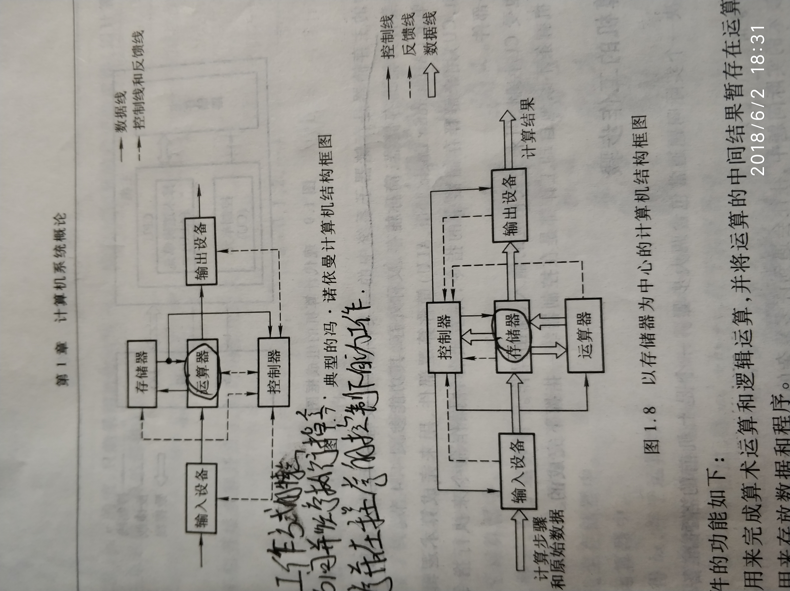
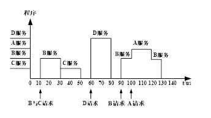
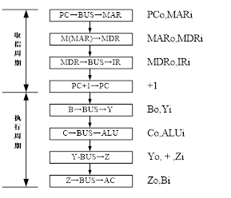
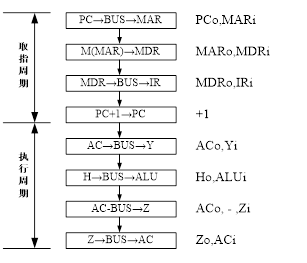
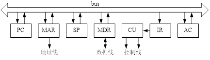

# 计算机组成原理复习纲要

## 第一章 计算机系统概述

### 1.计算机的系统结构

```
计算机体系结构是指那些能够被程序员所见到的计算机系统的属性，即概念性的结构与功能特性。
```


### 2.冯诺依曼系统结构的原理，特点有哪些？

```
原理:提出了“存储程序”的概念。
特点：
 - 计算机由运算器、存储器、控制器、输入设备和输出设备五大部件组成。
 - 指令和数据以同等地位存放于存储器中，并可按地址寻址。
 - 指令和数据均用二进制数表示。
 - 指令由操作码和地址码组成，操作码用来表示操作的性质，地址码用来表示操作数在存储器中的未知
 - 机器以运算器为中心，输入输出设备与存储器间的数据传送通过运算器完成。
```


### 3.计算机硬件的发展（框图的发展，中心？）




###  4.计算机执行过程中，各寄存器的作用

```
 PC：程序计数器存放下一条指令的地址
 IR：指令寄存器 存放当前正在执行的指令
 MAR是存储器地址寄存器，用来存放欲访问的存储单元的地址，其位数对应存储单元的个数(如MAR为10位，则2^10=1024个存储器，记为1K)。
 MDR是存储器数据寄存器，用来存放从存储体某单元取出的代码或者准备往某存储单元存入的代码，其位数与存储字长相等。
 ACC为累加器
 MQ为乘商寄存器
 X为操作数寄存器
```


## 第三章 系统总线

### 1.总线类型（总线型，分散型），总线型的优点？

```
总线型：总线是连接多个部件信息传输线，是各部件共享的传输介质。
分散型：分散连接结构，I/O与主存交换信息可以不经过运算器，又采用了中断、DMA等技术，使CPU工作效率得到很大的提高，但是仍无法解决I/O设备与主机之间连接的灵活性。
总线型优点：只允许有一个部件向总线发送信息，而多个部件可以同时从总线上接收相同的信息。
```


### 2.总线的发展，从16到32到64，都有那些总线？

```
8位：STD
16位：ISA
32位：EISA、VESA、MCA、PCI
参考书P47的表3.1
```

### 3.总线上传输的信息分类

```
数据总线（传送数据信息【各种指令数据信息】）
地址总线（传输	CPU向存储器、I/O接口设备发出的地址信息）
控制总线（各种控制信号，有CPU至存储器、I/O接口设备的控制信号，有I/O接口送向CPU的应答信号、请求信号）
```


### 4.总线结构类型（单总线，双总线，多总线，存储器采用什么结构对提高系统吞吐率最有效，多口寄存器、告诉缓冲存储器、交叉编址多模块存储器）

先来解释下`吞吐率`这个概念

> 单位时间内网络上传输的数据量，也可以指单位时间内处理客户请求数量。它是衡量网络性能的重要指标，通常情况下，吞吐率用“字节数/秒”来衡量，当然，你可以用“请求数/秒”和“页面数/秒”来衡量。其实，不管是一个请求还是一个页面，它的本质都是在网络上传输的数据，那么来表示数据的单位就是字节数。 

```
单总线：在数据传输需求量和传输速度要求不太高的情况下，为克服总线瓶颈问题，尽可能采用增加总线宽度和提高传输速率来解决。
双总线：将速度较低的I/O设备从单总线上分离出来，形成主存总线与I/O总线分开的结构。
三总线：分别使用主存总线、I/O总线、DMA总线来完成信息传输，任一时刻只能使用一种总线。
四总线：比三总线多增了高速总线。

```


### 5.总线的三种集中式仲裁方式（链式，计算器定时，独立请求，怎么找优先级，怎么响应）

```
链式查询，详情看书P58
计数器定时查询，详情看书P59
独立请求方式，详情看书P59
```


### 6.总线异步通信的方式？有哪几种？

```
异步通信克服了同步通信的缺点，允许各模块速度的不一致性，给设计者充分的灵活性和选择性。
不互锁方式
半互锁方式
全互锁方式
看书P61~62，做例题
```


## 第四章 存储器

### 1.按字节寻址，按字寻址，按半字寻址？

```
64KB 32位
字：16K
半字：32K
地址24根
数据32根
字节：16M
字：4M
半字：8M
```


### 2.存储芯片容量的扩展，片内地址和片选的选择，地址空间分配

```
按位扩展，按字扩展
低位交叉 书P104

```


### 3.奇偶校验码，海明码校验位的位数及生成

```
奇偶校验码 一位校验位 奇数为1 偶数为0
海明码校验位 2^K>=n+k+1
```


### 4.海明码的检错纠错

```
p101
```


### 5.Cache的命中率，效率，平均访问时间，不同映射方式主存地址和缓存地址的表示，命中的判断等

```
128KB 1KB 块32b 8路组相联
全相联映射 m12 b 5 c5b5
直接映射 m-c 7 c3b5
组相联映射 m-q 10 q2b5 q2r3b5
```


### 6.磁记录方式，记录数据时串行-并行方式写入？

```
磁带 顺序
```

### 7.硬盘盘面，柱面，磁盘，扇区，数据传输率的计算，磁盘地址的表示？

```
磁盘组有6片磁盘，最外两侧盘面可以记录，存储区域内径22cm，外径33cm，道密度为40道/cm，内层密度为400位/cm，转速3600转/分，问：
（1）共有多少存储面可用？
（2）共有多少柱面？
（3）盘组总存储容量是多少？
（4）数据传输率是多少？
解：（1）共有：6×2=12个存储面可用。
   （2）有效存储区域=（33-22）/ 2 = 5.5cm
        柱面数 = 40道/cm × 5.5= 220道
  （3）内层道周长=×22=69.08cm
       道容量=400位/cm×69.08cm= 3454B
       面容量=3454B×220道=759，880B
       盘组总容量=759，880B ×12面= 9，118，560B
（4）转速 = 3600转 / 60秒 = 60转/秒
     数据传输率 = 3454B × 60转/秒 = 207，240 B/S
某磁盘存储器转速为3000转/分，共有4个记录盘面，每毫米5道，每道记录信息12 288字节，最小磁道直径为230mm，共有275道，求：
（1）磁盘存储器的存储容量。
（2）最高位密度（最小磁道的位密度）和最低位密度。
（3）磁盘数据传输率。
（4）平均等待时间。
解：（1）存储容量 = 275道×12 288B/道×4面 = 13 516 800B
   （2）最高位密度 = 12 288B/（×230）= 17B/mm = 136位/mm（向下取整）
   最大磁道直径=230mm+2×275道/(5道/mm) = 230mm + 110mm = 340mm 
  最低位密度 = 12 288B /(×340)= 11B/mm = 92位 / mm （向下取整）
（3）磁盘数据传输率= 12 288B × 3000转/分=12 288B × 50转/秒=614 400B/s
（4）平均等待时间 = 1s/50 / 2 = 10ms
为3.1415926，就是pai。打印不出来
```


## 第五章 输入输出系统

### 1.通道控制方式可实现同步内部数据处理和异步并行工作

### 2.显示原理，刷新存储器，显示控制器，ROM BIOS 各起什么作用

### 3.显示器的刷新存储器容量计算

```
一、某CRT显示器可显示64种ASCII字符，每帧可显示72字×24排；每个字符字形采用7×8点阵，即横向7点，字间间隔1点，纵向8点，排间间隔6点；帧频50Hz，采取逐行扫描方式。假设不考虑屏幕四边的失真问题，且行回扫和帧回扫均占扫描时间的20%，问：
1）显存容量至少有多大？
2）字符发生器（ROM）容量至少有多大？
3）显存中存放的是那种信息？
4）显存地址与屏幕显示位置如何对应？
5）设置哪些计数器以控制显存访问与屏幕扫描之间的同步？它们的模各是多少？
6）点时钟频率为多少？
解：1）显存最小容量=72×24×8 =1728B
2）ROM最小容量=64×8行×8列= 512B（含字间隔1点）
3）显存中存放的是ASCII码信息。
4）显存每个地址对应一个字符显示位置，显示位置自左至右，从上到下，分别对应缓存地址由低到高。
5）设置点计数器、字计数器、行计数器、排计数器控制显存访问与屏幕扫描之间的同步。
它们的模计算如下：
点计数器模 = 7+1 = 8
行计数器模 = 8 + 6 = 14
字、排计数器的模不仅与扫描正程时间有关，而且与扫描逆程时间有关，因此计算较为复杂。
列方程： （72+x）× 0.8 = 72
（24+y）× 0.8 = 24
解方程得：x = 18，y = 6，则：
字计数器模 = 72 + 18 = 90
排计数器模 = 24 + 6 = 30
6）点频 = 50Hz × 30排 × 14行 × 90字 × 8点   = 15 120 000Hz= 15.12MHz

```


### 4.怎么实现中断？要有中断判优，产生中断向量？

```
有中断请求 中断请求未被屏蔽 优先级最高
```


### 5.单重中断和多重中断的区别？

```
多重中断是指：当CPU执行某个中断服务程序的过程中，发生了更高级、更紧迫的事件，CPU暂停现行中断服务程序的执行，转去处理该事件的中断，处理完返回现行中断服务程序继续执行的过程。
实现多重中断的必要条件是：在现行中断服务期间，中断允许触发器为1，即开中断。
```


### 6.中断屏蔽的作用？

```
使当前的程序顺利运行
```


### 7.DMA方式的优点，怎么实现主机与外设工作的？

```
i/o设备与主存直接交换信息不占用CPU 
i/o设备与主存之间有一条数据通路
cpu 与DMA同时访问主存，DMA先 窃取一个存储周期
```


## 第六章 计算机的运算方法

### 1.移码的表示，与补码的区别

```
[x]=2^n+x  移码就是在真值上加 2^n  n代表位数
P227
```


### 2.加减运算溢出的判断方法？

```
1）两个正数相加结果为负数，or两个负数相加结果为正数
2）最高有效位的进位 异或 符号位的进位=1 溢出
3）用两位符号位判断溢出 01正溢 10 负溢
```


### 3.补码乘法方法及过程

### 4.补码除法方法及过程

### 5.浮点数的表示：IEEE754浮点数的表示

### 6.浮点数的规格化数表示

### 7.浮点数的加减运算步骤及过程

## 第七章 指令系统

### 1.指令的寻址方式有两种，怎么寻找指令地址的？

```
顺序寻址pc+1自动形成下一条指令的地址 和跳跃寻址通过转移指令实现
```


### 2.地址码通过不同的寻址方式获取操作数地址，不同指令格式，操作数地址怎么计算？操作数如何获取？

```
立即寻址
直接寻址
隐含寻址
间接寻址
寄存器寻址
寄存器间接寻址
基址寻址
变址寻址
相对寻址
```


### 3.不同数据寻址方式，取得操作速度的快慢？

### 4.指令格式设计与分析，寻址空间的计算，有效地址怎么算，如何扩大寻址空间？

## 第八章 CPU的结构功能

### 1.运算器的功能，核心部件？CPU读写控制信号的功能？机器周期的含义？

```
加法器 移位器
```


### 2.指令周期的概念：指令周期的包括那四个？各自访存的目的是什么？

```
完成一条指令的所用时间
取址 访存取出指令 间址 取出数据 执行 中断
```


### 3.中断周期如何保护断点，为什么要保护断点？

```
断点入栈 中断结束之后还要返回中断处继续执行下面的指令
```


### 4.改变中断处理次序，并能画出CPU执行程序的轨迹

```
现有A、B、C、D四个中断源，其优先级由高向低按A、B、C、D顺序排列。若中断服务程序的执行时间为20µs，请根据下图所示时间轴给出的中断源请求中断的时刻，画出CPU执行程序的轨迹。
解：A、B、C、D的响优先级即处理优先级。CPU执行程序的轨迹图如下：
```



### 5.CPU的内通用寄存器的个数及位数，常用寄存器的作用，PC,IR等

```
4个bx ax dx cx  16位
```


## 第九章 控制单元的功能

### 1.微操作序列，根据图写出指令的微操作序列

**设****CPU****内部结构如图****9.4****所示，此外还设有****B****、****C****、****D****、****E****、****H****、****L****六个寄存器，它们各自的输入和输出端都与内部总线相通，并分别受控制信号控制（如****Bi****为寄存器****B****的输入控制；****Bo****为****B****的输出控制）。要求从取指令开始，写出完成下列指令所需的全部微操作和控制信号。**

   **（****1****）****ADD B****，****C    ((B)+(C)** **®****B)**

   **（****2****）****SUB A,H     ((AC)-(H)** **®****AC)**

**解：先画出相应指令的流程图，然后将图中每一步数据通路操作分解成相应的微操作，再写出同**名的微命令即可。

 （1） ADD B，C指令流程及微命令序列如下：



 （2） SUB A，H指令流程及微命令序列如下：




## 第十章 控制单元的设计

### 1微程序设计思想？用软件设计操作控制

```
微操作形成 微命令 ，微命令和微地址形成微指令 微指令形成微程序 
```


### 2.微操作序列对应的微控制信号

写出完成下列指令的微操作及节拍安排（包括取指操作）。

  （1）指令ADD R1，X完成将R1寄存器的内容和主存X单元的内容相加，结果存于R1的操作。

  （2）指令ISZ X完成将主存X单元的内容增1，并根据其结果若为0，则跳过下一条指令执行。

解：设采用单总线结构的CPU数据通路如下图所示，且ALU输入端设两个暂存器C、D（见17题图）。并设采用同步控制，每周期3节拍：



（1）指令ADD R1，X的微操作及节拍安排如下：

​     取指周期：T0  PC®MAR，1® R

T1  M(MAR) ®MDR，PC+1®PC

T2  MDR®IR,OP(IR) ®ID

执行周期1：T0 Ad（IR）®MAR，1®R

​           T1  M(MAR) ®MDR

T2  MDR®D

执行周期2：T0 R1®C

T1  +

T2  ALU®R1

（2）指令ISZ X的微操作及节拍安排:

取指周期同（1）:略

执行周期1:  T0  Ad（IR）®MAR，1®R

​            T1  M(MAR)®MDR

T2  MDR®C，+1®ALU

 执行周期2：T0  ALU®MDR，1®W 

T1 (PC+1)·Z+ PC·®PC

T1 (PC+1)·Z+ PC·®PC 