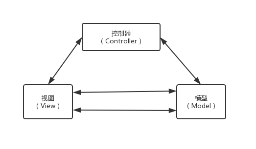
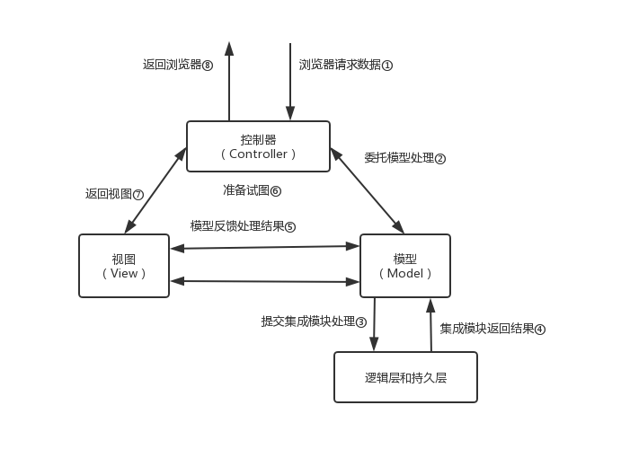

# MVC框架
## MVC框架的实现
在开始设计MVC框架前，首先要对MVC框架做一个简单的介绍。MVC（Model View Controller）的中文名称叫做模型视图控制器模型，就是因为它的英文名字太流行了，中文名字反而被忽略了。它诞生于20世纪80年代，原本是为桌面应用程序建立起来的一个框架，现在反而在Web应用中大放异彩（其实也可以把B/S认为是C/S的瘦化结构），MVC框架的目的是通过控制器C将模型M（代表的是业务数据和业务逻辑）和视图V（人机交互的界面）实现代码分离，从而使同一个逻辑或行为或数据可以具有不同的表现形式，或者是同样的应用逻辑共享相同、不同视图。比如，可以在IE浏览器访问某应用网站（页面格式遵守HTML标准），也可以用于手机访问。

MVC框架有两个版本，一个Model1，也就是MVC的第一个版本，它的视图中存在者大量的流程控制和代码开发，也就是控制器和视图还具有部分的耦合。也有人不认为Model1属于MVC框架，那也说得通，因为在JSP页面中融合了控制器和视图的功能，这其实就是早期的开发模式，开发一堆的JSP页面，然后再开发一堆的JavaBean，JavaBean就是模型了，它只是把JSP和JavaBean拆分开了。Model2版本则是提倡视图和模型的彻底分离，视图仅仅负责展示服务，不再参与业务的行为和数据处理。我们举例来说明MVC框架是如何运行的。
在做Web开发时，例如开发一个数据展示界面，从一张表中把数据全部读出，然后展示到页面上，也是一个简单的表格，其中页面展示的格式就是视图V，怎么从数据库中取得数据则是模型M，那么控制器C是做什么的呢？它负责把接收的浏览器的请求转发通知模型M处理，然后组合视图V，最终反馈一个带数据的视图到用户端，数据处理流程如图：

浏览器通过HTTP协议发出数据请求①，由控制器接收请求，通过路径②委托给数据模型处理，模型通过与逻辑层和持久层的交互（路径③④），把处理结果反馈给控制器（路径⑤），控制器根据结果组装视图（路径⑥⑦），并最终反馈给浏览器可以接受的HTML数据（路径⑧）。整体MVC框架还是比较简单的，但它带来的优点非常多。
- 高重用性
一个模型可以有多个视图，比如同样是一批数据，可以是柱状展示，也可以是条形展示，还可以是波形展示。
- 低耦合
一位模型和视图分离，两者没有耦合关系，所以可以独立地扩展和修改而不会产生相互影响。
- 快速开发和便捷部署
模型和视图分离，可以使各个开发人员自由发挥，做视图地人员和开发模型地人员可以制定自己的计划，然后在控制器地协作下实现完整的应用逻辑。
# MVC的系统架构
我们设计的MVC框架包含以下模块：核心控制器（FilterDispachter）、拦截器（Interceptor）、过滤器（Filter）、模块管理器（Model Action）、视图管理器（View Provider）等，基本上一个MVC框架上常用的功能我们都具备了，系统架构图如下：

各个模块的职责如下：
- 核心控制器
MVC框架的入口，负责接收和反馈HTTP请求。
- 过滤器
Servlet容器内的过滤器，实现对数据的过滤处理。
- 拦截器
对进出模型的数据进行过滤，他不依赖系统容器，只过滤MVC框架内的业务数据。
- 模型管理器
提供一个模型框架，该框架内的所有业务操作都应该是无状态的，不关心容器对象，例如Session、线程池等。
- 视图管理器
管理所有的视图，例如提供多语言的视图等。
- 辅助工具
它其实就是一大堆的辅助管理工具，比如文件管理，对象管理等。