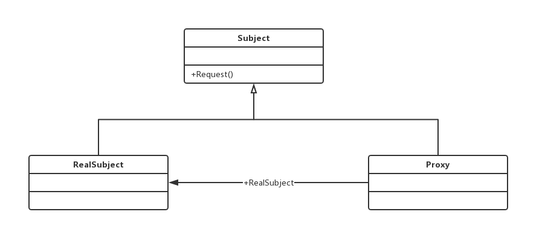

# 代理模式
## 代理模式的定义
代理模式（Proxy Pattern）是一个使用率非常高的模式，其定义如下：
Provide a surrogate or placeholder for another object to control access to it.（为其他对象提供一种代理以控制对象的访问）。
代理模式也叫做委托模式，它是一项基本设计技巧。许多其他的模式，如状态模式、策略模式、访问者模式本质上是在更特殊的场合采用了委托模式，而且在日常的应用中，代理模式可以提供非常好的访问控制。
代理模式的通用类图如下：

三个角色的定义：
- Subject抽象主题角色
抽象主题类可以是抽象类也可以是接口，是一个最普通的业务类型定义，无特殊要求。
- RealSubject具体主题角色
也叫做被委托角色、被代理角色。它才是冤大头，是业务逻辑的具体执行者。
- Proxy代理主题角色
也叫做委托类、代理类。它负责对真实角色的应用，把所有抽象主题类定义的方法限制委托给真实主题角色实现，并且在真实主题角色处理完毕前后做预处理和善后处理工作。
抽象主题类：
```java
public interface Subject {
    // 定义一个方法
    public void request();
}

```

真实主题类：
```java
public class RealSubject implements Subject{

    // 实现方法
    @Override
    public void request() {
        // 业务逻辑处理
    }
}

```
代理类：
```java
public class Proxy implements Subject{
    // 要代理那个实现类
    private Subject subject = null;
    // 默认被代理者
    public Proxy(){
        this.subject = new Proxy();
    }
    // 通过构造函数传递代理者
    public Proxy(Object...objects ){
    }

    // 实现接口中定义的方法
    @Override
    public void request() {
        this.before();
        this.subject.request();
        this.after();
    }

    // 预处理
    private void before(){
        // do something
    }

    // 善后处理
    private void after(){
        // do something
    }
}
```
一个代理类可以代理多个被委托者或被代理者，因此一个代理类具体代理那个真实主题角色，是由场景类决定的。
代理的构造函数：
```java
public Proxy(Subject _subject){
        this.subject = _subject;
    }
```
## 代理模式的应用
### 代理模式的优点
- 职责清晰

- 高扩展性

- 智能化

### 代理模式的使用场景
 代理模式的使用场景非常多，大家可以看看Spring AOP，这是一个非常典型的动态代理。