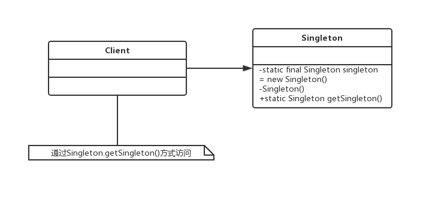

# 单例模式
## 单例模式的定义
单例模式（Singleton Pattern）是一个比较简单的模式，其定义如下：
Ensure a class has only one instance, and provide a global point of access to it.（确保某一个类只有一个实例，而且自行实例化并向整个系统提供这个实例。）
单例模式的通用类图如下：

Singleton类称为单例类，通过使用private的构造函数确保了在一个应用中只产生一个实例，并且是自行实例化的（在Singleton中自己使用new Singleton()）。单例模式的通用源代码如下：
```java
public class Singleton {
    private static final Singleton singleton = new Singleton();
    // 限制产生多个对象
    private Singleton(){
    }
    // 通过该方法获得实例对象
    public static Singleton getSingleton(){
        return singleton;
    }
    // 类中其他方法，尽量是static
    public static void doSometing(){
    }
}
```

## 单例模式的应用
### 单例模式的优点
- 由于单例模式在内存中只有一个实例，减少了内存开支，特别是一个对象需要频繁地创建、销毁时，而且创建或销毁时性能又无法优化，单例模式的优势就非常明显。
- 由于单例模式只生成一个实例，所以减少了系统的性能开销，当一个对象的产生需要比较多的资源时，如读取配置、产生其他依赖对象时，则可以通过在应用启动时直接产生一个单例对象，然后用永久驻留内存的方式来解决（在Java EE中采用单例模式时需要注意JVM垃圾回收机制）。
- 单例模式可以避免对资源的多重占用，例如一个写文件动作，由于只有一个实例存在内存中，避免对同一个资源文件的同时写操作。
- 单例模式可以在系统设置全局的访问点，优化和共享资源访问，例如可以设计一个单例类，负责所有数据表的映射处理。

### 单例模式的缺点
- 单例模式一般没有接口，扩展很困难，若要扩展，除了修改代码基本上没有第二种途径可以实现。
- 单例模式对测试是不利的。
- 单例模式与单一职责原则有冲突。

### 单例模式的使用场景
- 要求生成唯一序列号的环境
- 在整个项目中需要一个共享访问点或者共享数据，例如一个Web页面上的计数器，可以不用把每次刷新都记录到数据库中，使用单例模式保持计数器的值，并确保是线程安全的
- 创建一个对象需要消耗的资源过多，如要访问IO和数据库等资源
- 需要定义大量的静态常量和静态方法（如工具类）的环境，可以采用单例模式（当然，也可以直接声明为static的方式）


### 单例模式的注意事项
首先，在高并发情况下，请注意单例模式的线程同步问题。单例模式有几种不同的实现方式，上面的例子不会出现产生多个实例的情况，但是如下:
```java
public class Singleton{
  private static Singleton singleton = null;
  // 限制产生多个对象
  private Singleton(){
  }
  // 通过该方法获得实例对象
  public static Singleton getSingleton(){
    if(singleton == null){
      singleton = new Singleton();
    }
    return singleton;
  }
}
```
解决线程不安全的方法有很多，可以在getSingleton方法钱加synchronized关键字，也可以在getSingleton方法内增加synchronized来实现，但都不是最优秀的单例模式，建议使用：
```java
public class Singleton {
    private static final Singleton singleton = new Singleton();
    // 限制产生多个对象
    private Singleton(){
    }
    // 通过该方法获得实例对象
    public static Singleton getSingleton(){
        return singleton;
    }
    // 类中其他方法，尽量是static
    public static void doSometing(){
    }
}
```
```java
public class Singleton{
  private staitc Singleton singleton = null;
  private Singleton(){
  }
  public static synchronized Singleton getSingleton(){
    if(singleton == null){
      singleton = new Singleton();
    }
    return singleton;
  }
}
```

## 最佳实践
在Spring中，每个Bean默认就是单例的，这样做的优点是Spring容器可以管理这些Bean的生命期，决定什么时候创建出来，什么时候销毁，销毁的时候要如何处理，等等。如果采用非单例模式（Prototype类型），则Bean初始化后的管理交由J2EE容器，Spring容器不再跟踪管理Bean的声明周期。