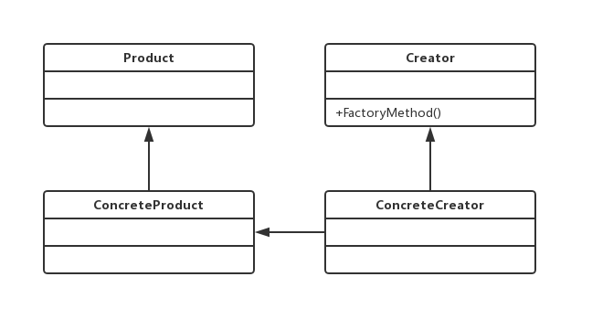

# 工厂模式
## 工厂方法模式的定义
工厂方法模式使用的频率非常高，在我们日常的开发中总能见到它的身影。其定义为：
Define an interface for creating an object,but let subclasses decide which class to instantiate.Factory Method lets a class defer instantiation to subclasses.（定义一个用于创建对象的接口，让子类决定实例化哪一个类。工厂方法使一个类的实例化延迟到其子类。）
工厂方法模式的通用类图如图：

在工厂方法模式中，抽象产品类Product负责定义产品的共性，实现对事务最抽象的定义；Creator为抽象创建类，也就是抽象工厂，具体如何创建产品类是由具体的实现工厂ConcreteCreator完成的。工厂方法模式的变种较多，我们来看一个比较实用的通用源码。
抽象产品类代码如代码：
```java
public abstract class Product {
    // 产品类的公共方法
    public void method1(){
        // 业务逻辑处理
    }
    // 抽象方法
    public abstract void method2();
}
```
具体的产品类可以有多个，都继承于抽象产品类，其源代码：
```java
public class ConcreteProduct1 extends Product {
    @Override
    public void method2() {
        // 业务逻辑处理
    }
}

public class ConcreteProduct2 extends Product {
    @Override
    public void method2() {
        // 业务逻辑处理
    }
}

```
抽象工厂类负责定义产品对象的产生，源代码：
```java
public abstract class Creator {
    /*
     * 创建一个产品对象，其输入参数类型可以自行设置
     * 通常为String、Enum、Class等，当然也可以为空
     */
    public abstract <T extends Product> T createProduct(Class<T> c);
}
```
具体如何产生一个产品的对象，是由具体的工厂类实现的，如代码：
```java
public class ConcreteCreator extends Creator {
    @Override
    public <T extends Product> T createProduct(Class<T> c) {
        Product product = null;
        try {
            product = (Product)Class.forName(c.getName()).newInstance();
        }catch (Exception e){
            // 异常处理
        }
        return (T)product;
    }
}
```
场景类的调用方法如代码：
```java
public class Client {
    public static void main(String[] args){
        Creator creator = new ConcreteCreator();
        Product product = creator.createProduct(ConcreteProduct1.class);
        /*
         * 继续业务处理
         */
    }
}
```
该通用代码是一个比较实用、易扩展的框架，读者可以根据实际项目需要进行扩展。
## 工厂方法模式的应用
### 工厂方法模式的优点
首先，`良好的封装性，代码结构清晰`。一个对象创建是优条件约束的，如一个调用者需要一个具体的产品对象，只要知道这个产品的类名（或约束字符串）就可以了，不用知道创建对象的艰辛过程，`降低模块间的耦合`。
其次，`工厂方法模式的扩展性非常优秀`。在增加产品类的情况下，只要适当地修改具体的工厂类或扩展一个工厂类，就可以完成“拥抱变化”。
再次，`屏蔽产品类`。这一特点非常重要，产品类的实现如何变化，调用者都不需要关心，它只需要关心产品的接口，只要接口保持不变，系统中的上层模块就不要发生变化。因为产品类的实例化工作是由工厂类负责的，一个产品对象具体由哪一个产品生成是由工厂类决定的。在数据库开发中，大家应该能够深刻题会到工厂方法模式的好处：如果使用JDBC链接数据库，数据库从MMySQL切换到Oracle，需要改动的地方就是切换一下驱动名称（前提条件是SQL语句是标准语句），其他的都不需要修改，这是工厂方法模式灵活的一个直接案例。
最后，`工厂方法模式是最典型的解耦框架`。高层模块值需要知道产品的抽象类，其他的实现类都不用关心，符合迪米特法则，我不需要的就不要去交流；也符合依赖倒置原则，只依赖产品类的抽象；当然也符合里氏替换原则，使用产品子类替换产品父类，没问题！
### 工厂方法模式的使用场景
首先，工厂方法模式是new一个对象的替代品，所以在所有愮生成对象的地方都可以使用，但是需要慎重考虑是否要增加一个工厂类进行管理，增加代码的复杂度。
其次，需要灵活的、可扩展的框架时，可以考虑采用工厂方法模式。
再次，工厂方法模式可以用在异构项目重。
最后，可以使用在测试驱动开发的框架下。
## 工厂方法模式的扩展
### 简单工厂模式
简单工厂模式（Simple Factory Pattern），也叫做静态工厂模式。在实际项目中，采用该方法的案例还是比较多的，其缺点是工厂类的扩展比较困难，不符合开闭原则，但它仍然是一个非常实用的设计模式