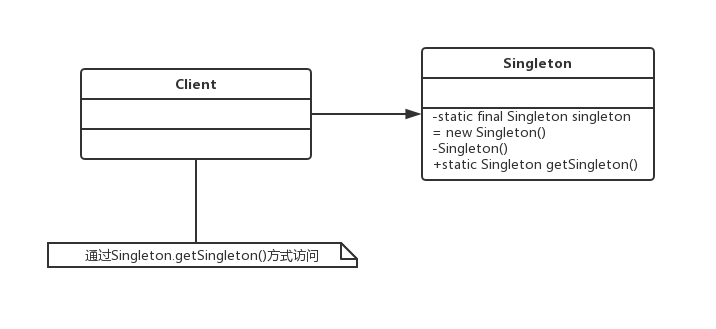

#  六大原则
## 单一职责原则

单一职责原则的英文名是Single Responsibility Principle，简称是SRP。

单一职责原则的定义是：应该有且仅有一个原因引起类的变更。

SRP的原话解释是：

> There should never be more than one reason for a class to change.

单一职责原则要求一个接口或类只有一个原因引起变化，也就是一个而接口或类只有一个指责，它就负责一件事情。

## 里氏替换原则


## 依赖倒置原则

# 设计模式
## 单例模式
### 单例模式的定义
单例模式（Singleton Pattern）是一个比较简单的模式，其定义如下：
Ensure a class has only one instance, and provide a global point of access to it.（确保某一个类只有一个实例，而且自行实例化并向整个系统提供这个实例。）
单例模式的通用类图如下：

Singleton类称为单例类，通过使用private的构造函数确保了在一个应用中只产生一个实例，并且是自行实例化的（在Singleton中自己使用new Singleton()）。单例模式的通用源代码如下：
```java
public class Singleton {
    private static final Singleton singleton = new Singleton();
    // 限制产生多个对象
    private Singleton(){
    }
    // 通过该方法获得实例对象
    public static Singleton getSingleton(){
        return singleton;
    }
    // 类中其他方法，尽量是static
    public static void doSometing(){
    }
}
```

### 单例模式的应用
#### 单例模式的优点
- 由于单例模式在内存中只有一个实例，减少了内存开支，特别是一个对象需要频繁地创建、销毁时，而且创建或销毁时性能又无法优化，单例模式的优势就非常明显。
- 由于单例模式只生成一个实例，所以减少了系统的性能开销，当一个对象的产生需要比较多的资源时，如读取配置、产生其他依赖对象时，则可以通过在应用启动时直接产生一个单例对象，然后用永久驻留内存的方式来解决（在Java EE中采用单例模式时需要注意JVM垃圾回收机制）。
- 单例模式可以避免对资源的多重占用，例如一个写文件动作，由于只有一个实例存在内存中，避免对同一个资源文件的同时写操作。
- 单例模式可以在系统设置全局的访问点，优化和共享资源访问，例如可以设计一个单例类，负责所有数据表的映射处理。

#### 单例模式的缺点
- 单例模式一般没有接口，扩展很困难，若要扩展，除了修改代码基本上没有第二种途径可以实现。
- 单例模式对测试是不利的。
- 单例模式与单一职责原则有冲突。

#### 单例模式的使用场景
- 要求生成唯一序列号的环境
- 在整个项目中需要一个共享访问点或者共享数据，例如一个Web页面上的计数器，可以不用把每次刷新都记录到数据库中，使用单例模式保持计数器的值，并确保是线程安全的
- 创建一个对象需要消耗的资源过多，如要访问IO和数据库等资源
- 需要定义大量的静态常量和静态方法（如工具类）的环境，可以采用单例模式（当然，也可以直接声明为static的方式）


#### 单例模式的注意事项
首先，在高并发情况下，请注意单例模式的线程同步问题。单例模式有几种不同的实现方式，上面的例子不会出现产生多个实例的情况，但是如下:
```java
public class Singleton{
  private static Singleton singleton = null;
  // 限制产生多个对象
  private Singleton(){
  }
  // 通过该方法获得实例对象
  public static Singleton getSingleton(){
    if(singleton == null){
      singleton = new Singleton();
    }
    return singleton;
  }
}
```
解决线程不安全的方法有很多，可以在getSingleton方法钱加synchronized关键字，也可以在getSingleton方法内增加synchronized来实现，但都不是最优秀的单例模式，建议使用：
```java
public class Singleton {
    private static final Singleton singleton = new Singleton();
    // 限制产生多个对象
    private Singleton(){
    }
    // 通过该方法获得实例对象
    public static Singleton getSingleton(){
        return singleton;
    }
    // 类中其他方法，尽量是static
    public static void doSometing(){
    }
}
```
```java
public class Singleton{
  private staitc Singleton singleton = null;
  private Singleton(){
  }
  public static synchronized Singleton getSingleton(){
    if(singleton == null){
      singleton = new Singleton();
    }
    return singleton;
  }
}
```

### 最佳实践
在Spring中，每个Bean默认就是单例的，这样做的优点是Spring容器可以管理这些Bean的生命期，决定什么时候创建出来，什么时候销毁，销毁的时候要如何处理，等等。如果采用非单例模式（Prototype类型），则Bean初始化后的管理交由J2EE容器，Spring容器不再跟踪管理Bean的声明周期。
## 工厂模式
### 工厂方法模式的定义
工厂方法模式使用的频率非常高，在我们日常的开发中总能见到它的身影。其定义为：
Define an interface for creating an object,but let subclasses decide which class to instantiate.Factory Method lets a class defer instantiation to subclasses.（定义一个用于创建对象的接口，让子类决定实例化哪一个类。工厂方法使一个类的实例化延迟到其子类。）
工厂方法模式的通用类图如图：

在工厂方法模式中，抽象产品类Product负责定义产品的共性，实现对事务最抽象的定义；Creator为抽象创建类，也就是抽象工厂，具体如何创建产品类是由具体的实现工厂ConcreteCreator完成的。工厂方法模式的变种较多，我们来看一个比较实用的通用源码。
抽象产品类代码如代码：
```java
public abstract class Product {
    // 产品类的公共方法
    public void method1(){
        // 业务逻辑处理
    }
    // 抽象方法
    public abstract void method2();
}
```
具体的产品类可以有多个，都继承于抽象产品类，其源代码：
```java
public class ConcreteProduct1 extends Product {
    @Override
    public void method2() {
        // 业务逻辑处理
    }
}

public class ConcreteProduct2 extends Product {
    @Override
    public void method2() {
        // 业务逻辑处理
    }
}

```
抽象工厂类负责定义产品对象的产生，源代码：
```java
public abstract class Creator {
    /*
     * 创建一个产品对象，其输入参数类型可以自行设置
     * 通常为String、Enum、Class等，当然也可以为空
     */
    public abstract <T extends Product> T createProduct(Class<T> c);
}
```
具体如何产生一个产品的对象，是由具体的工厂类实现的，如代码：
```java
public class ConcreteCreator extends Creator {
    @Override
    public <T extends Product> T createProduct(Class<T> c) {
        Product product = null;
        try {
            product = (Product)Class.forName(c.getName()).newInstance();
        }catch (Exception e){
            // 异常处理
        }
        return (T)product;
    }
}
```
场景类的调用方法如代码：
```java
public class Client {
    public static void main(String[] args){
        Creator creator = new ConcreteCreator();
        Product product = creator.createProduct(ConcreteProduct1.class);
        /*
         * 继续业务处理
         */
    }
}
```
该通用代码是一个比较实用、易扩展的框架，读者可以根据实际项目需要进行扩展。
### 工厂方法模式的应用
#### 工厂方法模式的优点
首先，`良好的封装性，代码结构清晰`。一个对象创建是优条件约束的，如一个调用者需要一个具体的产品对象，只要知道这个产品的类名（或约束字符串）就可以了，不用知道创建对象的艰辛过程，`降低模块间的耦合`。
其次，`工厂方法模式的扩展性非常优秀`。在增加产品类的情况下，只要适当地修改具体的工厂类或扩展一个工厂类，就可以完成“拥抱变化”。
再次，`屏蔽产品类`。这一特点非常重要，产品类的实现如何变化，调用者都不需要关心，它只需要关心产品的接口，只要接口保持不变，系统中的上层模块就不要发生变化。因为产品类的实例化工作是由工厂类负责的，一个产品对象具体由哪一个产品生成是由工厂类决定的。在数据库开发中，大家应该能够深刻题会到工厂方法模式的好处：如果使用JDBC链接数据库，数据库从MMySQL切换到Oracle，需要改动的地方就是切换一下驱动名称（前提条件是SQL语句是标准语句），其他的都不需要修改，这是工厂方法模式灵活的一个直接案例。
最后，`工厂方法模式是最典型的解耦框架`。高层模块值需要知道产品的抽象类，其他的实现类都不用关心，符合迪米特法则，我不需要的就不要去交流；也符合依赖倒置原则，只依赖产品类的抽象；当然也符合里氏替换原则，使用产品子类替换产品父类，没问题！
#### 工厂方法模式的使用场景
首先，工厂方法模式是new一个对象的替代品，所以在所有愮生成对象的地方都可以使用，但是需要慎重考虑是否要增加一个工厂类进行管理，增加代码的复杂度。
其次，需要灵活的、可扩展的框架时，可以考虑采用工厂方法模式。
再次，工厂方法模式可以用在异构项目重。
最后，可以使用在测试驱动开发的框架下。
### 工厂方法模式的扩展
#### 简单工厂模式
简单工厂模式（Simple Factory Pattern），也叫做静态工厂模式。在实际项目中，采用该方法的案例还是比较多的，其缺点是工厂类的扩展比较困难，不符合开闭原则，但它仍然是一个非常实用的设计模式。 
## MVC框架
### MVC框架的实现
在开始设计MVC框架前，首先要对MVC框架做一个简单的介绍。MVC（Model View Controller）的中文名称叫做模型视图控制器模型，就是因为它的英文名字太流行了，中文名字反而被忽略了。它诞生于20世纪80年代，原本是为桌面应用程序建立起来的一个框架，现在反而在Web应用中大放异彩（其实也可以把B/S认为是C/S的瘦化结构），MVC框架的目的是通过控制器C将模型M（代表的是业务数据和业务逻辑）和视图V（人机交互的界面）实现代码分离，从而使同一个逻辑或行为或数据可以具有不同的表现形式，或者是同样的应用逻辑共享相同、不同视图。比如，可以在IE浏览器访问某应用网站（页面格式遵守HTML标准），也可以用于手机访问。
## 代理模式

## JDK中常用的设计模式
