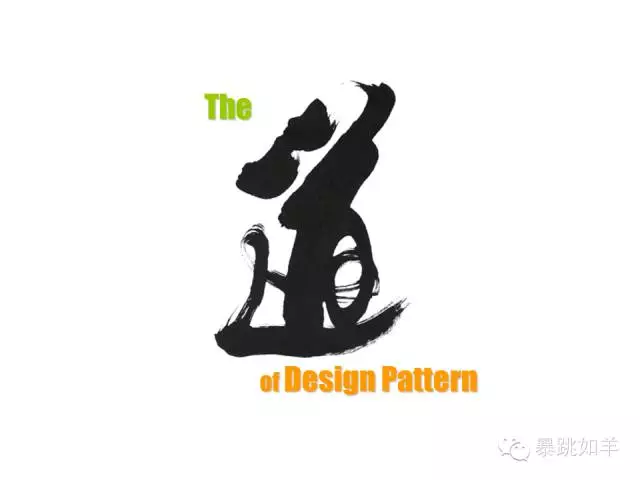
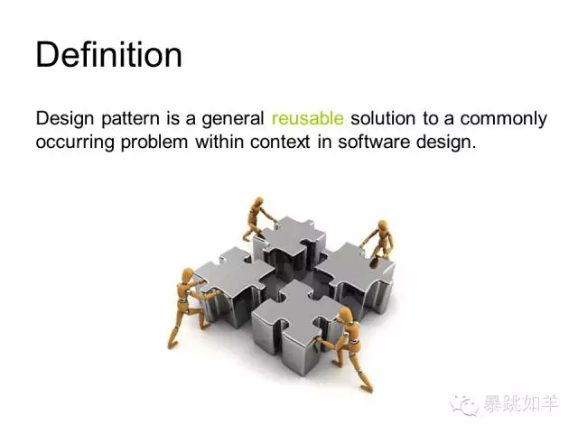
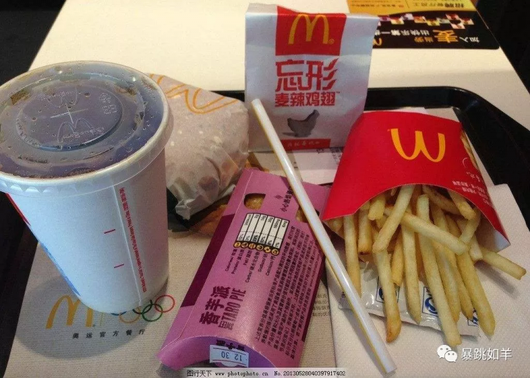
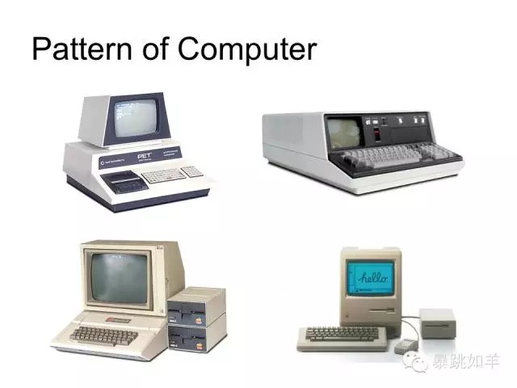
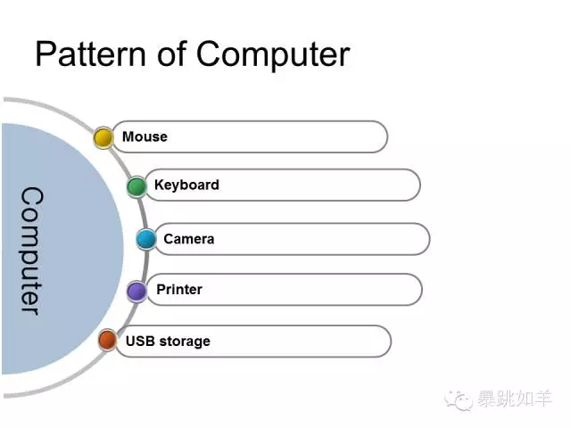
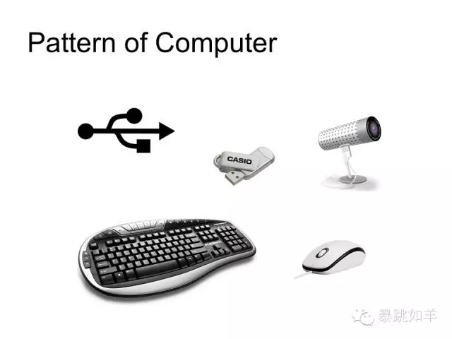
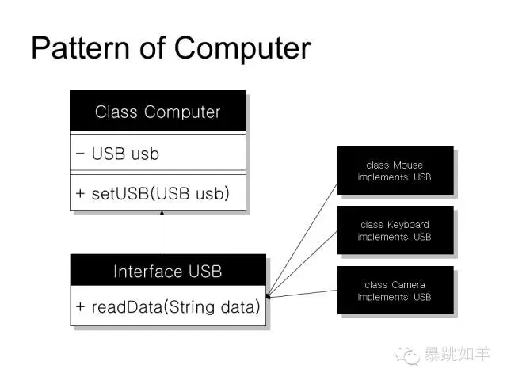
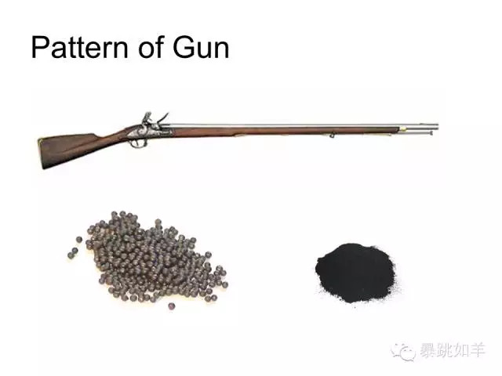
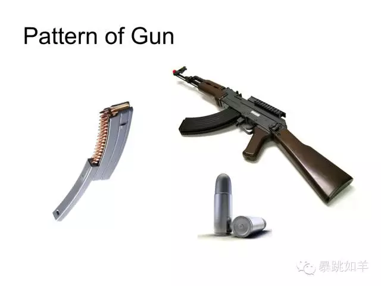
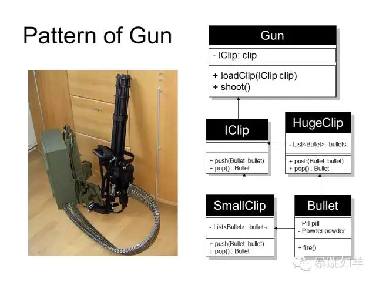

# 设计模式是什么鬼（初探）

“世界处处不设计**”** 

有物混成,先天地生。寂兮寥兮，独立而不改，周行而不殆，可以为天地母。吾不知其名，字之曰**道**，强为之名曰大。大曰逝，逝曰远，远曰反。

道是什么？道可道，非常道。道不明，说不尽的才算是道，它是自然法则的终极抽象。但至少在某一方面，它是各种事物如何组织在一起以及进行沟通互动的原始规律。而在软件设计中，各个模块之间怎样组织通信成为一个优雅健壮的整体，以便保证良好的可重用性和扩展性，这对于设计人员至关重要，于是有人将这些组装模式总结了出来，成为一种道，设计模式之道。

首先我们得搞清楚点面向对象的概念，面向对象其实是对现实世界的理解和抽象的方法，也就是在计算机世界里去模拟现实世界的一种编程方法，具体是利用封装、继承、多态的方法去建立模型，我们一个个看下这都是些什么鬼。 

### 封装 

恩？这是……麦当劳？对，但重点在于那杯可乐，是被盖子给封起来的，只留了一个孔可以插吸管才能喝。这其实就是封装，封装隐藏了内部的可乐，对外留有一个接口来访问，这样有啥好处？干净！防止外部随便访问，比如灰尘落入弄脏内部数据。对外暴露的习惯是非常容易使用的，你根本无需关心内部实现细节，你喝个可乐还在乎气压怎么增大减小导致可乐杯吸出来？非常简单，一个字：“吸”！ 

### 继承 

DNA？生物一代代的延续下来是靠什么保持其父辈的特征？遗传基因，正所谓龙生龙凤生凤，老鼠儿子会打洞，没有这个机制那代码量会急剧上升，很多功能，资源都是重复的在定义，这样造成极大的冗余和浪费！所以就有了继承机制，儿子从父亲那继承下来一些东西，不需要自己再去拼搏了，比如富二代继承家产，再比如天生好嗓子，妈妈是王菲。当然，只是单单继承是没有意义的，否则不如直接用父类了，所以得有自己的特色，比如增加属性啊，重写方法之类。 

### 多态 

看清楚哈，是多态不是变态。没有继承就没有多态，这个多态其实跟上面的继承是有关系的。中华美食博大精深，菜品众多，色香味俱全，形态各异，但是万变不离其宗，他们都是食品，也就是说，他们都继承自食品类，食材都是来自自然界生长出来的有机生物。这不就是继承么？等等我还没说完，多态其实是很巧妙地利用了继承这个特性实现了另一种机制。我们人类可以吃塑料么？显而易见不能，因为我们的接口只接收上面的天然有机食品类，对于铁啊什么的金属无机物是不能消化的。所以说，我们人类只接受食品类的多态，比如肉，蛋，蔬菜，水果，而决不能是塑料。来看一个多态的具体例子。 

这些是早期的一些个人电脑，看起来它们是该进博物馆了，顺便怀念下神作的乔帮主。我们发现，越是古老的电脑越是高度集成，某天显示器坏掉了我们会发现麻烦来了，我们只能去送修，然后把整个壳子拆开进行更换，也许它是焊接在主板上的那就惨了，模块间的过度依赖造成了极大的耦合度，而更糟的是这种显示器已经停产了根本买不到新的来匹配，那只能扔掉了。 

为了解决这个问题设计人员提出了模块化的概念，各种设备如雨后春笋般涌现。如：鼠标，键盘，摄像头，打印机，存储设备……但又有一个问题，每种设备都有一种接口，那电脑主机上得有多少种接口啊？这不坑爹么？于是出现了接口标准化。 

在各种接口百花齐放的时候，有一种接口胜出了，它就是USB。它提供了一种接口标准，电压5V，双工数据传输， 供电…… 最重要的是物理上形状是不一样的，所以别乱插、别乱捅。

于是乎，我们可以把电脑的模型设计成这样：

话说有一个Computer类，一个USB接口，还有各种USB设备，故事就这样开始了。

Computer：“我上面装有一个USB接口，我只认识这个接口传递过来的数据，谁要跟我沟通你就去找它吧。”

USB：“要接驳我的设备是什么我不关心，但我规定设备必须有readData()这个方法，但是怎么实现我不管，总之你得通过这个方法把数据给我。”

Keyboard：“我有readData()这个方法，我已经实现好了，用户一敲键盘我就读过来传给你。 O(∩_∩)O。”

Mouse&Camera：“我也是，我也是，我要插！”

USB：“确实多态，够变态。”

该分的分，该合的合，合合分分，分分合合，此乃阴阳之道。

### 实战，实战！ 

早期的枪设计非常原始简陋，打一发子弹要很长时间去准备，装填时要先把火药倒入枪管内，然后装入铅弹，最后用棍子戳实后才能发射。 射击时士兵扣动扳机冲击火药爆炸，子弹被冲击出去射杀敌方，然后再循环往复进行装填这一过程，费时费力，所以我们能看到19世纪战场上的士兵方阵前后排轮换射击，后排的士兵实际上在装填弹药以节省时间。

为了解决这个问题，我们开始思考了，既然弹药装填困难，那么不如把弹丸和火药组合起来，然后封装在弹壳里，只要撞击底火弹头就会被爆炸的火药崩出去，这样直接装入枪膛一触即发，杀人方便多了，这个就是“封装”。

那么问题又来了，虽然封装弹药节省了很多时间，但一次打一发子弹还是很麻烦不是？那就在子弹之上再包装一层弹夹吧，这相当于压栈，最早压入（push）的子弹最后弹出（pop），先进后出（栈数据结构），这样子弹打完了只要换弹夹就好了。总之只要枪接收子弹就对了，我们都是子弹的继承。 

然后设计师做了一件更丧心病狂的事情，他造了个外挂弹夹箱来实现弹夹接口的标准方法，背在身上不停地突突，多态发生了，冷兵器时代结束了，以上UML图正描述了这种嗜杀如狂的疯狂设计模式。 