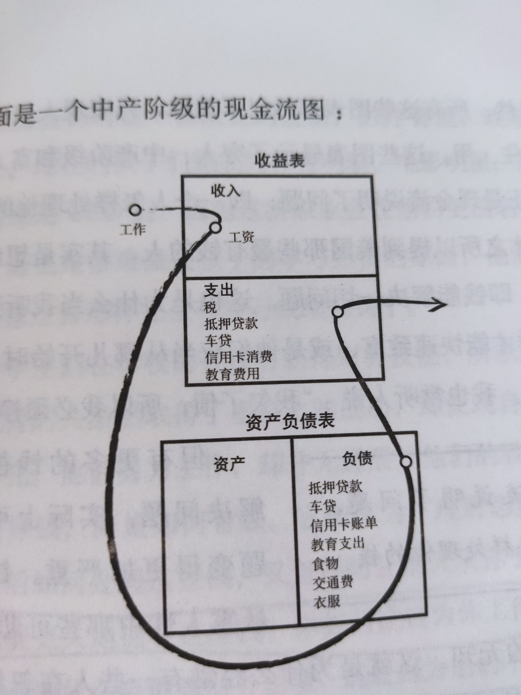

# 富爸爸穷爸爸读后感

## 前言

知道这本书是自己对于理财的搜索，一些帖子或者回答都或多或少的提到了这本书。所以趁着618打折买了。断断续续看了一个月，看完了。

## 读后感

这本书介绍作者如何成为富人（一定资产的范围内为富人，而不一定是马云之类的首富）。
### 思维对比
作者的背景是这样的：作者的亲生爸爸也就是标题的穷爸爸，是个受过良好高等教育的公务员，在政府上班。作者朋友的亲爸爸也就是标题的富爸爸，是个没受过高等教育的富人（作者不是推荐大家不好好念书，只是这种对比，应该是一种思维的对比）。

穷爸爸思维：

> 好好念书，考个好大学，然后找个稳定的收入尚可的工作

富爸爸思维：

> 如果想要致富，就需要如何让钱为你工作，而不是为了钱而工作，也就是文中所说的“财商”。如果想要学一个东西，就去应聘这个职位，因为这个职位会将专业的东西教给你。

很多人应该都是穷爸爸思维，好好念书、考个好大学、出来找个好工作。但是这样只是为了老板而好好念书、考个好大学，并没有本质上让你变得富有（因为本书探讨的是如何变得富有，并比较两种思维方式的差别）。你努力工作就认为能够变富有，其实这是一种误判（并不是鼓励大家不好好工作），其实是为了老板的新车而努力奋斗。也就是说，不能光靠工资来变得富有（可以参考刘强东说他工资一年只有1元）。在生活中你挣了多少钱并不重要，重要的是你留下了多少钱。

另外，学校的思维方式是努力学习就是为了找到好工作，另外不允许犯错误或者失败。其实这都是很病态的（对比社会大学来说），社会是允许人犯错误的（不是推荐大家犯罪或者特别严重错误）。但是如何从失败中吸取教训才是胜利者的关键，失败者只会被失败打败。另外学校学的专业知识也不一定是为了未来找工作（作者认为，学习是一辈子的事，要不断的学习，如果想要学习营销或者推销，就去参加这个岗位，去应聘，从工作中去学习知识。这些知识才是很贵的，脱离实际的教导是虚无缥缈的）。

另外必须要认清楚`资产`和`负债`的区别。

资产：

> 能带给你钱的东西。

负债

> 能拿走你钱的东西。

想要变富的秘诀就是增加自己的资产，减少自己的负债。

### 穷人、中产阶级、富人的现金流

#### 穷人现金流

#### 中产阶级现金流

#### 富人现金流

这个需要结合国情来看，作者写这本书是在上个世纪，当然不能一概而论就是对的，要去批判的看待他所说的思维，因为并不都适合当下。

### 事业

事业和工作，对我来说有点分不清。作者说`你的事业重心应该是你的资产项，而不是你的收入项`。晋升或者一份更好的工作只是围绕着工资收入转。只有你把额外的收入用来购买可产生收入的资产，你才能真正感到财务安全。

也就是不要为了工资而死，你的目标是你的资产项。

另外可以通过减税的方式来减轻自己的税务上的开支（当然必然是在合法的情况下）。

### 学会不为钱工作

这也是之前提到的，工作是给你相关职业专业最好的课堂和老师，只有自己实践了才明白其中的道理。也就是说工作不是为了钱这个目的去工作的，而是这个工作能够给你带来什么，能够让你学到什么东西，这也算是一种投资，投资自己。

事实上，他们（指教师）没有经历过他们在课堂上所教导的事情，也未尝试过犯错误，更不会从这些错误中学到东西，并把学到的东西应用在接下来的实践中，，从而变得越来越好。学校教我们阅读和记忆。

一个管理理论是这么说的：

> 工人付出最大努力以免于被解雇，而雇主提供最低工资以防止工人辞职

生活就像去健身房，最痛苦的事情是做出锻炼身体的决定，一旦你过了这个一关，以后的事情就好办了。

如果你是高度专业化的人士，就加入工会（国内应该是没有“工会”的）。

最重要的专门技能是销售和对市场营销的理解。销售技能是个人成功的基本技能，它涉及与其他人的交往，包括与顾客、雇员、老板、配偶和孩子。而沟通能力，如书面表达、口头表述及谈判能力等对一个人的成功来说更是至关重要。我就是通过学习各种课程、听教学磁带等来扩展知识并不断提高自己的这一技能的。

关于内卷：我受过良好教育的爸爸工作越努力，就越具有竞争力，但同时他也更深地陷入专业特长的陷阱中。

我还不知道有比销售和市场营销更重要的技能，但要掌握它们对大部分人来说是很困难的，这主要是因为他们害怕被拒绝。所以，你在处理人际关系、商务谈判和被拒绝时的恐惧心里等方面做得越好，生活就会越轻松。

### 克服困难

掌握财务知识的人有时候还是不能积累丰厚的而且能产生大量现金流的资产项，其主要原因有5个：

1. 恐惧。

要知道不喜欢失败和害怕失败的差别。

2. 愤世嫉俗。

在现实世界中，如果承认错误，并总结经验教训，那么犯错是无价的。适当恐惧是好事，但我们不应该生活在对犯错的严重恐惧中。犯错是好事，前提是我们能在每一次失败中吸取教训。

3. 懒惰。

“我付不起”这句话禁锢了你的思想，使你无法进一步思考。“我怎样才能付得起”这句话则开启你的头脑，迫使你去思考并寻求答案。

“欲望是好事”

4. 不良习惯。

5. 自负。

## 总结

大概是这些，其中大部分是摘抄书中的知识。这本书给了我一种我没有过的思维方式来思考我思考的问题，还曾一度让我觉得工作就是可耻的，但是这都没什么，其实想想工作除了给你带来工资，还有税收，以及其他的，带给你你想学的东西了吗?