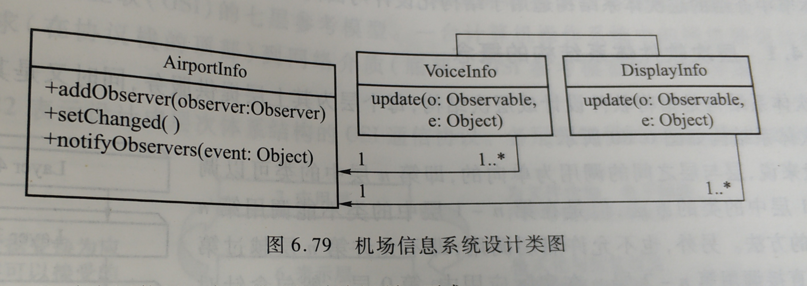

# 软件设计模式与体系结构-内作业

## 第一次内作业

### 1、利用网络查询设计模式七大原则的含义并举例说明

1. **开放-封闭原则**

   - **定义：一个软件实体如类、模块和函数应该对扩展开放，对修改关闭。**
     - 举例：刚开始需求只是写加法程序，很快在client类中完成后，此时变化没有发生，需求让再添加一个减法功能，此时会发现增加功能需要修改原来这个类，这就违背了开放-封闭原则，于是你就应该考虑重构程序，增加一个抽象的运算类，通过一些面向对象的手段，如继承、动态等来隔离具体加法、减法与client耦合，需求依然可以满足，还能应对变化。此时需求要添加乘除法功能，就不需要再去更改client及加减法类，而是增加乘法和除法子类即可。

2. **单一职责原则**

   - **定义：不要存在多于一个导致类变更的原因。通俗的说，即一个类只负责一项职责，应该仅有一个引起它变化的原因**
     - 举例：要设计加法和减法功能，则只需要设计好加法类和减法类即可，而不需要设计同时存在加法和减法的类。

3. **依赖倒转原则**

   - **定义：高层模块不应该依赖低层模块，二者都应该依赖其抽象；抽象不应该依赖细节；细节应该依赖抽象。即针对接口编程，不要针对实现编程**
     - 举例：依赖倒转原则，好比一个团队，有需求组，开发组，测试组，开发组和测试组都是面对同样的需求后，做自己相应的工作，而不应该是测试组按照开发组理解的需求去做测试用例，也就是说开发组和测试组都是直接面向需求组工作，大家的目的是一样的，保证产品按时上线，需求是不依赖于开发和测试的。

4. **迪米特法则**

   - **定义：又叫最少知识原则，一个软件实体应当尽可能少的与其他实体发生相互作用。**
     - 举例：一个类对自己依赖的类知道的越少越好。也就是说，对于被依赖的类来说，无论逻辑多么复杂，都尽量的将逻辑封装在类的内部，对外除了提供的`public`方法，不对外泄露任何信息。

5. **接口隔离原则**

   - **定义：建立单一接口，不要建立庞大臃肿的接口，尽量细化接口，接口中的方法尽量少。**
     - 举例：我们要为各个类建立专用的接口，而不要试图去建立一个很庞大的接口供所有依赖它的类去调用。在程序设计中，依赖几个专用的接口要比依赖一个综合的接口更灵活。接口是设计时对外部设定的“契约”，通过分散定义多个接口，可以预防外来变更的扩散，提高系统的灵活性和可维护性。

6. **组合/聚合复用原则**

   - **定义：尽量使用合成/聚合达到复用，尽量少用继承。原则： 一个类中有另一个类的对象。**
     - 举例：

7. **里氏代换原则**

   - **定义1：如果对每一个类型为 T1的对象 o1，都有类型为 T2 的对象o2，使得以 T1定义的所有程序 P 在所有的对象 o1 都代换成 o2 时，程序 P 的行为没有发生变化，那么类型 T2 是类型 T1 的子类型。**

     **定义2：子类型必须能够替换掉它们的父类型。**

     - 举例：在生物学分类上，企鹅是一种鸟，但在编程世界里，企鹅却不能继承鸟。在面向对象设计时，子类拥有父类所有非`private`的行为和属性，鸟会飞，但企鹅不会飞，所以企鹅不能继承鸟类。

### 练习题 1

#### （1）在例6.19的设计与实现中使用了观察者模式，其中利用了Java API中提供的支持事件系统的Observable类与Observer接口。请解释Observer接口的update(Observable subject,Object arg)方法的两个参数的类型与作用。回答问题：

1. 在程序运行的时候，Observable对象subject 是由水怎样被传入的？
2. 在程序运行的时候，Object对象arg是由谁怎样被传入的？
3. 在该方法的具体实现中，怎样使用这两个参数？

#### （2）在例6.19的设计与实现中，当调用Observable类的notifyObserver之前，还应该同时调用什么方法？

#### （3）设计一个控制金鱼缸水质、水温与水位高度的软件系统。基本需求：该程序用于自动控制金鱼缸中的水质、水温与水位高度。系统硬件包含鱼缸、化学传感器、水温传感器与水温传感器。当化学传感器的读数超过某种范围时，鱼缸需要排除本分废水，同时补充新鲜的水；当水温传感器读数低于某温度，或者超过某温度值时，需要开启加热设备或者冷却设备调整水温；当水位读书高于或低于特定高度时，需要开启排水设备，排除部分水或者添加新鲜的水。要求使用观察者模式设计该软件系统。具体要求：

1. 画出设计类图
2. 解释设计的控制程序的风格，说明类图中各软件组件之间的关系及各软件组件所包含的功能。

#### （4）设计一个机场信息系统。在该系统中有一个AirportInfo类负责维持机场信息，例如飞机到达时间、起飞时间、延迟信息、气象信息、航班取消信息等。假设有两个依赖于这些信息的类：VoiceInfo类，负责从AirportInfo类自动获取语音机场信息，然后将这些信息传送给乘客；DisplayInfo类，负责从AirportInfo类自动获取文字机场信息，然后将这些信息显示在屏幕上。

部分设计图如图所示：

请基于以上设计类图使用观察者模式设计该问题。要求：

1. 添加若干类或者接口，完成上述设计类图。
2. 解释AirportInfo类的三个方法的功能。
3. 解释update方法的参数“o”与“e”的数据类型与实际意义。
4. 写出VoiceInfo类与DisplayInfo类的两个update方法的具体行为。
5. 说明自己的设计的工作原理。

## 第二次内作业

### 利用观察者模式，来写上课铃声和下课铃声，对学生的反应状态。

