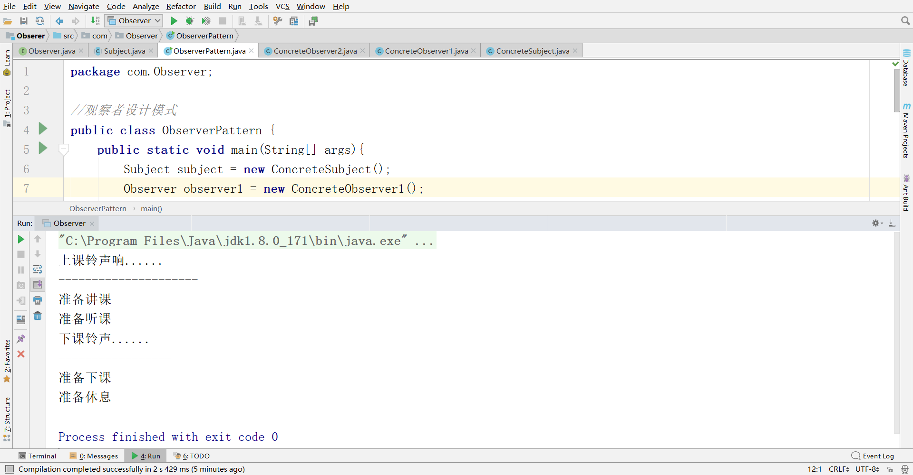

# 软件设计模式与体系结构-内作业

## 第一次内作业

### 1、利用网络查询设计模式七大原则的含义并举例说明

1. **开放-封闭原则**

   **定义：一个软件实体如类、模块和函数应该对扩展开放，对修改关闭。**

   举例：刚开始需求只是写加法程序，很快在client类中完成后，此时变化没有发生，需求让再添加一个减法功能，此时会发现增加功能需要修改原来这个类，这就违背了开放-封闭原则，于是你就应该考虑重构程序，增加一个抽象的运算类，通过一些面向对象的手段，如继承、动态等来隔离具体加法、减法与client耦合，需求依然可以满足，还能应对变化。此时需求要添加乘除法功能，就不需要再去更改client及加减法类，而是增加乘法和除法子类即可。

2. **单一职责原则**

   **定义：不要存在多于一个导致类变更的原因。通俗的说，即一个类只负责一项职责，应该仅有一个引起它变化的原因**

   举例：要设计加法和减法功能，则只需要设计好加法类和减法类即可，而不需要设计同时存在加法和减法的类。

3. **依赖倒转原则**

   **定义：高层模块不应该依赖低层模块，二者都应该依赖其抽象；抽象不应该依赖细节；细节应该依赖抽象。即针对接口编程，不要针对实现编程**

   举例：依赖倒转原则，好比一个团队，有需求组，开发组，测试组，开发组和测试组都是面对同样的需求后，做自己相应的工作，而不应该是测试组按照开发组理解的需求去做测试用例，也就是说开发组和测试组都是直接面向需求组工作，大家的目的是一样的，保证产品按时上线，需求是不依赖于开发和测试的。

4. **迪米特法则**

   **定义：又叫最少知识原则，一个软件实体应当尽可能少的与其他实体发生相互作用。**

   举例：一个类对自己依赖的类知道的越少越好。也就是说，对于被依赖的类来说，无论逻辑多么复杂，都尽量的将逻辑封装在类的内部，对外除了提供的`public`方法，不对外泄露任何信息。

5. **接口隔离原则**

   **定义：建立单一接口，不要建立庞大臃肿的接口，尽量细化接口，接口中的方法尽量少。**

   举例：我们要为各个类建立专用的接口，而不要试图去建立一个很庞大的接口供所有依赖它的类去调用。在程序设计中，依赖几个专用的接口要比依赖一个综合的接口更灵活。接口是设计时对外部设定的“契约”，通过分散定义多个接口，可以预防外来变更的扩散，提高系统的灵活性和可维护性。

6. **合成/聚合复用原则**

   **定义：尽量使用合成/聚合达到复用，尽量少用继承。原则： 一个类中有另一个类的对象。**

   举例：我们需要办理一张银行卡，如果银行卡默认都拥有了存款、取款和透支的功能，那么我们办理的卡都将具有这个功能，此时使用了继承关系：

   ​	

   为了灵活地拥有各种功能，此时可以分别设立储蓄卡和信用卡两种，并有银行卡来对它们进行聚合使用。此时采用了合成复用原则:

   

7. **里氏代换原则**

   **定义1：如果对每一个类型为 T1的对象 o1，都有类型为 T2 的对象o2，使得以 T1定义的所有程序 P 在所有的对象 o1 都代换成 o2 时，程序 P 的行为没有发生变化，那么类型 T2 是类型 T1 的子类型。**

   **定义2：子类型必须能够替换掉它们的父类型。**

   举例：在生物学分类上，企鹅是一种鸟，但在编程世界里，企鹅却不能继承鸟。在面向对象设计时，子类拥有父类所有非`private`的行为和属性，鸟会飞，但企鹅不会飞，所以企鹅不能继承鸟类。

### 练习题 1

#### （1）在例6.19的设计与实现中使用了观察者模式，其中利用了Java API中提供的支持事件系统的Observable类与Observer接口。请解释Observer接口的update(Observable subject,Object arg)方法的两个参数的类型与作用。回答问题：

1. 在程序运行的时候，Observable对象subject 是由谁怎样被传入的？
2. 在程序运行的时候，Object对象arg是由谁怎样被传入的？
3. 在该方法的具体实现中，怎样使用这两个参数？

**答**：

**1**、在程序运行时，Observable对象subject是由addObserver(observer:Observer)。

**2**、在程序运行时，Object对象arg是由TemperatureGUI传入，通过noftifyObservers(bTem)。

**3**、subject可以知道被观察者输入的温度，而arg参数可以知道温度值的类型。

#### （2）在例6.19的设计与实现中，当调用Observable类的notifyObserver之前，还应该同时调用什么方法？

**答**：getSelectedTemExpression()。

#### （3）设计一个控制金鱼缸水质、水温与水位高度的软件系统。基本需求：该程序用于自动控制金鱼缸中的水质、水温与水位高度。系统硬件包含鱼缸、化学传感器、水温传感器与水温传感器。当化学传感器的读数超过某种范围时，鱼缸需要排除本分废水，同时补充新鲜的水；当水温传感器读数低于某温度，或者超过某温度值时，需要开启加热设备或者冷却设备调整水温；当水位读书高于或低于特定高度时，需要开启排水设备，排除部分水或者添加新鲜的水。要求使用观察者模式设计该软件系统。具体要求：

1. 画出设计类图

   

   UML图[连接](https://www.processon.com/view/5b9a1c96e4b075b9fe4558e2)

2. 解释设计的控制程序的风格，说明类图中各软件组件之间的关系及各软件组件所包含的功能。

   **答**：鱼缸通过化学传感器、水温传感器和水位传感器，来知道那个变化，然后将变化发送给软件系统，软件系统得知后做出反应。

#### （4）设计一个机场信息系统。在该系统中有一个AirportInfo类负责维持机场信息，例如飞机到达时间、起飞时间、延迟信息、气象信息、航班取消信息等。假设有两个依赖于这些信息的类：VoiceInfo类，负责从AirportInfo类自动获取语音机场信息，然后将这些信息传送给乘客；DisplayInfo类，负责从AirportInfo类自动获取文字机场信息，然后将这些信息显示在屏幕上。                                                                                                                                                                                                                                            

部分设计图如图所示：


请基于以上设计类图使用观察者模式设计该问题。要求：

1. 添加若干类或者接口，完成上述设计类图。


UML图[连接](https://www.processon.com/view/5b9a2b87e4b0bd4db93ab844)

2. 解释AirportInfo类的三个方法的功能。

**答**：addObserver(observer : Observer)增加观察者

​	setChanged()改变现有信息

​	notifyObservers(event:Object)更改信息的对象，如飞机到达时间、起飞时间、延迟信息、气象信息、航班取消

3. 解释update方法的参数“o”与“e”的数据类型与实际意义。

   ”o”

   - 数据类型：对象
   - 实际意义：被观察者

   “e”

   - 数据类型：对象
   - 实际意义：被观察者的目标

4. 写出VoiceInfo类与DisplayInfo类的两个update方法的具体行为。

   - VoiceInfo：更新语言机场信息
   - DisplayInfo：更新文字机场信息

5. 说明自己的设计的工作原理。

在飞机信息系统中，如果AirportInfo改变飞机到达时间、起飞时间、延迟信息、气象信息、航班取消信息等，如果增加VoiceInfo观察者，则广播机场信息，传送给乘客。如果增加DisplayInfo观察者，则更新屏幕上的信息，传达给乘客。

### 课下设计 - 编程作业

在例6.19的基础上添加两个观察者类：RankineGUI和ReumurGUI，分别代表两种新的温度表示度量。

```java
//RankineGUI
import java.awt.*;
import javax.swing.*;
import javax.swing.border.Border;
import java.util.Observable;
import java.util.Observer;

public class RankineGUI extends JFrame implements Observer{
    private JSplitPane  bigSplitPane;
    private JPanel showInfoPane;
    private JPanel tempColorPane;
    private JLabel lblTempType;
    private JLabel lblColorTemp;
    private JTextArea tempTextArea;
    private JTextArea colorTempTxt;
    private static Dimension size = new Dimension(400, 200);

    public RankineGUI() {
        super("Rankine - Observer 4");
        setUpScrollPanes();
    }

    private void setUpScrollPanes() {
        Border raisedbevel = BorderFactory.createRaisedBevelBorder();

        lblTempType= new JLabel("Rankine Temperature");
        lblTempType.setFont(new Font("Helvetica", Font.BOLD, 13));

        tempTextArea = new JTextArea(20, 20);
        tempTextArea.setFont(new Font("Helvetica", Font.BOLD, 20));
        tempTextArea.setLineWrap(true);
        tempTextArea.setBackground(Color.pink);

        showInfoPane = new JPanel();
        showInfoPane.setLayout(new BorderLayout());
        showInfoPane.add(lblTempType, "North");
        showInfoPane.add(tempTextArea, "Center");

        lblColorTemp = new JLabel("Temperature Color");
        lblColorTemp.setFont(new Font("Helvetica", Font.BOLD, 13));
        colorTempTxt = new JTextArea(20, 20);

        tempColorPane = new JPanel();
        tempColorPane.setLayout(new BorderLayout());
        tempColorPane.add(lblColorTemp, "North");
        tempColorPane.add(colorTempTxt, "Center");

        bigSplitPane = new JSplitPane(JSplitPane.HORIZONTAL_SPLIT, showInfoPane,tempColorPane);
        bigSplitPane.setDividerLocation(200);

        getContentPane().add(bigSplitPane);
        setSize(size);
        setVisible(true);
    }

    public void update(Observable subject, Object arg) {
        String t = (String) arg;


        TemperatureGUI tg = (TemperatureGUI)subject;
        String option = tg.getSelectedTemExpression();

        TemperatureConvertor tc = new TemperatureConvertor();
        float kTem = tc.getKelvinTemperature(option,t);
        tempTextArea.setText(""+ kTem);

        Color color=tc.getColor(kTem);
        colorTempTxt.setBackground(color);
    }
}

```

```java
//ReumurGUI
import java.awt.*;
import javax.swing.*;
import javax.swing.border.Border;
import java.util.Observable;
import java.util.Observer;

public class ReaumurGUI extends JFrame implements Observer{
    private JSplitPane  bigSplitPane;
    private JPanel showInfoPane;
    private JPanel tempColorPane;
    private JLabel lblTempType;
    private JLabel lblColorTemp;
    private JTextArea tempTextArea;
    private JTextArea colorTempTxt;
    private static Dimension size = new Dimension(400, 200);

    public ReaumurGUI() {
        super("Reaumur - Observer 5");
        setUpScrollPanes();
    }

    private void setUpScrollPanes() {
        Border raisedbevel = BorderFactory.createRaisedBevelBorder();

        lblTempType= new JLabel("Reaumur Temperature");
        lblTempType.setFont(new Font("Helvetica", Font.BOLD, 13));

        tempTextArea = new JTextArea(20, 20);
        tempTextArea.setFont(new Font("Helvetica", Font.BOLD, 20));
        tempTextArea.setLineWrap(true);
        tempTextArea.setBackground(Color.pink);

        showInfoPane = new JPanel();
        showInfoPane.setLayout(new BorderLayout());
        showInfoPane.add(lblTempType, "North");
        showInfoPane.add(tempTextArea, "Center");

        lblColorTemp = new JLabel("Temperature Color");
        lblColorTemp.setFont(new Font("Helvetica", Font.BOLD, 13));
        colorTempTxt = new JTextArea(20, 20);

        tempColorPane = new JPanel();
        tempColorPane.setLayout(new BorderLayout());
        tempColorPane.add(lblColorTemp, "North");
        tempColorPane.add(colorTempTxt, "Center");

        bigSplitPane = new JSplitPane(JSplitPane.HORIZONTAL_SPLIT, showInfoPane,tempColorPane);
        bigSplitPane.setDividerLocation(200);

        getContentPane().add(bigSplitPane);
        setSize(size);
        setVisible(true);
    }

    public void update(Observable subject, Object arg) {
        String t = (String) arg;


        TemperatureGUI tg = (TemperatureGUI)subject;
        String option = tg.getSelectedTemExpression();

        TemperatureConvertor tc = new TemperatureConvertor();
        float kTem = tc.getKelvinTemperature(option,t);
        tempTextArea.setText(""+ kTem);

        Color color=tc.getColor(kTem);
        colorTempTxt.setBackground(color);
    }
}

```

<iframe src="//player.bilibili.com/player.html?aid=1328701&cid=2015358&page=1" scrolling="no" border="0" frameborder="no" framespacing="0" allowfullscreen="true"> </iframe>

## 第二次内作业

### 利用观察者模式，来写上课铃声和下课铃声，对学生的反应状态。

**抽象观察者**

```java
package com.Observer;
/*
抽象观察者
 */
public interface Observer {
    void response1();//反应1
    void response2();//反应2
}

```

**抽象目标**

```java
package com.Observer;

import java.util.ArrayList;
import java.util.List;
//抽象目标
public abstract class Subject {
    //定义一个观察者集合 用于存储 所有观察者
    protected List<Observer> observers = new ArrayList<Observer>();
    //增加观察者方法
    public void add(Observer observer){
        observers.add(observer);
    }
    //删除观察者方法
    public void remove(Observer observer){
        observers.remove(observer);
    }
    public abstract void notifyObserve1();//通知观察者方法1
    public abstract void notifyObserve2();//通知观察者方法2
}

```

**具体目标**

```java
package com.Observer;

public class ConcreteSubject extends Subject{
    @Override
    public void notifyObserve1() {
        System.out.println("上课铃声响......");
        System.out.println("---------------------");
        for(Object object : observers){
            ((Observer)object).response1();
        }
    }

    public void notifyObserve2(){
        System.out.println("下课铃声......");
        System.out.println("-----------------");
        for(Object object : observers){
            ((Observer)object).response2();
        }
    }
}

```

**老师**

```java
package com.Observer;

//老师
public class ConcreteObserver1 implements Observer{
    @Override
    public void response1(){
        System.out.println("准备讲课");
    }

    @Override
    public void response2(){
        System.out.println("准备下课");
    }
}

```

**学生**

```java
package com.Observer;

//学生
public class ConcreteObserver2 implements Observer{
    @Override
    public void response1() {
        System.out.println("准备听课");
    }

    @Override
    public void response2(){
        System.out.println("准备休息");
    }
}

```

**具体验证**

```java
package com.Observer;

//观察者设计模式
public class ObserverPattern {
    public static void main(String[] args){
        Subject subject = new ConcreteSubject();
        Observer observer1 = new ConcreteObserver1();
        Observer observer2 = new ConcreteObserver2();

        subject.add(observer1);
        subject.add(observer2);

        subject.notifyObserve1();
        subject.notifyObserve2();
    }
}

```



## 第三次内作业

### 1、上网查询饿汉模式和懒汉模式的比较

Sunny公 司开发人员使用单例模式实现了负载均衡器的设计，但是在实际使用中出现了一个非常严重的问题，当负载均衡器在启动过程中用户再次启动该负载均衡器时，系统 无任何异常，但当客户端提交请求时出现请求分发失败，通过仔细分析发现原来系统中还是存在多个负载均衡器对象，导致分发时目标服务器不一致，从而产生冲 突。为什么会这样呢？Sunny公司开发人员百思不得其解。

​      现在我们对负载均衡器的实现代码进行再次分析，当第一次调用getLoadBalancer()方法创建并启动负载均衡器时，instance对象为null值，因此系统将执行代码instance= new LoadBalancer()，在此过程中，由于要对LoadBalancer进行大量初始化工作，需要一段时间来创建LoadBalancer对象。而在此时，如果再一次调用getLoadBalancer()方法（通常发生在多线程环境中），由于instance尚未创建成功，仍为null值，判断条件(instance==  null)为真值，因此代码instance= new LoadBalancer()将再次执行，导致最终创建了多个instance对象，这违背了单例模式的初衷，也导致系统运行发生错误。

​      如何解决该问题？我们至少有两种解决方案，在正式介绍这两种解决方案之前，先介绍一下单例类的两种不同实现方式，饿汉式单例类和懒汉式单例类。

1. 饿汉单利模式

饿汉单例类是实现起来最简单的单例类，饿汉单例类结构图如下：


代码如下：

```java 
class EagerSingleton{
	private static final EagerSingleton instance = new EagerSingleton();
    private EagerSingleton(){}
    
    public static EagerSingleton getInstance(){
        return instance;
    }
}
```

当类被加载时，静态变量instance会被初始化，此时类的私有构造函数会被调用，单例类的唯一实例将被创建。如果使用恶汉单例来实现负载均衡器LoadBalancer类的设计，则不会出现创建多个单例对象的情况，可确保单例对象的唯一性。

2. 懒汉单例类与线程锁定

除了饿汉式单例，还有一种经典的懒汉式单例，也就是前面的负载均衡器LoadBalancer类的实现方式。懒汉式单例类结构图如图所示：


从图中可以看出，懒汉式单例在第一次调用getInstance()方法时实例化，在类加载时并不自行实例化，这种技术又称为**延迟加载(Lazy Load)**技术，即需要的时候再加载实例，为了避免多个线程同时调用getInstance()方法，我们可以使用**关键字synchronized**，代码如下所示：

```java
class LazySingleton{
    private static LazySingleton instance = null;
    private LazySingleton(){}
    synchronized public static LazySingleton getInstance(){
        if(instance == null){
            instance = new LazySingleton();
        }
        return instance;
    }
}
```

该懒汉式单例类在getInstance()方法前面增加了关键字synchronized进行线程锁，以处理多个线程同时访问的问题。但是，上述代码虽然解决了线程安全问题，但是每次调用getInstance()时都需要进行线程锁定判断，在多线程高并发访问环境中，将会导致系统性能大大降低。如何既解决线程安全问题又不影响系统性能呢？我们继续对懒汉式单例进行改进。事实上，我们无须对整个getInstance()方法进行锁定，只需对其中的代码“instance
= new LazySingleton();”进行锁定即可。因此getInstance()方法可以进行如下改进：
```java
public static LazySingleton getInsance(){
	if(instance == null){
        synchronized(LazySingleton.class){
            instance = new LazySingleton();
        }
    }
}
```
问题貌似得以解决，事实并非如此。如果使用以上代码来实现单例，还是会存在单例对象不唯一。原因如下：

​      假如在某一瞬间线程A和线程B都在调用getInstance()方法，此时instance对象为null值，均能通过instance == null的判断。由于实现了synchronized加锁机制，线程A进入synchronized锁定的代码中执行实例创建代码，线程B处于排队等待状态，必须等待线程A执行完毕后才可以进入synchronized锁定代码。但当A执行完毕时，线程B并不知道实例已经创建，将继续创建新的实例，导致产生多个单例对象，违背单例模式的设计思想，因此需要进行进一步改进，在synchronized中再进行一次(instance  == null)判断，这种方式称为**双重检查锁定(Double-Check Locking)**。使用双重检查锁定实现的懒汉式单例类完整代码如下所示：
```java
class LazySingleton{
	private volatile static LazySingleton instance = null;
    private LazySingleton(){}
    
    public static LazySingleton getInstance(){
        //第一重判断
        if(instance == null){
            //锁定代码块
            synchronized(LazySingleton.class){
                
                if(instance == null){
                    instance = new LazySingleton();//创建单例实例
                }
            }
        }
        
    }
}
```

需要注意的是，如果使用双重检查锁定来实现懒汉式单例类，需要在静态成员变量instance之前增加**修饰符volatile**，被volatile修饰的成员变量可以确保多个线程都能够正确处理，且该代码只能在JDK 1.5及以上版本中才能正确执行。由于volatile关键字会屏蔽Java虚拟机所做的一些代码优化，可能会导致系统运行效率降低，因此即使使用双重检查锁定来实现单例模式也不是一种完美的实现方式。

3. 饿汉单例与懒汉单例比较

饿汉式单例类在类被加载时就将自己实例化，它的优点在于无须考虑多线程访问问题，可以确保实例的唯一性；从调用速度和反应时间角度来讲，由于单例对象一开 始就得以创建，因此要优于懒汉式单例。但是无论系统在运行时是否需要使用该单例对象，由于在类加载时该对象就需要创建，因此从资源利用效率角度来讲，饿汉 式单例不及懒汉式单例，而且在系统加载时由于需要创建饿汉式单例对象，加载时间可能会比较长。

​      懒汉式单例类在第一次使用时创建，无须一直占用系统资源，实现了延迟加载，但是必须处理好多个线程同时访问的问题，特别是当单例类作为资源控制器，在实例 化时必然涉及资源初始化，而资源初始化很有可能耗费大量时间，这意味着出现多线程同时首次引用此类的机率变得较大，需要通过双重检查锁定等机制进行控制， 这将导致系统性能受到一定影响。

### 2、访问百度，算不算单例模式

不算，我可以开很多窗口同时访问百度，而且搜索的界面可能都不一样。

### 3、上网查询 ioDH方式或者技术

饿汉式单例类不能实现延迟加载，不管将来用不用始终占据内存；懒汉式单例类线程安全控制烦琐，而且性能受影响。可见，无论是饿汉式单例还是懒汉式单例都存在这样那样的问题，有没有一种方法，能够将两种单例的缺点都克服，而将两者的优点合二为一呢？答案是：Yes！下面我们来学习这种更好的被称之为**Initialization Demand Holder (IoDH)**的技术。

​      在IoDH中，我们在单例类中增加一个**静态(static)内部类**，在该内部类中创建单例对象，再将该单例对象通过getInstance()方法返回给外部使用，实现代码如下所示：

```java
class Singleton{
    private Singleton(){

    }
    private static class HolderClass{
        private final static Singleton instance = new Singleton();
    }
    public static Singleton getInstance(){
        return HolderClass.instance;
    }

    public static void main(String[] args){
        Singleton s1,s2;
        s1 = Singleton.getInstance();
        s2 = Singleton.getInstance();
        System.out.println(s1 == s2);
    }
}
```


​       编译并运行上述代码，运行结果为：true，即创建的单例对象s1和s2为同一对象。由于静态单例对象没有作为Singleton的成员变量直接实例化，因此类加载时不会实例化Singleton，第一次调用getInstance()时将加载内部类HolderClass，在该内部类中定义了一个static类型的变量instance，此时会首先初始化这个成员变量，由Java虚拟机来保证其线程安全性，确保该成员变量只能初始化一次。由于getInstance()方法没有任何线程锁定，因此其性能不会造成任何影响。

​      **通过使用IoDH，我们既可以实现延迟加载，又可以保证线程安全，不影响系统性能，不失为一种最好的Java语言单例模式实现方式**（其缺点是与编程语言本身的特性相关，很多面向对象语言不支持IoDH）。

## 第四次内作业

### 1.下载JDK源码，分析ArrayList,LinkedList,HashSet,HashMap底层源代码实现。

#### ArrayList


### 2. 上网查询Java各种集合以及它们的使用场景


### 3.上网查阅List,Set,ArrayList,LinkedList,HashMap用法


### 4.上网查阅6种类图关系资料


### 5.上网查阅13种类图


### 6.用IDEA生ATM类图


### 7.用rational rose生ATM类图


### 8.ArrayList LinkedList Vector set List    Collection                                                                              等用法需要掌握

### 9.上网查询Java为啥有接口这个概念，以及接口使用的场景


### 10.Java中的static和final有什么区别，他们都有那些使用场景


### 11.上网查阅配置tomcat集群


### 12.上网查阅tomcat配置详解


### 13.上网查阅IoC原理

我曾经做的DI相关知识。

https://blog.csdn.net/tangzongpi6936/article/details/82795014

这里转发别人的博文，写的挺不错的

IOC（DI）：其实这个Spring架构核心的概念没有这么复杂，更不像有些书上描述的那样晦涩。java程序员都知道：java程序中的每个业务逻辑至少需要两个或以上的对象来协作完成，通常，每个对象在使用他的合作对象时，自己均要使用像new object（） 这样的语法来完成合作对象的申请工作。你会发现：对象间的耦合度高了。而IOC的思想是：Spring容器来实现这些相互依赖对象的创建、协调工作。对象只需要关系业务逻辑本身就可以了。从这方面来说，对象如何得到他的协作对象的责任被反转了（IOC、DI）。

这是我对Spring的IOC的体会。DI其实就是IOC的另外一种说法。DI是由Martin Fowler 在2004年初的一篇论文中首次提出的。他总结：控制的什么被反转了？就是：获得依赖对象的方式反转了。

如果对这一核心概念还不理解：这里引用一个叫Bromon的blog上找到的浅显易懂的答案：


IoC与DI

　　首先想说说IoC（Inversion of Control，控制倒转）。这是spring的核心，贯穿始终。所谓IoC，对于spring框架来说，就是由spring来负责控制对象的生命周期和对象间的关系。这是什么意思呢，举个简单的例子，我们是如何找女朋友的？常见的情况是，我们到处去看哪里有长得漂亮身材又好的mm，然后打听她们的兴趣爱好、qq号、电话号、ip号、iq号………，想办法认识她们，投其所好送其所要，然后嘿嘿……这个过程是复杂深奥的，我们必须自己设计和面对每个环节。传统的程序开发也是如此，在一个对象中，如果要使用另外的对象，就必须得到它（自己new一个，或者从JNDI中查询一个），使用完之后还要将对象销毁（比如Connection等），对象始终会和其他的接口或类藕合起来。

　　那么IoC是如何做的呢？有点像通过婚介找女朋友，在我和女朋友之间引入了一个第三者：婚姻介绍所。婚介管理了很多男男女女的资料，我可以向婚介提出一个列表，告诉它我想找个什么样的女朋友，比如长得像李嘉欣，身材像林熙雷，唱歌像周杰伦，速度像卡洛斯，技术像齐达内之类的，然后婚介就会按照我们的要求，提供一个mm，我们只需要去和她谈恋爱、结婚就行了。简单明了，如果婚介给我们的人选不符合要求，我们就会抛出异常。整个过程不再由我自己控制，而是有婚介这样一个类似容器的机构来控制。Spring所倡导的开发方式就是如此，所有的类都会在spring容器中登记，告诉spring你是个什么东西，你需要什么东西，然后spring会在系统运行到适当的时候，把你要的东西主动给你，同时也把你交给其他需要你的东西。所有的类的创建、销毁都由 spring来控制，也就是说控制对象生存周期的不再是引用它的对象，而是spring。对于某个具体的对象而言，以前是它控制其他对象，现在是所有对象都被spring控制，所以这叫控制反转。如果你还不明白的话，我决定放弃。

IoC的一个重点是在系统运行中，动态的向某个对象提供它所需要的其他对象。这一点是通过DI（Dependency Injection，依赖注入）来实现的。比如对象A需要操作数据库，以前我们总是要在A中自己编写代码来获得一个Connection对象，有了 spring我们就只需要告诉spring，A中需要一个Connection，至于这个Connection怎么构造，何时构造，A不需要知道。在系统运行时，spring会在适当的时候制造一个Connection，然后像打针一样，注射到A当中，这样就完成了对各个对象之间关系的控制。A需要依赖 Connection才能正常运行，而这个Connection是由spring注入到A中的，依赖注入的名字就这么来的。那么DI是如何实现的呢？ Java 1.3之后一个重要特征是反射（reflection），它允许程序在运行的时候动态的生成对象、执行对象的方法、改变对象的属性，spring就是通过反射来实现注入的。关于反射的相关资料请查阅java doc。
　理解了IoC和DI的概念后，一切都将变得简单明了，剩下的工作只是在spring的框架中堆积木而已。

如果还不明白，放弃java吧！
```java
public static void main(String[] args) {
		ApplicationContext context = new FileSystemXmlApplicationContext(
				"applicationContext.xml");
		Animal animal = (Animal) context.getBean("animal");
		animal.say();
	}
```
这段代码你一定很熟悉吧，不过还是让我们分析一下它吧，首先是applicationContext.xml
```xml
<bean id="animal" class="phz.springframework.test.Cat">
		<property name="name" value="kitty" />
	</bean>
```
他有一个类phz.springframework.test.Cat
```java
public class Cat implements Animal {
	private String name;
	public void say() {
		System.out.println("I am " + name + "!");
	}
	public void setName(String name) {
		this.name = name;
	}
}
```
实现了phz.springframework.test.Animal接口
```java
public interface Animal {
	public void say();
}
```
很明显上面的代码输出I am kitty!

那么到底Spring是如何做到的呢？
接下来就让我们自己写个Spring 来看看Spring 到底是怎么运行的吧！

首先，我们定义一个Bean类，这个类用来存放一个Bean拥有的属性
```java
/* Bean Id */
	private String id;
	/* Bean Class */
	private String type;
	/* Bean Property */
	private Map<String, Object> properties = new HashMap<String, Object>();
```

一个Bean包括id,type,和Properties。

接下来Spring 就开始加载我们的配置文件了，将我们配置的信息保存在一个HashMap中，HashMap的key就是Bean 的 Id ，HasMap 的value是这个Bean，只有这样我们才能通过context.getBean("animal")这个方法获得Animal这个类。我们都知道Spirng可以注入基本类型，而且可以注入像List，Map这样的类型，接下来就让我们以Map为例看看Spring是怎么保存的吧

Map配置可以像下面的
```xml
<bean id="test" class="Test">
		<property name="testMap">
			<map>
				<entry key="a">
					<value>1</value>
				</entry>
				<entry key="b">
					<value>2</value>
				</entry>
			</map>
		</property>
	</bean>
```
Spring是怎样保存上面的配置呢？，代码如下：
```java
if (beanProperty.element("map") != null) {
					Map<String, Object> propertiesMap = new HashMap<String, Object>();
					Element propertiesListMap = (Element) beanProperty
							.elements().get(0);
					Iterator<?> propertiesIterator = propertiesListMap
							.elements().iterator();
					while (propertiesIterator.hasNext()) {
						Element vet = (Element) propertiesIterator.next();
						if (vet.getName().equals("entry")) {
							String key = vet.attributeValue("key");
							Iterator<?> valuesIterator = vet.elements()
									.iterator();
							while (valuesIterator.hasNext()) {
								Element value = (Element) valuesIterator.next();
								if (value.getName().equals("value")) {
									propertiesMap.put(key, value.getText());
								}
								if (value.getName().equals("ref")) {
									propertiesMap.put(key, new String[] { value
											.attributeValue("bean") });
								}
							}
						}
					}
					bean.getProperties().put(name, propertiesMap);
				}
```

接下来就进入最核心部分了，让我们看看Spring 到底是怎么依赖注入的吧，其实依赖注入的思想也很简单，它是通过反射机制实现的，在实例化一个类时，它通过反射调用类中set方法将事先保存在HashMap中的类属性注入到类中。让我们看看具体它是怎么做的吧。
首先实例化一个类，像这样
```java
public static Object newInstance(String className) {
		Class<?> cls = null;
		Object obj = null;
		try {
			cls = Class.forName(className);
			obj = cls.newInstance();
		} catch (ClassNotFoundException e) {
			throw new RuntimeException(e);
		} catch (InstantiationException e) {
			throw new RuntimeException(e);
		} catch (IllegalAccessException e) {
			throw new RuntimeException(e);
		}
		return obj;
	}
```
接着它将这个类的依赖注入进去，像这样
```java
public static void setProperty(Object obj, String name, String value) {
		Class<? extends Object> clazz = obj.getClass();
		try {
			String methodName = returnSetMthodName(name);
			Method[] ms = clazz.getMethods();
			for (Method m : ms) {
				if (m.getName().equals(methodName)) {
					if (m.getParameterTypes().length == 1) {
						Class<?> clazzParameterType = m.getParameterTypes()[0];
						setFieldValue(clazzParameterType.getName(), value, m,
								obj);
						break;
					}
				}
			}
		} catch (SecurityException e) {
			throw new RuntimeException(e);
		} catch (IllegalArgumentException e) {
			throw new RuntimeException(e);
		} catch (IllegalAccessException e) {
			throw new RuntimeException(e);
		} catch (InvocationTargetException e) {
			throw new RuntimeException(e);
		}
}
```
最后它将这个类的实例返回给我们，我们就可以用了。我们还是以Map为例看看它是怎么做的，我写的代码里面是创建一个HashMap并把该HashMap注入到需要注入的类中，像这样，
```java
if (value instanceof Map) {
				Iterator<?> entryIterator = ((Map<?, ?>) value).entrySet()
						.iterator();
				Map<String, Object> map = new HashMap<String, Object>();
				while (entryIterator.hasNext()) {
					Entry<?, ?> entryMap = (Entry<?, ?>) entryIterator.next();
					if (entryMap.getValue() instanceof String[]) {
						map.put((String) entryMap.getKey(),
								getBean(((String[]) entryMap.getValue())[0]));
					}
				}
				BeanProcesser.setProperty(obj, property, map);
			}
```
好了，这样我们就可以用Spring 给我们创建的类了，是不是也不是很难啊？当然Spring能做到的远不止这些，这个示例程序仅仅提供了Spring最核心的依赖注入功能中的一部分。
本文参考了大量文章无法一一感谢，在这一起感谢，如果侵犯了你的版权深表歉意，很希望对大家有帮助！