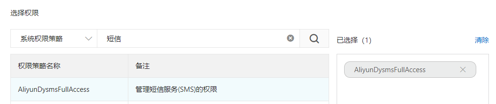
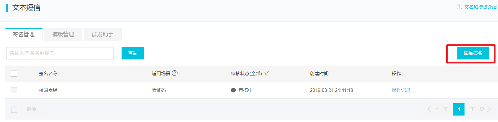

# 开通阿里云
## 注册登录阿里云
省略。
# 完整流程
开通短信服务后，点击新手帮助
https://help.aliyun.com/document_detail/59210.html?spm=a2c4g.11174283.4.1.4c5d2c42maskcM

## 创建AccessKey
首先，生成AccessKey：

点击后，进入心的帮助页面：

操作步骤：

- 登录RAM管理控制台
- 点击用户管理
- 新建用户
- 填写信息，点击确定
-在弹出的对话框中，展开`AccessKey`详情查看查看`AcessKeyId`和`AccessKeySecret`。然后单击保存AK信息，下载AccessKey信息。

## 给用户授权

然后添加短信授权：

## 创建短信签名
短信签名就是短信内容头部的标签，标注短信发送者的身份。

点击管理界面的签名管理：

点击添加签名：

填写信息后点击确定，进入审核状态：

