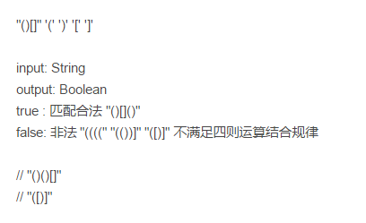

# 一面

- 自我介绍

- 说下了解的安全攻击手段（SQL注入，XSS，CSRF之类的）

- 对Java容器了解吗，说一下hashmap

  然后就是扯hashmap，为什么先是链表（加载因子小于8）为什么大于8转变成红黑树结构呢？大概就是这些问题，扯了很长时间。

- 两道智力题

- 快排的基本思路

- docker的命令之类的，让说出来，为什么用docker。

- 由于当时我还在上课，出来电话面试的，就没有电脑可用，面试官说那就不做题了。

总共20多分钟。

# 二面

- 手撕单例模式

- Java实现一个死锁类型

- 匹配字符串中的[]() 符号

  

  我的

  ```java
  public boolean legal(String str){
  	LinkedList<Charcter> stack = new LinkedList<>();
  	for(char ch : str.toCharArray()){
  		if(ch == '('){
  			stack.push(')');
  		}else if(ch == '['){
    		stack.push(']');
  		}else if(stack.empty() || stack.pop() != ch){
  		return false;
  		}
  	}
  	return stack.empty();
  }
  ```

  然后面试官让我想想有没有更简单的写法，我说我想不出来。然后就结束了，等hr通知。

这次面试，很长时间都是我在想解体的思路，然后一个小时，然后就没了。