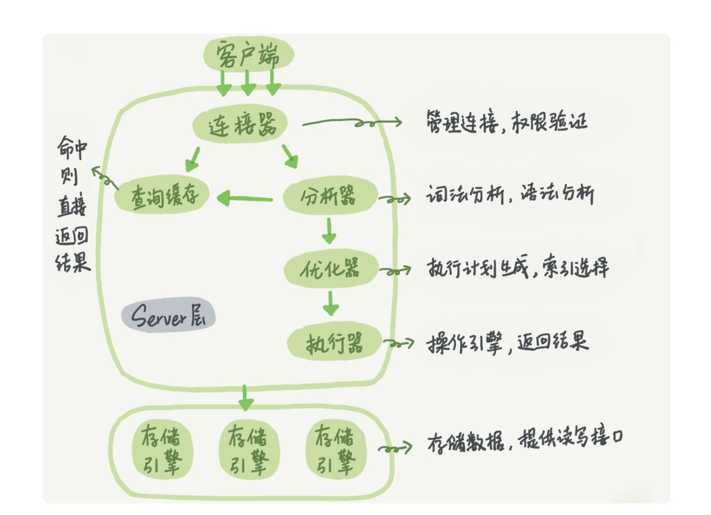

# 网上搜集的面经

0. 一开始自我介绍

​	4. 项目是怎么做优化的

​	5. Mysql两种引擎相关的问题，你是如何看待大家认为的Innodb要比MyISAM快的，谈谈你的看法

​	6. mysql建索引有哪些注意点，在哪些地方需要建索引（常用字段，联表需要的字段等）

​	7. 用过redis吗？有哪些常用数据类型？你用redis做过哪些事？

​	8. 了解redis的持久化吗？展开讲讲

​	14. 讲一下生成器，迭代器的概念，还有装饰器

​	16. 讲一下多进程多线程，协程的区别	

​	17. 一个url从输入到获得结果，经历了哪些步骤，越详细越好（主要从这几方面：dns，三次握手四次挥手，负载均衡，后端架构，当然大佬们要是从更深的角度去讲也是更好的）

​	18. 讲一下http的状态码，200，400这些不要说（这个我是直接举了个delete操作的例子，从它会遇到的各种情况去讲相应的返回码的）

​	19. TCP协议了解吗，讲一下三次握手和四次挥手的过程

​	20. 如何保证一个api的安全性（从后端的权限设定到http攻击都可以讲，不过面试官期望直接讲http攻击，这个不会）

​	21. 你听过哪些http攻击（这里我知道的不多，只举了一个例子结合讲了一下CSRF和cookies攻击的过程）

​	22. 举几个你常用的linux命令，有没有用过awk

​	23. tail命令如何查看一个日志的中间几行

​	24. 如何用命令去开启一个守护进程（nohup）

​	25. 项目遇到bug，你一般是如何去排查的

​	27. 讲一讲你对贪心和动态规划的理解

​	28. 你认为自己做开发有哪些优势？

​	29. 后面就是聊生活了，在哪住，什么时候可以实习等等

	30. 最后就是你有什么想问我的（有啥疑问就问吧，要是不知道问啥github上还有一个专门的项目写这些问题的）

1.list set map的区别？ arraylist和llinkedlist区别，然后说了几种情况问我该用什么？  

​		2.多线程编程的几种方式，你建议我用哪一种，又说了一些情况，让我说该怎么用？  

​		3.在浏览器输入一个百度网址，经历的流程，以及每个流程对应用到什么协议，以及协议对应的osi七层模型中的层。  

​		4.spring用到了哪些设计模式和思想？  

​		5.说下springmvc、我开发web、不用springmvc，我该怎么进行开发。  

​		6.拿出一张纸，给定一些字段，让我设计数据表，然后根据设计的表，又让我按要求写sql语句。

1 ping命令干嘛，什么协议在哪层
 2 tcp ip报文段详细内容
 3 tcp怎么保证可靠性，拥塞四个特性
 4 输入url，浏览器做什么工作，说出几个响应码及意义
 5 abc三种网络怎么分，网关配置等
 6 linux查看网络状态，cpu状态
 7 nginx负载均衡有几种方法，反向***机制
 8 如果有很多个用户请求，主服务器压力过大怎么办?（多机部署）缓冲区容易不足怎么办（Lru）
 9 数据库索引为何高效，底层结构
 10 innodb有几种索引，听说过倒排索引吗
 11 数据库调优有了了解吗，主从复制简单说下，怎么保证主从库的一致性（从乐观锁悲观锁时间戳说），听说过数据库切分么，怎么动态切分（使用触发器）
 12 gcc gdb makefile有了解么

2 多进程和多线程的优缺点
3 聊项目聊人生

一面： 

  讲项目 

  写了分级sql 

  如果服务器运行了一个月了，突然down掉了，怎么找出原因？ 

 

  二面： 

  讲项目，一个功能一个功能，画图讲。 

  会数据结构吗？你用数据结构给我设计出来一个缓存。 

  

  三面： 

  聊人生，谈理想，问了项目。

一面问我项目框架，再然后问了sql，最后问了如果一台服务器运行一个月突然宕机，怎么找出原因。 

  二面主管面，详细讲了项目，把每一个功能都画了框架图。然后让用数据结构知识设计一个内存大于1g的缓存，这个是开放题，面试官跟我一起讨论，缓存问题聊了快一个小时。

# 一面

2.12面的，但是我写的时候是15号，刚面完万得就面奇安信

整个过程呢，有两个面试官，主要是MySQL这块我没有答好

其中一个问题需要知道：

MySQL的查询过来底层过程：

