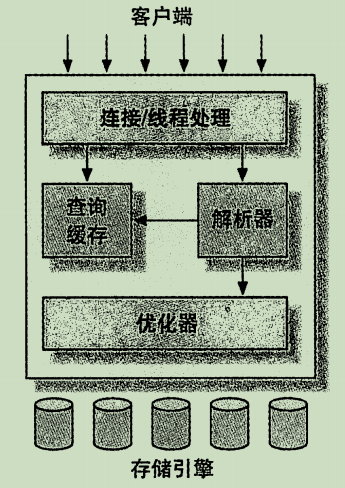

# MySQL架构与历史

MySQL服务器逻辑架构图

## 并发控制

以Unix系统的email box为例，典型的mbox文件格式是非常简单的。一个mbox邮箱中的所有邮件都串行在一起，彼此首尾相连。这种格式对于读取和分析邮件信息非常友好，同时投递邮件也很容易，只要在文件末尾附加新的邮件内容即可。

但如果两个进程在同一时刻对同一个邮箱投递邮件，会发生什么情况？显然，邮箱的数据会被破坏，两封邮件的内容会交叉地附加在邮箱文件地末尾。设计良好地邮箱投递系统会通过锁（lock）来防止数据损坏。如果客户试图投递邮件，而邮箱已经被其他客户锁住，那就必须等待，直到锁释放才能进行投递。

这种锁地方案在实际应用环境中虽然工作良好，但并不支持并发处理。因为在任意一个时刻，只有一个进程可以修改邮箱地数据，这在大容量的邮箱系统中是个问题。

### 读写锁

从邮箱中读取数据没有这样的麻烦，即使同一时刻多个用户并发读取也不会有什么问题。因为读取不会修改数据，所以不会出错。但如果某个客户正在读取邮箱，同时另外一个用户试图删除编号为35的邮件，会产生什么结果？结论是不确定，读的客户可能会报错退出，也可能读取到不一致的邮箱数据。所以，为安全起见，即使是读取邮箱也需要特别注意。

如果把上述的邮箱当作数据库中的一张表，把邮件当作表中的一行记录，就很容易看出，同样的问题依然存在。从很多方面来说，邮箱就是一张简单的数据库表。修改数据库表中的记录，和删除或修改邮箱中的邮件信息，十分类似。

解决这类经典问题的方法就是并发控制，其实非常简单。在处理并发读或者写时，可以通过实现一个由两种类型的锁组成的所系统来解决问题。这两种类型的锁通常被称为共享锁（shared lock）和排他锁（exclusive lock），也叫读锁（read lock）和写锁（write lock）。

描述一下锁的概念如下：

- 读锁是共享的，或者说是相互不阻塞的。多个客户在同一时刻可以同时读取同一个资源，而互不干扰。
- 写锁是排他的，也就是说一个写锁会阻塞其他的写锁和读锁，这是出于安全策略的考虑，只有这样，才能确保在给定的时间里，只有一个用户能执行写入，并防止其他用户读取正在写入的同一资源。

### 锁粒度

一种提高共享资源并发性的方式就是让锁定对象更有选择性。尽量只锁定需要修改的部分数据，而不是所有的资源。更理想的方式是，只对会修改的数据片进行精确的锁定。任何时候，在给定的资源上，锁定的数据量越少，则系统的并发程度越高，只要相互之间不发生冲突即可。

问题是加锁也需要消耗资源。锁的各种操作，包括获得锁、检查锁是否已经解除、释放锁等，都会增加系统的开销。如果系统花费大量的时间来管理锁，而不是存取数据，那么系统的性能可能会因此受到影响。

所谓的锁策略，就是在锁的开销和数据的安全性之间寻求平衡，这种平衡当然也会影响到性能。大多数商业数据库系统没有提供更多的选择，一般都是在表上施加行级锁（row-level lock），并以各种复杂的方式来实现，以便在锁比较多的情况下尽可能地提供更好的性能。

而MySQL则提供了多种选择。每种MySQL存储引擎可以实现自己的锁策略和锁粒度。在存储引擎的设计中，锁管理是个非常重要的决定。将锁粒度固定在某个级别，可以为某些特定的应用场景提供更好的性能，但同时却会失去对另外一些应用场景的良好支持。好在MySQL支持多个存储引擎的架构，所以不需要单一的通用解决方案。

#### 表锁

表锁是MySQL中最基本的锁策略，并且是开销最小的策略。表锁非常类似于前文描述的邮箱加锁机制：它会锁定整张表。一个用户在对表进行写操作（插入、删除、更新等）前，需要先获得写锁，这会阻塞其他用户对该表的所有读写操作。只有没有写锁时，其他读取的用户才能获得读锁，读锁之间是不相互阻塞的。

在特定的场景中，表锁也可能有良好的性能。例如，READ LOCAL 表锁支持某些类型的并发写操作。另外，写锁也比读锁有更高的优先级，因此一个写锁请求可能会被插入到读锁队列的前面（写锁可以插入到锁队列中读锁的前面，反之读锁则不能插入到写锁的前面）。

尽管存储引擎可以管理自己的锁，MySQL本身还是会使用各种有效的表锁来实现不同的目的。例如，服务器会为诸如ALTER TABLE之类的语句使用表锁，而忽略存储引擎的锁机制。

行级锁（row lock）

行级锁可以最大程度地支持并发处理（同时也带来了最大地锁开销）。众所周知，在InnoDB和XtraDB，以及其他一些存储引擎中实现了行级锁。行级锁只在存储引擎层实现，而MySQL服务器没有实现。服务器层完全不了解存储引擎中地锁实现。

## 事务

## 多版本并发控制

## MySQL的存储引擎

